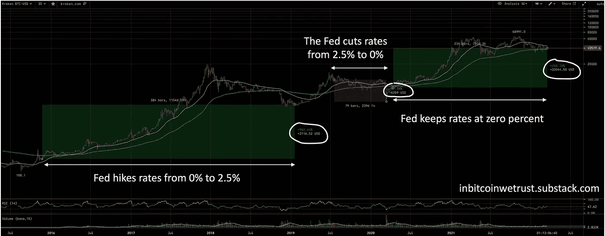

# 美国加息将如何影响加密货币价格？

> 原文：<https://medium.com/coinmonks/how-will-the-us-interest-rate-hikes-affect-cryptocurrency-prices-5884e808343e?source=collection_archive---------34----------------------->

*本文不构成财务建议。

随着疯狂的通胀达到创纪录的高位(3 月份，年通胀率为 8.5%，为 40 年来的最高水平)，美国美联储已经批准了一系列加息措施。3 月初，宣布利率定为每月增加 0.25%。随后在 3 月下旬，美联储宣布至少在 2022 年 6 月之前，目标将提高到每月 0.5%的增幅。

美国经济的这种激进紧缩对加密货币有着巨大的影响，无论是短期还是长期。随着利率上升，购买资产的借贷成本增加，阻碍了银行和消费者购买科技股和加密货币等风险更高的资产。由于更高的奖励，消费者也受到激励去存钱。总体而言，这在短期内(1-2 年)会抑制购买加密货币。由于加密货币仍然是一个新兴行业，市值小，波动性高，在这样的不确定性时期，买家的购买动机较低，更有可能转向更安全的资产，如现金或蓝筹股。因此，预计会出现波动。

也就是说，加息对物价的影响可能没有预期的那么大。2016 年至 2018 年，美联储将利率从 0%上调至 2.5%。这并没有阻止加密货币的飙升，比特币从 2016 年 1 月的 429 美元到 2017 年 12 月的 2 万美元，几乎翻了 50 倍。然而，2018 年，派对结束，加密货币进入了近 2 年的熊市。

这表明，加息可能会对价格产生抑制作用，但这种影响不会立即显现。此外，当前的利率目标比 2017 年更加激进(毕竟 2017 年的通胀没有那么糟糕)，这可能对加密货币产生更大的短期影响。

然而，从长期来看，这些加息显示了加密货币传统法定货币(如美元)的价值。M2 供给是在经济中流通的美元的总供给。加息实际上是减少 M2 供应量，这表明法定货币是多么容易受到中央政府的操纵。这与大多数加密货币形成鲜明对比，尤其是比特币和以太坊。比特币有固定的最大供应量 2100 万，不是一个 1 多。由于年通胀率约为 1.66%，采矿率每 4 年减半，流通供应的增长只会放缓。随着即将到来的以太坊“合并”，三倍减半将使 ETH 的发行率降低约 90%，使 ETH 的供应出现通缩(ETH 的供应实际上将开始以每年约 0.5%的速度减少)。显然，加密货币的供应因素给投资者留下了很少的不确定性，买家会很高兴地知道，供应不会受到像政府这样的中央机构的操纵。

在需求方面，从长远来看，投资者将转向加密货币，以此逃避传统金融系统，保护他们的购买力。这在土耳其等地区已经很普遍，土耳其的通胀导致投资者转向比特币，并导致 BTC/特里估值达到历史最高水平。机构正涌入数万亿的加密货币。根据雅虎财经的数据，以太坊在 2021 年转移了 11.6 万亿美元，而 VISA 的支付量为 10.4 万亿美元。随着越来越多的金融工具出现在 DeFi 领域，超过了传统金融工具，对这些工具的需求只会呈指数级增长。

随着政府对货币供应和利率的完全控制，投资者也将希望转向加密货币，以摆脱政府的操纵。这将再次推动需求的长期增长。毕竟，没有人能够控制比特币和以太坊的供应，除非他们以某种方式设法控制所有参与节点的 50%以上，这些节点遍布世界各地。经纪平台 Tradier 的首席执行官 Dan Raju 认为，加息将推动更多机构投资进入加密货币领域。Raju 在接受 [Bankrate](https://www.bankrate.com/investing/federal-reserve-impact-on-stocks-crypto-other-investments/) 采访时预计，“2022 年将出现净正值，因为加息导致的任何短期下跌都将被机构和散户活跃交易员对这一资产类别的更多采用所抵消”。

总而言之，美国经济为应对猖獗的通货膨胀而收紧可能会暂时抑制加密货币的价格，并导致市场的恐惧和不确定性。然而，这也暴露了当前货币政策的缺陷，加密货币和区块链技术正处于解决这些问题的首要位置。随着需求的增加以及供应的缓慢膨胀(在某些情况下甚至是紧缩)，加密货币的价格从长远来看只会越来越高。因此，长期投资者可能希望将此作为一个机会，以美元平均成本(DCA)进入市场。请在下面的评论区分享你的观点。

> 加入 Coinmonks [电报频道](https://t.me/coincodecap)和 [Youtube 频道](https://www.youtube.com/c/coinmonks/videos)了解加密交易和投资

# 另外，阅读

*   [最佳比特币保证金交易](/coinmonks/bitcoin-margin-trading-exchange-bcbfcbf7b8e3) | [萝莉点评](/coinmonks/lolli-review-e6ddc7895ad8) | [比特币保证金交易](https://coincodecap.com/bityard-margin-trading)
*   [创造并出售你的第一个 NFT](https://coincodecap.com/create-nft) | [密码交易机器人](https://coincodecap.com/best-crypto-trading-bots)
*   [如何在 CoinDCX 上购买柴犬(SHIB)币？](https://coincodecap.com/buy-shiba-coindcx)
*   [CBET 评论](https://coincodecap.com/cbet-casino-review) | [库科恩 vs 比特币基地](https://coincodecap.com/kucoin-vs-coinbase) | [拜比特 vs 比特币基地](https://coincodecap.com/bybit-vs-coinbase)
*   [折叠 App 回顾](https://coincodecap.com/fold-app-review) | [LocalBitcoins 回顾](/coinmonks/localbitcoins-review-6cc001c6ed56) | [Bybit vs 币安](https://coincodecap.com/bybit-binance-moonxbt)