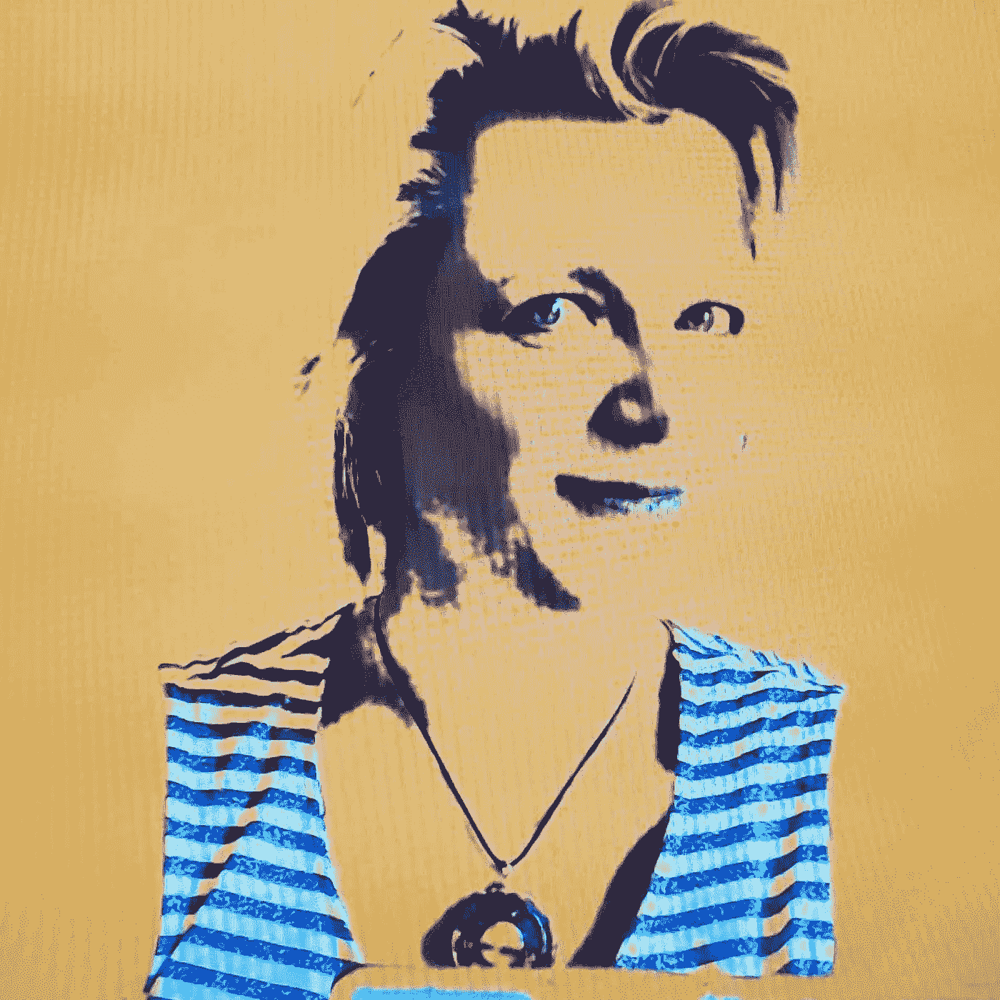

# 如何免费创建自己的 NFTs！

> 原文：<https://medium.com/coinmonks/how-you-can-create-your-own-nfts-for-free-daa44d4fb7f9?source=collection_archive---------8----------------------->

嗯，我睡着了，我只是工作起来…不，不，我没有睡着，当你晚上睡觉的时候。我睡着了，因为我的眼睛对密码和 NFTs 的世界是关闭的。

我是一名 IT 人员，多年来一直如此。我一直都知道加密货币，但从未想过要研究它，直到现在。我很清醒，因为让我告诉你，加密货币即将到来，非功能性金融工具已经是一件事。

这不是一个加密是否会到来的问题，而是一个加密何时到来的问题。

所有国家都在测试中央加密货币银行，一些国家已经投入生产，因此将会发生一些事情。这只是时间问题。

如果你看看目前正在发生的事情，我们已经没有使用大量现金。我们正在使用塑料。你的手机将成为你的钱包…

这不是财务建议，我也不是算命师。我只是和你分享我的想法…

现在回到主题 NFTs …如果你想知道更多我对加密货币的看法，请在下面留言。我很乐意写一篇关于我的想法的文章。

无论如何，现在 NFT…你可能听说过 NFT(不可替换的令牌),如果你有很好的，如果没有，这里是他们是什么…

因此，可替代代币就像是一块钱换一块钱，或者一块金砖换一块金砖。它们是相同的，并且具有相同的值。

不可替代的令牌(NFT)就像你的房子或一件艺术品。它们是独一无二的，没有一样东西是完全一样的。如果你有一个你最喜欢的球员签名的棒球，它也可以是一个收藏品。我们不能把它换成同等价值的东西。这就是它成为 NFT 的原因。

既然我们清楚了这一点，并且可以将它与现实世界的项目联系起来，我们就可以讨论数字 NFT 了。这些可以是艺术，音乐，收藏品，音乐会门票…等等

疯狂的是，为什么有人会花一百万美元买一张猴子或其他 NFT 的照片？？？因为我们人类让事物变得有价值。它是我们所珍视的，如果它稀有、独特或独一无二，它就会变得更有价值。然后它会有很高的价值，会有人愿意花很多钱买它。

我知道！我知道！我也搞不懂，但是你可以把数字 NFTs 想象成现实世界中的一栋房子或者一位著名艺术家的杰作。

那么 NFT 是如何工作的呢？你可能会问。

我不打算深入细节，否则我会永远在这里，但我会尝试为你画一幅画，所以你得到的想法。

我们正处于 Web 3 即将到来的时代。我们已经有了 web，这是我们有静态网页的第一个版本，然后第二个版本是 web 2.0，在 Web 2.0 中，你有社交媒体和广播自己的能力，现在很快 Web 3 将在这里，你将有一个带有人工智能的分散化系统。

给你一个关于 Web 3 的简单例子，想象一下你要去度假，你的预算有限，你会开始谷歌所有的折扣网站来寻找最适合你的交易。有了 Web 3，你可以把你的搜索放进去，这样你就可以为你的预算旅行得到最好的交易，而不需要去每个打折网站寻找最好的交易。

我在这里举一个非常简单的例子，这是一个基本的解释。

有了 Web 3，一切都是分散的，这意味着不是一台计算机或一个组织拥有所有的数据。数据分布在多台计算机上，这样就没有办法伪造或丢失信息，也无法更改。例如，现在你的房屋所有权会在土地所有权办公室。如果土地所有权办公室被烧毁，你将失去你的所有权，但如果这是一个数字合同，它将被存储在互联网上的多台计算机。如果一台计算机出现故障，那么其他计算机仍将拥有您的合同副本。

我在这里再次给出非常简单的例子，这是一个基本的解释。

有了 NFT 就这样想。我只是画了这张非常酷的照片，并在照片背面写下了我的名字，然后我把它交给了我的每个朋友，每次朋友收到照片时，他们都会在照片背面写下自己的名字，然后当照片到达弗兰克手中时，他非常喜欢它，以至于他想把它变成自己的照片。

弗兰克拍了我这张非常酷的照片，自己留着，然后复制了它，并在复制品的背面签上了自己的名字，然后又开始把它传给我的其他朋友。当它回到我手中时，它没有我的签名，也没有在弗兰克之前的任何人的签名。现在我们知道这不是原件，因为它没有所有的签名。链条断了。

这正是区块链技术的工作原理。当你制作 NFT 时，分类账中会有一个记录，显示它是由你创作或铸造的，那么每次它被卖给一个人时，都会有一个记录被创建，所以它不可能是伪造的。

如前所述，非专利技术的价值在于，如果它们稀有、独特或独一无二，那么我们就会珍视它们，一些人愿意花大价钱购买它们。

如果你想制作自己的 NFT，那么你可以遵循这个规则，让它们变得稀有、独特或独一无二，所以要有创意。

这里的第二部分是如果你想创造或铸造一个 NFT。(铸造的意思是创造)你需要支付一些费用，这些费用叫做汽油费，是计算机用你的新 NFT 更新分类账的交易费。

目前的汽油费很贵，而且有了 NFT，它们不像加密货币那样可以很容易地将其转换成货币，但是等等，如果我告诉你有一种免费创建 NFT 的方法，这要归功于多边形区块链上的一种叫做****的东西，你可以在 NFT 最大的市场 [**OpenSea**](https://opensea.io/) 上实现它。****

****所以就像我说的，如果你想创造 NFT，你需要有创造力，这样你才能创造有价值的东西。此外，现在的一个好处是，你可以免费列出它们，这对你的口袋有好处，因为没有风险，对环境也有好处，因为在销售完成之前，计算机不会处理你的请求。****

****在我离开之前，我想向你们介绍一下我的 NFT 系列，这是一个纯属偶然的机会。它叫做 [**女朋友随机意外艺术**](https://opensea.io/collection/girlfriend-nfts) 。****

****这是一个 68 GFNFT(女朋友 NFT——是的，我做了一个新词)收集是原创的，独一无二的，不会重复。以下是这一切是如何发生的故事…****

****在一次变焦会议之前，我的女朋友正在玩一个新的绿色屏幕。你不会相信发生了什么！当她设置绿色屏幕时，颜色变得很奇怪。她变成了一幅画。就像有人画了她。她开始拍照，同时做鬼脸，不去想太多。结果就是这些前所未见的照片。当她和我分享的时候。我想创造我自己的，因为它们很酷。在我知道这个故事之前，我以为它们是用一个应用程序创建的。当她告诉我发生了什么时，我想捕捉那个特别的时刻，所以我们决定把它们变成 NFT，因为它们确实是独一无二的，令人惊讶的，独一无二的！****

****这是一个非常酷的纯运气和意外收获的效果，再也不会重复了。点击下面的链接，自己去看看吧！****

****[**女朋友随机意想不到的艺术官网**](https://girlfriendnfts.com/) 或者可以在 [**OpenSea 上查看。**](https://opensea.io/collection/girlfriend-nfts)****

****一定要让我知道你对 GFNFTs 的看法…****

****我想在一个大的数码相框上挂一个。是的，我相信在不久的将来会是这样。人们将把他们的数字艺术照片挂在数字相框上，此外，他们还将有能力展示数字艺术画廊。****

****如果你发现了这篇有益的文章，请在下面给我写一行。如果你想在泡沫破裂前进入 NFTs，我想知道你是怎么想的，你在做什么。****

****感谢阅读…****

> ****加入 Coinmonks [电报频道](https://t.me/coincodecap)和 [Youtube 频道](https://www.youtube.com/c/coinmonks/videos)了解加密交易和投资****

# ****另外，阅读****

*   ****【Capital.com】|[港加密借贷平台](https://coincodecap.com/crypto-lending-hong-kong)****
*   ****[如何在 Uniswap 上交换加密？](https://coincodecap.com/swap-crypto-on-uniswap) | [A-Ads 评论](https://coincodecap.com/a-ads-review)****
*   ****[WazirX vs CoinDCX vs bit bns](/coinmonks/wazirx-vs-coindcx-vs-bitbns-149f4f19a2f1)|[block fi vs coin loan vs Nexo](/coinmonks/blockfi-vs-coinloan-vs-nexo-cb624635230d)****
*   ****[本地比特币审核](/coinmonks/localbitcoins-review-6cc001c6ed56) | [加密货币储蓄账户](https://coincodecap.com/cryptocurrency-savings-accounts)****
*   ****[什么是保证金交易](https://coincodecap.com/margin-trading) | [美元成本平均法](https://coincodecap.com/dca)****