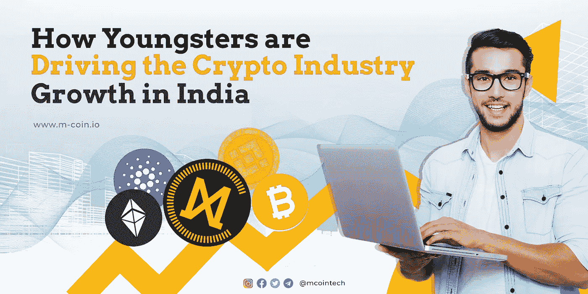
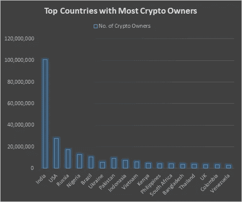
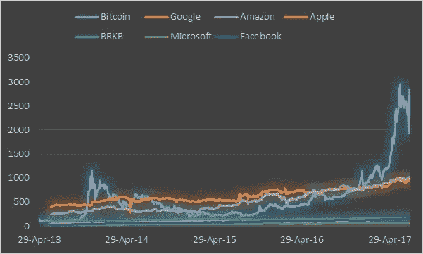

# 年轻人如何推动印度密码产业的发展

> 原文：<https://medium.com/coinmonks/how-youngsters-are-driving-the-cryptocurrency-industry-growth-in-india-e3db21662c9?source=collection_archive---------28----------------------->

How youngsters are driving the cryptocurrency industry growth in India_M-coin

## **加密货币**

尽管经历了几次过山车，但加密货币市场每次都证明了自己的实力。与任何其他增长领域类似，年轻人正在推动加密市场的加密货币增长。随着加密在不同行业(如定义/支付、基于加密的游戏、NFT 趋势、元宇宙、云存储以及其他各种行业)中的使用案例越来越多，加密已经崭露头角。

## **印度的加密货币**

印度的加密产业潜力超过 1 万亿美元，印度见证了[加密货币投资者](https://timesofindia.indiatimes.com/business/india-business/crypto-tech-blockchain-draws-young-investors-despite-risks/articleshow/88677700.cms)的激增。

印度是全球数量最多的本土加密交易所的中心。据印度主要密码交易所报道，过去他们的大部分用户年龄在 18-35 岁之间。 [WazirX](https://wazirx.com/) (最大的之一)，2018 年成立的印度加密货币交易所&于 2019 年被加密货币交易所[币安](https://www.binance.com/en/blog/all/binance-acquires-indias-leading-digital-asset-platform-wazirx-to-launch-multiple-fiattocrypto-gateways-404105749895733248)收购，据报道，其 70%的用户年龄在 30 岁以下。

过去，印度市场曾报道过最高的密码持有者数量，拥有超过 1 亿用户，占总人口的 7.30 %。因此，印度年轻人投资密码的趋势显而易见。这些年轻人似乎对股票和黄金不太感兴趣，对加密货币投资的兴趣更大。

image source: [www.c-sharpcorner.com/article/top-10-countries-with-the-most-cryptocurrency-holders](https://www.c-sharpcorner.com/article/top-10-countries-with-the-most-cryptocurrency-holders/)

## **青少年加密货币投资场景**

尽管投资知识较少，千禧一代仍热衷于秘密投资，这有时也会导致他们的资金损失。尽管加密市场的波动性很大，但印度的每个年轻人都在积极成为这些代币和加密货币的持有者，跟随加密浪潮。他们只是在遵循高风险高回报的说法。

投资加密货币和替代硬币的流行始于最近 Covid 期间工作文化的转变，当时加密货币市场的持有者在全球范围内增长最快。

对于年轻的初创公司创始人和企业家来说，这个区块链和加密货币市场也开辟了通过 ICO(初始硬币发行)和 IEO(初始交易所发行)等筹集资金的新途径。并成为他们通过其他方式筹集资金的首选。

由于加密货币的无边界、无障碍交易和去中心化特性，许多专业人士(IT 专业人士、程序员、数字营销人员、自由职业者等。)开始接受以加密货币支付的工作报酬。另一方面，口口相传提高了人们对加密货币的认识，导致加密货币在印度被广泛采用。

## **更高的投资回报**

这些替代硬币和加密货币投资为年轻投资者提供了比市场上其他投资选择获得更高回报的途径。在出生于互联网和技术时代之后，这些年轻人可以很容易地比较最佳投资选择，以保持他们的投资增长，毫无疑问，加密投资者在过去几年中出现了大幅增长。

另一个重要原因可能是，这些年轻的加密投资者不相信，他们可能是听着有关全球金融衰退和普遍经济困难的故事长大的。

许多金融机构&银行在全国范围内关闭，人们无法获得他们的血汗钱，这些故事可能导致了当代人对传统体系缺乏信任。另一方面，当涉及到他们的财务前景时，年轻人是积极主动的。

在与一群年轻投资者交谈时，投资不受一个实体控制的分散投资更有意义。他们在投资这些去中心化的加密货币& altcoins 的同时，似乎拥有感更强。

image source: [steemit.com/bitcoin/@datageek/bitcoin-roi-totally-outclasses-that-of-amazon-facebook-and-other-top-stocks](https://steemit.com/bitcoin/@datageek/bitcoin-roi-totally-outclasses-that-of-amazon-facebook-and-other-top-stocks)

## **在印度投资加密货币的法律问题**

以前，印度无监管的市场和不确定的加密未来是阻止人们自由参与加密投资工具的原因。

在 2022 年联邦预算期间，印度财政部长 Nirmala Sitharaman 提议对加密货币和不可替代代币(NFT)等数字资产的转让征收 30%的税，使其成为受监管的投资选择。她还提议对此类交易征收 1%的 TDS，将这些资产纳入税网。

然而，投资加密是一个高风险的行为，必须在专家的建议和正确的理解之后进行。但是，在印度，它将不再被称为不受监管的市场。

## **结论**

正如之前所写的，投资加密会带来高风险和高回报的比率。如果没有正确的知识和理解投资加密的内容和方法，就不应该投资加密。

在投资任何替代硬币和加密货币之前，需要了解的几个要点是看下面陈述的几件事情，但是，这些不是唯一的事情，而是应该被考虑以避免投资损失。

*   增加硬币需求的硬币背后的产品
    -跨交易所的可用性和流动性
    -团队和他们以前的成功

Maximus tech 拥有针对云存储行业 1000 亿美元市场的 [M-coin](https://m-coin.io/) 解决方案。提供主要行业问题的解决方案，M-coin 可以被视为一项长期投资计划，期望获得长期高回报。

M-coin (Maximus Tech)得到了行业专家的支持，如[**Jason Daniel Paul Phillip**](https://www.linkedin.com/in/jason-daniel-paul-philip/)[ABBC 币](https://abbccoin.com/) (ABBC 基金会)的首席执行官和创始人，是 [coinmarketcap](https://coinmarketcap.com/) 排名的 400 强加密货币之一，已成功运营 ABBC 超过 5 年。

在 [Coinsbit](https://coinsbit.io/) 和 [P2PB2B](https://p2pb2b.io/) (截至 2022 年 3 月 22 日)[上市的 M-coin 可以被认为是对这种分散式云存储概念背后的技术和市场的长期投资](/@mcoin.tech/why-to-consider-m-coin-as-an-investment-and-the-use-cases-of-m-coin-as-a-crypto-token-e2ff8f64357b)。

关注我们的[脸书](https://www.facebook.com/mcointech)推特

加入我们的[t.me/mcointech](http://t.me/mcointech?fbclid=IwAR0x740OdXr2XmwjQRpOmSaOxez50yZSUslUG4mjRZS2D6XaFd1ljOj5dYE)

> 加入 Coinmonks [电报频道](https://t.me/coincodecap)和 [Youtube 频道](https://www.youtube.com/c/coinmonks/videos)了解加密交易和投资

# 另外，阅读

*   [加密复制交易平台](/coinmonks/top-10-crypto-copy-trading-platforms-for-beginners-d0c37c7d698c) | [如何在 WazirX 上购买比特币](/coinmonks/buy-bitcoin-on-wazirx-2d12b7989af1)
*   [CoinLoan 评论](https://coincodecap.com/coinloan-review)|【Crypto.com 评论】T2
*   [如何在加拿大购买加密货币？](https://coincodecap.com/how-to-buy-cryptocurrency-in-canada)
*   [无聊猿游艇俱乐部(BAYC)评论](https://coincodecap.com/bored-ape-yacht-club-bayc-review)