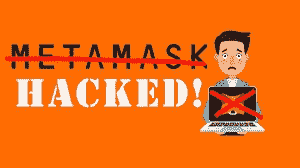
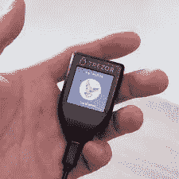

# 你的元掩码是如何被黑的(可能)

> 原文：<https://medium.com/coinmonks/how-your-metamask-got-hacked-probably-795abca4534a?source=collection_archive---------0----------------------->

我很乐意承认我喜欢 DeFi 加密投资——从一堆垃圾项目和庞氏骗局中寻找新的产生收益的项目并识别合法项目是一个令人愉快和有利可图的挑战。但 DeFi 有一个明显的缺点——你必须使用 Metamask 这样的非托管钱包来与 DeFi 交易所进行交互。是的，Metamask 运行良好，并完全按照您的要求运行，但遗憾的是，它在安全性方面严重不足。加密脸书集团，Reddit，Discord 和 Telegram 充满了讲述他们的钱包被黑客攻击和榨干的故事，通常价值数千美元的加密。事实上，我有一个网上联系人，尽管他在自己的领域里是一个受过高等教育、全国知名的专业人士，却让自己被愚弄，向黑客暴露了他的 Metamask 安全信息。我的网上朋友承认在这次黑客攻击中损失了超过 10 万美元，可悲的是，即使这么大的数额也不足以让任何在线取证公司或执法机构有兴趣试图追回资金。有了像 Metamask 这样的非托管钱包，您就可以真正地独自保护您的资金了。

如果你在网上阅读这些故事，你会觉得几乎所有使用 Metamask 的人都被黑客攻击了。好消息是这通常不是真的——只有一小部分 Metamask 用户真的被黑了。此外，大多数被黑客攻击的用户是对 DeFi 交易相当陌生的用户，他们还没有学会保护 Metamask 钱包所必须采取的所有重要步骤。是的，对于更老练的用户来说，黑客攻击仍然会发生，但这种情况要少得多，而且通常只涉及一个被黑客利用的用户错误。从这个意义上来说，使用 Metamask 很像参与一项冒险运动，如跳伞或悬挂式滑翔——你必须确保 100%的时间做正确的事情。一个错误就能毁掉你的账户。

是的，它也发生在我身上，因为我犯了一个愚蠢的错误。稍后会详细介绍。

为了避免被黑(或者如果你已经被黑了，就再次被黑)，了解你必须采取的所有步骤来保护你的帐户是至关重要的:做什么，不做什么，以及如何防止骗子接近你的帐户。因此，让我们来看看 Metamask 用户被黑客攻击的最常见方式，以及如何避免它们。

**下载骗局版 Metamask**

这实际上有点罕见，但确实会发生，当然必须避免。Metamask 的官网是 [https://metamask.io](https://metamask.io) 。这是您应该下载和安装 Metamask 的唯一网站。众所周知，黑客会创建虚假的 Metamask 网站，并使用谷歌广告将这些网站显示在谷歌搜索结果的顶部。这个假网站有一个黑客版本的 Metamask，让用户创建一个钱包，像真的一样添加资金，但随后将用户的资金发送到黑客的钱包。所以一直用 Metamask 官方版！

**暴露你的种子短语**

人们被黑客攻击的最常见方式，800 磅的大猩猩“不要这样做”，是允许钱包的种子短语被暴露。如您所知，当您创建元掩码钱包时，元掩码会向您显示一个 12 个单词的种子短语，允许您在紧急情况下找回钱包。这个 12 个单词的种子短语实际上是保护这个钱包的私钥的人类可读表示。为了保护你的钱包，你必须绝对肯定地保证你不会把这个给任何人看。这意味着:

*   当 Metamask 向您展示种子短语时，请仅将它写在一张纸上，并安全地存放在您居住的地方或某个安全的地方。你可以把它存放在保险箱里，或者银行的保险箱里，或者只有你知道它在哪里的地方。如果有其他人住在你的住处，任何你不能 100%信任的人，不要让那个人接近你的硬拷贝种子短语。
*   不要以数字方式存储您的种子短语，即存储在您的计算机或手机上。黑客只需访问你的文件系统或云备份，你的种子短语就会泄露。
*   不要用你的照相手机给你的种子短语拍照。黑客可以(并且已经)访问手机的照片集(通过入侵手机或入侵在线备份)，并且只搜索任何含有种子短语的照片。一旦找到种子短语，游戏就结束了。
*   不以数字形式存储种子短语的唯一例外是值得信赖的高度安全的密码管理器或秘密管理器服务，如 Dashlane 或 1Password。这可能是好的，尽管有许多知识渊博的人也回避这种做法。我觉得大概可以吧，但这取决于你。

但是仅仅在你创建钱包的时候保护你的种子短语是不够的！您必须时刻警惕试图以其他方式窃取您的种子短语的黑客和网络钓鱼骗子。用户被黑的一个常见方式是当他们加入一个 Discord 或 telegram 服务器，为他们发现的一些新项目服务。有很多骗子潜伏在这些地方，只是等待一个新的人(你)开始提问。他们一见到你，就会尽快给你发短信，甚至给你打电话，为你提供“技术支持”。他们的账户名让他们看起来像是项目的官方技术支持，经常窃取和使用真实项目创始人的名字。你必须记住，没有合法的技术支持或项目创始人会欺骗你！说真的，永远不要回复任何假装支持某个项目的人——删除信息，继续前进(或者随时告诉骗子滚蛋，这取决于你)。

这些假冒的技术支持骗子的运作方式是首先给你一个他们是合法的印象，然后说服你连接到一些特殊的网站来“验证你的钱包”或采取一些类似的行动。永远不要这样做！当然，如果你读了前一段，你会知道首先不要和这些人聊天，但是如果由于你的判断失误，你最终和这样的人交谈，永远不要连接到他们给你的任何网站，永远不要以任何理由给出或输入你的种子短语！很大一部分 Metamask 黑客攻击是由于缺乏经验的用户以这种方式被骗。

请注意，这些类型的网络钓鱼欺诈可能通过多种通信渠道发生，包括电子邮件、电报和不和谐信息。Telegram 和 Discord 的风险尤其大，因为这些平台的匿名性使它们成为无良骗子的理想平台。在这些服务上聊天来讨论合法的项目问题和提问是很好的，只是不要点击任何看起来可疑的链接或答案和 DMs。我很少在 Telegram 上回复 DMs，而且只回复我在 Telegram 聊天中接触过的人。我绝对不会回答任何关于不和的问题。

**恶意软件和键盘记录程序**

确保您的计算机免受病毒、恶意软件和键盘记录程序的侵害也非常重要。我们大多数人使用电脑有各种各样的目的，其中一些目的(让我们面对现实吧)比其他的稍微有点可疑。电脑是工作、教育、写文件、给家人发电子邮件等的好工具。，但它也是一个玩游戏、看色情片、共享文件等的绝佳平台。其中一些网站可能会试图用病毒或恶意软件感染您的计算机。使用防病毒软件和反恶意软件(如 Malwarebytes)来保持计算机始终干净是至关重要的。一些/许多严肃的密码投资者甚至会有一台完全专用于密码交易的电脑，并使用另一台电脑进行所有这些其他有风险的用途。

受感染的计算机可以通过多种方式导致您的钱包被黑:

*   骗子可以在你的机器上安装键盘记录软件，并记录你的击键，包括你的密码。如果用户可以获得您的密码，您的钱包现在就可以被骗子利用，很可能会被掏空。
*   即使骗子没有使用键盘记录器来获取您的密码，骗子也有可能访问存储您的种子短语和私钥的加密文件。如果骗子将此文件下载到他/她自己的机器上，那么如果您没有选择非常安全的密码，就可以使用暴力密码猜测软件来获取您的密码。我仍然不明白有多少人会使用像“12345”或“Joe123”这样容易猜到的短密码。

这里有一点很重要，那就是你的密码一定要让人猜不出来——一定要使用混合了大小写字母、数字和符号的长密码。始终确保您的密码长度为 12 个或更多字符，越多越好。密码中的每一个额外字符都会让猜测变得更加困难。正如您在下面的图表中看到的，即使使用大小写、数字和符号，也很容易破解 7 或 8 个字符长的密码，但要破解 15 个字符长的密码则需要很长时间。请始终使用长密码！

Time it takes to brute force a password

**诈骗交易**

一些诈骗网站使用的另一个技巧是首先让你连接到他们的网站，然后要求你签署一项或多项交易，允许他们花你的硬币。是的，所有合法的分布式交易所(DEXes)也要求您这样做。但是要意识到，这些请求中的每一个都默认要求您授权该网站从您的钱包中支付无限量的硬币或代币。一些诈骗网站用这个来榨干你的钱包，把你的代币或者硬币发到他们自己的钱包里。一些诈骗网站欺骗你，让网站花掉你钱包里的所有其他硬币，而不仅仅是你想兑换的硬币。

为了避免这种情况，您必须首先确保您正在与一个合法的网站进行交互。如果该网站看起来有问题，不要签署任何交易，直到你彻底研究它，并已成为确信该网站是合法的。你也可以随时编辑交易，让网站只花你可用硬币的一小部分。twitter 上的这个专业建议更详细地解释了这个过程，但是在 Youtube 和其他地方有很多关于这个的教程。如果你像这样提供一个自定义的消费限额，至少你限制了黑客对你造成的损害。

**不和谐或电报上的虚假/诈骗空投促销**

当你发现一个你可能有兴趣投资的新的 DeFi 项目时，你通常会加入该项目的 Discord 或 Telegram 频道以获得更多信息。这些可能是很好的信息来源，但是如果你不小心的话，它们也会让你暴露在大量潜在的诈骗信息面前。我可以保证，日复一日，你打开你的 Discord 应用程序，会看到一群 DM 在宣传一些“空投”、“代币赠品”或其他促销活动，要求你将钱包连接到某个网站，领取免费奖励。DM 推广和假冒网站将有一个类似的域名，但不是相同的，你的项目的域名。这些 DMs 和促销永远永远都是骗局！太多的人仍然被这些东西欺骗。你应该做的唯一一件事就是立即删除它们。我从不在不和谐的时候打开 DM，除非在极少数情况下，我在主频道上与某人聊天，足以知道他们是真实的，他们要求给我发 DM。当他们开始要求我去随机链接或连接到另一个网站时，我会停下来删除对话。电报也是如此。不要打开随机的 DMs，不要将您的钱包连接到任何空投或赠品网站！否则你会被骗！

**尘袭**

人们被诈骗的另一种方式被称为“灰尘攻击”，骗子给你发送一些你从未听说过的 shitcoin 代币。这些代币与恶意智能合同代码相关联，当你试图出售这些垃圾硬币或试图以任何其他方式处理它们时，这些代码会耗尽你的钱包。我怀疑这是元掩码不会在您的帐户中显示令牌的一个原因，除非您显式添加它们。只有在适当的区块链浏览器中输入你的钱包地址，你才能看到它们。如果你在钱包里发现未知或不熟悉的代币，最好忽略它们，除非你确定这些代币来自合法项目。

**用硬件钱包避免这些问题**

当然，任何认真的加密投资者都会告诉你，通过将硬件钱包连接到你的帐户，上述问题几乎可以完全消除。请务必注意，元掩码中使用的钱包地址是硬件钱包地址，而不是元掩码地址。将新的硬件 wallet 连接到现有的 Metamask wallet 提供的额外保护非常少—始终将硬件 wallet 地址导入 Metamask 并使用该地址。同样，Youtube 和其他地方有很多关于如何正确做到这一点的教程。

我更喜欢的硬件钱包是 Trezor 型。是的，它比它的主要竞争对手(Ledger Nano X)略贵，但我觉得它对用户更加友好。分类帐很笨重，经常不能正常工作，而 Trezor 却能正常工作。

Trezor Model T

**保持警惕**

可悲的是，骗子继续设计新的方法来攻击你，这取决于你跟上如何最好地保护你的钱包。我很想说，如果采取以上所有措施，你的钱包将永远不会被黑，但我能说的是，以上步骤大大降低了这种可能性。黑客和安全专家(以及用户)之间有一场永无休止的升级战争，所以你必须继续保持谨慎，确保你永远不会做傻事。

这让我想到…

**当我做了傻事被黑的时候**

是的，它发生在我身上，因为我做了一些蠢事。我是一名长期的软件开发人员，现在是区块链的开发人员，去年我通过参加 Udacity 区块链开发人员纳米学位项目磨练了我的技能。作为该计划的一部分，我们创建了几个涉及区块链技术的项目。实际上，我为合法的大麻产业创建了一个基于区块链的供应链追踪系统，或者至少是一个系统的框架版本。对于所有这些 Udacity 项目，学生必须将他们的项目文件上传到 Github。因为我没有太注意，并且只使用了一个 Testnet wallet，所以我上传的一个文件包含了我在开发计算机上用于开发的 Metamask wallet 的种子短语。这里面从来没有任何资金，所以我不担心。

但一年后，出于某种我不记得的原因，我决定向那台电脑上的 Metamask 钱包发送一些真正的 AVAX。我早就忘记了这是我的开发钱包和开发机器，钱包可能已经损坏了。在我上传文件和发送 AVAX 之间的一年左右时间里，一名黑客发现了暴露的种子短语，并在那个钱包地址上安装了一些软件。黑客软件只是检查了那个钱包地址，以防我会做一些愚蠢的事情，比如给它发送真实的 AVAX。当我确实做了一些愚蠢的事情并发送了一些 AVAX 时，黑客的耐心当然得到了回报。AVAX 到达了，但在到达后的几分钟或几秒钟内很快消失在某个不熟悉的钱包地址。我花了几分钟的时间才发现发生了什么，我很尴尬的承认是我自己的愚蠢导致了这次黑客攻击。

**发现自己做错了什么的重要性**

这就引出了我的最后一点——如果你真的被黑了，重要的是把你的自我放在一边，找出你做错了什么。我在网上看到太多人想指责 Metamask 和/或指责除了他们自己以外的所有人被黑。这些人不知道他们做错了什么，最终再次被黑。帮你自己和密码社区的其他人一个忙——总是花费精力找出你做错了什么。我们越是共同努力找出这些黑客攻击是如何发生的，就越容易帮助彼此和我们自己避免被黑客攻击。

> 加入 Coinmonks [电报频道](https://t.me/coincodecap)和 [Youtube 频道](https://www.youtube.com/c/coinmonks/videos)获取每日[加密新闻](http://coincodecap.com/)

## 另外，阅读

*   [复制交易](/coinmonks/top-10-crypto-copy-trading-platforms-for-beginners-d0c37c7d698c) | [加密税务软件](/coinmonks/crypto-tax-software-ed4b4810e338)
*   [网格交易](https://coincodecap.com/grid-trading) | [加密硬件钱包](/coinmonks/the-best-cryptocurrency-hardware-wallets-of-2020-e28b1c124069)
*   [密码电报信号](http://Top 4 Telegram Channels for Crypto Traders) | [密码交易机器人](/coinmonks/crypto-trading-bot-c2ffce8acb2a)
*   [有哪些交易信号？](https://coincodecap.com/trading-signal) | [Bitstamp vs 比特币基地](https://coincodecap.com/bitstamp-coinbase)
*   [ProfitFarmers 回顾](https://coincodecap.com/profitfarmers-review) | [如何使用 Cornix 交易机器人](https://coincodecap.com/cornix-trading-bot)
*   [如何在势不可挡的域名上购买域名？](https://coincodecap.com/buy-domain-on-unstoppable-domains)
*   [印度的加密税](https://coincodecap.com/crypto-tax-india) | [altFINS 审查](https://coincodecap.com/altfins-review) | [Prokey 审查](/coinmonks/prokey-review-26611173c13c)
*   [最佳加密交易所](/coinmonks/crypto-exchange-dd2f9d6f3769) | [印度最佳加密交易所](/coinmonks/bitcoin-exchange-in-india-7f1fe79715c9)
*   开发人员的最佳加密 API
*   最佳[密码借贷平台](/coinmonks/top-5-crypto-lending-platforms-in-2020-that-you-need-to-know-a1b675cec3fa)
*   杠杆代币的终极指南