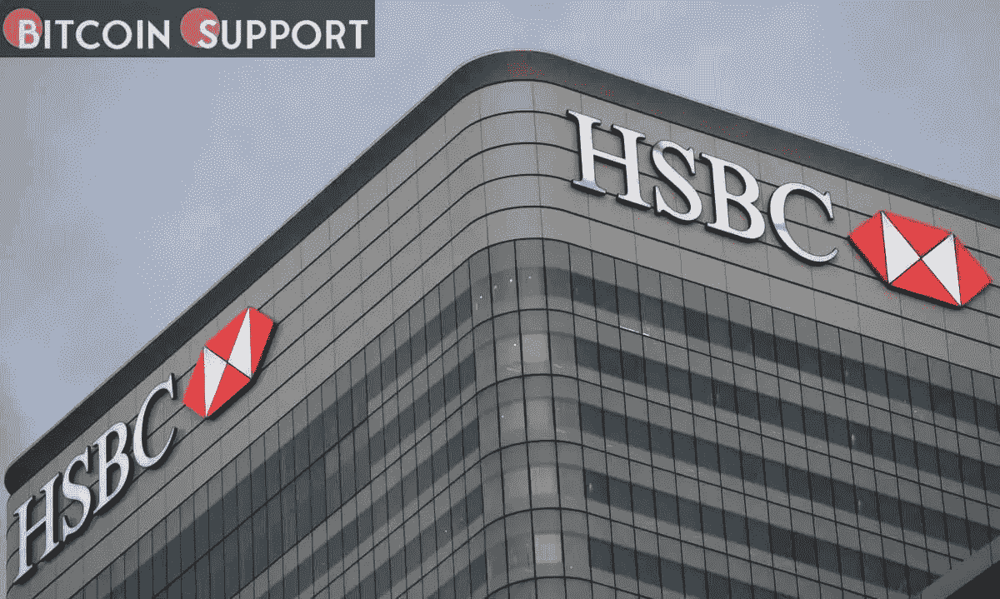

# 汇丰银行，一家全球性银行，已经通过沙盒进入了“元宇宙”

> 原文：<https://medium.com/coinmonks/hsbc-a-global-bank-has-entered-the-metaverse-via-a-sandbox-290ad2adf868?source=collection_archive---------43----------------------->

**Visit our website:-** [**https://bitcoinsupports.com/**](https://bitcoinsupports.com/)

周三，汇丰银行宣布与沙盒元宇宙合作，该银行将创建一个虚拟体育场，并与社区相连。沙盒在一篇博客文章中宣布了合作关系，但没有透露交易的财务细节。作为协议的一部分，汇丰银行将加入古驰、华纳音乐和育碧等公司，在沙盒中创建虚拟世界。

**在元宇宙，人们将与下一代互联网 Web3 互动，采用增强现实、虚拟现实和扩展现实等沉浸式技术。**

–汇丰亚太区首席营销官 Suresh Balaji

**Web3 对于汇丰来说并不陌生**

汇丰进入元宇宙是随着该行对区块链技术的接受程度不断扩大而进行的。虽然它仍然坚决反对加密货币，但它更愿意投资甚至实施区块链技术。

去年 12 月，本行推出了一款基于区块链的工具来帮助外币操作，这表明主要跨国银行对采用分类账技术更感兴趣。据汇丰称，分类账技术将使其能够简化支付。

银行是各国央行发行的数字货币的支持者。去年，首席执行官 Noel Quinn 强调了 CBDCs 通过实现更便宜和更容易的支付促进经济增长的潜力。稳定货币和加密货币将需要与它们所带来的危险成比例的监管，如果它们以同样的方式被信任的话。

——奎因在 9 月份的博客中写道。11 月，这家英国银行是区块链科技公司 ConsenSys 的一轮 2 亿美元融资的投资者之一。

**企业对元宇宙的兴趣正在扩大**

由于持续到 2021 年的加密泡沫，几家重要的金融机构表示了对区块链和元宇宙的兴趣。

摩根大通&公司刚刚在分散地开了一个休息室，泰国最大的银行暹罗商业银行也在沙盒有一个位置。金融咨询公司普华永道估计，到 2030 年，虚拟现实市场将价值 1.5 万亿美元。

**访问我们的网站:-**[**https://bitcoinsupports.com/**](https://bitcoinsupports.com/)

**免责声明:这些是作者的观点，不应被视为投资建议。读者应该自己做研究。**

> 加入 Coinmonks [电报频道](https://t.me/coincodecap)和 [Youtube 频道](https://www.youtube.com/c/coinmonks/videos)了解加密交易和投资

# 另外，阅读

*   [如何在加拿大购买加密货币？](https://coincodecap.com/how-to-buy-cryptocurrency-in-canada)
*   [无聊猿游艇俱乐部(BAYC)评论](https://coincodecap.com/bored-ape-yacht-club-bayc-review)
*   [5 款最佳加密交易终端](https://coincodecap.com/crypto-trading-terminals) | [最佳 DeFi 应用](https://coincodecap.com/best-defi-apps)
*   [最佳网上赌场](https://coincodecap.com/best-online-casinos) | [币安评论](/coinmonks/binance-review-ee10d3bf3b6e) | [BitMEX 评论](https://coincodecap.com/bitmex-review)
*   [麻雀交换评论](https://coincodecap.com/sparrow-exchange-review) | [纳什交换评论](https://coincodecap.com/nash-exchange-review)
*   [美国最佳加密交易机器人](https://coincodecap.com/crypto-trading-bots-in-the-us) | [经常性回顾](https://coincodecap.com/changelly-review)