# HTO:这是 100 万美元，但在太空中(元宇宙)

> 原文：<https://medium.com/coinmonks/hto-next-level-metaverse-on-solana-f1740ea87c54?source=collection_archive---------14----------------------->

虚拟土地的价格在牛市期间暴涨，这是你第二次有机会以便宜的# CoinDCXpathbreaker 在元宇宙拥有虚拟土地

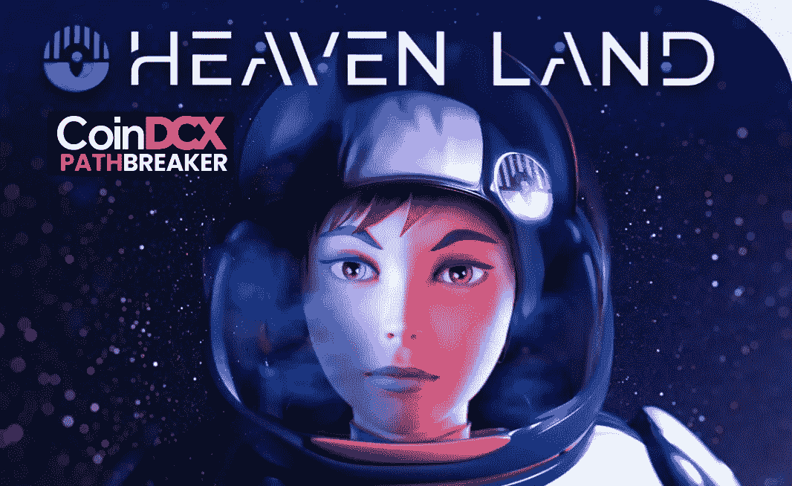

Metaverse in Space

**项目**:天堂

**项目代号** : $HTO

**项目网络可用性**:

**Solana —合同地址:**htohlbjv 1 err 8 XP 5 oxyqdv 2 plqhtvjxlxpkb 7 fsgjqd

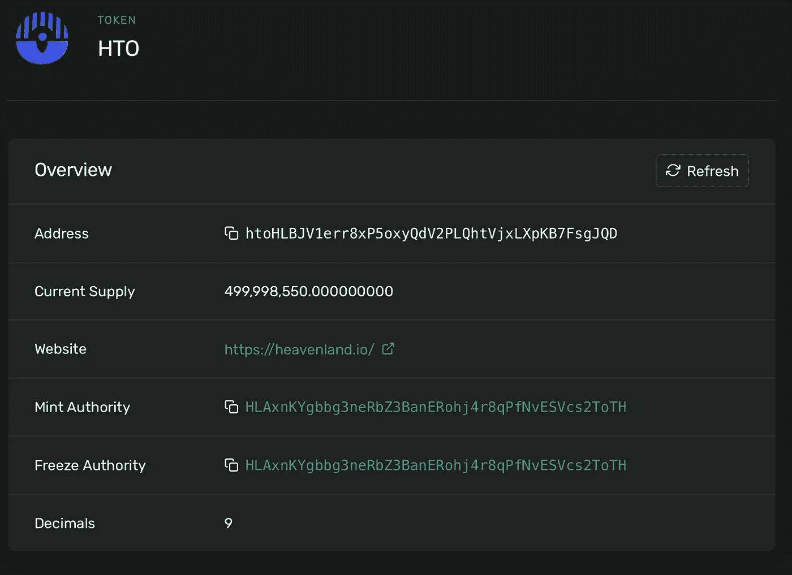

HTO details on Solana Explorer

## 天堂的独特卖点:

*   进入售前轮次将授予 3 种特权状态中的一种，该状态将随投资水平而变化。每一个独特的地位都有利于元宇宙球员的发展
*   NFT 提供了效用(作为所有权的证明)以及货币价值
*   **“地块”是最重要的 NFT—**它们是大片土地。购买足够的土地将使玩家能够在这些土地上创造各种形式的被动收入
*   化身将是玩家的元宇宙代表，每个人都有独特的身体特征(你的生活从此数字化)

One-of-the-many Avatars on Heavenland

新的化身可以从他们的“父母”那里继承属性。获得拥有超人能力(如飞行)的“传奇”化身的潜力

*   **NFT 市场** —所有可用的 NFT 都是可交易的。这些 NFT 也将用于游戏内购买。想象一下，它们是茄乐者的本国货币(例如元宇宙的音乐会门票)
*   一个非常独特的打桩协议
*   被动收入策略—这包括各种方法，例如:

1.  **允许玩家租赁他们的财产空间**
2.  **打造自己的商业店铺/空间**
3.  **投放广告并从中获得广告收入(超级酷的 IMO)**

*   天堂王国的目标是未来过渡到一个**道**，加权投票权不仅取决于你持有的代币和土地数量，还取决于你在元宇宙的活跃程度

## 事实和结构:

天堂之地是一座未来城市，建在地球轨道上旋转的引力圆柱体中。

A very unique take on the ecosystem construction

负的表面曲率赋予天堂之地的居民外部世界的体验，它在太空中的位置使天堂之地成为一个真正的太空门户。

我们一直在研究元宇宙及其虚拟功能，但我们已经看到了常见的**数字商场、数字空间、数字城市**——但在太空中设置一个元宇宙，具有独特的结构构造，确实是下一个层次。

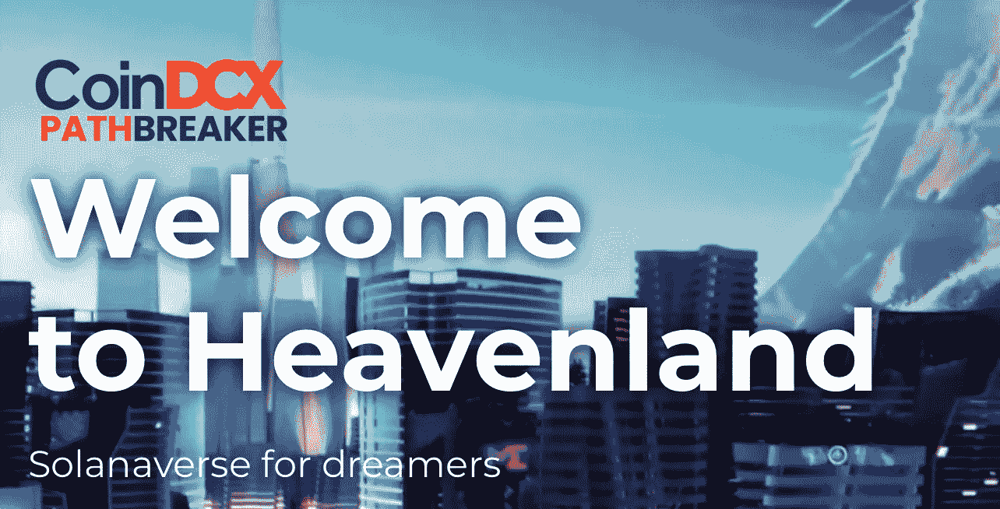

目前，我还没有从项目中看到一个成功的 DAO 实现，但是这个概念仍然是好的，随着项目随着团队愿景的进一步发展，我确信他们最终会实现这一点。

## 天堂项目审计报告:

该团队尚未提交他们的合同地址用于审计报告，但这可能是因为他们目前是索尔新员工。在这方面，我仍然会小心行事&特别留意这一点。

## 天堂项目组:

看起来如此有前途的项目建立在索拉纳的基础上，我对这个匿名的团队感到非常失望。

项目白皮书只是陈述了由 15 名成员组成的核心团队，并且每周都在增长。不会给我带来任何自信。

## 天堂伙伴:

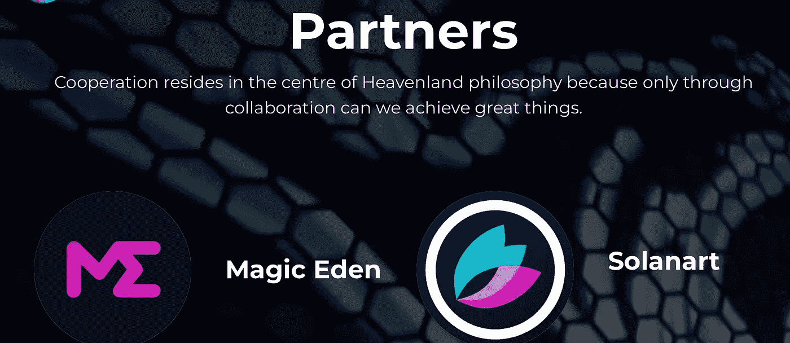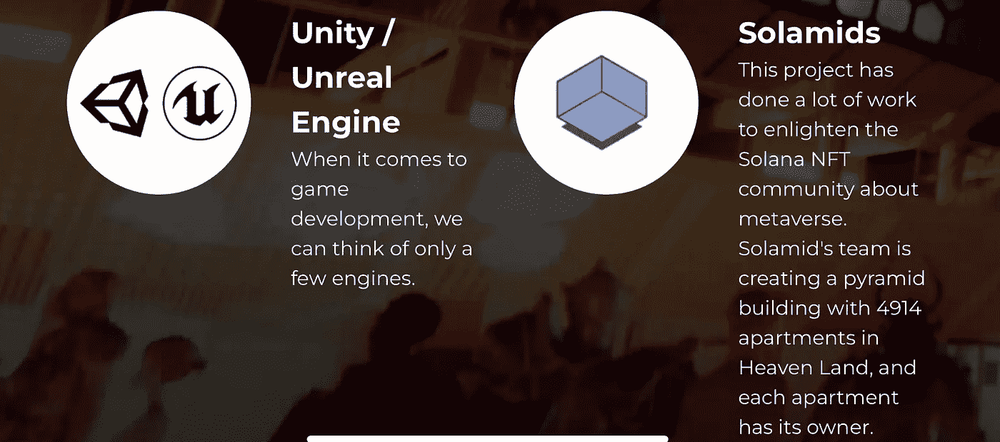

我喜欢他们的做法，他们船上的每个合作伙伴，将不得不购买和股份$HTO 代币。

此外，作为一个狂热的游戏玩家，我很高兴看到 Unity(虚幻引擎)成为合作伙伴。由于该项目旨在向虚拟现实空间迈进，我觉得虚幻引擎 5 绝对会通过这一元宇宙产品让用户大吃一惊。值得称赞🚀

**天堂网站上链接的伙伴关系**

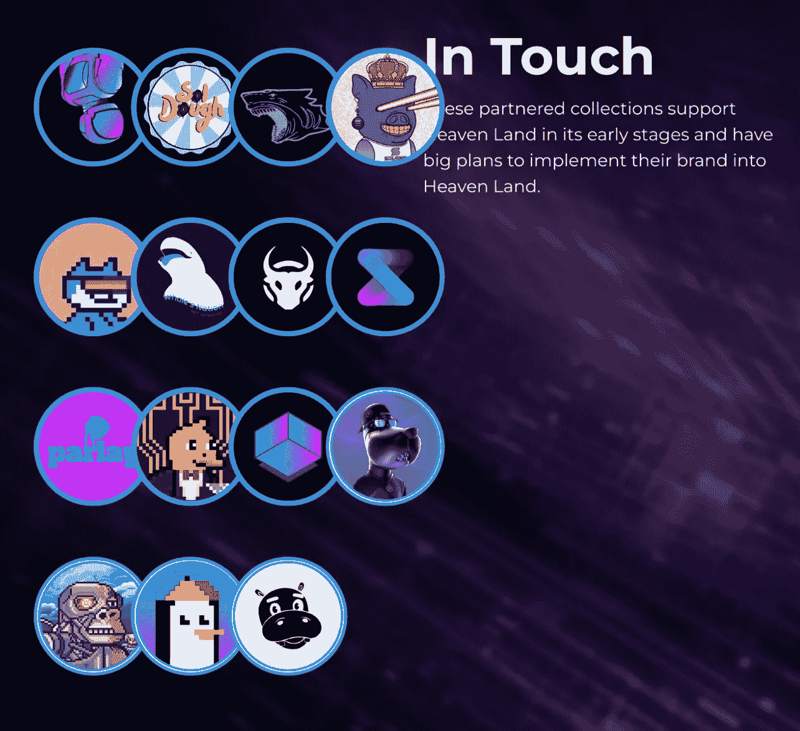

Support partners & project

## 天堂项目路线图:

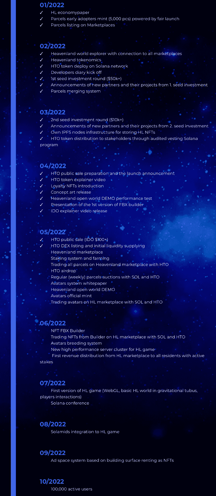

Heavenland, 2022- Roadmap

在我在 Medium 上公开写作的短短时间内准备了多个项目报告后，我现在可以很容易地区分坏的、好的和伟大的项目路线图。看到天堂的路线图(附在上面)，我非常激动，这表明了电车对他们的愿景是多么认真。我的书里有可靠的评级！

最大项目并不重视路线图，但问题的关键是路线图给了你一个团队愿景的美丽视角。仅仅通过将路线图分成几个阶段，并写一些密码术语，对投资者来说只是混淆视听。

我现在是，并且将继续向加密社区的每个人重复，在投资一个项目之前要做好尽职调查……在这个领域快速亏损并不新鲜&你必须时刻保持警惕。

## HTO 令牌组学:

*   $HNT 是本机令牌；用于市场交易、费用、奖励和管理
*   铸造了最多 5 亿枚代币

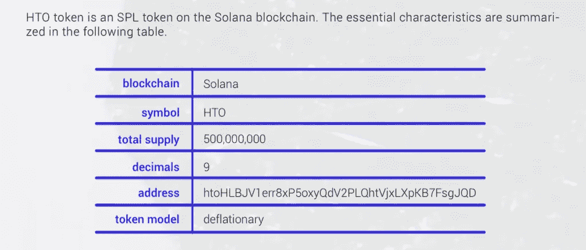

*   **令牌分配如下**:

1.  **团队 20%**
2.  **社区 5%**
3.  **打桩池 20%；**
4.  **基础池 22%**
5.  **资金池 33%**

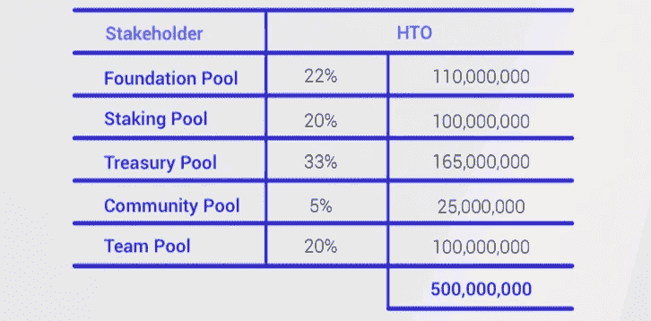

## 代币授予计划:

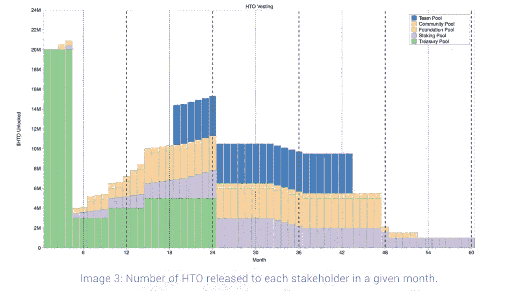

**团队代币锁定 18–42 个月**。上图给出了详细的授权时间表。

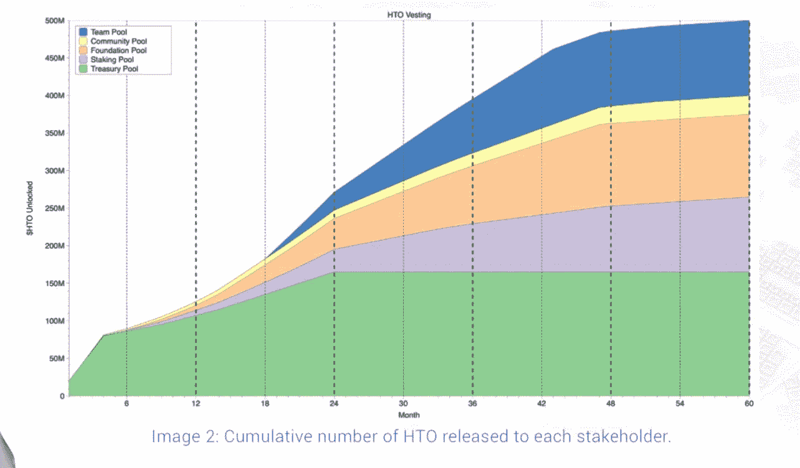

上图以图形图像的形式显示了发布的令牌的确切具体数量；

团队令牌的初始解锁比我希望的要高一点，但看到团队投入的大量工作，我不会发出市场抛售的信号。

## 下注$HTO

下注$HTO 会减少总的流通供应量，但是下注$HTO，用户首先需要拥有土地。一个用户被允许下注的$HTO 的数量受限于他们拥有的土地数量。

*   积极的一面是——从长远来看，这会激励 HODL 和 HTO
*   消极的一面是——增加了鲸鱼集中化的风险

## $HTO 代币销售:

天堂将分两轮提供象征性销售:

*   **私人回合**
*   **公共回合**

私人回合销售已经结束，而公共回合销售 IDO 将于 2022 年 5 月初开始(即将到来)

## 索尔西·NFT 和$HTO

索尔西列出了一个经过验证的天堂土地 NFTs 的集合，可以直接用$HTO 购买

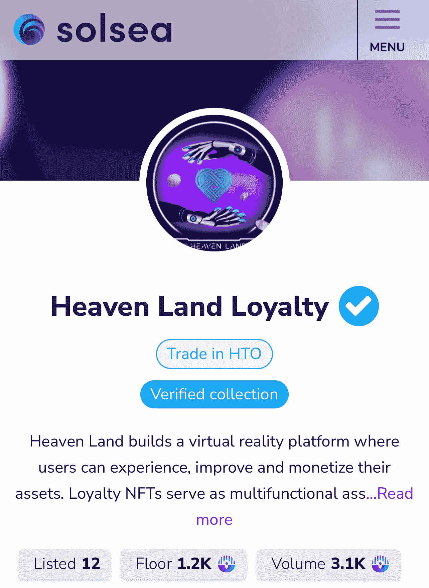

## 社交媒体和相关链接:

*   https://twitter.com/heavenland_io?s=21&t = yRWvTQwlbcg-3 ljkr 9 owha
*   **不和:**https://t.co/CRKjOpJb9W

## 关键要点:

这是一个非常成功的项目，巩固了它在元宇宙市场的地位。

不利的一面是，我对团队选择匿名不太感兴趣&项目团队选择现在不进行项目审计。希望这种情况在未来会有所改变，我们会得到更多相关的细节。

元宇宙的虚拟土地已经以疯狂的价格出售，我们最近在分散土地、Blockotopia 和 BAYC 上看到了这种情况……所以在即将到来的项目的早期阶段进行投资可以产生一些惊人的收入机会。

***注意:这不应被视为投资建议，纯粹出于教育目的。无论如何，我写这篇文章并没有得到这个项目的报酬，这只是我的研究报告，目的只是为了教育。***

*非常感谢 CoinDCX 给我这个机会撰写如此详细的报告，并成为# CoinDCXpathbreaker 计划的一部分，使我能够与加密领域的每个人分享这些知识。*

> 加入 Coinmonks [电报频道](https://t.me/coincodecap)和 [Youtube 频道](https://www.youtube.com/c/coinmonks/videos)了解加密交易和投资

# 另外，阅读

*   [如何开始通过加密贷款赚取被动收入](https://coincodecap.com/passive-income-crypto-lending)
*   [BigONE 交易所评论](/coinmonks/bigone-exchange-review-64705d85a1d4) | [电网交易 Bot](https://coincodecap.com/grid-trading)
*   [氹欞侊贸易评论](https://coincodecap.com/anny-trade-review) | [CoinSpot 评论](https://coincodecap.com/coinspot-review)
*   [新加坡十大最佳密码交易所](https://coincodecap.com/crypto-exchange-in-singapore) | [收购 AXS](https://coincodecap.com/buy-axs-token)
*   [投资印度的最佳加密软件](https://coincodecap.com/best-crypto-to-invest-in-india-in-2021) | [WazirX P2P](https://coincodecap.com/wazirx-p2p)
*   [7 个最佳零费用加密交易平台](https://coincodecap.com/zero-fee-crypto-exchanges)
*   [最佳网上赌场](https://coincodecap.com/best-online-casinos) | [期货交易机器人](/coinmonks/futures-trading-bots-5a282ccee3f5)