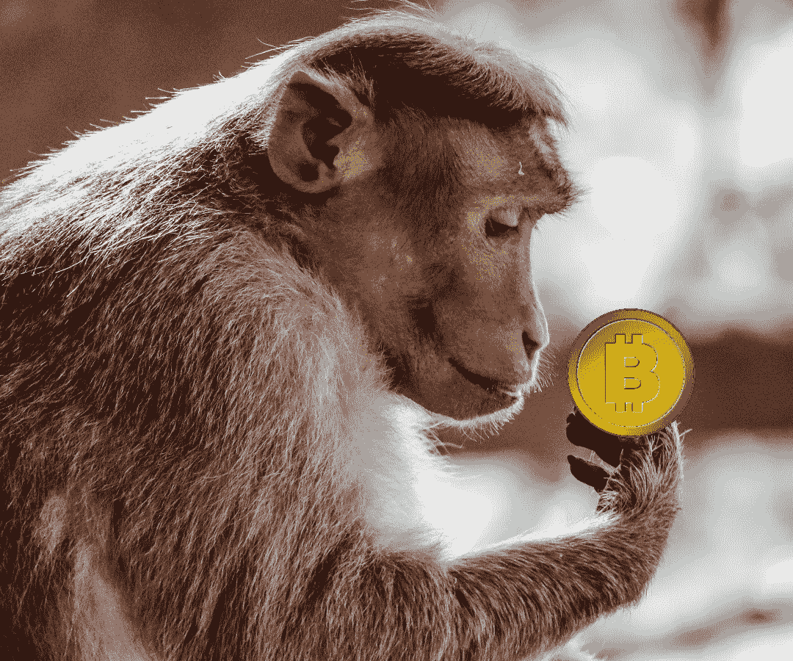

# 拥抱熊:聪明人的愚蠢加密投资

> 原文：<https://medium.com/coinmonks/hugging-the-bear-dumb-crypto-investing-for-smart-people-9b41702b7b20?source=collection_archive---------6----------------------->

恐慌的投资者正在抛售市场。为什么现在是进入 crypto 的好时机，以及如何变笨为聪明。

Image: PixTeller

> “想想普通人有多愚蠢，意识到他们中有一半比这更愚蠢”――乔治·卡林

# 钻石是给熊的