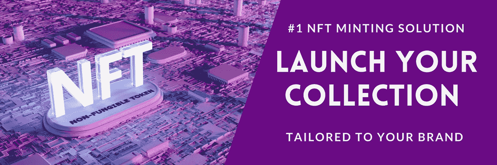

# 蜂鸟金融收购 Swyft

> 原文：<https://medium.com/coinmonks/hummingbird-finance-acquires-swyft-310bf2872087?source=collection_archive---------18----------------------->

RYI 联合和蜂鸟金融达成战略发展伙伴关系，在币安智能链上建立最大的 NFT 发射台

> 加入 Swyft 开发的技术是对我们平台产品的一项重大投资和补充，也是蜂鸟金融(Hummingbird Finance)向前迈出的一大步。与 HMNG 和 RYI 统一的战略合作伙伴关系使 HMNG 在一个不断增长和令人兴奋的市场中具有竞争优势。
> **布赖登·麦金尼 CEO HMNG。**

蜂鸟金融社区很高兴欢迎 Swyft 项目持有人和他们的社区加入我们的网络。作为收购的一部分，所有 Swyft 令牌持有者将被空投我们的 NestSwap 平台治理令牌:HEGG。完整的过渡时间表将向持有人公布，并在他们的电报组和推特上宣布。所有社区都将有机会在 Twitter 聊天(TBA)上提问。

# 您的 NFT 项目启动解决方案

# 什么是 NFT 和启动流程？

NFT 代表[“不可替代令牌”](https://www.fool.com/investing/stock-market/market-sectors/financials/non-fungible-tokens/)，这是一种建立在币安智能链(BSC)上的数字证书，可以保证唯一数字资产的所有权。将数字资产(从艺术到音乐到文章的一切)铸造成 NFT 是艺术家将其作品货币化的一种方式。

该发射台将能够支持公司提供全面的服务，从开始到结束 NFT 发射。我们将构建 NFT 智能合同，并为售前准备一个售前/白名单网站。因此，从客户那里带走了许多工作和困难。客户只需将他们的设计提交给我们的团队，我们将开始这一进程。

# NFT 发射台铸造

**许多公司和组织都想推出自己的 NFT 系列，而我们在该行业的专业知识让我们能够使用 Swyft 项目开发的技术。**

# VIPSs 白名单呢？

通过我们的智能合同开发，我们将根据客户的需求量身定制一个白名单 NFT 预售。您选择主题的网站。您将完全控制白名单事件的管理。我们就是来实现它的！

# 售前的

一旦白名单结束，项目将有机会在一个定制的网站上举办预售。可以选择合适的日期和销售期限。

# 铸造

每个项目将有机会选择他们的 NFT 系列的供应。这可以根据专业特性、稀有性、智能 NFTs 进行定制，并完全根据项目要求进行定制。一旦项目完成预售，非功能性测试将被揭示和铸造。

# 接触

如果您对新的合作关系有任何疑问，我们希望了解如何与我们一起推出您的 NFT 系列，请通过[电报](https://t.me/brydenmck)或发送[电子邮件](mailto:nestswap.app@gmail.com)联系首席执行官布莱登·麦金尼。

# 成为合伙人

如果你拥有一个 BSC 项目，并且想用 Nestswap 建立自己的池，请在此申请【https://forms.gle/jt1k1yhwmWNe1rUf9 

# HEGG 是什么，在哪里买？

蜂鸟蛋(HEGG)是我们自己的去中心化交易所 NestSwap 的治理标志。前往 [NestSwap.app](https://nestswap.app/swap?outputCurrency=0x778682C19797d985c595429FbC51D67736013A86) 购买交易对 HEGG/BNB。

# 关于蜂鸟金融

在[https://docs.nestswap.app/](https://docs.nestswap.app/)阅读关于该项目和 2022 年计划的所有信息

# 加入我们了解更多信息:

电报:[https://t.me/hummingbirdbsc](https://t.me/hummingbirdbsc)

网址:https://[hummingbirdbsc.org/](http://www.hummingbirdbsc.org/)

推特:[https://twitter.com/HmngBsc](https://twitter.com/HmngBsc)

https://www.reddit.com/r/HmngBsc/

> 加入 Coinmonks [电报频道](https://t.me/coincodecap)和 [Youtube 频道](https://www.youtube.com/c/coinmonks/videos)了解加密交易和投资

# 另外，阅读

*   [最佳加密分析或链上数据](https://coincodecap.com/blockchain-analytics) | [Bexplus 评论](https://coincodecap.com/bexplus-review)
*   [NFT 十大市场造币集锦](https://coincodecap.com/nft-marketplaces)
*   [AscendEx Staking](https://coincodecap.com/ascendex-staking)|[Bot Ocean Review](https://coincodecap.com/bot-ocean-review)|[最佳比特币钱包](https://coincodecap.com/bitcoin-wallets-india)
*   [Bitget 回顾](https://coincodecap.com/bitget-review) | [双子 vs 区块链](https://coincodecap.com/gemini-vs-blockfi) | [OKEx 期货交易](https://coincodecap.com/okex-futures-trading)
*   [美国最佳加密交易机器人](https://coincodecap.com/crypto-trading-bots-in-the-us) | [经常性回顾](https://coincodecap.com/changelly-review)
*   [在印度利用加密套利赚取被动收入](https://coincodecap.com/crypto-arbitrage-in-india)