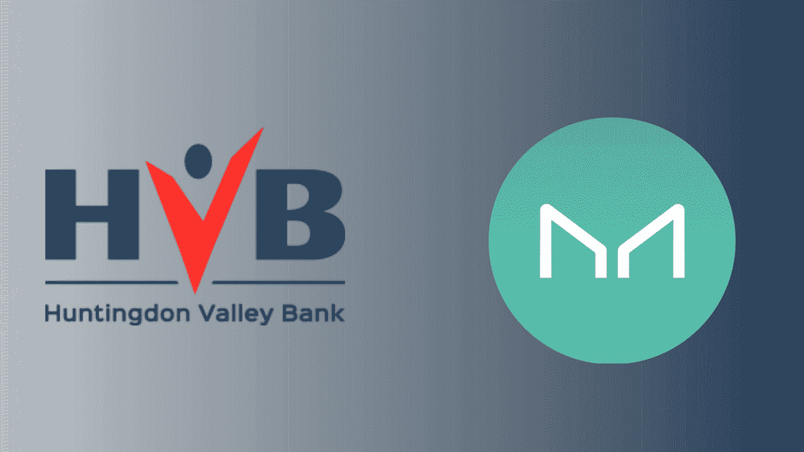
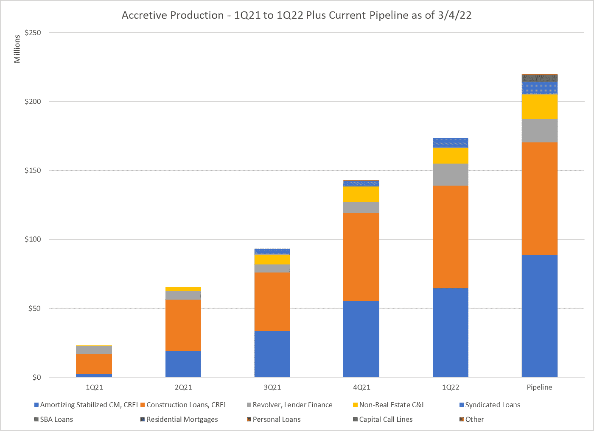
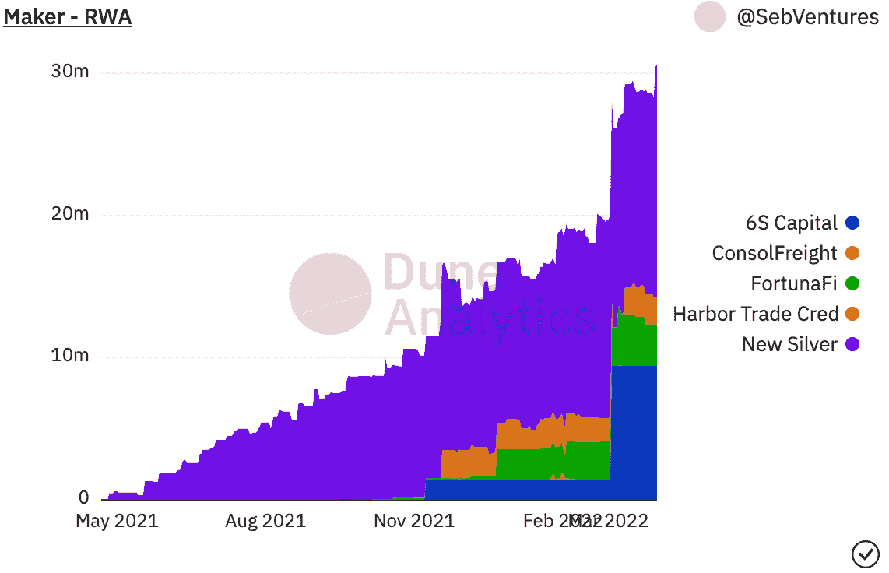
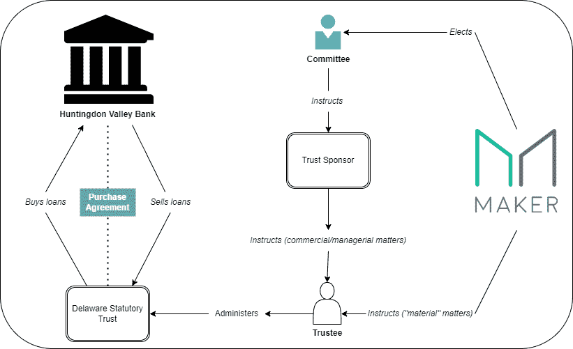

# 亨廷顿谷银行向马克道的大胆迈进

> 原文：<https://medium.com/coinmonks/huntingdon-valley-banks-bold-move-towards-makerdao-f3065eba6aa1?source=collection_archive---------2----------------------->

如果被问及金融或区块链最让我兴奋的是什么，我的回答是一样的，两者的融合和整合。如果你还没有读过我上一篇关于弥合这两者的潜力的文章，我强烈推荐它。3 月 25 日，亨廷顿谷银行向马克道提交了一份令人惊讶的申请，申请从区块链获得融资，用于在现实世界中放贷。在美国的所有金融实体中，我们的银行是迄今为止我们最值得信赖、最稳定、最实用的中介，这就是为什么这个应用程序让我觉得它是将分散金融扩展到现实世界的重要一步。

据报道，该银行在截至 2021 年的一年中拥有 5.5 亿美元以上的资产和 3.75 亿美元以上的未偿贷款。亨廷顿谷银行(HV Bank)的拟议计划要求 1 亿美元的信贷额度(12 个月的目标是 10 亿美元)，以供 MakerDAO 平等(肩并肩)参与贷款。

虽然应用程序本身值得一看，但它读起来令人头痛，可以在这里找到。本文将提供关于亨廷顿银行的背景资料，重点介绍申请的主要方面，以及潜在的意义。我希望能让不同背景的人接触到有希望的信息，并不时地混合一些个人观点。虽然我不是行业专家，但我不断发现自己在学习，我确实相信我的见解和观点可能对其他人有价值。

## 亨廷顿谷银行简介

亨廷顿谷银行是一家成立于 1871 年的宾夕法尼亚特许银行，由 HV Bancorp 控股。公司(纳斯达克上市公司:HVBC)。截至 2021 年 12 月 31 日，该银行在财年结束时报告的资产为 5.5779 亿美元，在各种专业和部门雇用了约 140 名员工，并在三个州(PA、DE 和 NJ)运营着近十几个办事处，其地理运营区域从纽约到北卡罗来纳州，远至俄亥俄州和西弗吉尼亚州。亨廷顿谷银行在战略上多元化，经营几项专业或利基贷款或运营业务，包括但不限于住宅抵押贷款、投资房地产、建筑贷款、电子商务贷款、基于资产的贷款、贷款人融资贷款、个人担保和无担保贷款、与其他机构的银团贷款和政府贷款(SBA、Main Street、PPP)，每个运营领域都有经验丰富的人员。

就 2021 年商业贷款产量而言，所有非建设贷款的毛利息收益率平均约为 4.50%，建设贷款的毛利息收益率平均约为 5.0%，总加权平均毛利息收益率平均约为 4.65%。

在第二季度、第三季度和第四季度，HV Bank 的商业贷款部门分别产生了 4240 万美元、2760 万美元和 4960 万美元的新商业贷款。在 2012 年第一季度，HVBank 年初至今获得 3110 万美元，承销或结算过程中获得 4600 万美元。

上表说明了第一季度 21 至第二季度 22 期间贷款生产的多样化以及与贷款类别相关的预计渠道。该表没有显示前期的产量或 HVBank 其他业务领域的产量，如住房抵押贷款部门。该图显示了 HV 银行发起的和 HV 银行银团贷款的季度增长(累计),这些贷款在提议的贷款类别中是多样化的，作为对主购买协议提议产品的支持。

## 马克道简介

MakerDAO 是一个基于以太坊的协议，它发行 DAI stablecoin 并在没有中介的情况下促进抵押品支持的贷款。它的广泛使用和 DeFi 集成使 MakerDAO 成为加密生态系统中最具可操作性的协议之一。要了解更多关于区块链借贷的工作方式，[观看这段视频](https://www.youtube.com/watch?v=J9q8hkyy8oM)。MakerDAO 是目前 TVL(锁定总价值)超过 170 亿美元的最大的分散融资(DeFi)协议。

为什么 MakerDAO 对现实世界资产这个话题如此重要是从 2021 年 4 月 14 日开始，MakerDAO 通过严格的申请制度开始接受现实世界的资产作为抵押品。目前，只有六种 RWA 抵押品类型在 MakerDAO 平台上被积极用作抵押品。

## 提议的应用

亨廷顿谷银行如何融入马克尔道的贷款结构？简而言之:

通过设立特拉华州法定信托，银行打算设立“MakerDAO 银行参与信托”或申请中提到的“MBPTrust”。法律结构允许亨廷顿谷银行与 MakerDAO 签订主购买协议，因此 DeFi 协议可以参与亨廷顿谷银行的贷款或其他机构的银团贷款。

Overview of the transaction framework

MBPTrust 的首个主购买协议(首个投资组合购买协议)要求的初始债务上限为一亿美元(1 亿美元)，HVBank 参与贷款的目标为十亿美元(1B)，分散在所有提议的贷款类别中，将在开始后的十二(12)至二十四(24)个月内部署。

按照目前的基准利率，在发起和参与时，MBPTrust 的预期净收益率(4.65%减去服务费)保守估计为 3.00%。投资组合的目的是混合固定利率和可变利率，以对冲总体利率风险，平衡收益率和其他风险因素。

HVBank 将保留 HVBank 参与贷款本金的至少百分之五十(50%)的所有权。随着时间的推移，HVBank 将请求 MakerDAO 降低参与贷款的最低所有权百分比，以便 HVBank 建议始终保留最低百分之五(5%)的所有权。

*HVBank 商业贷款部门发放的 HV bank 贷款有固定利率和浮动利率，期限通常为五(5)年或更短，但有时根据市场条件和基础抵押品的要求，建设或抵押贷款的总期限可达十(10)年，它们属于以下贷款类别之一:*

*(一)根据稳定的商业房地产投资摊销商业抵押贷款(“摊销 CRE 抵押”)；*

*(二)由商业房地产投资担保的建筑融资(“建筑贷款”)；*

*(iii)HV bank 私人贷款客户的优先循环债务，为之前的两类“贷款人融资额度”提供融资。*

*(iv)以应收账款、存货、设备和/或企业的其他资产为抵押的非房地产企业贷款(定期或循环贷款)(“企业贷款”)；*

*(v)小企业管理局贷款(“SBA 贷款”)的政府担保部分；和*

*(vi)对批准的私募股权基金的优先担保循环信贷额度，用于通过指定的资本调用(“资本调用额度”)支持投资。*

*总之，HVBank 在其正常业务过程中发放的所有贷款，以及在所有方面符合银行信贷政策和贷款发放指南的所有贷款，包括但不限于上述贷款类别，应被视为 HVBank 参与的贷款，因此属于提议的初始贷款类别。*

*此外，HVBank 购买并参与 MBPTrust 的所有贷款必须符合此处描述的 HVBank 的所有标准信贷和风险条件，符合上述(I)至(vi)类别之一，HVBank 的信用评级令人满意，HVBank 与 MBPTrust 有同等关系。*

此外，HVBank 利用 10 分制风险评级来分析每一笔商业贷款。所有符合总购买协议资格的贷款的建议可接受等级为“6”级或以上(越低越好)，否则通常称为“合格等级”。虽然 HVBank 的信用评级系统中有 10 个类别，但绝大多数风险评级在 4 到 6 之间，反映了正常的风险分布。等级 4-6 的标题分别为“优于平均风险”和“可接受风险”要了解更多关于信用评级系统，我会检查原来的申请，因为所有的要求和评级系统的细节都列出来了。

## 时间表

在 MakerDAO 的管理论坛上提交 MIP6 申请(入职新担保品申请)后，会有一个为期两周的冷静期，在此期间，代表们会在论坛上与申请人互动并提出问题。绿灯投票是第一次附带审查投票，在每个月的第一个和第三个星期一进行，绿灯投票持续两周。

如果绿灯投票通过，RWF(真实世界金融)核心部门人员将联系申请人，启动抵押品尽职调查流程&将从技术、商业和法律角度评估申请。

根据这一信息，相关日期如下:

*   3 月 25 日:提交申请
*   3 月 25 日-4 月 8 日:“冷却期”和选民互动
*   4 月 11 日至 4 月 25 日:绿灯投票
*   TBD:马克道内部团队审批

## 展望未来

传统金融和 DeFi 都可以从合作创新两种金融体系中获益匪浅。如果该应用程序能够通过 MakerDAO 系统，这将是连接两个世界的最激动人心的突破之一。MakerDAO 不仅可以从扩展到 RWA 和利用以下利息收入中获益匪浅，还可以成为该领域的第一家，为其他协议的扩展铺平道路。“加密”资金可以用来为现实世界中的事情融资的方式在法律上变得越来越多，我相信早期采用者将会得到回报。如果绿灯投票获得通过，这是进入 MakerDAO 的重要一步，它将成为媒体的一个重大故事，导致 HV Bank 被描述为为不断变化的环境进行创新。最初不清楚的是 HV 银行提交该申请的其他动机是什么？一个合理的结论是，贷款参与允许牵头金融机构发起一笔异常大的贷款，否则这笔贷款对它们自己来说可能太大了。通过让其他金融机构参与进来，牵头金融机构可以保持在自己的合法贷款限额内，并仍然获得足够的现金来为贷款提供资金。

MakerDAO 的上升空间可能非常大。保守估计，这是一种全新的资产类别，净收益率为 3%，与他们目前持有的资产正交，因此这一机会是一种必要的多元化。此外，在推出更多 RWA 的过程中，MakerDAO 进一步使自己脱颖而出，成为与链外公司合作提供区块链融资的最具创新性的协议。

HV 银行的加入过程将是整个区块链社区都应该关注的事情，因为它的成功可能会引发将分散的银行与美国银行连接起来的大趋势。

个人资料:

[Twitter](https://twitter.com/AltoGrayson) 个人资料

[领英](https://www.linkedin.com/in/grayson-alto-243bb21ba/)简介

[中型](http://graysonalto.medium.com/)型材

> 加入 Coinmonks [电报频道](https://t.me/coincodecap)和 [Youtube 频道](https://www.youtube.com/c/coinmonks/videos)了解加密交易和投资

# 另外，阅读

*   [火币加密交易信号](https://coincodecap.com/huobi-crypto-trading-signals) | [Swapzone 审查](/coinmonks/swapzone-review-crypto-exchange-data-aggregator-e0ad78e55ed7)
*   最佳[密码交易机器人](https://coincodecap.com/best-crypto-trading-bots) | [购买索拉纳](https://coincodecap.com/buy-solana) | [矩阵导出评论](https://coincodecap.com/matrixport-review)
*   [Coldcard 评论](https://coincodecap.com/coldcard-review) | [BOXtradEX 评论](https://coincodecap.com/boxtradex-review)|[uni swap 指南](https://coincodecap.com/uniswap)
*   [比特币基地评论](/coinmonks/coinbase-review-6ef4e0f56064) | [德里比特评论](/coinmonks/deribit-review-options-fees-apis-and-testnet-2ca16c4bbdb2) | [FTX 评论](/coinmonks/ftx-crypto-exchange-review-53664ac1198f)
*   [联合国硬币评论](https://coincodecap.com/unocoin-review) | [最佳加密赌注硬币](https://coincodecap.com/best-crypto-staking-coins)
*   如何使用 MetaMask Wallet 获得 KCC 地址？