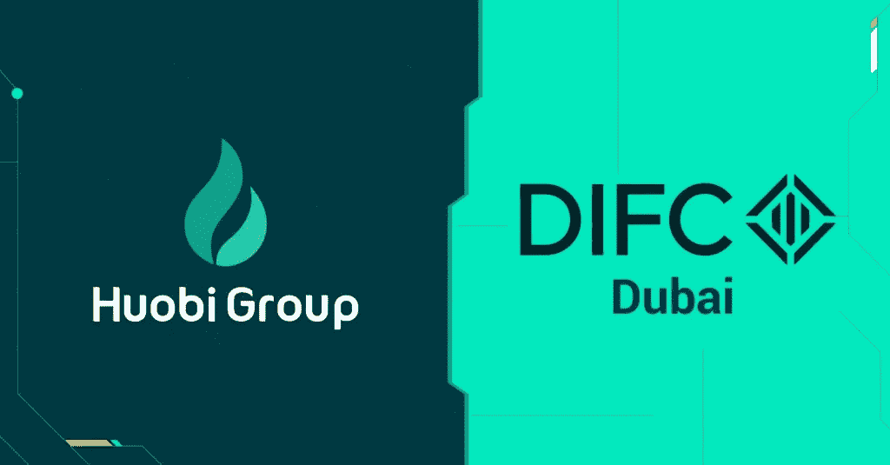

# Huobi 加密交易所在迪拜和新西兰获得许可证

> 原文：<https://medium.com/coinmonks/huobi-crypto-exchange-receives-licenses-in-dubai-and-new-zealand-109183b7dea5?source=collection_archive---------70----------------------->

主要加密货币交易平台 Huobi 通过在新西兰和阿拉伯联合酋长国获得新的许可证，继续扩大其全球业务。

上周五，火币集团获得了迪拜国际金融中心(DIFC)的创新许可，这是该公司有史以来第一次获得该中心的许可。

火币集团首席财务官张丽莉周一告诉 Cointelegraph，DIFC 许可证不是交易许可证，而是授权火币鼓励科技创业公司在迪拜开展业务。该许可证带来了各种好处，如进入当地技术生态系统，以及技术研发、资本流动和税收方面的优惠待遇。

Zhang 指出，Huobi 还打算从迪拜虚拟资产监管局(VARA)获得虚拟资产 MVP 许可证，使该公司能够提供广泛的加密货币交易产品和服务。

“我们在迪拜没有其他许可证。我们在那里有一个小办公室，为中东地区的一些大客户和机构客户服务。然而，我们正在向迪拜 VARA 申请虚拟资产 MVP 许可证的临时批准。”

除了推动其在阿联酋的存在，Huobi 还获得了新西兰金融服务提供商注册(FSPR)的注册，在新西兰提供加密交易服务。

FSPR 的注册是火币集团扩大其在新西兰的加密货币交易业务的第一步，因为所有交易所都必须在该平台上注册，以便为当地用户提供交易服务。

注册后，Huobi 的本地实体 HBGL New Zealand Limited 可在新西兰经营受监管的外币兑换和货币或价值转移服务。注册还允许火币提供资产管理服务和场外交易。

“在新西兰，加密货币本身不被视为法定货币，但监管机构对待加密货币交易所、经纪商和其他提供投资机会的企业，就像对待其他金融服务提供商一样，”张在给 Cointelegraph 的一份声明中说。

在 Huobi 最新的监管里程碑出现之前不久，该公司位于泰国的附属公司 Huobi Thailand 宣布，在泰国证券交易委员会(Securities and exchange Commission)吊销该公司的营业执照后，该公司将于 6 月中旬永久关闭。这家本地公司计划在 7 月 1 日之前结束业务。

“我们想重申的是，Huobi Thailand 不是 Huobi Global 的一部分，而是 2019 年与当地合作伙伴一起成立的一个独立实体，作为我们 Huobi Cloud 部门的一部分，”Huobi 的发言人告诉 Cointelegraph。该代表拒绝给出 Huobi Thailand 交易量的确切数字，只是指出，这只是 Huobi 整体业务中“相对较小和无关紧要的一部分”。

点击这里关注我们了解更多故事[。](http://t.me/etellworld)

> *加入 Coinmonks* [*电报频道*](https://t.me/coincodecap) *和* [*Youtube 频道*](https://www.youtube.com/c/coinmonks/videos) *了解加密交易和投资*

# 另外，阅读

*   [3 商业评论](/coinmonks/3commas-review-an-excellent-crypto-trading-bot-2020-1313a58bec92) | [Pionex 评论](https://coincodecap.com/pionex-review-exchange-with-crypto-trading-bot) | [Coinrule 评论](/coinmonks/coinrule-review-2021-a-beginner-friendly-crypto-trading-bot-daf0504848ba)
*   [莱杰 vs n rave](/coinmonks/ledger-vs-ngrave-zero-7e40f0c1d694)|[莱杰 nano s vs x](/coinmonks/ledger-nano-s-vs-x-battery-hardware-price-storage-59a6663fe3b0) | [币安评论](/coinmonks/binance-review-ee10d3bf3b6e)
*   [Bybit Exchange 审查](/coinmonks/bybit-exchange-review-dbd570019b71) | [Bityard 审查](https://coincodecap.com/bityard-reivew) | [Jet-Bot 审查](https://coincodecap.com/jet-bot-review)
*   [3 commas vs crypto hopper](/coinmonks/3commas-vs-pionex-vs-cryptohopper-best-crypto-bot-6a98d2baa203)|[赚取加密利息](/coinmonks/earn-crypto-interest-b10b810fdda3)
*   最好的比特币[硬件钱包](/coinmonks/hardware-wallets-dfa1211730c6) | [BitBox02 回顾](/coinmonks/bitbox02-review-your-swiss-bitcoin-hardware-wallet-c36c88fff29)
*   [BlockFi vs 摄氏度](/coinmonks/blockfi-vs-celsius-vs-hodlnaut-8a1cc8c26630) | [Hodlnaut 点评](/coinmonks/hodlnaut-review-best-way-to-hodl-is-to-earn-interest-on-your-bitcoin-6658a8c19edf) | [KuCoin 点评](https://coincodecap.com/kucoin-review)
*   [Bitsgap 审查](/coinmonks/bitsgap-review-a-crypto-trading-bot-that-makes-easy-money-a5d88a336df2) | [Quadency 审查](/coinmonks/quadency-review-a-crypto-trading-automation-platform-3068eaa374e1) | [Bitbns 审查](/coinmonks/bitbns-review-38256a07e161)