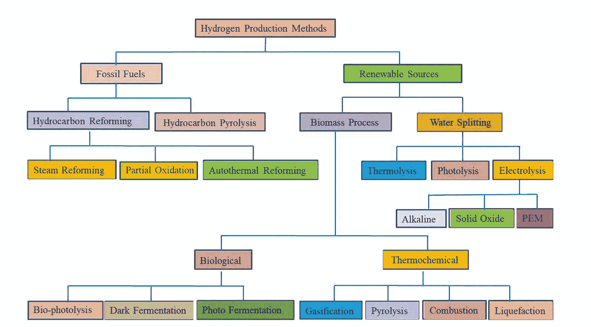

# 制氢方法

> 原文：<https://medium.com/coinmonks/hydrogen-production-methods-9b4504d26269?source=collection_archive---------13----------------------->

众所周知，氢是最有前途的清洁和可持续能源载体之一，并且只排放水作为副产品，没有任何碳排放。但是有哪些不同的制氢方法呢？在这篇博文中，我们将探索一些制氢方法。所以让我们开始吧！

根据国际能源署收集的统计数据计算，很明显我们目前正处于氢经济时代。全世界每年产生 5000 亿立方米的这种气体！

氢产业目前每年价值 3500 亿美元，并且还在增长。

氢是从可再生能源和化石燃料，特别是甲烷的蒸汽重整、油/石脑油重整、煤气化、生物质、生物源和水电解制得的。

Various Hydrogen Production Methods

今天，全球氢气生产的 96%是基于不可再生的化石燃料，主要是甲烷的蒸汽重整。化石燃料产生的氢气纯度较低，有害温室气体浓度高。

全球能源需求是无与伦比的，只有有限的化石燃料储备来推动我们前进。考虑到可持续发展和不断增长的人口给地球资源带来的压力，我们所有人——几代人都一样——都有必要找到不伤害这个星球的替代品，而是通过消除污染来治愈这个星球！其中一种方法可能就是通过水电解，仅仅通过饮用 H2O(在你的厨房水槽或浴室设备中)就可以产生纯氢气，而不会产生任何碳排放。

你觉得怎么样？水电解是未来能源需求和可持续性的方式吗？你对氢气作为燃料来源有什么想法？

请在下面的评论中告诉我们！

 [## Hydrogencoin -基于 Solana 区块链的 DeFi 基金

### Hydrogencoin.io 是全球首个绿色氢的 DeFi 基金

氢币. io](http://hydrogencoin.io/) 

> 加入 Coinmonks [电报频道](https://t.me/coincodecap)和 [Youtube 频道](https://www.youtube.com/c/coinmonks/videos)了解加密交易和投资

# 另外，阅读

*   [交易信号是什么？](https://coincodecap.com/trading-signal) | [Bitstamp vs 比特币基地](https://coincodecap.com/bitstamp-coinbase)
*   [10 本关于加密的最佳书籍](https://coincodecap.com/best-crypto-books) | [英国 5 个最佳加密机器人](https://coincodecap.com/uk-trading-bots)
*   [Koinly 回顾](https://coincodecap.com/koinly-review) | [Binaryx 回顾](https://coincodecap.com/binaryx-review) | [Hodlnaut vs CakeDefi](https://coincodecap.com/hodlnaut-vs-cakedefi-vs-celsius)
*   [40 个最佳电报频道](https://coincodecap.com/best-telegram-channels) | [1xBit 回顾](https://coincodecap.com/1xbit-review) | [Keevo 钱包回顾](https://coincodecap.com/keevo-wallet-review)
*   [如何在印度购买以太坊？](https://coincodecap.com/buy-ethereum-in-india) | [如何在币安购买比特币](https://coincodecap.com/buy-bitcoin-binance)
*   [在美国如何使用 BitMEX？](https://coincodecap.com/use-bitmex-in-usa) | [BitMEX 评论](https://coincodecap.com/bitmex-review) | [买入索拉纳](https://coincodecap.com/buy-solana)