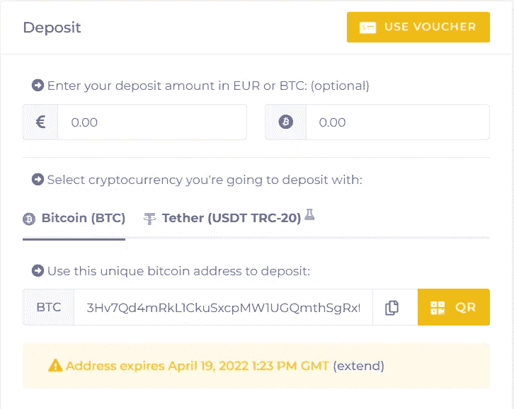

# 我几乎失去了 YieldNodes 的资金——一个巨大支持的故事

> 原文：<https://medium.com/coinmonks/i-almost-lost-funds-with-yieldnodes-a-tale-of-great-support-764dde8c2fff?source=collection_archive---------3----------------------->

几天前，我存了一些钱，准备存进收益账户，以获得每月的回报。通常这是一个简单的过程，我给[写了一个关于如何存款的完整指南(这里)](https://0xn1ce.medium.com/yieldnodes-step-by-step-deposit-guide-use-bitcoin-wallet-kraken-or-credit-card-earning-5-15-6d1b75965c0c)。

# 沉积到屈服节点

YieldNodes 提供了一个比特币地址，你可以将资金发送到这个地址。该地址仅在特定时间内有效，之后必须刷新。到目前为止，一切顺利。

Deposit on [YieldNodes](https://members.yieldnodes.com/c/?a=MyKawjWO4Aj6qAW&redirect=signup)

# 我的错误

当我从北海巨妖交易所汇出资金时，问题出现了。我在北海巨妖有一个旧的比特币地址。我有点分心，因为我试图记住比特币或系绳(USDT TRC-20)是更便宜的方法。

当我想起北海巨妖的比特币更便宜时(BTC 取款只需 0.00002 BTC，按每比特币 45000 美元计算为 0.90 美元)，我就开始取款，实际上是将比特币发送到旧的存款地址。

直到第二天，我的存款还没有到账(这很不寻常)，我才注意到错误。我检查了北海巨妖，他们那边的撤退是成功的。

我的心怦怦直跳，我真的搞砸了吗？我已经看到我的钱花光了。一定要仔细检查你的地址，不要仓促行事。当然，事后看来，很清楚。

# 伸出援助之手

我很快给 YieldNodes 支持部门发了一封邮件，详细说明了相关情况(我读了几遍 FAQ，知道我必须联系他们，尽管他们要求尽量少联系，这样他们就可以专注于主节点设计——这很容易理解)

我很快(从 Ulrich 那里)得到答复，如果 24 小时后存款没有到账，我应该再次联系。咻，我感到一些解脱，我被认真对待，看起来我的钱有希望了。

24 小时后，存款没有出现，我又发了一封邮件，里面有所有的细节。这一次，24 小时后，我收到了 CEO 本人(史蒂夫)的回复，说我的押金已经解决了。

# 快速解决方案

我被快速的解决方案和 YieldNodes 投入的努力所折服。像我这样的小错误一定经常发生。我只能想象团队一次又一次地修复这个问题有多烦人。

另一方面，当首席执行官亲自回应并解决你的问题时，你会感觉很棒。

总结一下:我把 BTC 送到了一个旧的存款地址，不到 48 小时就修好了，YieldNodes 的客户支持给我留下了深刻的印象。

经验教训(再次):仔细检查所有你寄钱的地址。在发送资金之前，请在 YieldNodes 上扩展您的比特币地址。

# 想从 YieldNodes 开始吗？

*   你自己去研究 YieldNodes 吧，说到底我只是网上随便找的一个人！
*   使用[我的会员链接(点击此处)](https://yieldnodes.com/?a=MyKawjWO4Aj6qAW&trk=publish0x)进行注册，我将赚取您存款的 5%,无需额外费用。提前感谢！
*   只投资你能承受的损失
*   通过比特币存款(支持许多美元/€支付提供商，你可以用信用卡或 SEPA 转账购买比特币)
*   决定你是否想要支付你的收入或复合他们！
*   如果你想了解更多，请告诉我，你可以通过[推特](https://twitter.com/n1ce34007134)联系我

今日音乐:

今天到此为止，

n1e

*   [在推特上关注我(或者问任何关于 YieldNodes 的问题)](https://twitter.com/0xn1ce)
*   [购买一个账本来保护你的密码安全(点击这里)](https://shop.ledger.com?r=efb39e05e4f3&tracker=BlogEnd)
*   [今天就注册 YieldNodes】](https://members.yieldnodes.com/c/?a=MyKawjWO4Aj6qAW&redirect=signup&trk=MediumEndOfBlog)

> 加入 Coinmonks [电报频道](https://t.me/coincodecap)和 [Youtube 频道](https://www.youtube.com/c/coinmonks/videos)了解加密交易和投资

# 另外，阅读

*   [3 商业评论](/coinmonks/3commas-review-an-excellent-crypto-trading-bot-2020-1313a58bec92) | [Pionex 评论](https://coincodecap.com/pionex-review-exchange-with-crypto-trading-bot) | [Coinrule 评论](/coinmonks/coinrule-review-2021-a-beginner-friendly-crypto-trading-bot-daf0504848ba)
*   [莱杰 vs n 格拉夫](/coinmonks/ledger-vs-ngrave-zero-7e40f0c1d694) | [莱杰纳诺 s vs x](/coinmonks/ledger-nano-s-vs-x-battery-hardware-price-storage-59a6663fe3b0) | [币安评论](/coinmonks/binance-review-ee10d3bf3b6e)
*   [Bybit Exchange 审查](/coinmonks/bybit-exchange-review-dbd570019b71) | [Bityard 审查](https://coincodecap.com/bityard-reivew) | [Jet-Bot 审查](https://coincodecap.com/jet-bot-review)
*   [3 commas vs Cryptohopper](/coinmonks/3commas-vs-pionex-vs-cryptohopper-best-crypto-bot-6a98d2baa203)|[赚取加密利息](/coinmonks/earn-crypto-interest-b10b810fdda3)
*   最好的比特币[硬件钱包](/coinmonks/hardware-wallets-dfa1211730c6) | [BitBox02 回顾](/coinmonks/bitbox02-review-your-swiss-bitcoin-hardware-wallet-c36c88fff29)