# “我他妈的不走！”

> 原文：<https://medium.com/coinmonks/i-am-not-f-ing-leaving-53f984176e26?source=collection_archive---------2----------------------->

## 或者为什么比特币还没有结束

在 2022 年 1 月 22 日写这篇文章的时候，比特币的价格是 36000 美元。

我认为 30，000-60，000 美元区间是一年之久的看涨盘整，之后会有另一波上涨，我将在本文中解释原因。

我的论文是建立在各种 TA 价格模式、链上指标和社会现象的基础上，简称为 4 个部分。

*   PA 以及与之前周期的比较
*   链上指示器
*   稳定的硬币及其重要性
*   加密货币的采用

## **1。周期性的井喷很快形成，这就是为什么 60，000 美元看起来不像一个**

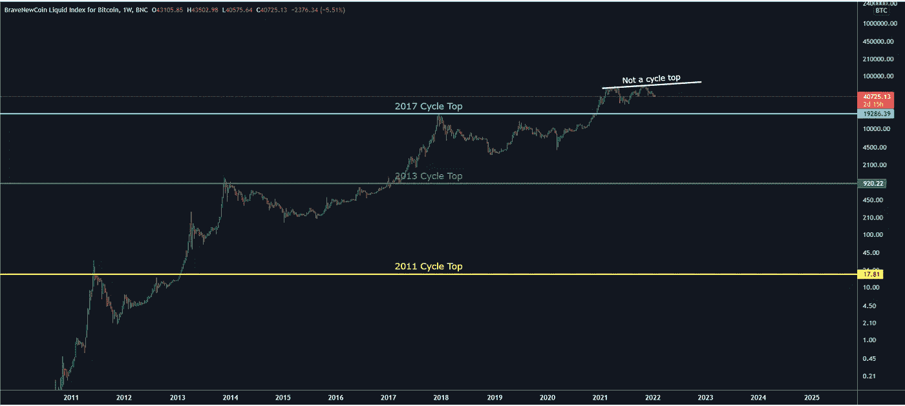

Figure 1 : Previous cycles and their respective top

请注意前几个周期的价格行为是多么的活跃。在 2021 年之前，我们总是经历一次快速的抛物线式触顶，随后是大幅调整和市场结构的变化。我们的情况并非如此，相反，我认为我们正处于长达一年的盘整格局中。

推荐:[你很可能忽略的 5 种比特币模式](/coinmonks/the-odd-shapes-of-the-bitcoin-market-cc58bf5560f0)

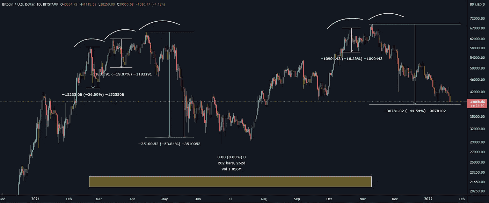

Figure 2 : Liquidity massacre and a year long consolidation

相比之下，在我们 2021 年至 2022 年的情况下，我们有一个长期行动，然后是流动性大屠杀。突破交易者被打了个措手不及，因为每次他们买了新的本地高点，一个急剧的修正发生了，让他们亏损。

请注意，从 58，000 美元涨到 69，000 美元花了 262 天。在 2018 年熊市深入 262 天后，我们已经经历了一次突破，随后是 70%的修正和一个明显的下降三角形(图 3):

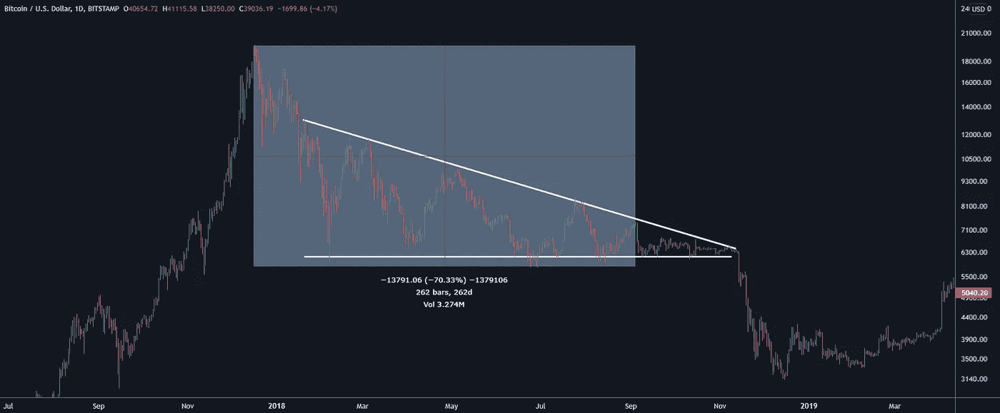

Figure 3 : Clear bearish structure

最后，熊市结构的特点是低高点和低低点。如图 4 所示，情况显然不是这样。

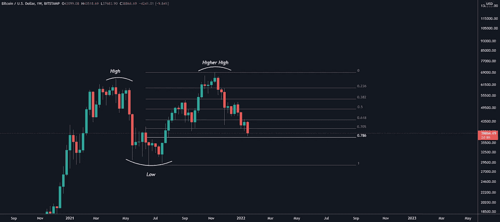

Figure 4 : Bullish market structure is still intact

## **2。链上指示灯**

On-chain 对于观察网络活动和隐藏在表面下的内部经济是非常有用的。我们可以将链上指标分为两类:

a)非常长期——类似于哈希速率，用于概括网络整体状态的新地址

b)有助于我们找到市场定位的中短期指标。

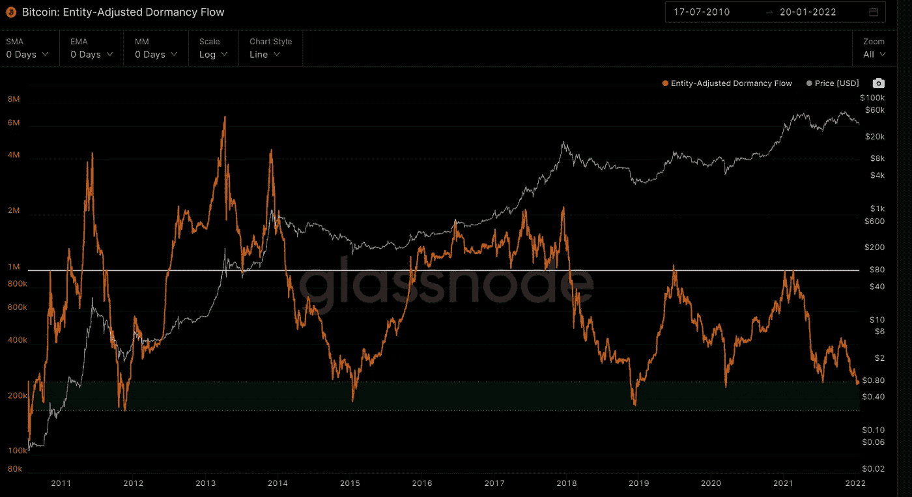

Figure 5 : Entity-Adjusted Dormancy Flow has been very successful finding

这个指标最适合寻找比特币的底部，尽管如图 4 所示，它也能以很高的准确度找到 14，000 美元和 55，000 美元的顶部。

休眠指的是自上次在事务中使用以来所花费的时间。实体调整后的休眠流量是当前市场资本总额与以美元衡量的年度休眠值的比率。积累(绿色区域)本质上是聪明的资金从愚蠢的资金和恐慌的卖家那里获得廉价的硬币。

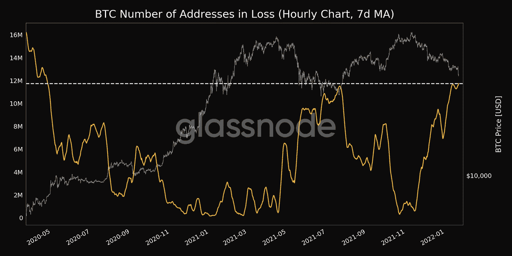

Figure 6 : Entity-Adjusted Dormancy Flow has been very successful finding

如图 6 所示，自 2020 年 5 月以来，我们的地址丢失数量达到最高，实际上是在那年 3 月大约 65%的数据丢失后不久。

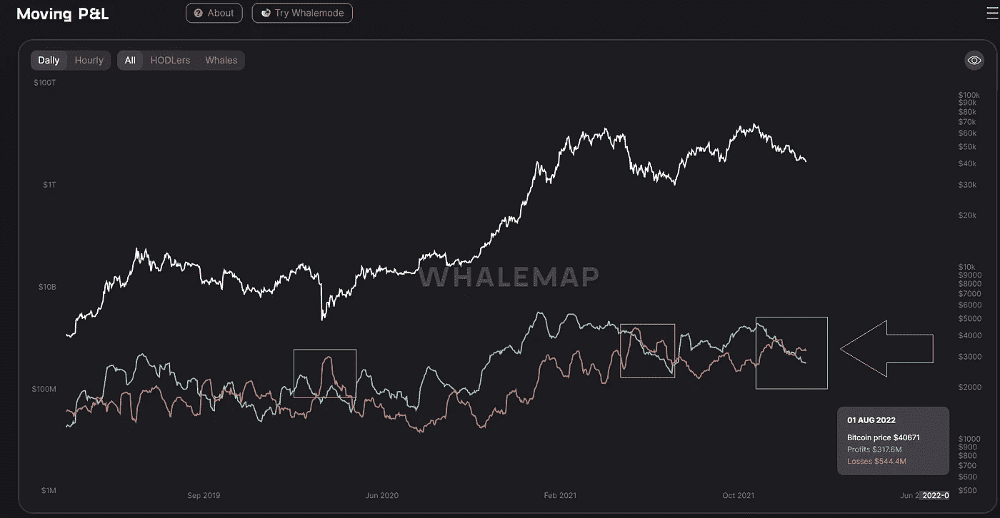

Figure 7 : Moving Profit & Loss measured in USD

如图 7 所示，大多数参与者都处于亏损状态，历史表明这是一个触底指标。我们能横向走或者跌得更低吗？是的，当然。在熊市中，我们可以在很长一段时间内保持这个 P&L 比率。

## **3。稳定的硬币及其重要性**

本月早些时候我观察到，自去年 2 月以来，我们有超过 3 倍的稳定硬币加入了这个空间。然而，价格保持不变，在撰写本文时徘徊在 36，000 美元左右。公平地说，这些基金中有很大一部分被锁定在 DeFi 中，然而，我们不能破坏这可能对市场产生的积极影响。这是已经存在的购买力，随时准备参与。

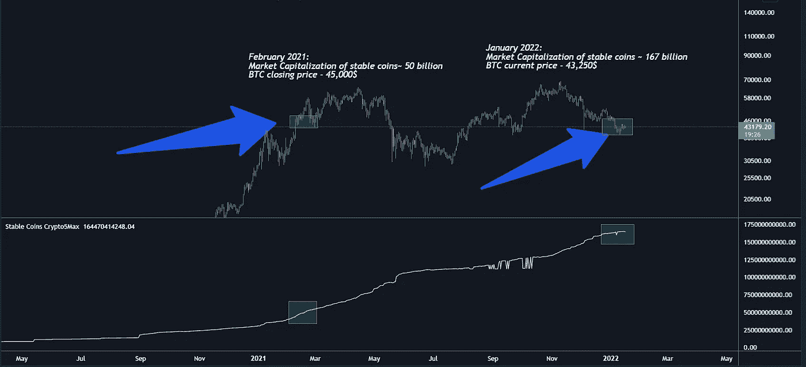

Figure 8 : Stable coins join the space

## **4。加密货币的采用**

这是一篇独立的文章，因为我们去年看到的发展是指数级的，真正改变了游戏规则，但是，我将尝试概述加密采用的许多细微差别——人口统计、基础设施、媒体参与、政府参与等。

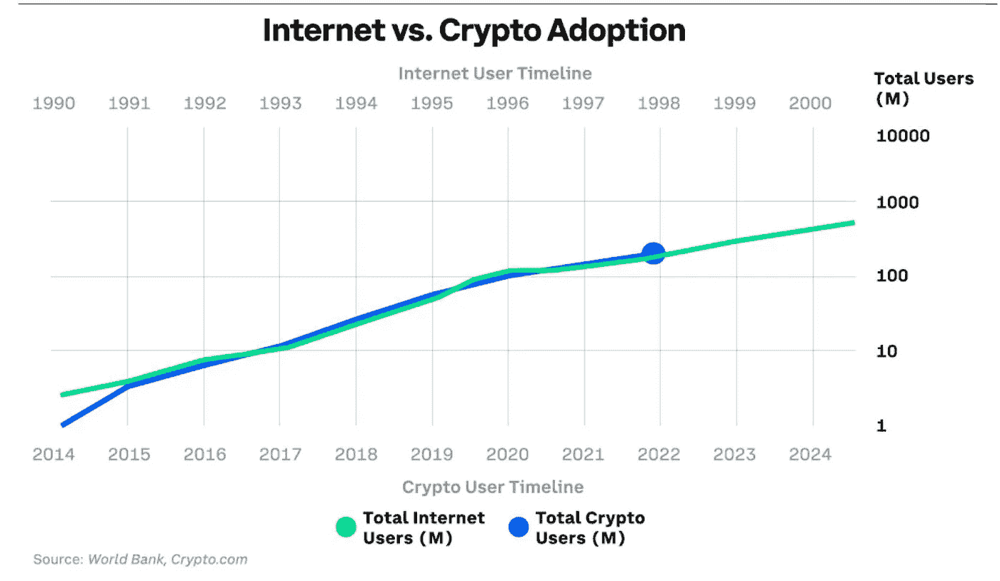

Figure 9 : Bitcoin’s user base is growing at the same pace as the internet

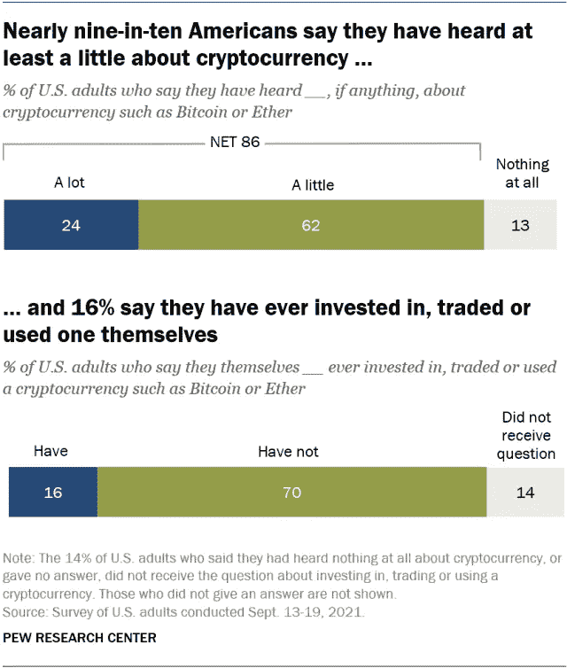

Figure 10 : 16% crypto penetration into the US market

如图 10 所示，我们已经实现了一个重要的里程碑——16%的渗透率，根据马洛尼法则，这是一项新技术从早期采用者转向大多数人的转折点。这一比例在年轻人群中要高得多——18 至 29 岁的人群中有 43%投资、交易或使用过加密货币。随着这一代人越来越多地参与金融和社会生活，我预计加密货币的采用将会增加。

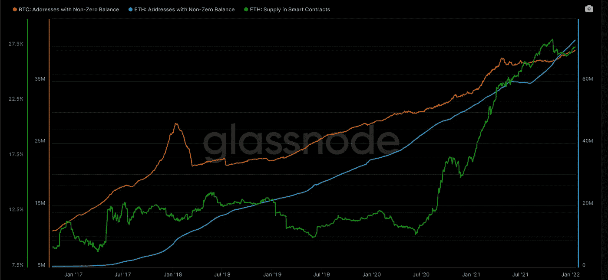

Figure 11 : BTC, ETH addresses with non-zero balance, green: % supply held in smart contracts

区块链都表现出健康和令人印象深刻的增长。智能合约中持有的 ETH 供应量增至约 28%(高于 2017 年的约 8%)。

此外，自 2021 年以来:

*   英特尔将生产比特币挖矿芯片
*   特斯拉加入比特币
*   比特币交易所交易基金获批
*   萨尔瓦多接受比特币为法定货币
*   DeFi 市值从 210 亿增加到 1800 亿
*   NFTs 市值从 10 亿英镑增加到 400 亿英镑

最近，Twitter 还宣布了 NFT 的整合，UFC 明星 Francis Ngannou 将在他即将到来的比赛中获得比特币的一半奖金，纽约市长将获得比特币的前三份薪水，等等。感觉世界在这一点上是加密的，不是吗？好吧，根据目前的市场情绪:

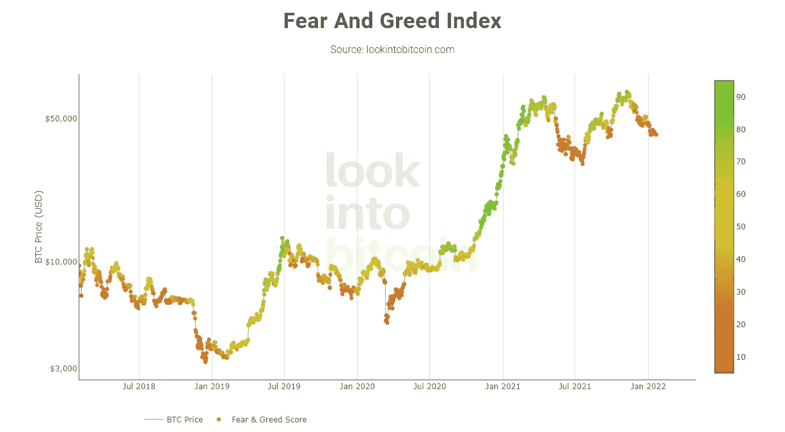

Figure 12— Fear and Greed Index relative to the price

我们已经处于极度恐惧状态整整两个月了。当情绪从极度贪婪下降到极度恐惧时，价格在同一价格水平上波动了整整一年？我觉得不错。

## **结论:**

目前的市场结构看起来没有突破——在既定范围内长时间交易，在此过程中获得更高的高点。绝大多数的环比数据表明下行趋势已经耗尽。加密技术的采用可能是最好的一年，真正成为主流。尽管我们的交易水平与 2021 年初相同，但市场情绪仍然非常悲观。出于这些原因，我认为牛市仍然完好无损，另一轮上涨即将到来。

也就是说，请始终尽职尽责。

免责声明:

以上分享的内容不是理财建议。

这篇文章重点介绍了我感兴趣的一些模式和工具，仅供娱乐之用。

> 加入 Coinmonks [电报频道](https://t.me/coincodecap)和 [Youtube 频道](https://www.youtube.com/c/coinmonks/videos)了解加密交易和投资

## 另外，阅读

*   [3 商业评论](/coinmonks/3commas-review-an-excellent-crypto-trading-bot-2020-1313a58bec92) | [Pionex 评论](https://blog.coincodecap.com/pionex-review-exchange-with-crypto-trading-bot) | [Coinrule 评论](/coinmonks/coinrule-review-2021-a-beginner-friendly-crypto-trading-bot-daf0504848ba)
*   [莱杰 vs n rave](/coinmonks/ledger-vs-ngrave-zero-7e40f0c1d694)|[莱杰 nano s vs x](/coinmonks/ledger-nano-s-vs-x-battery-hardware-price-storage-59a6663fe3b0) | [币安评论](/coinmonks/binance-review-ee10d3bf3b6e)
*   [Bybit Exchange 审查](/coinmonks/bybit-exchange-review-dbd570019b71) | [Bityard 审查](https://blog.coincodecap.com/bityard-reivew) | [Jet-Bot 审查](https://blog.coincodecap.com/jet-bot-review)
*   [3 commas vs crypto hopper](/coinmonks/3commas-vs-pionex-vs-cryptohopper-best-crypto-bot-6a98d2baa203)|[赚取加密利息](/coinmonks/earn-crypto-interest-b10b810fdda3)
*   最好的比特币[硬件钱包](/coinmonks/hardware-wallets-dfa1211730c6) | [BitBox02 回顾](/coinmonks/bitbox02-review-your-swiss-bitcoin-hardware-wallet-c36c88fff29)
*   [BlockFi vs 摄氏度](/coinmonks/blockfi-vs-celsius-vs-hodlnaut-8a1cc8c26630) | [Hodlnaut 审核](/coinmonks/hodlnaut-review-best-way-to-hodl-is-to-earn-interest-on-your-bitcoin-6658a8c19edf) | [KuCoin 审核](https://blog.coincodecap.com/kucoin-review)
*   [Bitsgap 审查](/coinmonks/bitsgap-review-a-crypto-trading-bot-that-makes-easy-money-a5d88a336df2) | [Quadency 审查](/coinmonks/quadency-review-a-crypto-trading-automation-platform-3068eaa374e1) | [Bitbns 审查](/coinmonks/bitbns-review-38256a07e161)
*   [密码本交易平台](/coinmonks/top-10-crypto-copy-trading-platforms-for-beginners-d0c37c7d698c) | [Coinmama 评论](/coinmonks/coinmama-review-ace5641bde6e)
*   [印度的加密交易所](/coinmonks/bitcoin-exchange-in-india-7f1fe79715c9) | [比特币储蓄账户](/coinmonks/bitcoin-savings-account-e65b13f92451)
*   [OKEx vs KuCoin](https://blog.coincodecap.com/okex-kucoin) | [摄氏替代品](https://blog.coincodecap.com/celsius-alternatives) | [如何购买 VeChain](https://blog.coincodecap.com/buy-vechain)
*   [币安期货交易](https://blog.coincodecap.com/binance-futures-trading)|[3 comas vs Mudrex vs eToro](https://blog.coincodecap.com/mudrex-3commas-etoro)
*   [如何购买 Monero](https://blog.coincodecap.com/buy-monero) | [IDEX 评论](https://blog.coincodecap.com/idex-review) | [BitKan 交易机器人](https://blog.coincodecap.com/bitkan-trading-bot)
*   [CoinDCX 评论](/coinmonks/coindcx-review-8444db3621a2) | [加密保证金交易交易所](https://blog.coincodecap.com/crypto-margin-trading-exchanges)
*   [红狗赌场评论](https://blog.coincodecap.com/red-dog-casino-review) | [Swyftx 评论](https://blog.coincodecap.com/swyftx-review) | [CoinGate 评论](https://blog.coincodecap.com/coingate-review)
*   [Bookmap 评论](https://blog.coincodecap.com/bookmap-review-2021-best-trading-software) | [美国 5 大最佳加密交易所](https://blog.coincodecap.com/crypto-exchange-usa)