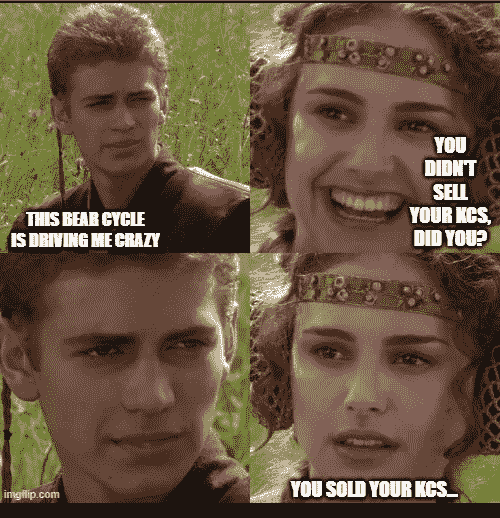
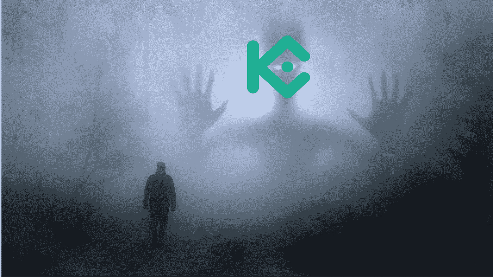
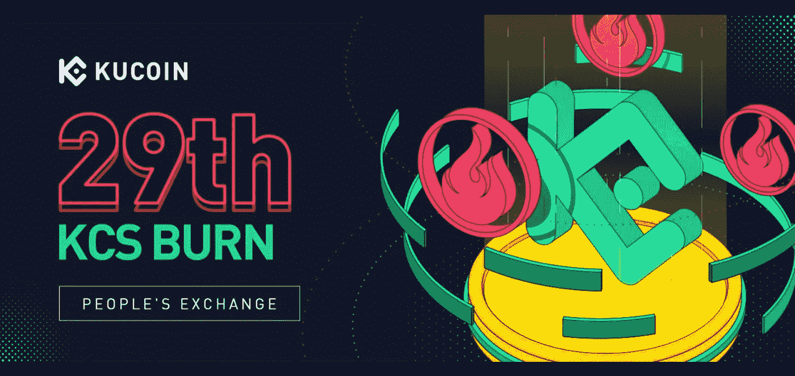
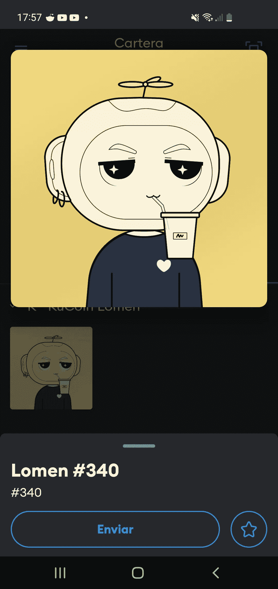
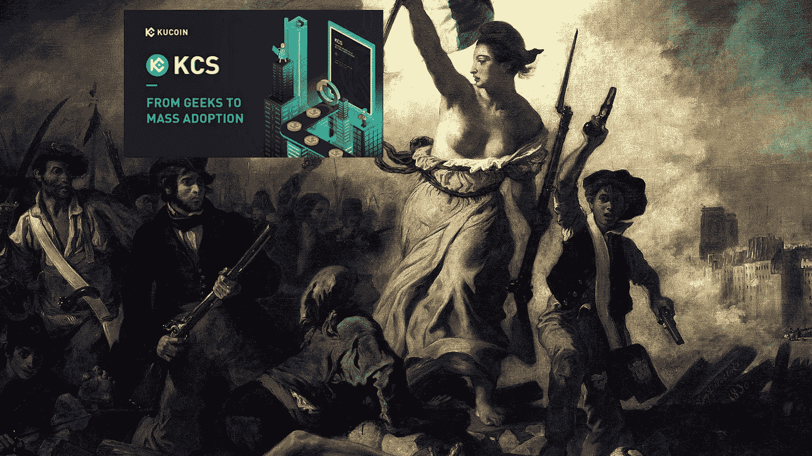

# 我认为你卖掉你的 KCS 不是个好主意

> 原文：<https://medium.com/coinmonks/i-dont-think-it-s-a-good-idea-for-you-to-sell-your-kcs-b656bb2e1bac?source=collection_archive---------62----------------------->

在这个熊市周期中，我度过了艰难的几天。有些晚上，我熬夜读雷·布雷德伯里，去其他世界旅行，让我的头脑清醒一点，暂时忘记我自己和其他人的投资组合。

昨晚我熬夜想弄清楚 GitHub 上的一段代码，这时一件奇妙的事情发生了。

突然，屏幕上出现了一个 KCS 人，他对我说话了！

我无法用语言表达那一刻的神奇。他金属般的机器人声音让我吓了一跳，我以为他把我带到了一个未知的空间。阴阳魔界。

Image by Stefen Keller from Pixabay

我做的第一件事就是惊恐地逃跑。但突然我对自己说，还能出什么问题？我会害怕什么？害怕交易所的公用令牌？如果我跑了，我就不能再和朋友喝啤酒了。

所以我面对了。

-你是真正的 KCS 吗？

-整个 KCS 都是真的。

想象一下这种情况，我在一个不知道元宇宙时空坐标的地方，对着一个交易所的公用令牌说话。

-哦，是的，我知道，我已经在 KuCoin 上买了 KCS 很久了。

-你没有买我，我不在你的 UID 里。

-我明白了，如果不是这样，你不会这么平静地走来走去

-我今天从大火中被救了出来，我出去呼吸一些新鲜空气

*   哈哈哈，2 亿被编程了就只剩 1 亿了吧？

-事情就是这样。我们这些留下来的人非常享受生活。无论如何，KCS 不仅仅是一个公用事业的象征。我们被设计成刺客，这就是我们的行为。我们是交易所公用代币中的精英突击队。我们有着与众不同的专业战斗训练和实践。

哇哦！

-我们被自豪地认为是用每日奖金赚取被动收入的最佳方式。

-我很清楚，这是我早上做的第一件事，把一天的利息放进我的钱包。

-所以你不止有 6 个 KCS。

——多了很多，我跟你说了我买了很久了。

-所以你知道拥有 6 个以上 KCS 的用户每天获得的红利来自交易所每日交易费收入的 50%。KCS 奖金是一种独特的机制，鼓励使用交易所并奖励其粉丝。KCS 持有者每天可以获得的奖励金额直接取决于当天的 KuCoin 交易量。

 [## 注册|注册

### 注册 KuCoin，今天就获得您的第一个密码！

www.kucoin.com](https://www.kucoin.com/ucenter/signup?rcode=rJE8S2S) 

我想了一会儿。加密货币交换令牌为它们运行的平台提供各种重要功能。一方面，它们可以增加流动性和交易活动。本地交换代币可用于激励流动性，奖励交易最多或持有代币的用户。但是，除此之外，它们还可以用来获得交易费折扣。似乎这还不够，它们还可以作为交易所治理机制中的一个工具。也就是说，交换令牌是加密生态系统中非常重要的资产。我在 CoinGecko 上查看了市值排名靠前的交易所:BNB (5)、CRO (19)、利奥(20)、FTT (22)、OKB (27)、尤尼(33)、KCS (48)和蛋糕(51)。

> 交易新手？试试[加密交易机器人](/coinmonks/crypto-trading-bot-c2ffce8acb2a)或者[复制交易](/coinmonks/top-10-crypto-copy-trading-platforms-for-beginners-d0c37c7d698c)

除了支持这些代币的平台之间的差异之外，它们都提供基于硬币赌注的奖励。但在我看来，KCS 的商业模式似乎很完美，因为它直接激励了交易所的交易活动。你在交易所交易越多，你从持有 KCS 中获得的利润就越多。这是一个很大的鼓励，这样下次你必须交易硬币时，你会在[库币进行交易。](https://www.kucoin.com/ucenter/signup?rcode=rJE8S2S)

我知道你不再是 ERC 20 号了，对吗？

-我们在 2017 年出生为 ERC-20，但在 2021 年移民到 KCC。我们是 [KCC(库币社区链)](https://www.kcc.io/)的本地货币。KCC 是由 KCS 和库科恩社区的核心成员开发的区块链。KCC 开始了 KCS 生态系统发展的新阶段，进入了权力下放的领域。当我们推出 KCC 时，我们经历了[在一个月内增长 100%](https://www.kucoin.com/blog/kcs-soared-more-than-100-percent-after-its-community-chain-launch)的眩晕。考虑到 [KuCoin](https://www.kucoin.com/ucenter/signup?rcode=rJE8S2S) 是世界上[顶级交易所](https://www.forbes.com/advisor/investing/cryptocurrency/best-crypto-exchanges/)之一，而且它的[增长是持续的](https://www.businesswire.com/news/home/20211025005469/en/KuCoin-Reports-720-YoY-Volume-Growth-in-Its-Q3-2021-Review)，我的朋友，我们正在做大事。我们有超过 600 枚硬币上市，远远超过任何其他交易所，交易量每个季度都在稳步增长。我们提供 1000 多个交易对，支持 51 种法定货币。截至 2022 年 1 月，KuCoin 已经拥有数千万注册用户，累计成交量以美元计算高达数千亿。

——我是 [KCC](https://www.kcc.io/) 的粉丝，我是[电报组](https://t.me/KCCOfficialChannel)的满编。我甚至珍藏了洛美#340

-我喜欢听这个！恭喜你！目前，KCC 是一个低成本，完全符合 EVM 的区块链。你可以在 KCC 使用你的 kcs 作为汽油。我们对这个项目感到非常兴奋，并相信它将很快成为密码圈内最重要的生态系统之一。KCC 是我们在权力下放上的大赌注。更大程度的去中心化意味着你，用户，将越来越多地参与到生态系统的决策中。KCC 是建立在以太坊源代码，并完全兼容 EVM 智能合同。KCC 1.0 于 2021 年 6 月 16 日正式发布。我们已经有了 KCC 2.0 和 KCC 3.0 的路线图。已经有几十个项目在 KCC 上运行，包括分散式交易所、钱包、NFT 和 Dao。KCC 生态系统中所有项目的 TVL 数以千万计。KCS 托管的地址数以万计。在 100 多个国家和地区拥有数百万粉丝。

-我认为 KCC 在不久的将来会成为最大的区块链之一，而 KCS 会成为下一个 BNB

-我会告诉你很少有人怀疑这一点

-你觉得自己会回到 2021 年 12 月的 ATH 吗，当时 KCS 的股价是 28 美元？

为什么不呢？两年前，一辆 KCS 的价格是 0.9 美元，今天大约是 15 美元。你知道有多少硬币在两年内翻了 15 倍吗？我们是“人民交易所”，我们将成为“人民的硬币”。

从谈话一开始，我就注意到这个 KCS 冷漠、飘渺、难以捉摸、不友好，但我没想到他也会咄咄逼人。突然他告诉我:

-有没有可能我打过交道的人类都这么蠢？他们唯一感兴趣的是我们未来的价格？你就不能想点更聪明的办法吗？

-比如什么？我有点茫然地问

-比如你有没有用你的 KCS 参加过 [KuCoin Spotlight](https://www.kucoin.com/spotlight-center?spm=kcWeb.B8homepage.Header6.3) ？

“不，”我有些害怕地回答

听着，KCS·霍德勒可以参加聚光灯下一个新项目的首次象征性销售。你知道 KuCoin 是最关心新项目的交易所，自成立以来，它的愿景就是产生其他地方拒绝的项目。在[聚焦](https://www.kucoin.com/spotlight-center?spm=kcWeb.B8homepage.Header6.3)中，我们展示新项目，您可以和您的 KCS 一起参与有前景项目的早期投资，获得巨大收益。与平均值相比，我们列出的项目的投资回报率非常高。

这对我来说很新鲜，因为我不是那种押注高风险项目的投资者。

但我还是觉得被之前的侵犯伤害了。

-我还错过了什么“智能”项目？我告诉他，这一次，要主动出击

-KCS 有太多的事情要做，我不知道你知道什么，你不知道什么。在这一点上，我可以向你保证，我们胜过其他交易所的所有硬币。例如，你和 KCS 一起去购物了吗？

-耶三三。我用 KCS 的 [Travala](https://www.kucoin.com/news/en-travala-joins-forces-with-the-kcs-ecosystem) 为我的下一次旅行做了预订，这是一个由区块链技术支持的旅游和酒店预订平台。

-非常好！你也可以和 KCS 一起在斯皮特兰买怪物，在各种商店买衣服，玩各种游戏并在各种游戏上下注，还可以经营一些提供贷款的金融网站。大成长来了。你读过我们在 2022 年 3 月发布的 KCS 白皮书吗？

-我读了，现在还在读。KuCoin 成为海量交易所的目标非常明确。现在你讲的是“人的生态系统”，不再讲“人的交流”。我喜欢这样。

-是的，这是一个微妙的，但基于一个非常清晰的愿景。我们的主要担忧是基于这样一个事实，即今天有许多大问题需要解决，而我们将继续开发工具，借助区块链技术，让人类未来的生活更加轻松。尽管如此，90%的人类没有接触过加密货币，这可能会产生一个非常大的缺口，可能很难解决，同时朝着完全去中心化系统的发展仍在继续。我们可以说，在加密世界和传统世界之间仍然有很大的差距。这就是为什么开国元勋们致力于开发一个基于 KCS 优势的完整生态系统。

-是的，我很清楚。我们现在正在谈论“KCS 生态系统”以及与库币交易所的“合作”。这是一种进化的迹象，考虑到我们，KCS·霍德勒夫妇，在获得每日奖金、费用减免、参与福利和新版本等丰厚回报的同时，对库科恩的巨大增长负有主要责任。

-但 KCS 生态系统的最大赌注与完全沉浸在 Web 3.0 世界有关。我们坚信，未来的互联网必须由用户创造，必须由用户拥有，必须由用户控制，必须由分布式协议组成。我们将创建并利用 Web 3.0 孵化基金和 KCS-Web 3.0 社区，与 KCS·霍德勒共同探索 Web 3.0 宇宙。

-这就是为什么“从极客到大规模采用”的口号？

没错。我们想不出更好的办法来说明我们的计划。总的愿景是将 KCS 打造成一个基于区块链的价值自循环生态系统，正如[白皮书](https://www.kcs.foundation/kcs-whitepaper.pdf)明确指出的那样。

-好了，KCS 先生，亲爱的朋友，我得回去工作了，会议很愉快，和你直接交谈很有趣。我不认为有人会相信，但我仍然计划在我的社交网络上留下一份关于这次会议的书面文件

——再见人类，在某种程度上，我们依赖于你，而你是如此的不可预测！希望你不要一直犯错，多考虑长远。光明的未来等待着我们。我们就是革命。周末愉快。

KCS 号消失了。或许我已经成为第一个与加密货币对话的人，更重要的是，我已经成为第一个接受加密货币建议的人。这就是神秘球体的不可预测性。

像人类一样。

在我看来，当他走开的时候，他吹着一首熟悉的曲子，我想是《带我飞向月球》。

**结论**

这一切都是梦吗？这是另一个梦中的梦吗？是雷·布雷德伯里的《火星编年史》的影响吗？

无论如何，我不需要这样的遭遇来知道卖掉我的 KCS 不是一个好主意。恰恰相反。我不断地购买以使用它并获得每日奖金，并在一些交易机器人的对中使用它，这是我在 KuCoin 中最喜欢的应用程序。随着这个充满活力的社区在其所有社交网络中辐射出的未来，一切似乎都表明，呆在里面比呆在外面更好。

[推特](https://twitter.com/kucoincom)

[出版 0x](https://www.publish0x.com/tag/kucoin-shares-kcs?utm_medium=click&utm_source=nav&utm_campaign=kucoin)

[中等](/tag/kucoin-shares)

[YouTube](https://www.youtube.com/c/KuCoinExchange) (强烈推荐，视频有教育意义，非常有趣)

[电报](https://t.me/Kucoin_News)

[不和谐](https://discord.gg/YRjVYFZdSE)

对我来说，在游戏的这个阶段你还没有一个 KuCoin 帐户似乎很难，但是如果有的话，我会把我的推荐链接[留给你，这样你就可以试试了。(如果要手动做，代码是 rJE8S2S)。](https://www.kucoin.com/ucenter/signup?rcode=rJE8S2S)

KuCoin 支持 20 多种支付方式，通过 Simplex、Banxa、SEPA 以及 OTC 进行可能扭曲市场的大型交易操作。你可以用 Visa，Mastercard 和通过银行转账来支付你的密码。

在 KuCoin 中，您可以进行现货交易、保证金交易、期货交易、贷款，我最喜欢的交易机器人已经支持 5 种不同的策略，即现货网格、期货网格、DCA、Infinity 网格和智能再平衡。(我从这些机器人身上学到了很多东西，尽管我必须承认，在教程方面还有很多工作要做，以使它们更容易被大众接受)。

KCS 的生态系统越来越令人上瘾，正如我遇到的 KCS 所说，这些加密货币似乎接受了非常成功和具有竞争力的精英战术和战略的训练。鉴于交易所采取的烧钱政策，库币和 KCC 的持续增长无疑会增加对 KCS 的需求，从而导致中期价格上涨。

当你是一名战略投资者时，你不得不客观看待事物。让我们客观地看待 KCS。随着 DeFi 热潮持续不减，像 KuCoin 这样的集中式交易所正在复苏。在集中交易所，你可以用很低的交易成本获得很多硬币。越多的交易所被用于交易，越多像 KCS 这样的代币将会升值。交易所之间的过热之战一天比一天激烈。

所有这一切才刚刚开始，我们都是每天享受革命的早起鸟。

 [## 注册|注册

### 注册 KuCoin，今天就获得您的第一个密码！

www.kucoin.com](https://www.kucoin.com/ucenter/signup?rcode=rJE8S2S) 

Image by WikiImages from Pixabay

[(本文原载于 Publish0x)](https://www.publish0x.com/tokenomics/i-dont-think-its-a-good-idea-for-you-to-sell-your-kcs-xqenzln)

像往常一样，这篇文章中写的东西都不是财务建议，也不打算取代个人研究。我写这篇文章的唯一目的是提供信息。这里讨论的一些事情可能是错误的，所以这篇文章不能被解释为金融建议，也不能取代你自己的研究。

感谢您的阅读！

如果您有任何问题或意见，请随时写在下面

你也可以通过 gerardo.saporosi@gmail.com[的](mailto:gerardo.saporosi@gmail.com)联系我

https://twitter.com/SirGerardThe1st 推特

领英[https://www.linkedin.com/in/gerardosaporosi/](https://www.linkedin.com/in/gerardosaporosi/)

关注我的博客《无政府状态:最终解决方案:[https://gerardosaporosi.substack.com/](https://gerardosaporosi.substack.com/)