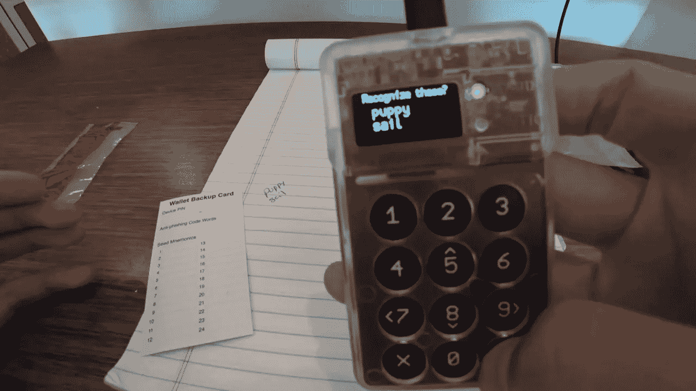
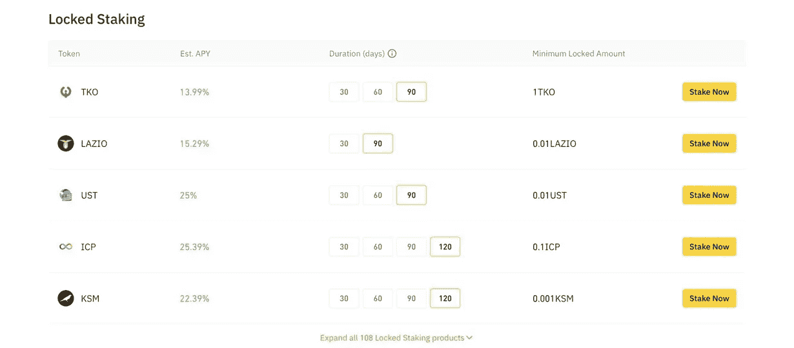
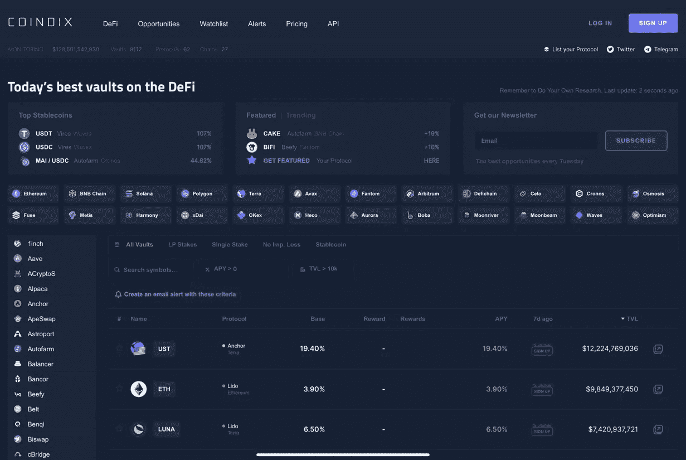
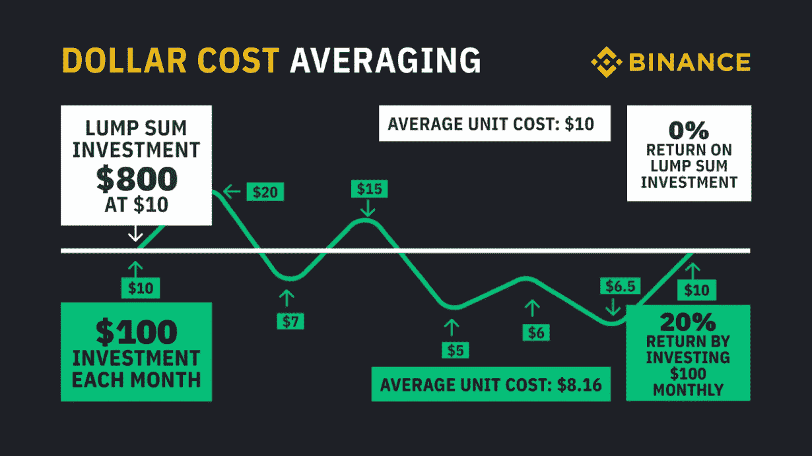

# 我在我的加密钱包里发现了灰尘

> 原文：<https://medium.com/coinmonks/i-found-dust-in-my-crypto-wallet-32e85a566268?source=collection_archive---------40----------------------->

Coldcard wallet

你登录币安账户，所有的硬币都亏损了 10%,你的投资组合又下跌了 30%。

你告诉自己一切都会好的。但实际上，并非如此。

与其对你的硬币叹息，这里是我最喜欢的让你的硬币为你工作的策略。

## 立桩标界

下注是一种策略，用于获得锁定代币的奖励。与其让你的硬币坐在那里积灰，赌注可以让你赚取利息！

除此之外，你还将为区块链的效率和安全做出贡献。唯一的缺点是大多数代币有一个归属或锁定期，这是减少价格下跌时的抛售压力。但我个人认为这是否定自己恐慌性抛售的一种方式。

在币安，锁定期可能从 30 天到 120 天不等，这取决于一个人想要获得的利益。

Binance lockup period

## 高产农业

收益农业是为了通过利息或交易费获得回报而将硬币借出或押出的做法。

但是产量农业和赌注有什么区别，它们听起来非常相似。

产量农业包括为 DeFi 协议提供流动性，而赌注允许赌注者为区块链验证节点。

但是服务似乎有风险，我想要更稳定东西。

如果你不是一个早餐大嚼波动性的德根，DeFi 的创新让我们在稳定的玉米上产生美味的产量！

## 稳定的谷物农业

稳定的硬币赌注是不受市场波动影响的产生收益的最好方法！

这基本上是一种策略，随着时间的推移，帮助你增加购买力，这样你就可以利用下跌或随着时间的推移增加投资。

检查我的文章对我最喜欢的稳定的玉米种植策略，赚取高达 20%的年利率！

 [## 比特币下跌，稳定币上涨

### 稳定的谷物农业介绍

medium.com](/coinmonks/high-yields-during-the-bear-market-2196029ccc70) 

## 但我如何搜索这些不同的策略并比较收益率呢？

我个人用 [CoinDix](https://coindix.com/) 。

这是最好的网站，在一个简单直观的界面下，将 DeFi 生态系统的各个部分集中在一个地方。

Coindix website

## 美元平均成本

DCA 是所有投资中最容易被忽视的策略。

这是一种策略，将你的总投资分成不同的部分，而不是一次性全部购买。这最终会降低你的平均成本，增加你的总体回报。

DCA model

***惟钱奉上。***

与其把时间花在 twitter 和 discord 上，试图寻找下一个 100 倍的宝石，你还不如寻找额外的收入来源。

当他深入探讨如何提高你的购买力时，请点击下面的链接:

这些是我在加密过程中学到的一些投资策略，最终目标是长期积累更多代币。

**改变你的心态**

不要看你的 PnL(盈利和亏损)，而是要学会看你积累的代币数量。积累加上再投资的回报，就意味着成功！

瓦格米

> 加入 Coinmonks [电报频道](https://t.me/coincodecap)和 [Youtube 频道](https://www.youtube.com/c/coinmonks/videos)了解加密交易和投资

# 另外，阅读

*   [币安 vs FTX](https://coincodecap.com/binance-vs-ftx) | [最佳(SOL)索拉纳钱包](https://coincodecap.com/solana-wallets)
*   [比诺莫评论](https://coincodecap.com/binomo-review) | [斯多葛派 vs 3Commas vs TradeSanta](https://coincodecap.com/stoic-vs-3commas-vs-tradesanta)
*   [Capital.com 评论](https://coincodecap.com/capital-com-review) | [香港的加密借贷平台](https://coincodecap.com/crypto-lending-hong-kong)
*   [如何在 Uniswap 上交换加密？](https://coincodecap.com/swap-crypto-on-uniswap) | [A-Ads 评论](https://coincodecap.com/a-ads-review)
*   [WazirX vs CoinDCX vs bit bns](/coinmonks/wazirx-vs-coindcx-vs-bitbns-149f4f19a2f1)|[block fi vs coin loan vs Nexo](/coinmonks/blockfi-vs-coinloan-vs-nexo-cb624635230d)