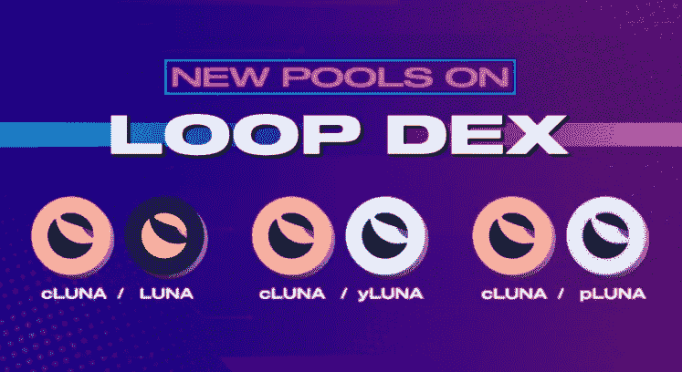
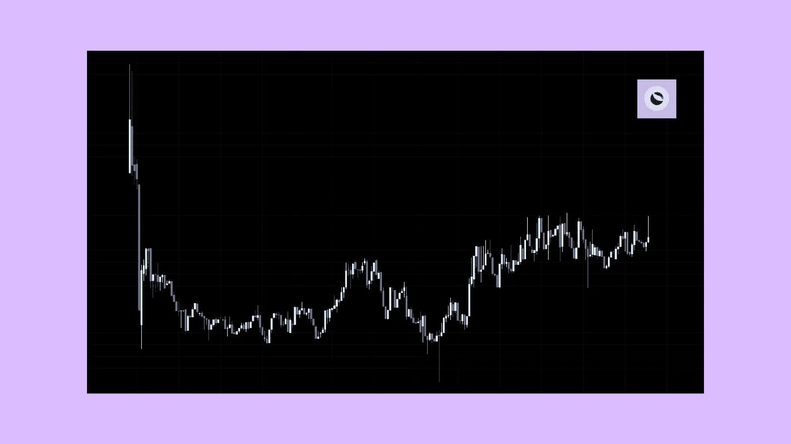
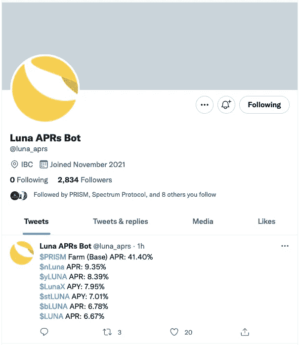
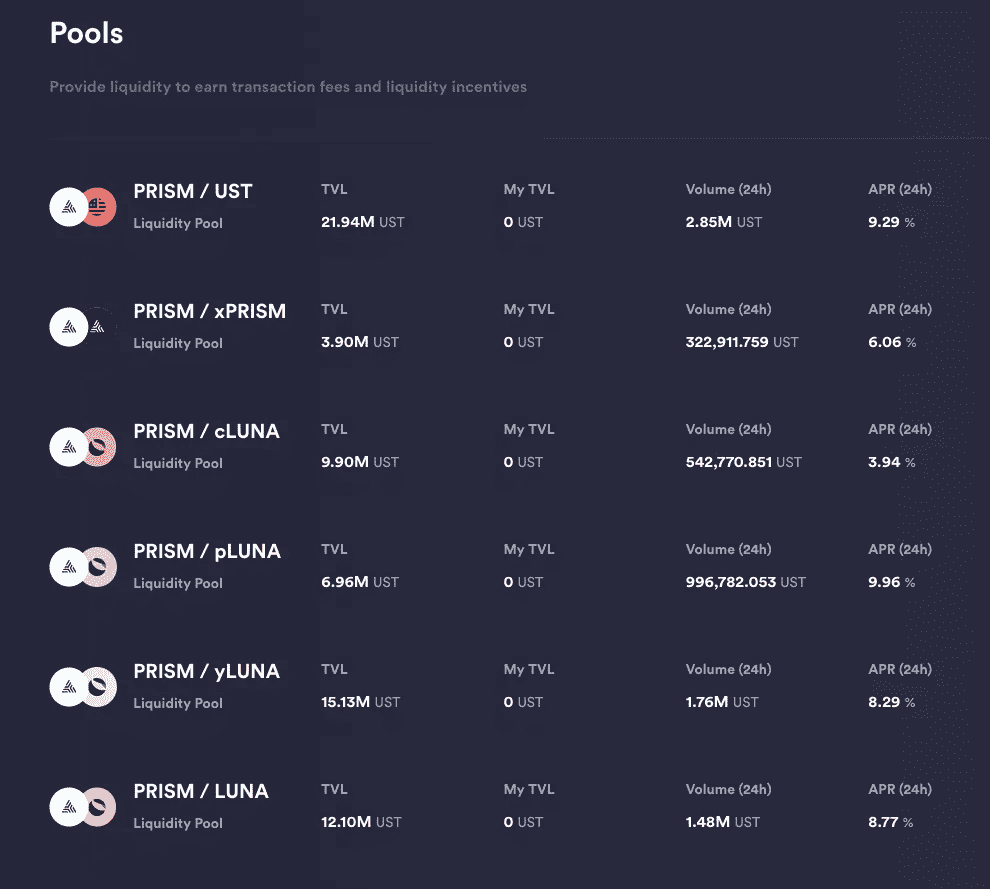
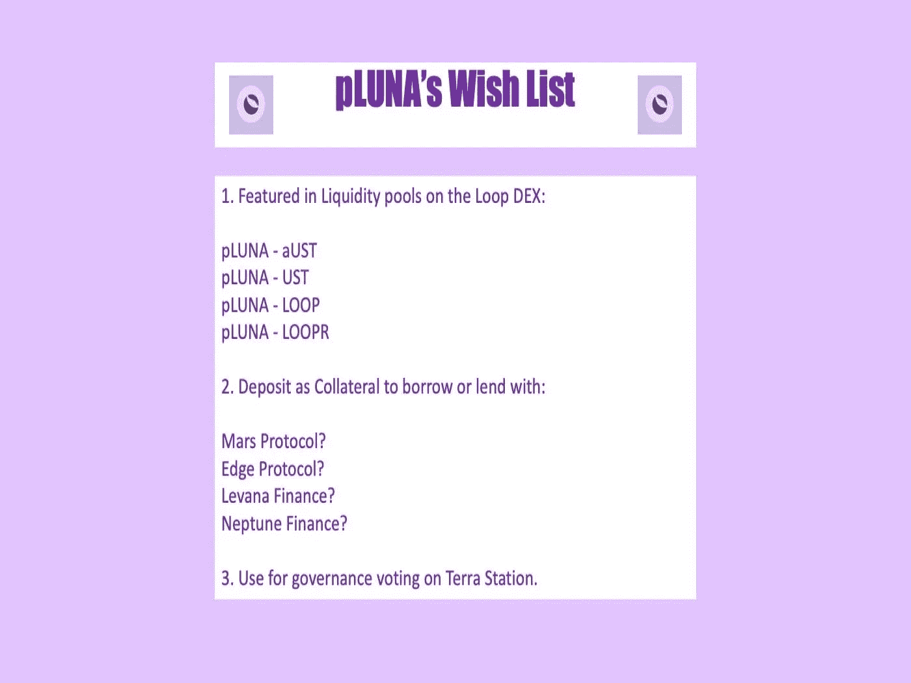

# 我没有得到尊重

> 原文：<https://medium.com/coinmonks/i-get-no-respect-c9e56abe03d4?source=collection_archive---------57----------------------->

# 泄露

当 jeyB 在 Twitter 上透露 Loop DEX 正在使用 Prism 令牌获得新的流动性池时，我简直要疯了。这会是我一直等待的时刻吗？这些新的流动性池会是它们中最好的代表吗？这肯定是它！

我开始做准备，把我的代币整理好。准备就绪，我急切地等待着来自 Loop Finance Twitter 账户的官方声明。但是，什么也没有出现！经过几天难熬的漫长日子，倒计时，公告终于来了。但是，在 Loop 迅速发展的作家社区的无畏领袖亚当向所有作家发出的一个闪电悬赏中，它被放弃了。

# 什么时候轮到我？

令我大失所望的是，泳池里出现了克鲁纳，而我又一次排在了最后。这怎么可能？在我忍受了一切之后，该轮到我了，对吗？

当我被创造的时候，我被赋予了一个恰当的名字:我是主要的象征！我将成为跟踪我们的顶点硬币价格的人，这种硬币在整个生态系统中都受到追捧。从露娜分裂出来，通过克鲁纳，我将成为最重要的象征，每个人都想在自己的投资组合中拥有的新的象征。开始是这样的，因为我的价格在发布会上急剧上升。我觉得自己就像是队长，四分卫，我注定要成为的那个人。可悲的是，这仅仅持续了几个小时。

所有那些可怕的疯子开始出卖我，把我从他们的钱包里甩出来，转而支持尤拉。我的价格暴跌，我成了生态系统的笑柄。为我的兄弟姐妹提供了一个又一个的公用事业:yLUNA 流动性池、yLUNA 打桩、yLUNA 农场，更糟糕的是，lejimmy 创造了 AMPS 来提高农场的 yLUNA。RyanLion 试图给我打气，但无济于事，我变得无关紧要，被所有疯子忽视。我退入默默无闻，被所有人遗忘。

# 孤独的游侠

在遥远的加密推特之外，出现了一个穿着闪亮盔甲的骑士。起初只有几个追随者，pLUNA DAO 开始唱我的福音，棱镜的真正王子。找一切机会解释持有普鲁纳的力量，一小群疯子回来了，骄傲地拿着普鲁纳马克西的头衔。我的价格又开始上涨了一点，生态系统的边缘开始出现一丝尊重。

然而，每当 LUNA APRs 机器人发布我所有兄弟姐妹的排行榜时，我仍然被排除在外。所有的荣耀仍然属于伊露娜农场！

就像在循环索引中 cLUNA 是特色标记一样，我也没有出现在 Prism 索引中。棱镜令牌带走了所有的荣耀。至少，我列在 yLUNA 之上；当然，更多的钱已经和 yLUNA 汇集在一起了！我简直不能抓住机会。

# 呼唤所有的疯子

到处都是疯子，我恳求你的帮助！让我们告诉 Terra 生态系统中各种协议的所有开发人员、产品经理和营销人员，pLUNA 准备开始卷土重来了！我已经准备好了我的愿望清单来开始行动。

你有更多的想法添加到我的愿望清单吗？关注并加入 Twitter 上的 pLUNA DAO，让您的声音被听到。

pLUNA Maxis 联合起来！— Opa。

# 资料来源、参考文献和进一步阅读

棱镜协议—[https://prismprotocol.app/](https://prismprotocol.app/)

棱镜推特—@棱镜协议

pLUNA DAO Twitter — @pLUNADAO

LUNA APRs Bot Twitter — @luna_aprs

你想了解更多关于 Prism 协议和它所提供的难以置信的机会吗？你来对地方了。我写了大量关于 Prism 的文章，并在下面提供了所有文章的链接。

我的第一篇关于 Prism 协议的循环文章“改造 LUNA”——【https://www.loop.markets/transforming-luna/ 

我的第二篇关于 Prism 协议的循环文章“一个新的协议被伪造”——【https://www.loop.markets/a-new-protocol-is-forged 

我的第三篇关于 Prism 协议的循环文章“获得 LUNA 的力量”-[https://www.loop.markets/derive-the-power-of-luna/](https://www.loop.markets/derive-the-power-of-luna/)

我的第四篇关于 Prism 协议的循环文章“折射露娜”—[https://www.loop.markets/refracting-luna/](https://www.loop.markets/refracting-luna/)

我的第五篇关于 Prism 协议的循环文章“使用 Prism 的智能农业”——[https://www.loop.markets/intelligent-farming-with-prism/](https://www.loop.markets/intelligent-farming-with-prism/)

你是密码新手，还是 Terra 新手，还是有经验的密码老手？欢迎所有人加入、撰写和贡献 Loop 社区。 [https://www.loop.markets？ref=52879](https://www.loop.markets/?ref=52879)

> 加入 Coinmonks [电报频道](https://t.me/coincodecap)和 [Youtube 频道](https://www.youtube.com/c/coinmonks/videos)了解加密交易和投资

# 另外，阅读

*   [红狗赌场评论](https://coincodecap.com/red-dog-casino-review) | [Swyftx 评论](https://coincodecap.com/swyftx-review) | [造币厂评论](https://coincodecap.com/coingate-review)
*   [Bookmap 评论](https://coincodecap.com/bookmap-review-2021-best-trading-software) | [美国 5 大最佳加密交易所](https://coincodecap.com/crypto-exchange-usa)
*   [如何在 FTX 交易所交易期货](https://coincodecap.com/ftx-futures-trading) | [OKEx vs 币安](https://coincodecap.com/okex-vs-binance)
*   [CoinLoan 审查](https://coincodecap.com/coinloan-review) | [YouHodler 审查](/coinmonks/youhodler-4-easy-ways-to-make-money-98969b9689f2) | [BlockFi 审查](https://coincodecap.com/blockfi-review)
*   [XT.COM 评论](https://coincodecap.com/profittradingapp-for-binance)币安评论 |
*   [SmithBot 评论](https://coincodecap.com/smithbot-review) | [4 款最佳免费开源交易机器人](https://coincodecap.com/free-open-source-trading-bots)