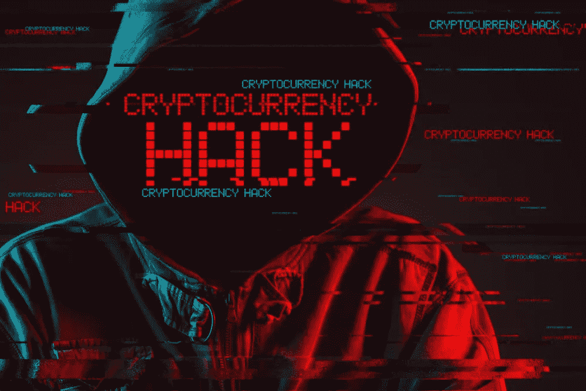

# 我被黑了密码。我该怎么办？

> 原文：<https://medium.com/coinmonks/i-got-crypto-hacked-what-should-i-do-fc34cc7b774c?source=collection_archive---------47----------------------->

如果你被黑客攻击，你的加密货币被盗或被黑。这可能通过各种方式发生，包括[网络钓鱼诈骗](https://cryptochartis.com/8-cryptocurrency-scams-to-avoid/)、恶意软件和薄弱的安全措施。

如果你被黑了，你需要做的第一件事就是评估损失。查看访问了哪些信息，并确定这些信息是如何被用来伤害您的。如果您的社会安全号码或信用卡信息被窃取，您需要采取措施保护自己免遭身份盗窃。

一旦你知道发生了什么，你需要更改你的密码并采取其他安全措施。一定要使用难猜的强密码，不要多个账号用同一个密码。如果可能，您还应该启用双因素身份验证。这将增加一层额外的安全性，因为登录时除了密码之外，还需要您的手机代码。

你也应该联系账户被黑的公司，让他们知道发生了什么。他们可能会帮助您恢复您的帐户或防止进一步的损害。最后，确保密切关注你的信用报告和财务账户，以防任何不寻常的活动。

## 警察能追踪到[比特币](https://cryptochartis.com/what-is-a-51-attack-and-why-is-it-a-threat-to-bitcoin/)吗？

比特币经常与犯罪联系在一起，因为它可以用来购买毒品和武器等非法商品。但比特币也有很多合法用途，比如买咖啡或网上购物。那么，警方如何知道有人是否在使用比特币进行非法活动呢？

事实证明，警察可以很容易地追踪比特币。每一笔比特币交易都被记录在一个名为区块链的公共账本上。因此，如果警方正在调查一起犯罪，并且他们认为嫌疑人可能使用了比特币，他们可以查看区块链，查看所有已经发生的交易。

这在两个方面是有帮助的。首先，它可以帮助警察识别谁是嫌疑犯。如果他们发现有人进行了大量可疑交易，他们可以开始更仔细地调查这个人。其次，它可以帮助警方追踪钱去了哪里。如果嫌疑人用比特币购买了东西，警方可以追溯到卖家，并有可能获得更多关于他们的信息。

因此，虽然比特币可能为犯罪分子提供一些匿名性，但它并非完全无法追踪。警方有各种工具可以用来追踪使用比特币的罪犯，所以如果你正在考虑使用比特币进行非法活动，你应该三思而行。

## 警方可以追踪其他加密货币吗？

简单的回答是肯定的，警察可以追踪大多数加密货币。然而，重要的是要记住，加密货币仍然是一项相当新的技术，因此，仍然有一些问题需要解决。例如，尽管执法机构在追踪比特币交易方面有所进步，但仍不完美。

此外，除了比特币，还有其他加密货币可以为用户提供更多的匿名性(例如 Monero)。因此，尽管警方可以追踪大多数加密货币，但人们仍有可能使用它们进行非法活动。

## 被黑了[比特币基地](https://cryptochartis.com/the-most-secure-cryptocurrency-exchanges/)会退款吗？

比特币基地有严格的反欺诈政策，如果客户遭到黑客攻击，将会退款。

如果客户被黑客入侵，比特币基地将通过一个叫做退款的程序向他们退款。当客户的银行或信用卡公司撤销交易时，就会发生拒付。如果顾客觉得他们没有购买的东西被收费，或者如果商家没有提供承诺的产品或服务，通常会这样做。

要从比特币基地获得退款，你需要联系你的银行或信用卡公司，告诉他们你想申请退款。然后他们会开始调查，可能会要求你提供一些文件，比如你的比特币基地账户声明，表明你为你没有购买的东西付费。

## 条款和条件获得比特币基地退款，如果被黑

如果你是比特币基地的客户，你的账户被黑了，你可能有资格获得退款。要申请退款，请联系我们的支持团队。

我需要提供什么信息？

为了处理您的退款申请，我们需要以下信息:

1.您的姓名和联系信息

2.对所发生事情的详细描述

3.事故的日期和时间(如果知道的话)

4.任何相关的截图或文档

5.您的比特币基地账号(如果知道的话)

退款的条件是什么？

要获得退款，您必须满足以下所有标准:

1.在事件发生时，您必须是经过验证的客户。

2.您必须使用受支持的浏览器和操作系统。目前，他们在桌面和 iOS 设备上支持最新版本的 Chrome、Firefox、Safari 和 Edge。他们目前不支持 Android 设备。

如果您在事件发生时没有使用这些浏览器或操作系统，他们可能无法处理您的退款请求。此外，我们不支持浏览器和操作系统的测试版或预览版。

3.在事件发生之前，你一定没有得到比特币基地的任何警告，说你的帐户受到威胁或有危险。这些包括电子邮件、通知等。

4.您必须在事件发生后 60 天内联系我们的支持团队。

## 接下来会发生什么？

一旦我们收到所有必需的信息，我们的团队将审查您的案例，并在 10 个工作日内做出决定。如果我们可以确认您的帐户被入侵，并满足所有其他资格标准，我们将在 2-4 周内开始处理您的退款。退款处理完成后，我们会通过电子邮件通知您。

请注意，在审查过程中，我们可能会要求您提供额外的信息或文档。在我们努力调查这些事件并保护我们的客户时，我们感谢您的耐心与合作。

## 感谢您的阅读

这是一篇由[Cryptochartis.com](http://cryptochartis.com/)撰写的文章，我们提供关于加密货币的准确、最新的信息、预测和行业最新消息。请务必关注我们，了解最新消息，在我们的 Twitter 和 Telegram 上，您可以找到买入/卖出信号以及赠品等等。

> 加入 Coinmonks [电报频道](https://t.me/coincodecap)和 [Youtube 频道](https://www.youtube.com/c/coinmonks/videos)了解加密交易和投资

# 另外，阅读

*   [Bookmap 评论](https://coincodecap.com/bookmap-review-2021-best-trading-software) | [美国 5 大最佳加密交易所](https://coincodecap.com/crypto-exchange-usa)
*   最佳加密[硬件钱包](/coinmonks/hardware-wallets-dfa1211730c6) | [Bitbns 评论](/coinmonks/bitbns-review-38256a07e161)
*   [新加坡十大最佳加密交易所](https://coincodecap.com/crypto-exchange-in-singapore) | [购买 AXS](https://coincodecap.com/buy-axs-token)
*   [红狗赌场评论](https://coincodecap.com/red-dog-casino-review) | [Swyftx 评论](https://coincodecap.com/swyftx-review) | [CoinGate 评论](https://coincodecap.com/coingate-review)
*   [投资印度的最佳密码](https://coincodecap.com/best-crypto-to-invest-in-india-in-2021)|[WazirX P2P](https://coincodecap.com/wazirx-p2p)|[Hi Dollar Review](https://coincodecap.com/hi-dollar-review)