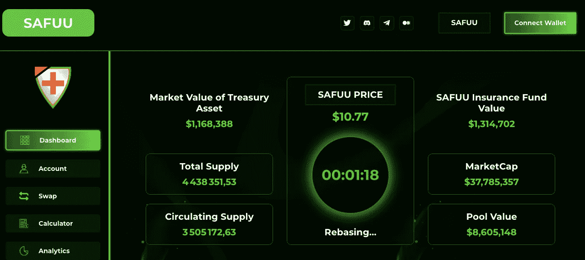
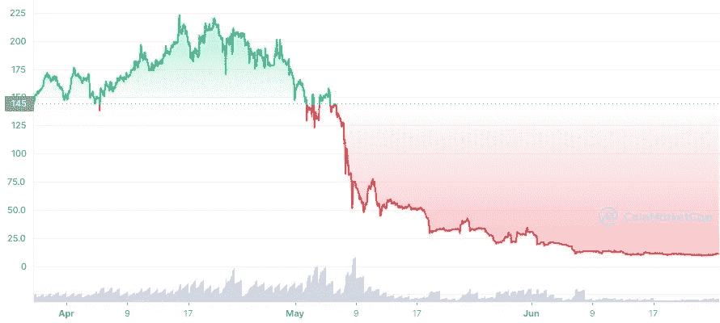
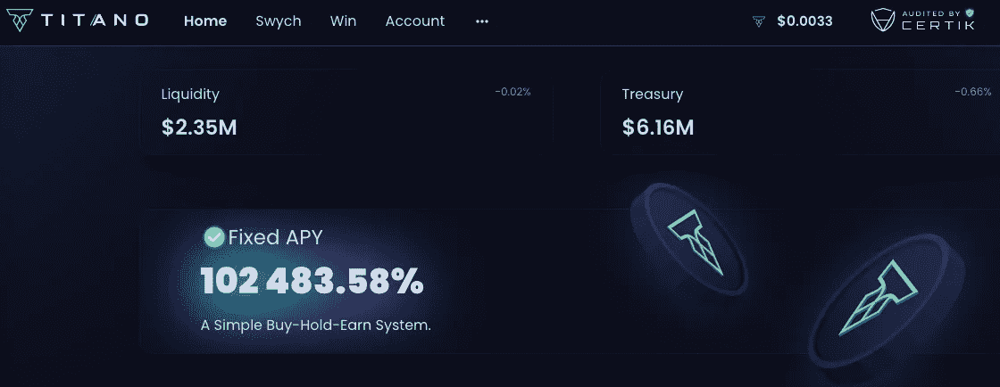
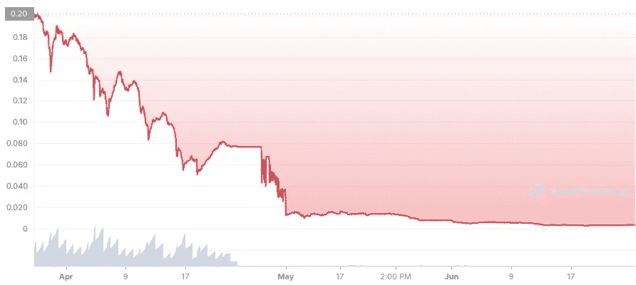
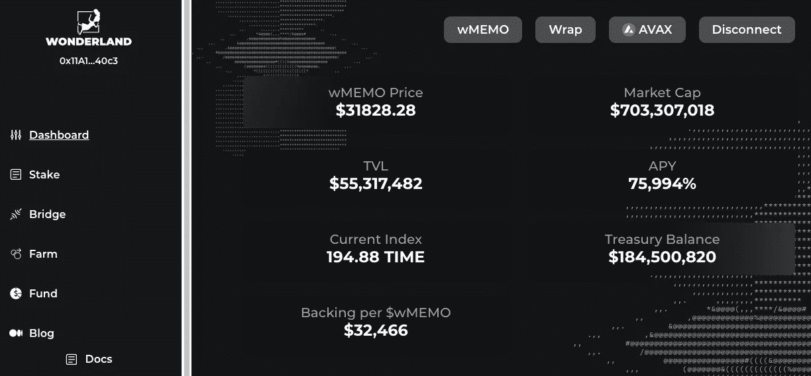
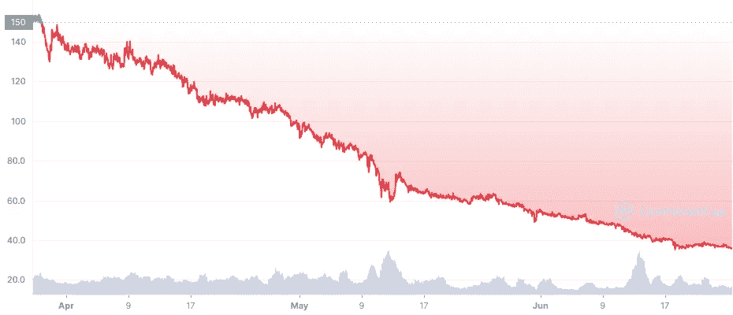
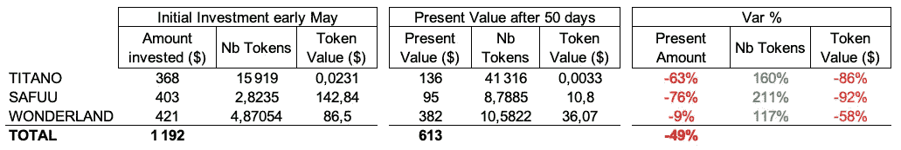

# 我在崩盘前投资了 1200 美元在 Safuu，Titano 和 Wonderland。这是他们的表现

> 原文：<https://medium.com/coinmonks/i-invested-1-200-in-safuu-titano-and-wonderland-before-the-crash-heres-how-they-performed-13eb06c45562?source=collection_archive---------0----------------------->

## 3 个高风险、高 APY 协议并不比市场表现更差。我还学到了另一个宝贵的教训。

Photo by [Hello I'm Nik](https://unsplash.com/@helloimnik?utm_source=medium&utm_medium=referral) on [Unsplash](https://unsplash.com?utm_source=medium&utm_medium=referral)

2022 年 5 月初，我想尝试这三个疯狂的 APY 协议:

> 萨夫、提塔诺和仙境。

这三个协议是谈论最多的高收益协议，每个都宣传极高的 APYs。

我必须检查他们是否能帮我形成一个更大的密码袋，以赚取定期赌注收入，并增加我的被动收入策略。

## 萨福和它疯狂的 383025%

Source: Safuu

Safuu 是一种自动锁定和自动复合协议，其固定 APY 高达 383，025%(前 12 个月)。

我写了一篇关于该协议及其本机令牌$SAFUU 的完整文章。

> 交易新手？试试[加密交易机器人](/coinmonks/crypto-trading-bot-c2ffce8acb2a)或者[复制交易](/coinmonks/top-10-crypto-copy-trading-platforms-for-beginners-d0c37c7d698c)

 [## 你应该投资萨福和它疯狂的 383，025%的 APY 吗？

### 这样的回报水平真的可持续吗？

medium.com](/@John_treadle/should-you-invest-in-safuu-and-its-crazy-383-025-apy-f7a74515f6e) 

在过去的三个月里，萨富的价格大幅下跌。

Source: Coinmarketcap

价格从 4 月初的 145 美元左右跌至最近的 11 美元，跌幅达 92%。

## 泰坦诺，固定 APY 102，483.58%

Source: Titano

Titano 是另一个桩协议。它目前有大约 82K 的持有者，其原生令牌是$TITANO。

这是$TITANO 的 3 个月价格图表

Source: Coinmarketcap

从 0.11 美元到 0.0032 美元的另一个自由落体。如你所见，价格总是可以降得更低，没有真正的底价。

## 仙境，目前 APY 为 75，994%

Source: Wonderland

仙境是一个集体道，部署其财政部投资于加密和 web 3 协议。

它目前拥有约 1 . 84 亿美元的资金，投资于以下领域:

*   Betswapp.gg:一个对等的无权限 bets 机器引擎
*   液体铆接溶液
*   游戏:DAO 的目标是在游戏中为自己定位，以赢得游戏产业
*   NFT 项目
*   德菲:道在德菲中不断寻找新的机会
*   第 1 层和第 2 层基础设施

仙境目前的 APY 是 75，994%。

它的原始符号是时间(仙境)，这里是**时间**的 3 个月价格图。

Source: Coinmarketcap

价格基本上从 150 美元降到了 35 美元左右，降幅约为 75%。

# 那么，我的 1200 美元投资表现如何？

在撰写本文时，**我下跌了 50%** 。

我的投资现在值 613 美元。

我在 50 天内损失了一半的资本。查看总结表:

我知道主要的风险是短暂的损失。

> 当您放入流动性池的代币价值下降，而您从流动性池中赚取利息时，就会发生非永久性损失。

这意味着，如果标的股票价格大幅下跌，你将资金存入回报非常高的资金池，实际上可能会亏损。

正如你所看到的，对于每一个代币，代币价值的大幅下降抵消了数量的上升，这要归功于复合物。

*   价格下跌了 86%，而交易量增加了 160% = >我损失了 63%的投资
*   **价格下跌了 92%，而交易量增加了 211% = >我的损失是 76%**
*   **仙境**价格降幅较小(仅 58%…。)随着成交量增加 117% = >亏损被限制在 9%。

## 第一课:仙境拯救了象征性价格击败 APY

最终，仙境以比其他两家更低的价格挽救了局面。

这个教训很重要:价格波动和代币的可持续性似乎不比疯狂的 APY 更重要

## 第二课:性能并不比其他主要加密技术差多少

这并不是什么重大安慰，但考虑到最近的危机，50%实际上并不比许多蓝筹股资产差多少。

自 5 月 5 日以来，以下是几个硬币的表现:

*   BTC: -33%
*   联邦理工学院:-58%
*   溶胶:-53%

如你所见，差别其实很小。

# 结论:继续跑马圈地还是抽身？

所以我损失了 50%的资本。

现在怎么办？继续下注？拉出来？

真正的问题是:价格会稳定下来吗？

如果我想有机会收回我的资本，价格必须稳定。问题是几乎没有任何刀做到了这一点。

但是，嘿，我会继续下注。我想把这段经历进行到底，看看耐心是否有回报。

保持联系。

如果你喜欢这个故事，并且愿意支持我(和其他成千上万的作家)，那么考虑一个月仅 5 美元或一年 50 美元的 [*中型*](/subscribe/@John_treadle) [*订阅*](/subscribe/@John_treadle) *。*

或者你可以给我买一个[*Ko-fi*](https://ko-fi.com/johntreadle)*。*

## **延伸阅读**

*   [**迈克尔·塞勒刚刚列出了持有比特币的前 10 件事**](/coinmonks/michael-saylor-just-listed-the-top-10-things-holding-bitcoin-back-91fb1cedf49d)
*   [**投降迹象表明是时候建立我们的 BTC 袋了**](/the-capital/capitulation-signs-are-saying-its-time-to-build-our-btc-bags-4b87ce92661f)
*   [**yield nodes 的安全性和可持续性如何？**](/coinmonks/how-safe-and-sustainable-is-yieldnodes-4bd84d01e5f6)
*   [**比特币将达到 100 万美元的 100 个理由**](/coinmonks/how-safe-and-sustainable-is-yieldnodes-4bd84d01e5f6)

> 加入 Coinmonks [电报频道](https://t.me/coincodecap)和 [Youtube 频道](https://www.youtube.com/c/coinmonks/videos)了解加密交易和投资

# 另外，阅读

*   [Pionex 双投](https://coincodecap.com/pionex-dual-investment) | [AdvCash 审核](https://coincodecap.com/advcash-review) | [光宗耀祖审核](https://coincodecap.com/uphold-review)
*   [面向开发者的 8 个最佳加密货币 API](https://coincodecap.com/best-cryptocurrency-apis)
*   [7 个最佳零费用加密交易平台](https://coincodecap.com/zero-fee-crypto-exchanges)
*   [最佳网上赌场](https://coincodecap.com/best-online-casinos) | [期货交易机器人](/coinmonks/futures-trading-bots-5a282ccee3f5)
*   [分散交易所](https://coincodecap.com/what-are-decentralized-exchanges) | [比特 FIP](https://coincodecap.com/bitbns-fip)
*   [用信用卡购买密码的 10 个最佳地点](https://coincodecap.com/buy-crypto-with-credit-card)