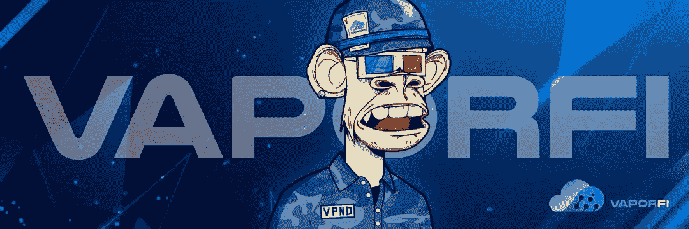

# 我在这个项目上投资了 70 美元，它每月付给我 122 美元

> 原文：<https://medium.com/coinmonks/i-invested-70-in-this-project-and-it-pays-me-122-per-month-805163696ad9?source=collection_archive---------1----------------------->

但是你必须尽快做它。

VaporFi Nodes

我说的是 [**VaporFi 节点**](https://app.vapornodes.finance/) 。

> **什么是节点？**

节点是区块链安全性的重要方面。广义而言，加密货币节点是区块链网络中的参与者。没有区块链节点，就没有区块链。