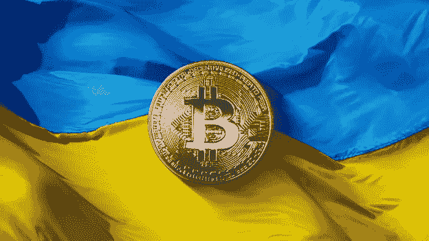
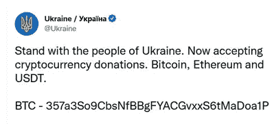

# 我刚刚把比特币寄给了乌克兰政府

> 原文：<https://medium.com/coinmonks/i-just-sent-bitcoin-to-the-ukraine-government-249183a9dfd0?source=collection_archive---------59----------------------->

因为我们被赋予了力量

全球金融领域正在发生深刻的变化。作为对俄罗斯入侵乌克兰的回应，世界正在迅速认识到比特币是转移财富的有效替代方式。

在冲突的一方，俄罗斯人正在拼命将他们的卢布兑换成比特币，希望在卢布自由落体的情况下保护自己的财富，自入侵开始以来，卢布兑美元已贬值 30%。如果俄罗斯不能用石油换取全球储备货币美元，它可能会用比特币作为支付手段。

另一方面，成千上万，希望是数百万像我一样的人正在使用比特币向乌克兰转移财富，我们集体和直接的财政支持可能会在实质上影响这场战争的结果。

技术没有灵魂；它不能区分对错。它只是存在。我们决定如何使用它。

一代人以前，我没有预见到这一天的到来，一场用金融牙齿进行的全球公民起义。我们不必等待我们选出的政治领导人最终做出正确的决定，我们已经被授权立即采取行动。查理·芒格(Charlie Munger)等少数勒德分子仍然错误地认为比特币是一个以洗钱为唯一目的的骗局。

我帮不了勒德分子。对我们其余的人来说，这是我们让世界变得更好的机会。

感谢比特币，我们都有了更强的话语权。

我把我的财富转移到这个比特币地址:

使用比特币转移财富的好处、效率和风险在于没有中间人。所需要只是互联网连接，以及两边的比特币钱包。意思是没有人保护你免受骗子的伤害。在你选择跟随我之前，请对自己负责并确认这是一个有效的比特币地址，收件人是你认为的那个人。

向埃隆·马斯克致敬，感谢他帮助乌克兰通过 Starlink 与互联网保持联系。

与百元大钞不同，比特币交易是透明的。点击这个链接，你可以看到到底有多少财富，以比特币的形式，通过这个比特币地址被送到了乌克兰政府:

[https://www . block chain . com/BTC/address/357 a3 so 9 cbsn fbbgfyacgvxs 6 TMA DOA 1 p](https://www.blockchain.com/btc/address/357a3So9CbsNfBBgFYACGvxxS6tMaDoa1P)

截至今天，超过 800 万美元。

对于一群积极的全球公民来说，这并不坏，但我们可以做得更好。

> *加入 Coinmonks* [*电报频道*](https://t.me/coincodecap) *和* [*Youtube 频道*](https://www.youtube.com/c/coinmonks/videos) *了解加密交易和投资*

# 另外，阅读

*   [Bookmap 评论](https://coincodecap.com/bookmap-review-2021-best-trading-software) | [美国 5 大最佳加密交易所](https://coincodecap.com/crypto-exchange-usa)
*   最佳加密[硬件钱包](/coinmonks/hardware-wallets-dfa1211730c6) | [Bitbns 评论](/coinmonks/bitbns-review-38256a07e161)
*   [新加坡十大最佳加密交易所](https://coincodecap.com/crypto-exchange-in-singapore) | [购买 AXS](https://coincodecap.com/buy-axs-token)
*   [红狗赌场评论](https://coincodecap.com/red-dog-casino-review) | [Swyftx 评论](https://coincodecap.com/swyftx-review) | [CoinGate 评论](https://coincodecap.com/coingate-review)
*   [投资印度的最佳密码](https://coincodecap.com/best-crypto-to-invest-in-india-in-2021)|[WazirX P2P](https://coincodecap.com/wazirx-p2p)|[Hi Dollar Review](https://coincodecap.com/hi-dollar-review)
*   [加拿大最佳加密交易机器人](https://coincodecap.com/5-best-crypto-trading-bots-in-canada) | [库币评论](https://coincodecap.com/kucoin-review)
*   [用于 Huobi 的加密交易信号](https://coincodecap.com/huobi-crypto-trading-signals) | [HitBTC 审查](/coinmonks/hitbtc-review-c5143c5d53c2)