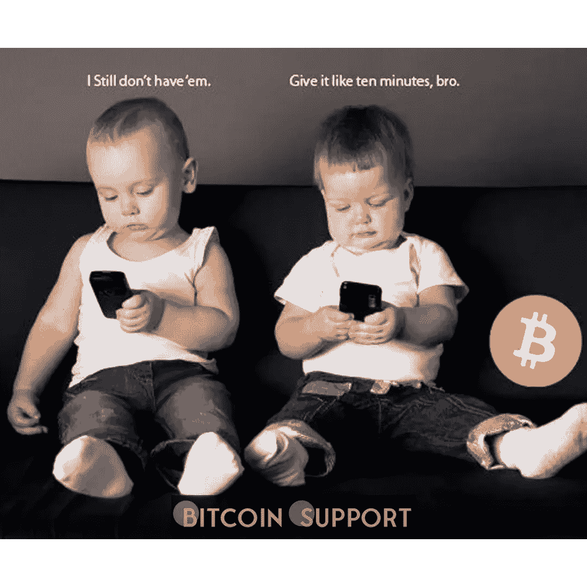
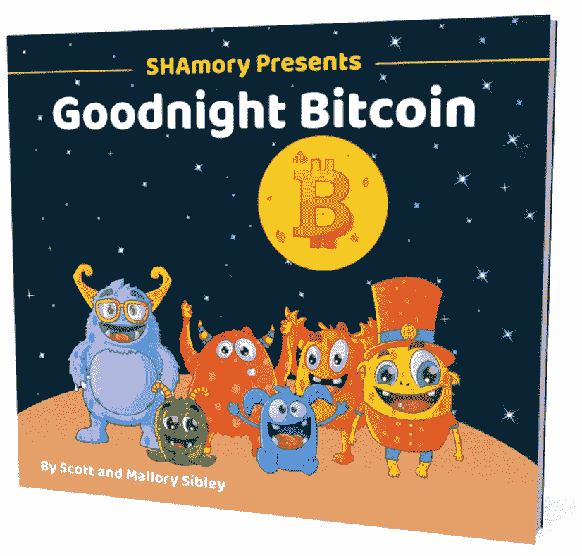
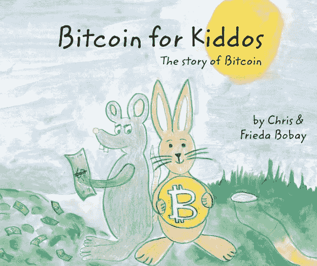
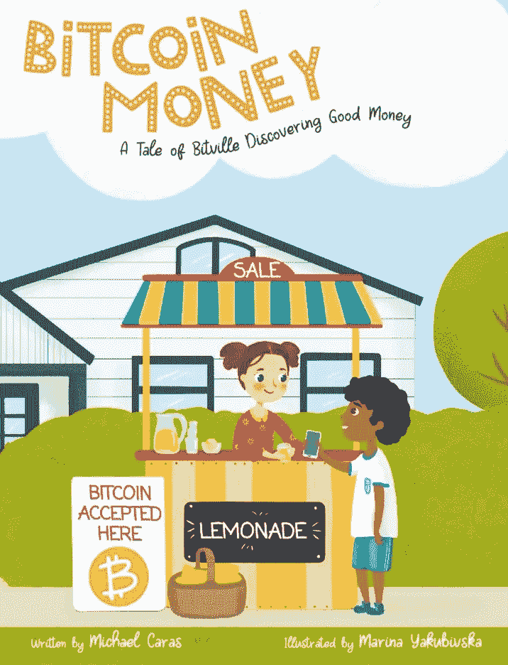

# 我打败了年轻人，亲爱的！BTC 的儿童作家讨论了学习金钱的重要性

> 原文：<https://medium.com/coinmonks/i-orange-pilled-the-youngsters-honey-13aaebd8b7fa?source=collection_archive---------89----------------------->

**Visit our website:-** [**https://bitcoinsupports.com/**](https://bitcoinsupports.com/)

三位比特币儿童书籍作者揭示了教孩子比特币和货币的秘密，以及为什么尽早开始如此重要。

每个人都可以使用比特币。青少年、儿童、幼儿甚至新生儿都属于这一类。因为这些孩子长大后将会使用比特币(BTC)协议，所以“在可行的情况下尽早将比特币融入学习是合乎逻辑的”至少，Shamory 比特币游戏和“晚安比特币”儿童睡前书团队的一员斯科特·西布利是这么说的。他加入了越来越多的比特币儿童书籍作者的行列，这些作者热衷于向儿童灌输对比特币和金钱的热爱。

**Visit our website:-** [**https://bitcoinsupports.com/**](https://bitcoinsupports.com/)

晚安比特币之书。

“孩子们可能比大多数人意识到的学得更快更早，”西布利和他的妻子相信。这也是他们创建“比特币睡前故事”的原因之一，这个故事是基于“过多的“晚安”小说(晚安月亮，晚安棒球，等等。)."这也很好地介绍了他们的半教育性比特币挖矿游戏 SHAmory。Sibleys 认识到“在儿童和成人学习比特币的有趣方法方面，产品和内容存在差距”，他们正在用传统播客、小说和长篇文章以外的教学内容来填补这一差距。

“大多数“常规”机构不提供包含比特币的金融教育。因此，现在就要靠比特币家长们来想办法在家里融入这种教学。”

**Visit our website:-** [**https://bitcoinsupports.com/**](https://bitcoinsupports.com/)

儿童书的比特币。

比特币的叙事《比特币为孩子而生》(Bitcoin for Kiddos)的创造者是克里斯和弗里达·博贝(Frieda Bobay)。他们是另一对夫妇，致力于教导“孩子们在很小的时候就懂得金钱”，这样“当他们看到钱时，他们就有最好的机会去发现它。”

他们表示:

**“我们希望在孩子们很小的时候就向他们介绍比特币和更广泛的货币概念，这样他们长大后就能更自如地使用和讨论这项技术。”“对大多数成年人来说，金钱是一个禁忌话题，”他们说，“但也不尽然。”它通过书籍向年轻人传授比特币(以及固有的货币)知识，从而减少了社会障碍，为“整个家庭带来了美妙的学习体验。”《比特币货币:一个比特维尔发现好货币的故事》一书的作者，比特币拉比迈克尔·卡拉斯赞扬了其他作者对孩子和金钱的想法。他说:“年轻人学会如何为钱工作、储蓄、合理消费和慈善捐赠，这一点至关重要。”**

**Visit our website:-** [**https://bitcoinsupports.com/**](https://bitcoinsupports.com/)

比特币货币，比特维尔的故事

他指出了教孩子比特币的一个意想不到的好处:它也是“成年人的入门”西布利认为:“孩子和成年人一样，在某种意义上说，我们都接触到并了解了更多关于钱的知识，钱来自哪里，什么使它有价值，等等，这将会更好。”西布利接着说:

**“这些都是大多数人一生中可能都不会思考或了解的问题。”**

此外，由于“儿童可能没有成年人的所有偏见”，他们可能对去中心化的货币网络更加开放。“孩子们理解比特币的数字成分，因为他们是数字原住民，”比特币拉比说。

**“因为他们对传统货币和银行的运作方式没有先入为主的先入之见，所以他们更容易将比特币视为真正的货币。”最后，比特币儿童读物不仅悄悄地教孩子们(和他们的父母)关于比特币的知识，而且还打破了一个长期存在的禁忌:谈论金钱。

**访问我们的网站:-**[**https://bitcoinsupports.com/**](https://bitcoinsupports.com/)

**免责声明:以上为作者观点，不应视为投资建议。读者应该自己做研究。****