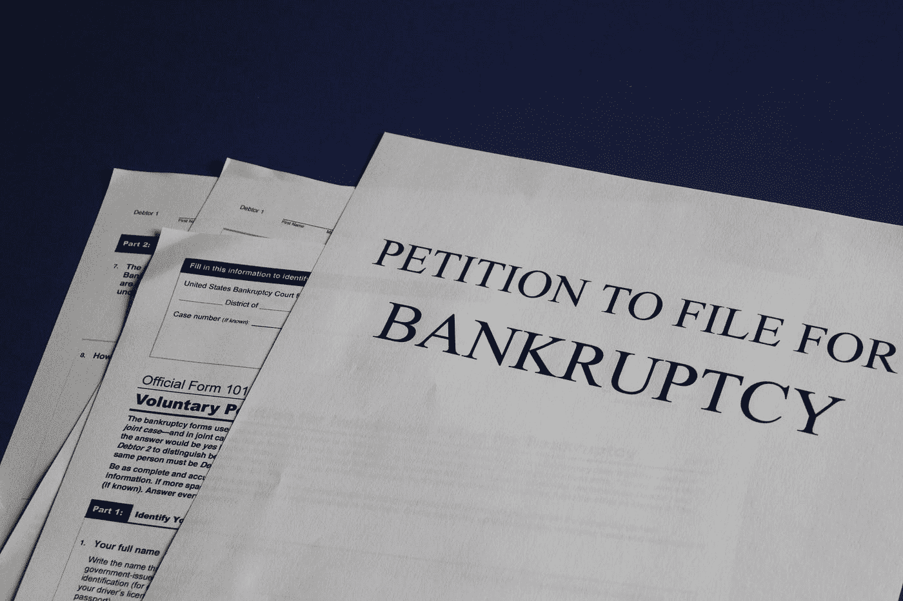

# 我卖了所有东西去买比特币…现在跌了 50%

> 原文：<https://medium.com/coinmonks/i-sold-everything-to-buy-bitcoin-now-its-down-50-761973684a72?source=collection_archive---------4----------------------->

比特币现在已经从历史高点下跌了 50%。这是比特币的末日吗？

Photo by [Melinda Gimpel](https://unsplash.com/@melindagimpel?utm_source=medium&utm_medium=referral) on [Unsplash](https://unsplash.com?utm_source=medium&utm_medium=referral)

6 个月前，比特币每枚价值 6.7 万美元。

如今，它下跌了 50%以上——每枚硬币约 3 万美元。