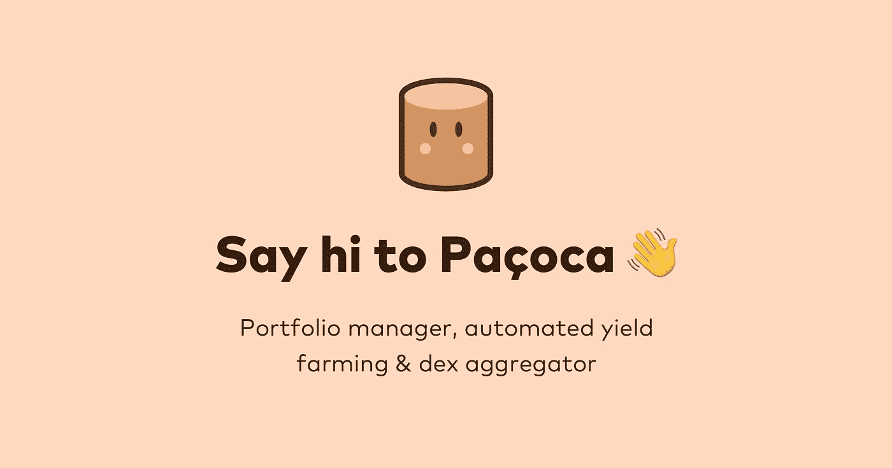

# 我尝试了 3 个月的帕卡

> 原文：<https://medium.com/coinmonks/i-tried-pacoca-for-3-months-f6c1b8819b9f?source=collection_archive---------23----------------------->

2021 年，我开始了不同的 DeFi 项目，目标是创造一个被动收入流。我已经看到不同的人尝试了这些新项目与疯狂的高 APYs，但我厌倦了看到相同的 DAO 项目。所以我做的是研究一个不同类型的 DeFi 项目，我发现的是 PACOCA，一个多链投资组合管理器，自动化产量农业和 DEX 聚合器。

我决定尝试这个项目，因为它看起来很有前景，所以在 2021 年 11 月投资了一小笔钱。就像《煎饼铛》和《仙境传说》一样，我应该制作一个为期一个月的结果视频。但是现在我们正在迎头赶上。

我们要调查一下 PACOCA 是什么，有什么特点，我试用了 3 个月后得到了什么结果。

# 帕卡卡是什么？

From [https://docs.pacoca.io/](https://docs.pacoca.io/)

paoca 是一个很好的投资组合管理器，用户可以跟踪他们的 DeFi 资产，投资具有复利的智能金库，并使用分散的交易所聚合器以最佳利率交易代币。

根据他们的[文件](https://docs.pacoca.io/)，

> Pacoca“旨在优化 DeFi 用户的体验，其目标是为区块链 EVM 的不同 Defi 项目(如 BSC、以太坊和 Polygon)提供广泛而集中的资产视图。”

顺便说一下，这个名字引起了我的兴趣，因为它很不寻常。当我查的时候，术语“paoca”实际上是一种美味的巴西花生糖，用磨碎的花生、糖和盐制成。

总之， **$PACOCA** 是该平台的原生令牌，将有许多短期和长期的用例，包括:治理、自动复利金库、&投资组合独有的特性。

最初，令牌的供应上限为 100，000，000，但是[提交了一份提案](https://snapshot.org/#/pacoca.eth/proposal/0xa2f21aff2495219f950c641bf94a8dcafea2bd261c99983a0cc7c5087f19efb3)，将供应上限提高到无限制。该提案于 2021 年 12 月投票通过，如果我们在谈论代币的价格，你应该猜到了。此后有所下降。

# PACOCA 有什么特点？

*   DeFi Dashboard—PaCO ca 的主要用途是在一个地方跟踪多个平台的多链仪表板。在他们的仪表板里，他们有一个功能，可以把你的小额余额转换成 Pacoca，这样你的钱包里就不会有灰尘了。
*   甜地窖——这基本上是你典型的农业特征。Pacoca 已与链节管理员合作，以优化其用户的收入。
*   交易所—他们的交易所由 1 英寸供电。

因为它是一个 microcap 项目，所以还有一些功能还没有发布。根据他们的路线图，NFTs 和清算通知功能是他们尚未在平台上启动的计划。

# 3 个月后我的结果

当我第一次看到 Pacoca 时，我喜欢这个想法，即我可以聚合我将来会参与的任何 BSC 项目。

当时我还有 PancakeSwap，这是 BSC 网络中比较流行的 DeFi 平台。在一个平台上看到我的 PancakeSwap 投资和 Pacoca 的投资非常有帮助。

Pacoca 仍然是一个微型项目，有一个非常好的前提。我相信从长远来看这将是一个好项目，所以我决定在去年 11 月 22 日投资。

我从 168.76 美元开始，支付了 1.01 美元的费用——将 BNB 换成帕卡 82 美分，启用自动复利功能 19 美分。

考虑到其他基于 ETH 的项目有天文数字般高的天然气，为 DeFi 项目支付 1 美元的费用是非常划算的。

3 个月后，我的 168 美元投资变成了 56.47 美元——亏损了 66.54%！

这种价值下降的最大原因是由于帕卡的价格下跌。在我投资之初，代币的价格是 25 美分。在把我的位置放入帕卡的甜蜜金库后，代币的最高价格是 30 美分。从那以后，价格降到了 4 美分，真是太悲惨了。我只经历了一周的盈利，直到我的头寸从 12 月份开始贬值。

所以 3 个月后，我决定在 2 月 22 日平仓，象征性价格 6 美分。那时，我认为不值得继续投资了。我只能接受失败，继续前进。

# 最终想法和计划

像往常一样，我学到了几个教训，在我与 Pacoca 相处 3 个月后，我对自己有了一个认识。

## 微盖项目是巨大的收益。

这与我这里的结果相矛盾。但是让我解释一下。作为一个微型摄像头是我投资这个项目的另一个原因。坦白地说，这可能是你第一次听说这个项目。Microcap 项目就像细价股。它们的市值通常不到 5000 万美元，而且很低调。他们不做很多市场营销，所以研究是大部分工作的地方。他们有可能获得丰厚的回报，尤其是如果你在项目的开发阶段投资的话。如果项目被证明是好的，你不需要一个相当大的头寸来从中获利。

## 时机是关键

加密货币已经很不稳定，所以风险很高。对于 microcap 项目，风险更大。由于它们不太受欢迎，关于它们的信息可能很少，而且仅限于开发者发布的内容和少量在线文章。如果你想在短期内从项目中获利，那么选择投资时机至关重要。对于一个小的投资，随着项目继续展现出希望并得到关注，你可以成倍地增长。从长远来看，很难说这个项目结果会如何。你可以做尽可能多的研究，但仅此而已。项目变成什么样，最终还是由开发者决定。

## 扭曲的投资观点

这是我的一个体会。对 DeFi 项目回报的预期扭曲了我对长期投资的看法。去年，人们被吸引到 DeFi 项目，因为许多投资者在如此短的时间内看到了巨大的回报。

在纸面上，这看起来很棒。你看到你的小投资在一年、一个月甚至一天内增长，因为这些项目提供了高的年利率。对于新的加密投资者来说，每年 10%看起来绝对酷。一般来说，你不可能从股票市场上得到这些。

然后，你继续发现其他 DeFi 项目，提供 100%每年，你被吹走了。你开始投资，看到回报，说服自己未来会是这样。

最后，你不再看那些提供每年回报的项目，但是他们告诉你每天的回报。对于一个刚刚起步的 DeFi 项目来说，每天 1%、2%、5%、甚至高达 10%，突然对你来说就成了很正常的事情。你开始摒弃那些回报低于新常态的项目，因为你相信这些项目会留在未来。

我可能是错的，也可能是对的。但这并不重要，因为从根本上讲，你对加密货币的看法现在是短期的现金攫取，而不是长期的。

虽然我并不反对那些这样做的人，因为那是他们的事，但这种心态目前并不适合我。我真的相信加密技术以及它如何改变金钱运作的方式，所以我仍然希望时不时地脱离利润。

我也喜欢利润和金钱，但我只是不想让它改变我。就像他们说的，“赚钱，但不要让钱让你。”

# 最终想法和计划

因为我已经平仓了，所以我现在有 BNB 代币。我已经考虑把我的 BNB 作为赌注，这样我就可以从中获得被动收入。我找到了两种方法，一种是通过币安网站，另一种是通过信托钱包。

我首先查看了币安的网站，但发现他们已经将[binance.org](http://binance.org)更名为 bnbchain.world。尽管我询问了其他人，但我对在新网站上下注不太确定，所以我查看了 Trust Wallet。

在经历了这个过程后，我还不能下注，因为我的余额不够。我需要一个完整的 BNB 代币来开始下注，所以我现在要等待，并逐步增加我的仓位。