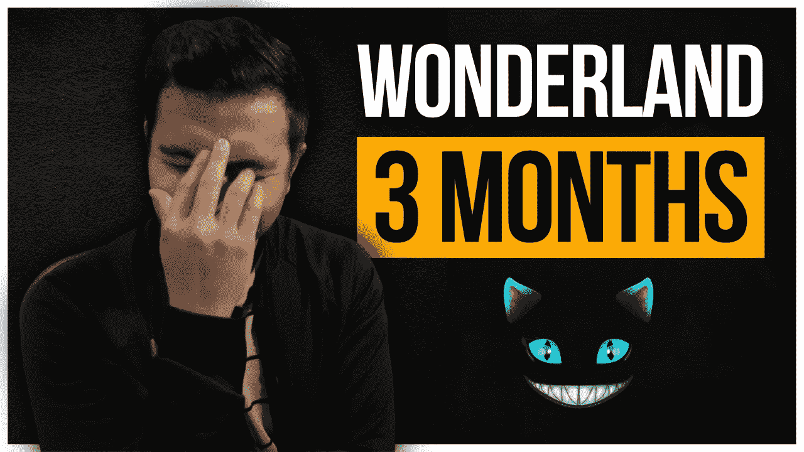
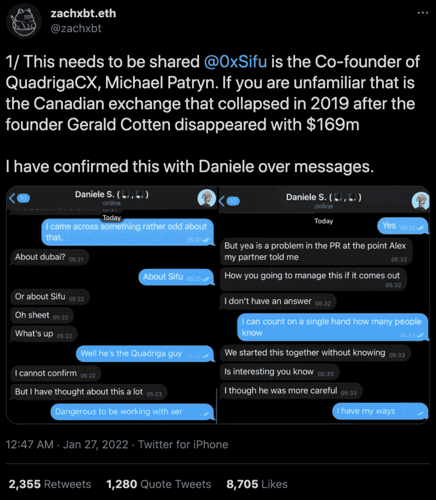
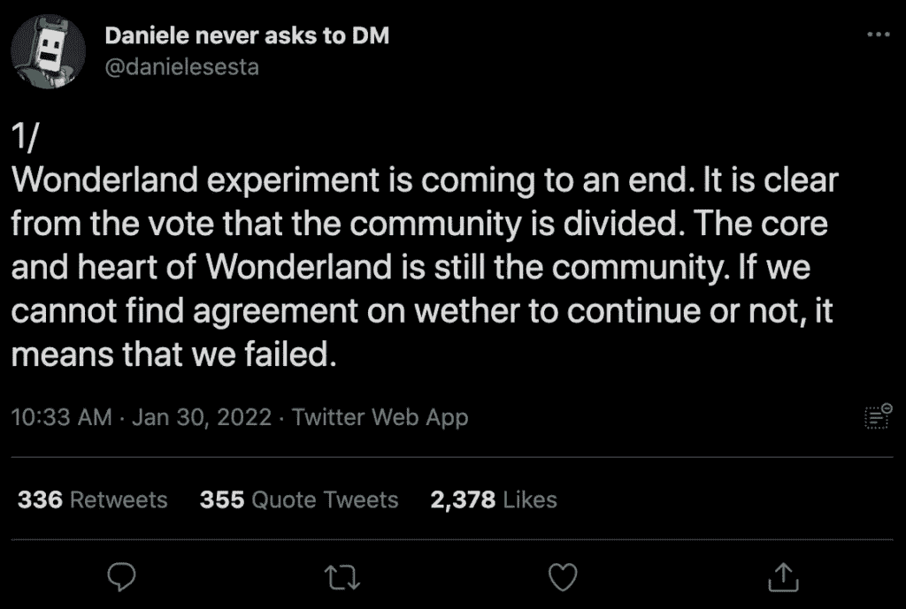
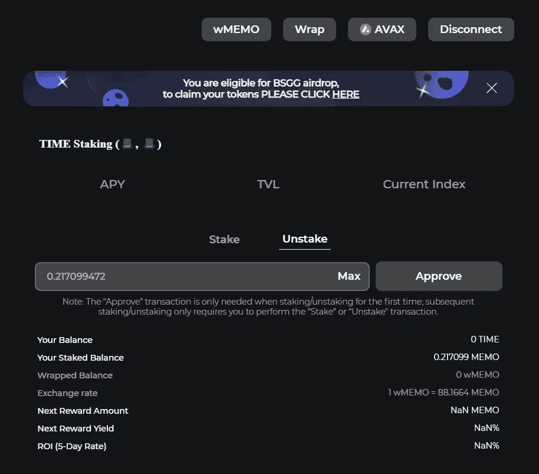

# 我尝试了三个月的时间仙境

> 原文：<https://medium.com/coinmonks/i-tried-time-wonderland-for-3-months-7739e4aa057e?source=collection_archive---------13----------------------->

2021 年，我尝试了不同的 DeFi 项目，希望从加密货币中获得一些额外的被动收入。至今试过[**BlockFi**](http://thehustlefiles.com/2021/11/22/how-much-i-made-using-blockfi-in-5-months/)[**Anchor Protocol**](http://thehustlefiles.com/2021/12/28/i-tried-anchor-protocol-for-6-weeks/)和 [**PancakeSwap**](http://thehustlefiles.com/2022/02/09/i-tried-pancakeswap-for-3-months/) ，截止到今天只保留了前两笔投资。

但除了这三个，我还在 11 月份投资了 Wonderland，这是一个在雪崩网络上可用的分散储备货币协议。

事实上，我来这里参加派对已经很晚了，因为发生了很多事情，从我读到的和看到的，到我离开投资 3 个月后的仙境。

我们将讨论仙境项目发生了什么，以及 3 个月后我的投资发生了什么。

# 什么是仙境？

仙境是雪崩区块链上的一个分散金融(DeFi)平台。它于 2021 年 9 月推出，由 Daniele Sestagalli 创建。

是 OlympusDAO (OHM)的一个分支，基本意思是他们用 OHM 的框架创建了这个项目。它们最大的相似之处是都使用一个后备来支持每个时间令牌。然而不同的是，欧姆使用戴令牌来支持它的硬币，而时间使用 MIM。

用户可以用时间代币来赚取更多的时间，或者用时间来换取 LP 代币或其他资产，以折扣价创造时间。然而，每铸造一个新的时间标记都会降低每个标记的总价值。

时间的开发者期望代币的价值会随着时间的推移而下降。虽然价格很可能会下降，但财政部被用来支持每一个代币，并确保价格不会低于某一点。

# 仙境怎么了？

许多投资者利用他们的功能在仙境大赚了一笔，称他们可以从超过 1000+%的 APY 赚到高达 80000+%的 APY。但到 2022 年 1 月底，仙境的 TVL 或总锁定价值从 26 亿美元升至约 9 亿美元。

发生了什么事？

2021 年 11 月下旬，整个加密市场呈下降趋势。虽然这是加密市场的典型场景，但 OlympusDAO 及其分支经历了一段艰难的时期。根据[今早上链](https://www.thismorningonchain.com/articles/defi/time-wonderland-survived-a-rug-pull-and-a-corporate-raid-but-was-it-a-scam/)，

> 这些项目的投资者期望获得巨额收益——通常利用杠杆来实现他们期望的回报。随着市场横盘下跌，杠杆头寸被平仓，投资者对高 APY 的 Dao 失去了信心。

自 11 月底以来，时代的象征性价格下跌，其领导层鼓励投资者留在该项目上。匿名的“Sifu”暗示他们将投资其他创收项目。随着该项目失去投资者，它承诺空投代币并启动回购，以防止代币突然崩溃。当价格接近 1000 美元时，没有进行空投，而是启动了回购。但在一周内，大量抛售使 TIME 跌至不到 400 美元。

有人猜测，仙境领导让令牌罐，清算杠杆头寸的过程中。但一天后，有消息称，著名的出境骗子迈克尔·帕特林可能是思福，仙境的首席财务官兼财务经理。

Source: Twitter @zachxbt

1 月 27 日，推特用户@zachxbt [透露了 Sifu 的身份](https://twitter.com/zachxbt/status/1486591682728673282)，并分享了与 Daniele Sestagalli 的聊天记录，证实了 Sifu 的身份为 Michael Patryn。此前，帕特林因身份欺诈在美国服刑，但涉嫌在 2019 年加拿大中央交易所 QuadrigaCX 的[退出骗局](https://coinclarity.com/quadrigacx-missing-crypto-investigation/)中窃取超过 1.5 亿美元。

1 月 29 日，TIME token 持有者投票决定是停止项目并分配国库，还是继续项目。大多数人想继续仙境，但尽管如此，一天后，塞斯塔加利杀死了仙境项目。

Source: Twitter @danielesesta

几天后，塞斯塔加利再度现身，参加 AMA，谈论仙境的未来。他提到了不终止项目、重组领导层、新的象征经济学，以及可能补偿一些被清算的仙境投资者。

最后，塞斯塔加利梳理了该项目的两个潜在新方向，“仙境 2.0”和“教授提案”。目前没有关于这些的更新。

# 三个月后我在仙境的结果

至于我的投资，你可以猜猜三个月后的结果是什么。当我看着他们的页面试图获得我的投资时，幸运的是我仍然可以看到我的余额

Lucky, it was still there!

当我第一次开始的时候，我投资了 383 美元。另外，我支付了大约 2.33 美元的费用。在这个时候，我真的很高兴费用在雪崩网络中不是一个大问题。我认为这将有所帮助，因为它不会吃掉我的初始投资。

3 个月后，由于我没有及时得到消息，也没有及时退出，我的 383 美元投资跌到了 18.50 美元，价值下降了 95.17%。

老实说，这是一个非常悲惨的损失，因为我对这个项目能够长期存在抱有很高的希望。再次经历这些让我想起了 2017 年我输给 BitConnect 大约 3000 美元的那段时间。这是一个毁灭性的损失，因为当时我是一名大学生，几乎没有任何东西可以帮助我重新站起来。

然而，这一次的不同之处在于，我做好了失去投资仙境的资金的准备。我对我在这里失去的钱感到很超然，因为我曾假设我会在这个项目中完全失去它。毕竟，这是一个高 APYs 的项目，相信它本身将是长期可持续的。

但是我怎么强调我赔钱的事实都不为过，而且这些类型的项目都是高风险的。赔钱是游戏的一部分。

# 最后的想法和教训

这次经历教会了我一些事情。让我与你分享它们，这样你今天会更明智一点，当涉及到这些 DeFi 项目时会更实际。

1.  **不要急**——我花了一段时间才决定投资仙境。这一点我做对了。我在 10 月份看过这个项目，看到人们得到了这些疯狂的 apy，这引起了我的兴趣。在研究了这个项目之后，我决定只投资我所用的金额，因为与我在这些实验中通常使用的金额相比，这已经足够大了，但也足够小，不会对我的财务产生大的影响。
2.  **把你的雷达放在**上——这是我跳进仙境时完全忽略的一件事。这些项目不受任何帮助你收回投资的实体的监管。这些都是民治，或者道治。他们是你与项目或你的钱的主要联系。关注每个项目的社交指标是很重要的，比如社区聊天和围绕它的宣传。关注他们的社交媒体渠道，了解正在发生的事情，并进入他们的私人社区团体，这样你就能洞察到可能会发生的事情，而这些事情并没有被公开。
3.  **多研究**——这是投资中最重要的方面。我尽我最大的努力去做这件事，但不可避免的是我能做得很完美。

*   令牌经济学(token omics)—这基本上是一个令牌的经济学，并讨论它将如何在项目中使用。令牌组学涵盖了数字资产的三个方面:筹资、治理和所有权。
*   **开发团队** —许多 DeFi 项目的一个问题是，它们通常是由匿名的人创建的。加密货币的匿名性是这个空间吸引人的因素之一，但它也是一把双刃剑。了解谁是开发团队，他们的经验和可信度将是我在尽职调查中需要改进的几个方面。

# 我 2022 年的计划

我 2022 年的计划很简单——投资更安全的赌注平台和代币。我知道“安全”在加密领域并不存在，但我说的是相对更安全的投资。今年对我和我的工作来说都将是忙碌的一年，所以要跟上这些进展太快的项目将是一项艰巨的任务。

如果我只关注追逐高利润，我就无法跟踪他们和我的投资。总会有下一个闪亮的 DeFi 项目，我不能全部投资。现在最好还是站在更安全的一边，专注于通过投资更安全的项目来建立我的加密组合。

我最近在 KuCoin 开了一个“储蓄账户”,帮助我从 BTC 中获得一些回报。这不是一个很大的回报，但至少我知道我的 BTC 可以在没有我的监督下成长。我现在可以给出安全的高回报。

# 你的仙境结果如何？

> 加入 Coinmonks [电报频道](https://t.me/coincodecap)和 [Youtube 频道](https://www.youtube.com/c/coinmonks/videos)了解加密交易和投资

# 另外，阅读

*   [比诺莫评论](https://coincodecap.com/binomo-review) | [斯多葛派 vs 3Commas vs TradeSanta](https://coincodecap.com/stoic-vs-3commas-vs-tradesanta)
*   [Capital.com 评论](https://coincodecap.com/capital-com-review) | [香港的加密借贷平台](https://coincodecap.com/crypto-lending-hong-kong)
*   [如何在 Uniswap 上交换加密？](https://coincodecap.com/swap-crypto-on-uniswap) | [A-Ads 审查](https://coincodecap.com/a-ads-review)
*   [WazirX vs CoinDCX vs bit bns](/coinmonks/wazirx-vs-coindcx-vs-bitbns-149f4f19a2f1)|[block fi vs coin loan vs Nexo](/coinmonks/blockfi-vs-coinloan-vs-nexo-cb624635230d)
*   [本地比特币评论](/coinmonks/localbitcoins-review-6cc001c6ed56) | [加密货币储蓄账户](https://coincodecap.com/cryptocurrency-savings-accounts)
*   什么是融资融券交易
*   [维护卡审核](https://coincodecap.com/uphold-card-review) | [信任钱包 vs MetaMask](https://coincodecap.com/trust-wallet-vs-metamask)
*   [Exness 点评](https://coincodecap.com/exness-review)|[moon xbt Vs bit get Vs Bingbon](https://coincodecap.com/bingbon-vs-bitget-vs-moonxbt)
*   [如何开始通过加密贷款赚取被动收入](https://coincodecap.com/passive-income-crypto-lending)