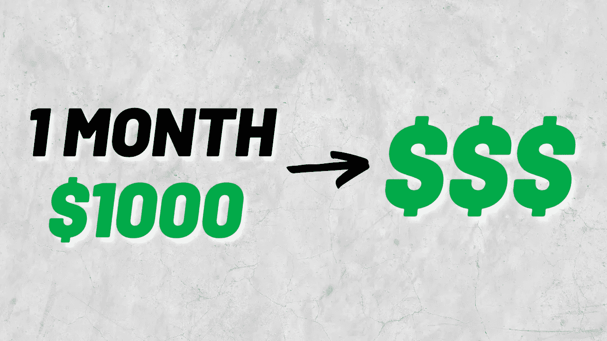
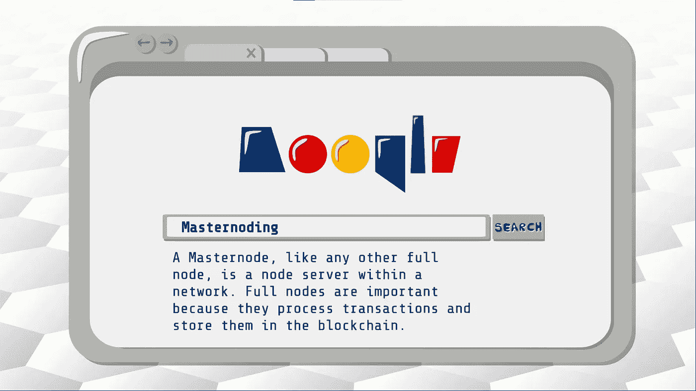
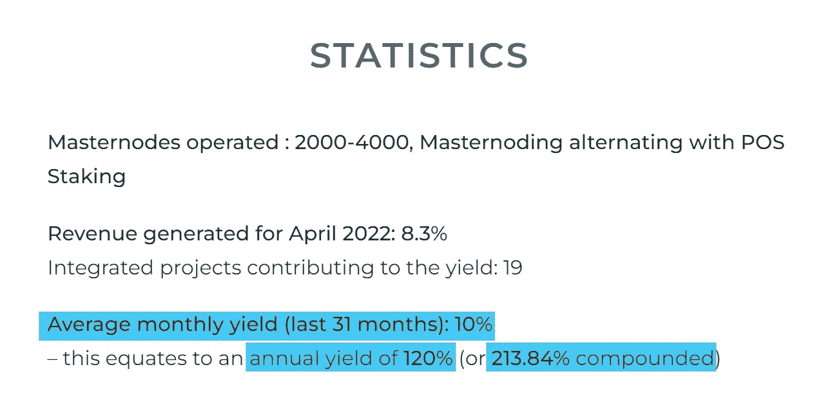
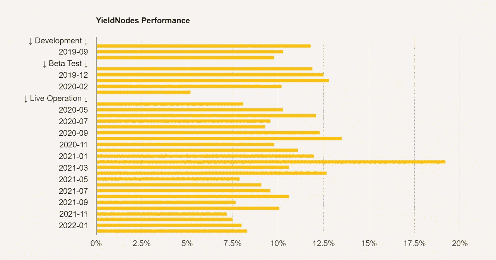
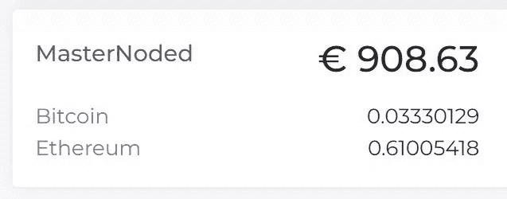
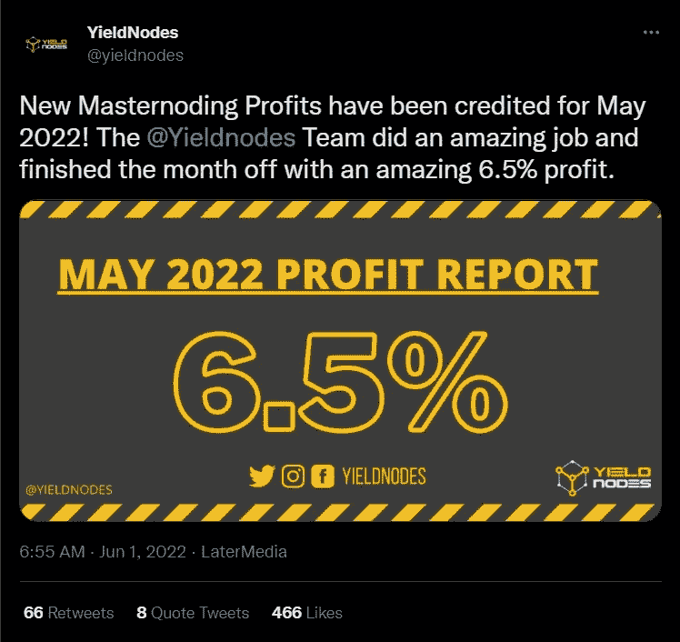
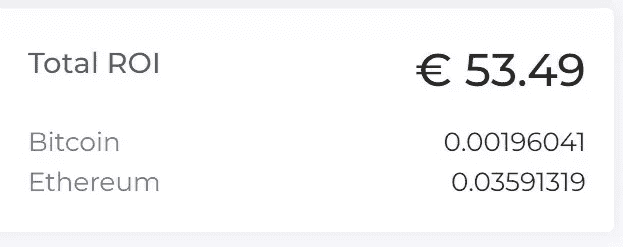

# 我尝试了 1 个月的收益节点(我赚了多少)

> 原文：<https://medium.com/coinmonks/i-tried-yield-nodes-for-1-month-how-much-i-made-da21685a4bad?source=collection_archive---------7----------------------->

## 我在收益率节点上投资了 1000 美元。我五月赚了多少钱？项目长期可持续吗？我对这个项目有什么想法？

# 在 1 分钟内解释产量节点

[Yield Nodes](https://yieldnodes.com/?a=mMdO8jM0agXnekE&trk=8) 是一个专门运行 masternodes 的**节点租赁程序。Masternodes 是一种特殊类型的股权证明节点，需要用于**处理交易并将其存储在区块链中，以及管理更关键的任务**，为运营商(收益节点)带来更高的回报。**

Masternoding Explained

该项目没有任何加密货币或代币，投资和收益都以欧元计量。

自从 31 个月前**项目启动以来**，几乎三年前，他们已经给出了**每月 10%左右的平均回报率**，这相当于 **120%的年利率或 213%的 APY(如果你将收益复合计算**)。

Yield Nodes Returns for the Past 31 Months

然而，这种**回报并不是固定的**，它根据每月 Yield Nodes masternodes 的表现而变化。不固定的回报初看起来可能不好，但是正如我在我上一篇关于收益节点的文章中解释的那样，它是好的，因为它意味着项目不会给出不可持续的回报。

Yield Nodes Doesn’t Have Fixed Returns

关于安全性， [**产量节点**](https://yieldnodes.com/?a=mMdO8jM0agXnekE&trk=8) **在 3 年内已经过多次审计****创始人完全公开。在 Youtube 上的多次采访中，我们看到了首席执行官史蒂夫和 CMO。他们还在马耳他召开年度面对面会议，邀请机构群体成员进行审计。**

The Core Team of Yield Nodes

# 我投资 1000 美元一个月后的结果

关于收益节点的解释已经够多了，让我们来看看我在 5 月份赚了多少。因此，正如我所说，我在[收益率节点](https://yieldnodes.com/?a=mMdO8jM0agXnekE&trk=8)上投资了 1000 美元，这给了我大约 900€(正如我之前所说，这些投资不是以任何代币或加密货币计量，而是以欧元计量)。

Amount I Masternoded (Invested) in Yield Nodes

[收益率节点](https://yieldnodes.com/?a=mMdO8jM0agXnekE&trk=8)在 5 月实现了 **6.5%的回报率，考虑到加密市场在这个月经历的大崩盘，这是令人印象深刻的。**

Yield Nodes 6.5% Return for the Month of May

然而，我并没有让我的投资人掌握整个月的情况，因为他们需要大约一周的时间将我们的投资投入工作。所以**我在月初错过了几天，我的回报率是 6.2%** ，这真的很好。

**这意味着我在第一个月的** [**收益节点**](https://yieldnodes.com/?a=mMdO8jM0agXnekE&trk=8) **从 900€投资中赚了 53€。**

Return Obtained in the First Month with Yield Nodes

# 向前看的想法

在投资于[收益节点](https://yieldnodes.com/?a=mMdO8jM0agXnekE&trk=8)一个月后，我认为**可能是我们在这次熊市中最好的被动收益机会**之一。

**我这次熊市的计划**围绕着比特币和以太坊，我在其中每个月都是美元成本平均。

但是我**正在考虑在计划**中加入 [**收益率节点**](https://yieldnodes.com/?a=mMdO8jM0agXnekE&trk=8) **，做一些类似 40%比特币 40%以太坊和 20%收益率节点的事情。**

然而，我不建议 100%进入收益节点。在熊市期间，最好分散投资，更多地投资于最强的加密资产。但是，对我来说，拿出一部分投资来获得 5%—10%的月回报率是很棒的。

始终记住，这不是投资建议，你应该在投资收益率节点之前做自己的研究。这只是我自己的经验，因投资者而异。

说完这些，我将从 [**产量节点**](https://yieldnodes.com/?a=mMdO8jM0agXnekE&trk=8) 开始，复习一下**的最佳方法。**

# 如何投资收益率节点

1.  [**在网上报名**](https://members.yieldnodes.com/c/?a=mMdO8jM0agXnekE&redirect=signup) **。**
2.  KYC 文件在左手边。存款前提交这些文件。
3.  一旦 KYC 完成并获得批准，你就可以使用比特币、菲亚特或 USDT 进行存款。只要记住，如果你用系绳做，你必须通过 Tron 网络发送它。
4.  等待宽限期(7 天)。我建议**激活 2FA 来保护你的账户**，或者使用谷歌认证器或者 Authy。

非常感谢你一直读到最后。如果你发现这些信息很有帮助，请跟随查看更多诚实和直截了当的加密和投资内容！

*   [Youtube](https://www.youtube.com/c/MarioVelaSimplyCrypto)
*   [**推特**](https://twitter.com/MarioVelaCrypto)

# 您可能还喜欢:

*   [收益率节点 2022 回顾—2019 年起月息 10%。](/@mariovela/yield-nodes-2022-review-10-monthly-interest-since-2019-52669811435c)
*   [收益率节点并非无风险(投资前要考虑的 3 个风险)。](/@mariovela/yield-nodes-is-not-risk-free-3-risks-to-consider-before-investing-76e703d8d6dd)

*本文非理财建议。投资前做好自己的研究。一些链接可能是附属链接。*

> 加入 Coinmonks [电报频道](https://t.me/coincodecap)和 [Youtube 频道](https://www.youtube.com/c/coinmonks/videos)了解加密交易和投资

# 另外，阅读

*   用信用卡购买密码的 10 个最佳地点
*   [最好的卡达诺钱包](https://coincodecap.com/best-cardano-wallets) | [Bingbon 副本交易](https://coincodecap.com/bingbon-copy-trading)
*   [印度最佳 P2P 加密交易所](https://coincodecap.com/p2p-crypto-exchanges-in-india) | [柴犬钱包](https://coincodecap.com/baby-shiba-inu-wallets)
*   [8 大加密附属计划](https://coincodecap.com/crypto-affiliate-programs) | [eToro vs 比特币基地](https://coincodecap.com/etoro-vs-coinbase)
*   [最佳以太坊钱包](https://coincodecap.com/best-ethereum-wallets) | [电报上的加密货币机器人](https://coincodecap.com/telegram-crypto-bots)
*   [交易杠杆代币的最佳交易所](https://coincodecap.com/leveraged-token-exchanges) | [购买 Floki](https://coincodecap.com/buy-floki-inu-token)