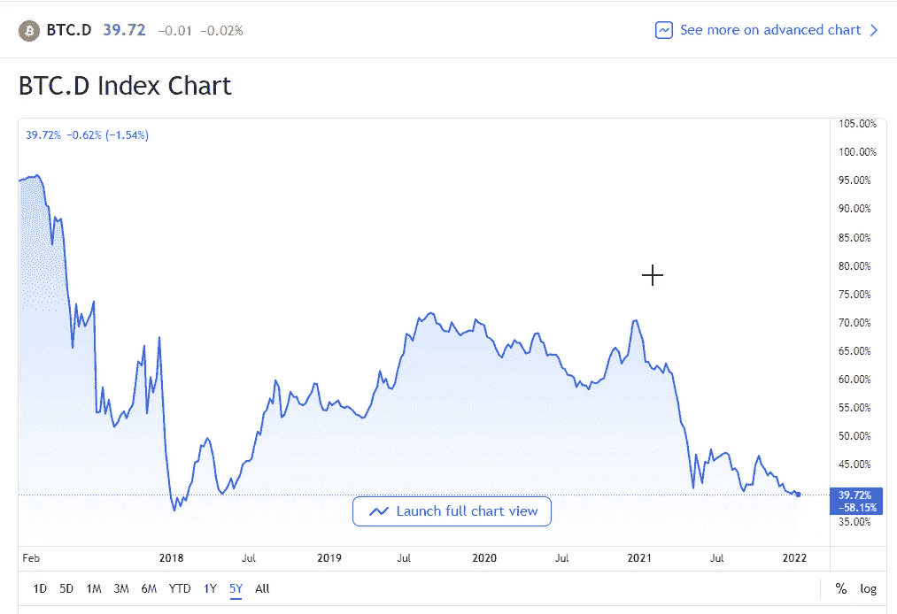

# 我会一直叠加 sat

> 原文：<https://medium.com/coinmonks/i-will-always-stack-sats-481d1cfbe752?source=collection_archive---------10----------------------->

## 为什么比特币仍然是投资的最佳密码

## 向奥运会组委会致敬

拥有比特币就像拥有一段历史。它不仅是一种价值储存手段，也是一种收藏品。

让*拥有*数字化的东西只是 *13 岁的*的一个概念——理解起来有点复杂。一个人如何拥有一项*也是*商品的技术？一个*如何以数字方式收集*一些东西？

本质上，比特币改变了拥有 的定义。

它经常与我们在日常生活中看到的所有权的其他**数字表示方式**相混淆，比如在线视频游戏，或者在线银行余额和股票交易账户。

但是拥有比特币是完全不同的事情…

与显示你的所有权的视频游戏不同，比特币的数据结构及其*挖掘协议*显示了你所有权的难以想象的广泛*证明*。

对于比特币，我们不信任——我们验证。仅用你的私人钥匙，你就可以证明你的所有权。

远离窥探和官僚主义的低效，拥有一枚比特币*不同于*你的**网上银行门户**或**证券交易所**向你展示的数字表示。

这些机构只是你所拥有的资产的保管人。为了您的方便，他们已经将这些信息上传到互联网上供您查看。

因此，你必须使用*他们的*应用程序，并进入*他们的*网站查看这些信息。资产本身的控制权仍在他们手中——你必须相信他们会满足你的要求。

另一方面，比特币允许我们以数字方式拥有一种资产，就像它是黄金和白银等*持有者*资产一样。

比特币网络通过加密协议和点对点共识来实现这一点，而不是依赖账簿管理人来保管你的资产和促进你的交易。在交易的两端都有一个唯一的私钥和公钥对，用于验证交易的合法性，而不需要任何可信的中介。

最后，该交易由矿工验证，然后由网络中的每个节点验证，允许双方独立地达到他们对比特币的真正所有权状态。

当你 ***拥有*** 比特币的时候，那就不是常规理解中的所有权概念了。

如今，NFT 扩大了我们可以数字化拥有的东西的数量。还有数以千计的其他加密货币**为人类提供这种数字*所有权。*所有人都站在 OG 的肩膀上，比特币。**

## **大而安全**

**作为有史以来第一个成功实现的加密货币，并为整个技术类别设定了标准，比特币曾经是加密市场的 100% 。**

**13 年过去了，数以千计的新兴加密项目涌现出来，比特币仍然稳居第一，并在整个加密市值中占据很大比例。**

****

**[https://www.tradingview.com/symbols/CRYPTOCAP-BTC.D/](https://www.tradingview.com/symbols/CRYPTOCAP-BTC.D/)**

**其他任何加密货币都不太可能取代比特币的头把交椅，尽管以太坊有一些潜力。尽管如此，即使坐在第二的位置，也还有很长的路要走，因为它还不到比特币市值的一半。**

**这些天来，加密领域在所有替代货币(不是比特币的加密)和比特币之间争夺主导地位的竞争中波动。因此，如果有一个黑天鹅事件使加密行业紧张，它肯定会是最后一个站着的。有许多默默无闻的小型和微型加密货币将在发生崩溃或其他经济灾难时成为炮灰。**

**作为同类产品中的第一个，拥有先发优势，也是存在时间最长的，比特币无疑是这一新兴资产类别中最安全的投资。对于仍然不确定加密网络内在安全性的投资者来说，投资比特币并经历缓慢而稳定的增长将建立信心。**

**对于经验丰富的投资者来说，无论他们可能拥有其他哪种闪亮的另类硬币，通过拥有比特币的股份来参与比特币网络，可以增强整个加密市场的实力。为比特币担保就是为整个加密市场担保。**

## **堆叠 sat**

**归根结底，我们寻求的是财务稳定，当这一点得到解决后，我们还会获得一些财务收益。**

**叠加 sat 依然是两全其美的最佳方式。当模糊的微型大写字母可能带来 100 倍的收益时，也存在 100 倍的作弊和安全漏洞的风险。**

**作为一种成熟的资产，比特币是风险和投资回报率之间的最佳平衡——对于时间偏好较低的明智投资者来说，这是完美的选择。**

> **加入 Coinmonks [电报频道](https://t.me/coincodecap)和 [Youtube 频道](https://www.youtube.com/c/coinmonks/videos)了解加密交易和投资**

## **也阅读**

** [## 杠杆代币[多头代币]终极指南

### 杠杆化令牌是具有杠杆化风险敞口的 ERC20 令牌，不考虑保证金、要求、管理…

medium.com](/coinmonks/leveraged-token-3f5257808b22)  [## 最佳加密交易所| 2021 年十大加密货币交易所

### 编辑描述

blog.coincodecap.com](https://blog.coincodecap.com/crypto-exchange)  [## 2022 年最佳加密交换平台| CoinCodeCap

### 编辑描述

blog.coincodecap.com](https://blog.coincodecap.com/best-swap-platforms)  [## 10 大最佳在线赌场|赢得并赢取免费 BTC 2022 | CoinCodeCap

### 编辑描述

blog.coincodecap.com](https://blog.coincodecap.com/best-online-casinos)  [## 2021 年最佳加密借贷平台| 6 大比特币借贷平台

### 获得比特币和其他加密货币的最佳贷款利率

medium.com](/coinmonks/top-5-crypto-lending-platforms-in-2020-that-you-need-to-know-a1b675cec3fa)  [## 2021 年 6 大最佳硬件钱包|顶级加密硬件钱包[更新]

### 最好的加密货币硬件钱包是绝对必要的。我们将在 NGRAVE、Ledger Nano X 和…

medium.com](/coinmonks/the-best-cryptocurrency-hardware-wallets-of-2020-e28b1c124069)  [## 2021 年最佳免费加密交易机器人

### 2021 年币安、比特币基地、库币和其他密码交易所的最佳密码交易机器人。四进制，位间隙…

medium.com](/coinmonks/crypto-trading-bot-c2ffce8acb2a)  [## 最佳 4 个加密交易信号电报通道

### 这是乏味的找到正确的加密交易信号提供商。因此，在本文中，我们将讨论最好的…

medium.com](/coinmonks/best-crypto-signals-telegram-5785cdbc4b2b)**