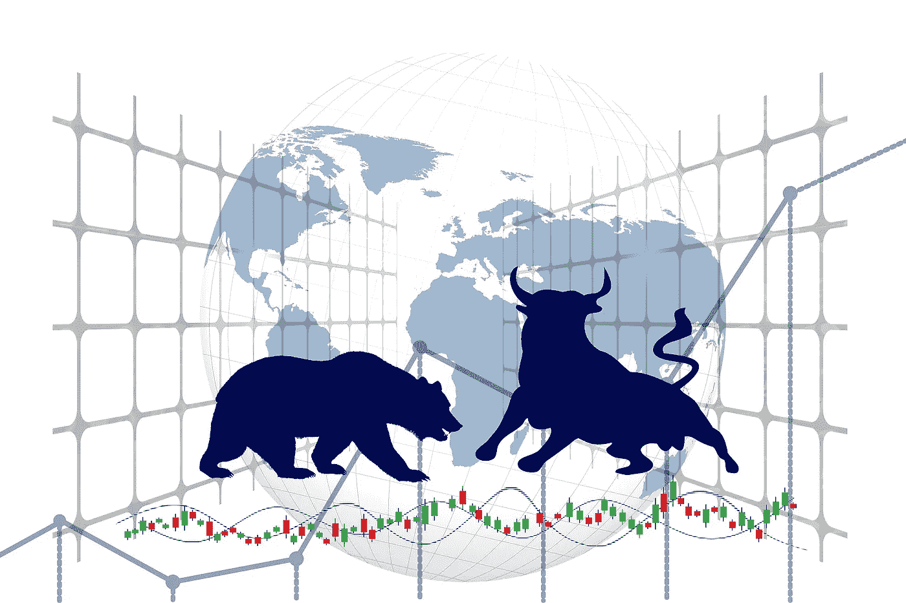

# ICOs(首次发行硬币)

> 原文：<https://medium.com/coinmonks/icos-initial-coin-offerings-20ccb6b576fe?source=collection_archive---------72----------------------->

在传统金融中，首次公开募股(IPO)发生在公司出售部分股份以换取资金的时候，这些资金可以用来支持他们的一些计划以及他们可能需要的任何其他资金。

同样，在加密领域，硬币或代币的开发者持有 ico 来资助他们的计划。代币或硬币开发商以预定的价格向您提供大量代币，以便将代币推向市场并为项目筹集资金。

从本质上讲，首次公开募股(ICO)是一种项目向公众募集资金的机制。开发人员开发出一枚他们的目标所需的硬币或代币，然后向公众出售其中的一部分，以便继续或开始一个项目的工作。所以，作为一个投资者，你买了一个还没有做任何事情，但是被一个团队支持的硬币，这个团队有着良好的记录，大概还有一些明确的技术目标。

通常，代币被出售以换取更知名的加密货币，如比特币或以太坊。因此，开发商将能够出售一部分他们的销售，并使用这个计划来支持他们的工作。

IPO 和 ico 之间的主要区别在于，后者不受政府监管，因此没有什么可以阻止你的钱被抢走，这是加密领域的一个重要问题，被称为“拉地毯”。当一个硬币或代币的创造者从一个项目中偷走所有的现金并带着它逃跑时，就发生了拉地毯事件。与此同时，前者由政府和其他几个机构进行检查，这些机构控制所有行为，并确保作为投资者的你不会被利用，从而降低投资者的风险。

由于 ico 大多不受监管，当它们首次出现在密码市场时，它们改变了公开筹款和人群销售的概念。ico 使加密货币领域的公司能够从公众那里筹集数百万美元，几乎没有繁文缛节。如果你能把你硬币的愿景卖给世界其他地方，你就能产生资金。

但是你为什么这么早就得到一枚硬币呢？通过 ICO 购买背后的基本原理是让投资者尽早获得较低的价格，并期望在令牌发行后，价格会上涨，从而让投资者卖出获利。

白皮书成为成功执行 ICO 的组成部分之一。白皮书旨在成为一种营销工具，并产生轰动效应，但它也应该概述项目的目标是什么，以及打算如何实现。白皮书通常富含数学理论和流程图。一旦营销周期暴露了项目并且生产了代币，就可以开始销售。

尽管 ico 是小公司从志同道合、热情的投资者那里获得资金的绝佳方式，但它们不受监管的事实让投资者面临巨大风险。实话实说，已经有并将继续有许多真正成功的 ico 创造并继续开发真正有益的技术。然而，事实是

推出一个 ICO 只需要一个网站和一些代币，这导致了一系列欺诈行为，无良行为者创建虚构的团队、花哨的网站和毫无价值的代币，希望杜平投资者寻找下一个伟大的东西。

ico 中几乎没有监督或问责。这强调了彻底研究你在密码世界中参与的任何事情的必要性，并致力于做出充分知情的判断。如果你不相信 ICO，最好谨慎行事，因为你将比特币或以太坊交给一个诈骗项目后，就无法收回了。

因此，更多地研究加密以及如何评估加密项目，调查团队，批判性地思考您资助的项目的价值和潜力，并优先考虑您的个人安全。在没有监管的情况下，既有了不起的成就，也有同样令人震惊的失败。

> 加入 Coinmonks [电报频道](https://t.me/coincodecap)和 [Youtube 频道](https://www.youtube.com/c/coinmonks/videos)了解加密交易和投资

# 另外，阅读

*   [密码本交易平台](/coinmonks/top-10-crypto-copy-trading-platforms-for-beginners-d0c37c7d698c) | [Coinmama 审核](/coinmonks/coinmama-review-ace5641bde6e)
*   [印度的加密交易所](/coinmonks/bitcoin-exchange-in-india-7f1fe79715c9) | [比特币储蓄账户](/coinmonks/bitcoin-savings-account-e65b13f92451)
*   [OKEx vs KuCoin](https://coincodecap.com/okex-kucoin) | [摄氏替代品](https://coincodecap.com/celsius-alternatives) | [如何购买 VeChain](https://coincodecap.com/buy-vechain)
*   [币安期货交易](https://coincodecap.com/binance-futures-trading)|[3 comas vs Mudrex vs eToro](https://coincodecap.com/mudrex-3commas-etoro)
*   [如何购买 Monero](https://coincodecap.com/buy-monero) | [IDEX 评论](https://coincodecap.com/idex-review) | [BitKan 交易机器人](https://coincodecap.com/bitkan-trading-bot)