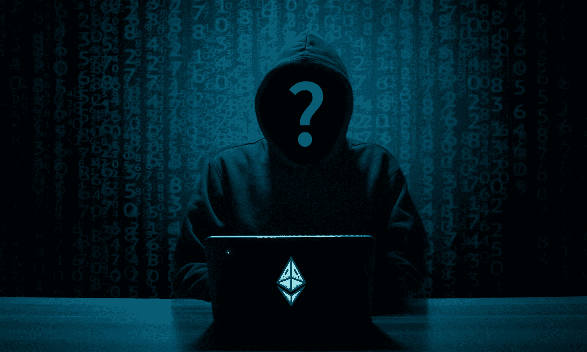

# 新书揭露所谓以太坊 2016 道黑客身份

> 原文：<https://medium.com/coinmonks/identity-of-alleged-ethereum-2016-dao-hacker-revealed-in-new-book-7853c2642e61?source=collection_archive---------27----------------------->

最近发表的一项研究声称，已经确定了 2016 年在以太坊上攻破 DAO 的黑客。在《福布斯》今天发表的一篇文章中，加密记者 Laura Shin 透露了她对震惊以太坊生态系统的臭名昭著的 DAO 黑客攻击的调查结果。Shin 透露，她与区块链分析公司 Chainalysis 合作，跟踪 DAO 基金的动向。

