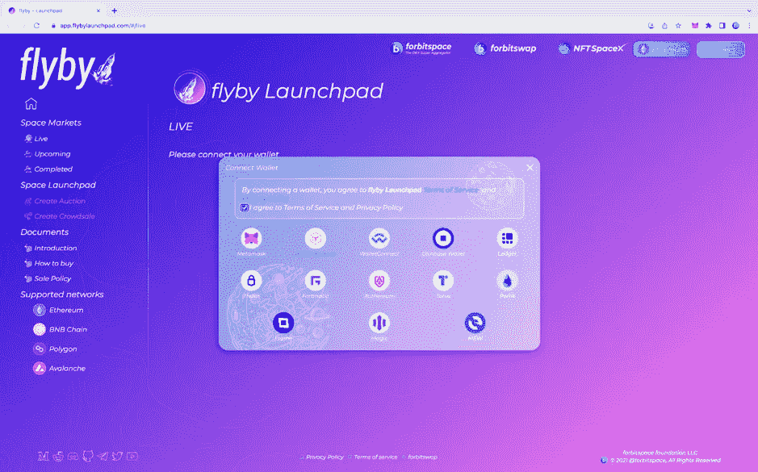
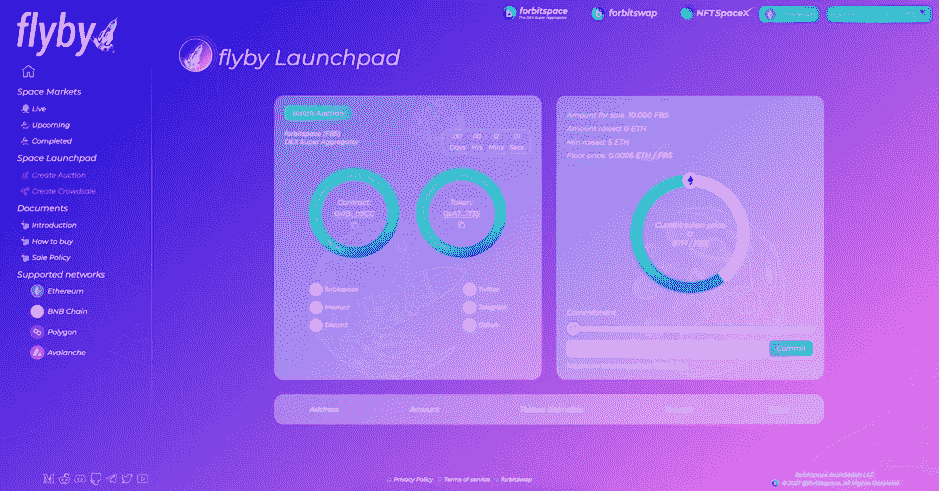
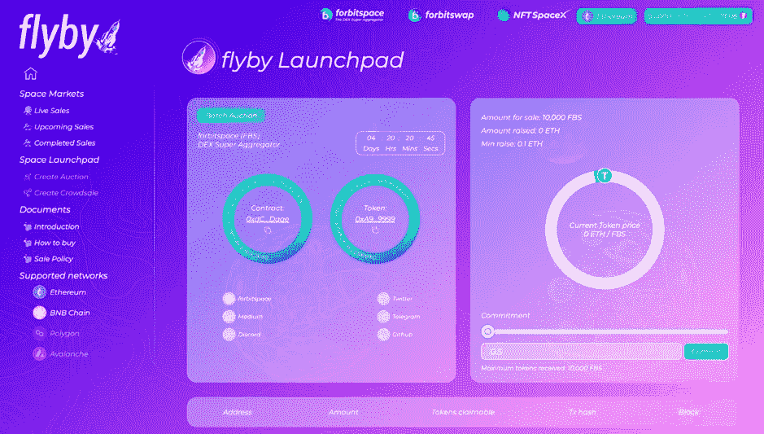
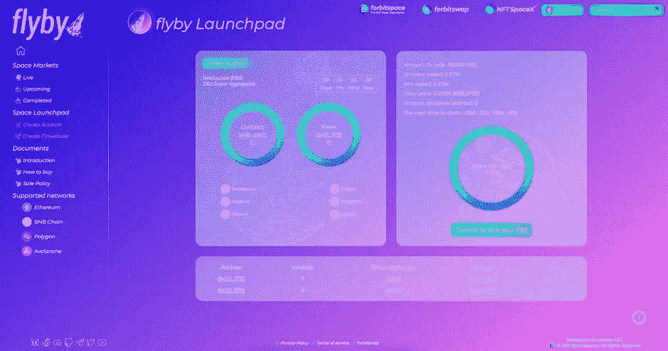
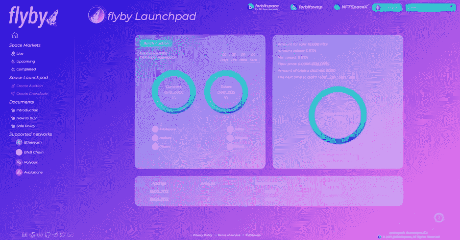

# IDO 和参与拍卖

> 原文：<https://medium.com/coinmonks/ido-and-batch-auction-110c8dd7a1e0?source=collection_archive---------43----------------------->

批量竞价是一种将所有单个订单集中在一起并发执行的交易方式。一批中的所有订单以相同的统一结算价格结算。批量拍卖受益于总流动性，是分散化和传统金融世界中指导公平价格发现的流行机制。

批量拍卖是一种市场方法，通过这种方法，在市场事件的所有参与者之间分配代币的集合，根据他们对池的贡献进行加权。无论你在总体加薪中占多大比例，这都是你将获得的全额奖励的一部分。直白。批量拍卖对于那些希望确认每个参与者都得到回报的项目来说是有用的，不管他们的净资产是多少。

首先，拍卖人确定要拍卖的代币数量以及他们愿意出售代币的最低价格。一旦拍卖开始，投标人可以开始投标，他们指定想要购买多少投标令牌，并查看价格。当拍卖期结束时，智能合约将出价从最高到最低排序，在出价累计量达到拍卖人愿意出售的价格时停止。

目前相当活跃的批量拍卖之一是针对 bitspace $FBS 实用工具和协议治理令牌协议，该协议将通过 IDO 众筹和批量拍卖提供，这些拍卖将在 flybylaunchpad 多链 launchpad 平台上进行。

批量拍卖将从 2022 年 3 月 30 日世界协调时+7 日下午 7:00 开始，持续 8 天，直到 2022 年 4 月 6 日世界协调时+7 日下午 07:00 结束。在这里，用户使用 USDT、USDC、BUSD、MATIC、AVAX 参与拍卖。取决于使用的 mainnet

以下是如何参与正在进行的 IDO flybyLaunchpad 拍卖

访问 flybyLaunchpad 网站

*点击右上角的“Launchpad”按钮。*

**第一步:连接钱包**

flybyLaunchpad 现在支持包括 Metamask 在内的许多钱包，我们还计划在未来扩展更多钱包。目前，以太坊，BNB 链，雪崩，多边形网络支持 IDO，所以你可以通过你的钱包改变你的网络，以互动的 mainnet-specific。

**第二步:选择现场拍卖**

然后你就可以看到现场拍卖的细节并与之互动了。如下图所示。

在现场拍卖期间，您可以在“合同”环和“令牌”环下看到我们的所有信息，以便开始与合同进行交易。在购买时，您需要注意我们市场产品的一些通用指标，包括:销售金额、筹集金额、最低筹集金额

## 步骤 3:创建采购订单

因此，当您在“承诺”字段中输入您希望花费的金额后，我们将在底部显示您可以收到的“收到的最大代币”,计算方法是将您承诺的金额除以“筹集的金额”,然后乘以“销售金额”。

对于使用原生硬币支付方式的拍卖，您只需在“提交”字段中输入您想要提交的金额，然后按“提交”按钮。

## 第四步:申领你的代币

当时间结束或代币售完时，我们将确认完成拍卖，flybyaunchpad 会将您的 FBS 代币连同您的原始货币的任何“零钱”一起转让给您。在授权时，返回并点击“确认锁定您的 FBS”以确认您接受 FBS 令牌锁定政策。然后单击“申请位空间”,获得符合政策的 50%的总令牌。

认领 FBS 后，等待下次认领

> 加入 Coinmonks [电报频道](https://t.me/coincodecap)和 [Youtube 频道](https://www.youtube.com/c/coinmonks/videos)了解加密交易和投资

# 另外，阅读

*   [Bookmap 点评](https://coincodecap.com/bookmap-review-2021-best-trading-software) | [美国 5 大最佳加密交易所](https://coincodecap.com/crypto-exchange-usa)
*   最佳加密[硬件钱包](/coinmonks/hardware-wallets-dfa1211730c6) | [Bitbns 评论](/coinmonks/bitbns-review-38256a07e161)
*   [新加坡十大最佳加密交易所](https://coincodecap.com/crypto-exchange-in-singapore) | [购买 AXS](https://coincodecap.com/buy-axs-token)
*   [红狗赌场评论](https://coincodecap.com/red-dog-casino-review) | [Swyftx 评论](https://coincodecap.com/swyftx-review) | [CoinGate 评论](https://coincodecap.com/coingate-review)
*   [投资印度的最佳密码](https://coincodecap.com/best-crypto-to-invest-in-india-in-2021)|[WazirX P2P](https://coincodecap.com/wazirx-p2p)|[Hi Dollar Review](https://coincodecap.com/hi-dollar-review)