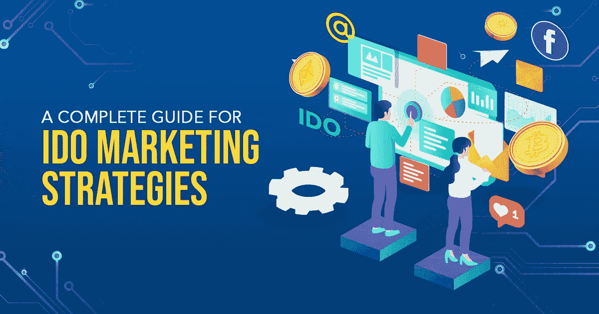

# IDO 营销策略——冲浪快速指南

> 原文：<https://medium.com/coinmonks/ido-marketing-strategies-a-quick-guide-to-surf-b13f9f9cc776?source=collection_archive---------43----------------------->

营销是企业家获取和扩大受众的福音。迄今为止，有许多营销策略潜在地使产品或服务对用户透明。毫无疑问，加密领域正以其标志性的创新加密项目入侵世界。有很多筹款平台，但其中 IDO 是最好的。在当今这个数字时代，加密项目至关重要。因为加密资产的特殊特性导致了需求的增加。IDO 将加密项目放在第一位，以吸引全球用户的注意力。

我们无法列举 IDO 的惊人好处。因此，我会给你最好的提示来理解 IDO 的商业重要性。目前，没有营销和战略，生意就什么都不是。如果你是一名企业家，那就用最好的 [IDO 营销服务](https://www.appdupe.com/ido-marketing-services?utm_source=google&utm_medium=medium&utm_campaign=monika)来广泛推广你的产品。你可以继续探索这个博客，以获得关于这一现象的完整想法。

## **I do——首先，知根知底**

IDO 是初始 Dex 发行的首字母缩写。随后，IDO 是最新的、另类的筹款工具。IDO 是一个吸引全球用户交易加密资产的虚拟平台。它也是一个众筹平台，为项目获取充足的资金。该平台允许用户自主选择他们想要的项目并提供资金。IDO 在一个分散化的交易平台下运作。因此，平台是可信的。

在分散式交换平台中，存在 IDO 令牌与用于加密资产的资金的交易。该平台安全地运行并存储信息，也不会向公众泄露信息。同样，IDO 通过即兴销售来帮助区块链公司。

## 🏷️**I do 营销服务阶段**

🔔**吸引观众**

当网站上有足够的信息时，受众就会急剧增加。主要是，搜索引擎优化和博客将定期维护网站的排名。

🔔**与观众合作**

此外，通过与听众交谈来建立关系也很重要。你可以通过社交媒体、会议和电子邮件与他们联系。如果您为他们提供正确的解决方案，您就有机会将他们转化为销售线索。

🔔**抓取引线**

你可以抓住线索，使你的工作更简单。因此，你也可以在未来留住这些买家。

🔔**取悦观众**

即使在销售结束后，在帮助和支持团队的帮助下接近买家也是很重要的。他们应该对你提供的服务心存感激，因为他们在那个时候需要你的帮助。

## 🏷️ **IDO 营销策略**

迄今为止有许多营销策略，挑选利润丰厚的是营销专家和团队的职责。但是，你可以知道什么是重要的策略:

✔️ **网站设计**

营销专家将帮助你为你的企业开发一个合适的网站。如果有相关的细节，你可以在几秒钟内提升你的网站。

✔️ **内容营销**

在这里，你可以创建博客和其他令人兴奋的内容来迷惑你的观众。你发布的内容将对你网站的排名负责。

✔️ **点击付费**

有付费广告模式，广告商将增强你的用户群，你可以获得大量点击你的网站。

✔️ **社交媒体营销**

社交媒体网络上有数十亿活跃用户。你可以通过脸书、Twitter、Instagram 和 Discord marketing 等应用获得更多关注。甚至在社交媒体上更容易与用户联系。

✔️ **新闻稿**

新闻稿是通过在授权的公关网站上推广 IDO 来征服大量观众的技术。

✔️ **领先**

掌握销售线索是一项伟大的技能。娴熟的专业知识将抓住用户的注意力，并最终将他们转化为销售。

✔️ **电子邮件营销**

群发邮件的活动确实有助于通过时事通讯和宣传信息来推广 IDO。您还可以对该人进行跟进，并跟踪电子邮件的状态。

✔️ **社区营销**

营销包括吸引社区并让他们参与进来。这种营销可以通过一定的方法来实现。

✔️ **上市后推广**

即使在你推出产品后，促销策略也会有所增加，以保持在市场中的地位。

✔️ **影响者营销**

这种推广包括像名人这样的有影响力的人向他们的追随者推广你的 IDO。他们也可以是内容创建者，可以在自己的网站上发布信息以接触受众。

# 🏷️ **总结**

因此，我的结论是，你可以雇佣最好的 [IDO 营销服务](https://www.appdupe.com/ido-marketing-services?utm_source=google&utm_medium=medium&utm_campaign=monika)公司来提高你的业务成果。博客给了你大量的营销步骤和策略的知识。在专家的指导下，你可以使用这些策略来提升你的业务。

> 加入 Coinmonks [电报频道](https://t.me/coincodecap)和 [Youtube 频道](https://www.youtube.com/c/coinmonks/videos)了解加密交易和投资

# 另外，阅读

*   [Bookmap 评论](https://coincodecap.com/bookmap-review-2021-best-trading-software) | [美国 5 大最佳加密交易所](https://coincodecap.com/crypto-exchange-usa)
*   最佳加密[硬件钱包](/coinmonks/hardware-wallets-dfa1211730c6) | [Bitbns 评论](/coinmonks/bitbns-review-38256a07e161)
*   [新加坡十大最佳加密交易所](https://coincodecap.com/crypto-exchange-in-singapore) | [购买 AXS](https://coincodecap.com/buy-axs-token)
*   [红狗赌场评论](https://coincodecap.com/red-dog-casino-review) | [Swyftx 评论](https://coincodecap.com/swyftx-review) | [CoinGate 评论](https://coincodecap.com/coingate-review)
*   [投资印度的最佳密码](https://coincodecap.com/best-crypto-to-invest-in-india-in-2021)|[WazirX P2P](https://coincodecap.com/wazirx-p2p)|[Hi Dollar Review](https://coincodecap.com/hi-dollar-review)
*   [加拿大最佳加密交易机器人](https://coincodecap.com/5-best-crypto-trading-bots-in-canada) | [库币评论](https://coincodecap.com/kucoin-review)