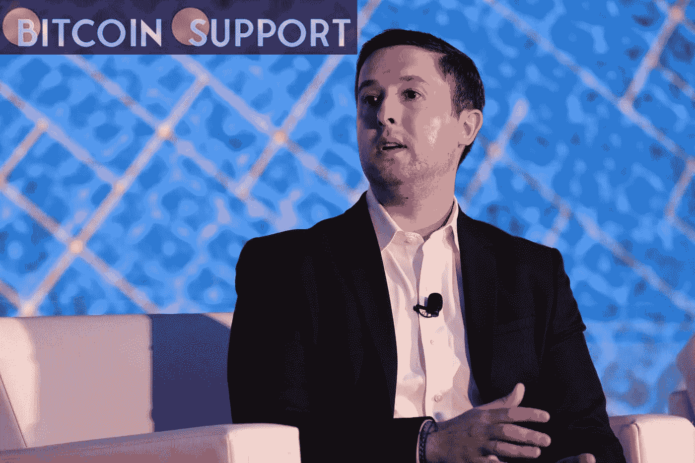

# 如果美国证券交易委员会再次拒绝 says 的比特币交易所交易基金，首席执行官 Sonnenshein 表示，该公司将提起诉讼

> 原文：<https://medium.com/coinmonks/if-the-sec-rejects-grayscales-bitcoin-etf-again-ceo-sonnenshein-says-the-company-would-sue-209b5d535594?source=collection_archive---------94----------------------->

**Visit our website:-** [**https://bitcoinsupports.com/**](https://bitcoinsupports.com/)

随着美国证券交易委员会(SEC)对批准比特币现货交易所交易基金(ETF)申请犹豫不决，其申请已提交监管机构的公司之一透露，如果该机构继续拒绝申请，它可能愿意起诉。

**所有可能性都摆在桌面上**

在彭博社的一次市场采访中，gray Markets CEO 迈克尔·索南斯坦(Michael Sonnenshein)表示，所有选择都摆在桌面上，包括对 SEC 采取法律行动。这是对该公司努力将其比特币信托转变为 ETF 的回应。当被问及他的公司是否会分析行政程序法诉讼的有效性时，Sonnenshein 回答说他相信所有的途径都是可行的。如果欧盟委员会拒绝 may 的要求，将其信托转换为 ETF，该公司可能会选择起诉。

鉴于已经拒绝了一些申请，欧盟委员会可能会将这封信视为一种威胁。仅举几个例子，富达、第一信托、NYDIG 和 VanEck 都有被委员会拒绝的现货比特币 ETF 申请。

灰度于 2021 年 4 月首次申请将其信托转换为现货比特币 ETF。这项申请是基于美国证券交易委员会接受期货交易的比特币基金，但所有的申请都被加里·詹斯勒的委员会拒绝了。灰度最近要求它的投资者写委托书以便公司的申请被批准。此外，该公司在其网站上创建了一个网页，专门提供有关 ETF 的信息，并接受上述观点的提交。

**美国证券交易委员会(SEC)正在征求公众对交易所交易基金(ETF)的意见**

SEC 已经要求利益相关者提交他们对现货 ETF 的想法和想法，作为其对大量现货 ETF 申请的反应的一部分。委员会设定了一个 240 天的窗口，在此期间必须提交意见。美国证券交易委员会此前在拒绝之前的现货申请时曾断言，这种投资容易受到市场操纵，使投资者的资产面临风险。然而，许多业内人士不同意这一评估，声称该公司获准的期货申请也将投资者的资金置于风险之中。

**访问我们的网站:-**[**https://bitcoinsupports.com/**](https://bitcoinsupports.com/)

**免责声明:以上为作者观点，不应视为投资建议。读者应该自己做研究。**

> 加入 Coinmonks [电报频道](https://t.me/coincodecap)和 [Youtube 频道](https://www.youtube.com/c/coinmonks/videos)了解加密交易和投资

# 另外，阅读

*   [交易信号是什么？](https://coincodecap.com/trading-signal) | [Bitstamp vs 比特币基地](https://coincodecap.com/bitstamp-coinbase) | [买索拉纳](https://coincodecap.com/buy-solana)
*   [ProfitFarmers 回顾](https://coincodecap.com/profitfarmers-review) | [如何使用 Cornix Trading Bot](https://coincodecap.com/cornix-trading-bot)
*   [十大最佳加密货币博客](https://coincodecap.com/best-cryptocurrency-blogs) | [YouHodler 评论](https://coincodecap.com/youhodler-review)
*   [my constant Review](https://coincodecap.com/myconstant-review)|[8 款最佳摇摆交易机器人](https://coincodecap.com/best-swing-trading-bots)
*   [MXC 交易所评论](/coinmonks/mxc-exchange-review-3af0ec1cba8c) | [Pionex vs 币安](https://coincodecap.com/pionex-vs-binance) | [Pionex 套利机器人](https://coincodecap.com/pionex-arbitrage-bot)