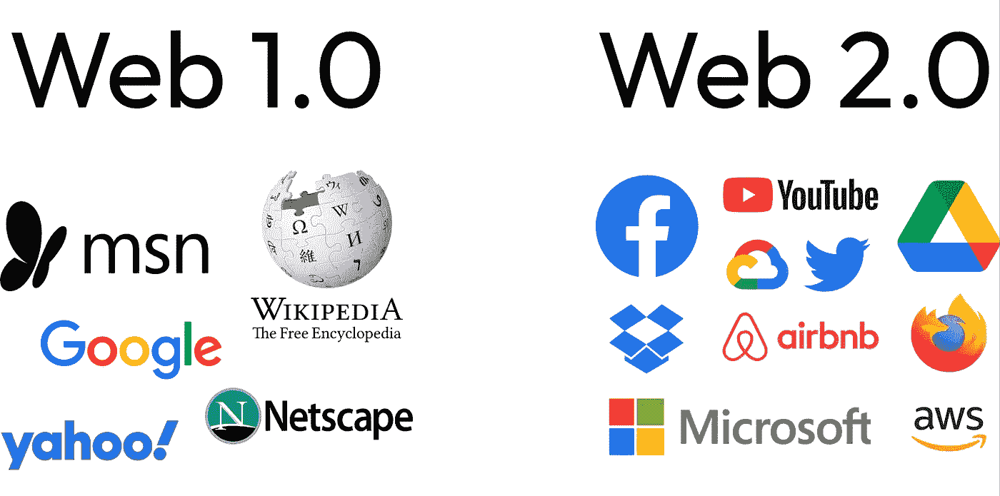
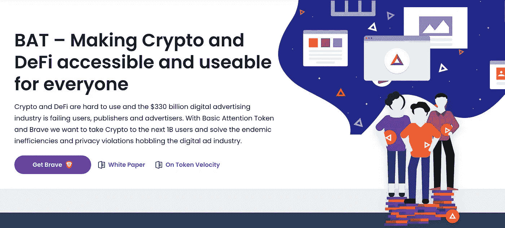

# 如果 Web 2.0 很棒，那么 Web 3.0 是什么？

> 原文：<https://medium.com/coinmonks/if-web-2-0-is-great-whats-web-3-0-22ad25cbbb39?source=collection_archive---------19----------------------->

你在 ***互联网***——一个你可以分享、创作、观看等的互联网。除了一个问题。

*哦，不好意思*。我几乎感觉互联网在看着我！我在*搜索*寻找“*全轮驱动*汽车”，我得到了一个关于它的**广告**。这是互联网迫使我们跟上的一个问题吗？为了看看我们能否解决这个问题，让我们*倒回时间*并回顾过去！

# 网络的世代

**Web 1.0:**Web 的第一代**和*只读*。我们创建的网站只有文本和图像，这意味着没有视频、音乐等。**

**Web 2.0:**Web 的**二代**和*当前状态*。我们可以*分享*、*创建*、*查看*、*与**媒体**进行多种方式的互动*。你几乎可以做任何你想做的事情。Web 2.0 的理念催生了诸如脸书、T42、推特、YouTube 和更多的公司。

Comparison of Web 1.0 and Web 2.0

# Web 2.0 的问题

## **广告**

在 Web 2.0 的初期，网站运行得非常好，用户遇到的问题数量少得惊人。由于没有广告，这些应用的**用户体验非常出色。**

**尽管公司的标准目标是盈利，但他们开始通过使用广告来赚钱。这些广告是根据你的**先验数据**推荐的，这些数据迫使**安全**和**隐私**问题上升。**

## ***安全+隐私***

**有了 Web 2.0，没有人能够*控制*他们的**数据**。一旦你在脸书、Instagram 或任何其他媒体平台上发布了一些东西，这些数据就会被**永远**存储在他们的**数据库***。他们将使用来自发布媒体的**数据**，例如*位置*或*标题*。最重要的是，Web 2.0 应用可能会遭遇**数据泄露**。这意味着你的*邮箱*、*密码*、*电话号码*、*姓名*、*地址*等。这些都可能被泄露，让用户处于危险之中。然而，有利的一面是，在人工智能的帮助下，公司有能力为你推荐内容。***

******

***Numerous advertisements at Times Square in New York***

# ***那么，什么是 Web 3.0，它解决了什么？***

## ***[分散式](https://dictionary.cambridge.org/dictionary/english/decentralized)服务器(*不受*公司控制)***

***如果开发者想要部署一个网站，他们可以将它部署到 [Google Cloud](https://cloud.google.com/) 或 [Amazon Web Services](https://aws.amazon.com/) 服务器上，然而，Web 3.0 应用程序运行在*区块链*、*分散服务器*和 **P2P** 节点上，或者它们的组合上。这些 app 被称为去中心化 app 或者[**dapp**](https://en.wikipedia.org/wiki/Decentralized_application)。例如 [**Uniswap**](https://uniswap.org/) ， [**煎饼互换**](https://pancakeswap.finance/) ，以及 [**OpenSea**](https://opensea.io/) (最大的 NFT 市场)。***

## ***代币/加密货币***

*****加密货币/代币**在 Web 3.0 中扮演*巨大*的角色。它们可以帮助那些想要*为**内容创作**社区做出*贡献的人，无论是*视频*、*艺术*、*文章*等等。如果人们喜欢**内容**，用户可以*捐赠* **代币**以示对的*支持(类似于社交媒体上的**喜欢**)。这些**代币**可以是*货币的任何*形式。令牌的一个很好的例子就是 [**基础关注令牌**](https://basicattentiontoken.org/) (蝙蝠)由 [**勇者浏览器**](https://brave.com/) 。任何时候你觉得像是一个 [Reddit](https://www.reddit.com/) 帖子、 [GitHub](https://github.com/) 拉请求，或者一个 [YouTube](https://www.youtube.com/) 视频例外，你都可以以 **BAT** 的形式给*内容创作者*一个**提示**。****

******

***Basic Attention Token (BAT)***

## ***[不可信](https://www.gemini.com/cryptopedia/trustless-meaning-blockchain-non-custodial-smart-contracts#section-trust-vs-trustless-in-crypto)内置支付***

***在这些**加密货币/代币**的帮助下，你还可以进行**支付**。**加密钱包**如 [MetaMask](https://metamask.io/) 让你在 Web 3.0 中集成*简单*、*匿名*、*安全*和*安全* **支付**和**交易** *国际*。这叫**分权财务**，也叫 **DeFi** 。拥有 [**不可信**](https://www.gemini.com/cryptopedia/trustless-meaning-blockchain-non-custodial-smart-contracts#section-trust-vs-trustless-in-crypto) *支付*和*交易*而没有像**银行**或*人*这样的*中间人*在我们今天的世界*看来是疯狂的。****

# ***Web 3.0 用在哪里？***

## ***文件共享:***

***借助 **P2P** *节点*，你不仅可以从**服务器**向**请求**一个*文件*，还可以直接从另一个人*那里请求*(类似于 [**BitTorrent**](https://www.bittorrent.com/) )。一个叫做 [**星际文件系统**](https://ipfs.io/) (IPFS)的**协议就是这么做的。然而，这能被用在哪里呢？假设你在**火星**上，你想*请求*一篇关于*核聚变的文章。由于数据从火星传到地球大约需要*最少 4 分钟*，从地球传回来大约需要 *4 分钟*，所以你总共需要 **8 分钟**才能*收到*这篇文章，这看起来是一段很长的时间！现在，你的朋友 Josh 讨厌共享一个设备，想要独立阅读。与乔希*从地球和地球回来请求*它并等待*最少* **8 分钟**，与[**【IPFS】**](https://ipfs.io/)不同，他可以*直接从你那里请求*它，因此得名**点对点** (P2P)。******

******

***Peer-to-peer File Sharing with IPFS***

## ***阅读有关 Web 3.0 的更多信息:***

***Aleem Rehmtulla 的一个很酷的项目利用了 https://pinyourtweet.vercel.app/的 IPFS***

***Web 3.0 的一个**动画解说**:[https://youtu.be/nHhAEkG1y2U](https://youtu.be/nHhAEkG1y2U)***

***[*星际文件系统*](https://ipfs.io/) 简单解释:[https://youtu.be/5Uj6uR3fp-U](https://youtu.be/5Uj6uR3fp-U)***

***Web 3.0 详解:[https://www.freecodecamp.org/news/what-is-web3/](https://www.freecodecamp.org/news/what-is-web3/)***

## ***关键要点:***

*   ***网络现状的问题包括数量众多的**广告**和*缺乏* 的**安全**和**隐私**。***
*   ***Web 3.0 通过使用**去中心化服务器**、**令牌/加密货币**、 [**无信任**](https://www.gemini.com/cryptopedia/trustless-meaning-blockchain-non-custodial-smart-contracts#section-trust-vs-trustless-in-crypto) **内置支付**来解决 Web 2.0 的问题。***
*   ***[**星际文件系统**](https://ipfs.io/) 与**点对点** *节点*允许在 Web 3.0 中快速*文件共享*。***

## *****我的链接:*****

*****Gmail:**ayaanzaveri08@gmail.com***

*****GitHub:**[https://github.com/AyaanZaveri](https://github.com/AyaanZaveri)***

*****领英:**https://www.linkedin.com/in/ayaan-zaveri-a0511b1a7/***

> ***加入 Coinmonks [电报频道](https://t.me/coincodecap)和 [Youtube 频道](https://www.youtube.com/c/coinmonks/videos)了解加密交易和投资***

# ***另外，阅读***

*   ***[3 商业评论](/coinmonks/3commas-review-an-excellent-crypto-trading-bot-2020-1313a58bec92) | [Pionex 评论](https://coincodecap.com/pionex-review-exchange-with-crypto-trading-bot) | [Coinrule 评论](/coinmonks/coinrule-review-2021-a-beginner-friendly-crypto-trading-bot-daf0504848ba)***
*   ***[莱杰 vs n rave](/coinmonks/ledger-vs-ngrave-zero-7e40f0c1d694)|[莱杰 nano s vs x](/coinmonks/ledger-nano-s-vs-x-battery-hardware-price-storage-59a6663fe3b0) | [币安评论](/coinmonks/binance-review-ee10d3bf3b6e)***
*   ***[Bybit 交易所评论](/coinmonks/bybit-exchange-review-dbd570019b71) | [Bityard 评论](https://coincodecap.com/bityard-reivew) | [Jet-Bot 评论](https://coincodecap.com/jet-bot-review)***
*   ***[3 commas vs crypto hopper](/coinmonks/3commas-vs-pionex-vs-cryptohopper-best-crypto-bot-6a98d2baa203)|[赚取加密利息](/coinmonks/earn-crypto-interest-b10b810fdda3)***
*   ***最好的比特币[硬件钱包](/coinmonks/hardware-wallets-dfa1211730c6) | [BitBox02 回顾](/coinmonks/bitbox02-review-your-swiss-bitcoin-hardware-wallet-c36c88fff29)***