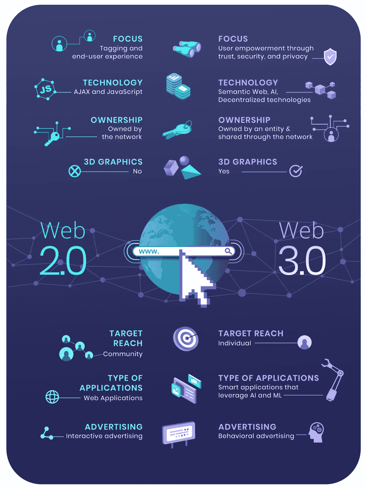
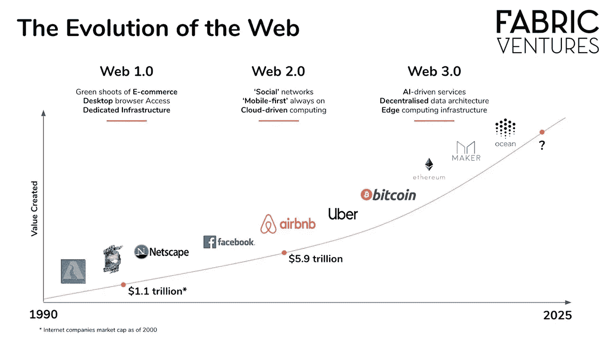
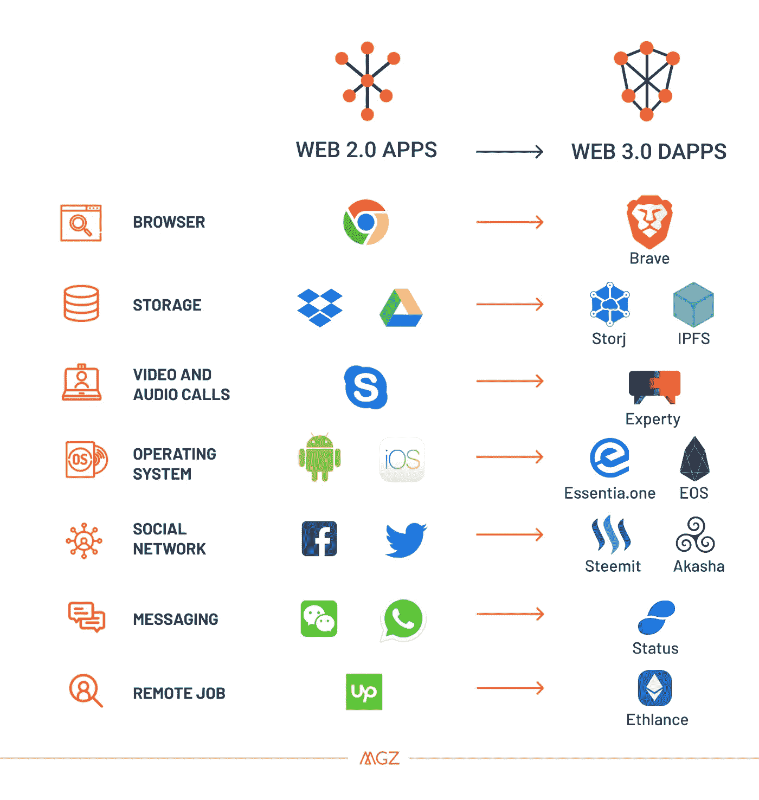

# 如果 Web2.0 + 1 = Web3.0，什么是“+ 1”？

> 原文：<https://medium.com/coinmonks/if-web2-0-1-web3-0-what-is-1-cc84d1dedf73?source=collection_archive---------11----------------------->

Image Credit: writtenbyjames.com

2021 年，贾斯汀·比伯在元宇宙——一个虚拟舞台——表演。同样在 2021 年，史努比·道格卖掉了元宇宙的土地。这些都是从“web 3.0”这个流行语开始的。这意味着什么，它与 web 2.0 有什么不同？

在我们开始之前，你相信先知吗？还是先知？还是未来柜员？

1900 年初，尼古拉·特斯拉谈到了一个一切都将是无线的世界。保罗·奥特莱特和瓦尼瓦尔·布什也谈到了书籍和其他媒体何时能以数字形式被储存和方便地获取。

# 互联网的简要起源

上面提到的人，以及许多科学家，足够聪明，能够预见未来，但他们没有足够的运气去预见未来。在 20 世纪 60 年代，当互联网的概念开始出现时，这些人已经踢了他们的个人水桶。

此时，政府研究人员需要一个系统来存储信息并与其他研究人员共享信息。计算机被用于这个目的，但是有一个重大的挫折。研究人员必须走到一台计算机的位置，才能访问该计算机上的信息。计算机之间的数据传输是不可能的。

数据传输的问题在冷战时期*(需要是发明之母，yunno)* 就解决了。如果苏联宣布发动核攻击，美国国防部需要传播信息。这导致了高级研究计划局网络(ARPANET)的建立，或者我们都知道的互联网。

# Web 1.0

阿帕网的创建是一个非凡的成就，但也有限制。只有政府和学术研究人员可以访问该网络。我们其余的人为我们在报纸上读到的东西欢呼。创建了一些网站，但互联网基本上是平淡无奇的。

# Web 2.0

这就是我们目前居住的洞穴。曾经平淡无奇的 web 1.0 焕发了青春，创造了新的活力。这是人们开始享受互联网的时候。互联网用户可以在世界的任何地方创建内容，与他人的内容进行交互，并创建社交联系。

我现在正在写这篇文章，一旦它上线，澳大利亚、巴拉圭、爱沙尼亚或世界任何其他地方的人都可以阅读它。读者也可以评论文章或联系我。这就是 web 2.0 的美妙之处。

社交网络、博客、在线论坛等都是在 web 2.0 上建立和扩展的。像亚马逊、谷歌、网飞、脸书等大公司已经从 web 2.0 中获得了巨大的利润。小公司也分享了一大块蛋糕。个人已经赚了钱，获得了工作，出售了服务，而这些只是 web 2.0 的一小部分好处

这一代互联网人诞生了电子商务、云存储和我们都爱的社交媒体。但是也有一些与 web 2.0 相关的问题。*(叹气，Ikr，问题没有 dey 完成)。*

集中控制是 web 2.0 的一个重要问题。这是什么意思？我可以对西方的种族主义感到愤怒，然后在我的脸书上贴上“F#@K 美国人”之类的东西。马克·扎克伯格的机器人现在会看到我的帖子，并将其标记为仇恨言论。接下来会发生什么？脸书删除了帖子，我收到了警告。现在，当我下一次发帖时，我必须小心，否则脸书会从我这里拿走我的账户。

另一个例子是 Twitter 暂停无辜者的账户，因为他们在短时间内获得了许多追随者。有很多集中控制的例子让 web 2.0 变得流行。

安全问题是另一个问题。如果你是一个狂热的互联网用户，你一定遇到过有人试图黑你的账户的情况。那是另一个 web2.0 wahala。

Image Credit: Fabric Ventures

# 什么是 Web3.0？

*如果此时你还没有听说 web3.0，也许你是从 2017 年开始读的。如果有，请购买比特币；它将达到超过 60，000 美元的历史最高水平。*

希望接下来的几句话，对那些看到过这个流行语，但还一无所知的人有所帮助。

Web 1.0 的建立是为了解决一个重要的沟通问题。Web 2.0 是为了解决 web 1.0 的问题而创建的。需要我说为什么开发 web 3.0 吗？

去中心化、开放性和用户效用是管理 web 3.0 的重要概念。没有人拥有对网络的绝对控制权。在创建我的内容之前，我不需要联系另一个人的社交网络。没人能把我的内容拿下来。零审查，零监视。终于自由了！

除了去中心化，web 3.0 不再需要第三方或政府授权，而是用区块链、P2P 网络或称为 dApps 的区块链和 P2P 网络的混合来代替。

人工智能和机器学习模仿人类行为是 web 3.0 的另一个特征。精确度近乎完美，使计算机能够更快地执行活动并产生更好的结果。

最后但同样重要的是连通性问题。Web 3.0 鼓励联系和无处不在。2021 年，一名互联网用户支付了 40 多万美元，在史努比·道格(Snoop Dogg)旁边购买了一处房产。一些在现实生活中不可能发生的事情。(*要是暴风女和我能做邻居就好了)。*

Image Credit: Essentia 1, medium.com

Web 3.0 仍在发展，从这个互联网的新领域中还有很多东西需要学习。web 3.0 的开放性暗示了集体努力对其发展至关重要。有几种方法可以为 web 3.0 做出贡献和创造一些东西。一个很好的例子是 [Nestcoin](https://nestcoin.com) 与 [Zuri 团队](https://zuri.team/)合作方块游戏。Blockgames 是一个为期 8 周的项目，旨在为创作者提供构建区块链项目的正确技能，以解决区块链的技术问题。

总结一下，你应该知道 web 3.0 的发展引起了人们的关注。权力下放剥夺了监管的权力，为犯罪、错误信息和其他不良行为提供了空间。没有法律，就没有规则。我们真的能生活在一个没有规则的世界吗？我把那个留给你来回答。