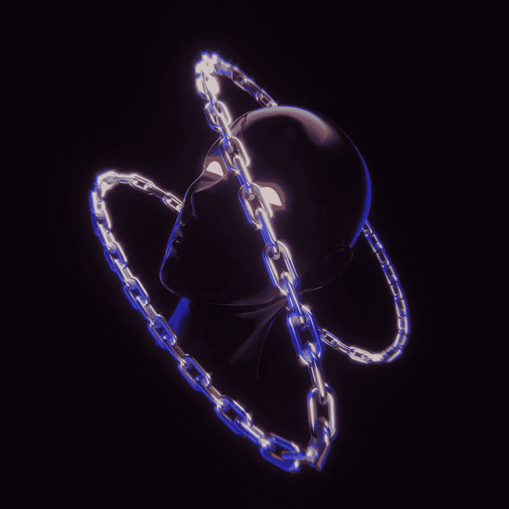

# 不持有就不拥有…什么？

> 原文：<https://medium.com/coinmonks/if-you-dont-hold-it-you-don-t-own-it-what-71ea3ad869c9?source=collection_archive---------61----------------------->

来源:[特里·đỗ](https://unsplash.com/@ductri317)

## 我的对冲哔哔声到底在哪里？

你还记得那些你可以用你换来的东西触摸金融菲亚特庞氏骗局的日子吗？你买的东西..或者我应该说，那些与物质联系更紧密的东西……还记得那个叫做有形的东西吗？这到底是怎么回事？哪里是…的领域