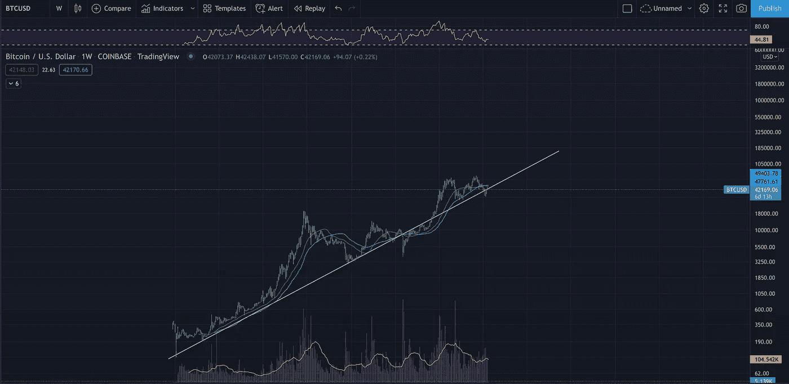
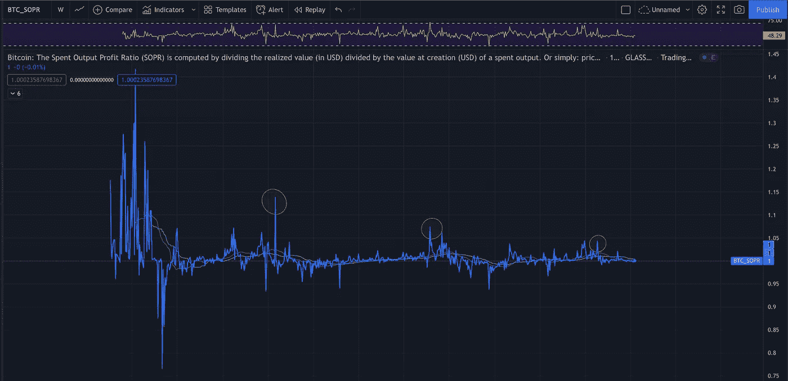
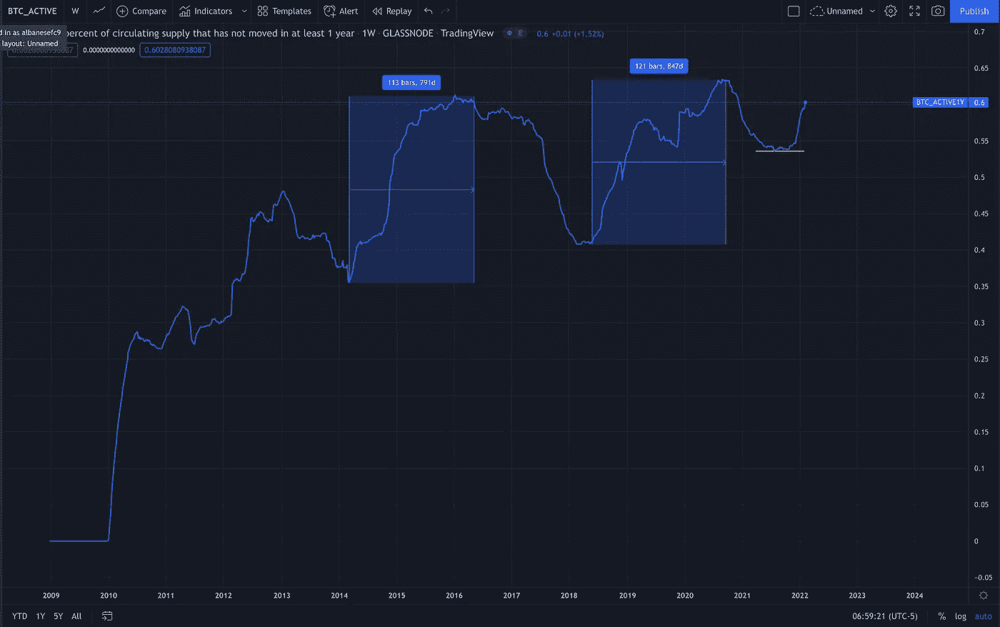
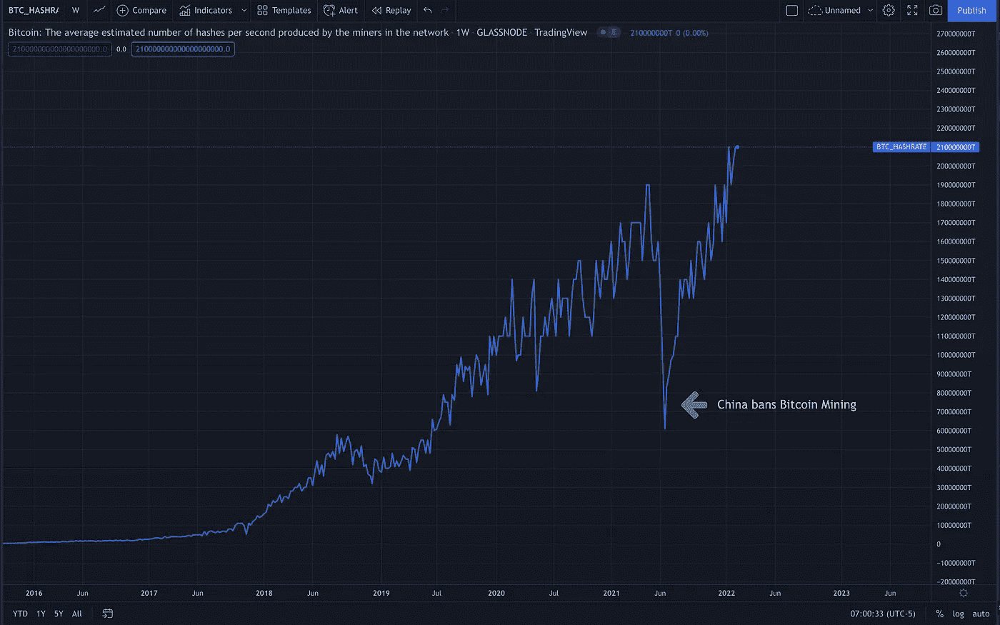
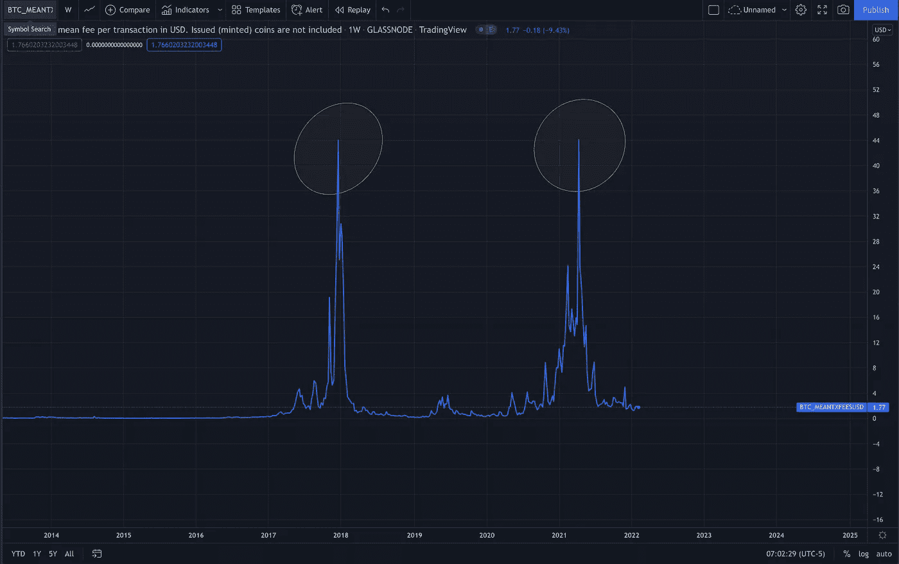

# 如果你的筹码饱和，你很可能是下一轮牛市的市场领导者

> 原文：<https://medium.com/coinmonks/if-your-stacking-sats-you-are-most-likely-a-market-leader-of-the-next-bullrun-5f0f0d3d41c5?source=collection_archive---------13----------------------->

## 创造和采用一种全新的宏观经济、全球货币资产是一件值得关注的事情。

自诞生以来，比特币经历了传统的四年周期，周期基于市场参与者、交易所和矿商之间的供求关系。这些动态导致价格剧烈波动，围绕着价格下降的周期性波动。

随着时间的推移，期货和期权合约等市场衍生品的出现，以及机构的参与，改变了这些动态。

问题是，大多数传统的比特币制造者和密码倡导者都陷入了固有的偏见，认为这些周期会一字不差地重复。虽然我认为这些周期仍然是市场的中枢神经系统，但动态已经发生了变化，更多的采用赋予了它新的面貌。

我的基本观点是市场已经见顶..接近触底。我们已经经历了一个温和的繁荣-萧条周期，尽管没有看到传统的多年时间范围和-85%的修正。经济低迷已经减弱，波动性总体上正在缩小。我相信，我们正在进入一个缓慢的 DCA 积累将获得巨大回报的时代，因为我们在下一次宏观牛市之前先发制人地进行建设和整合。

Bitcoin -From Rags to Riches

比特币处于一条非常基本的对数趋势线的低端。也就是说，随着时间的推移，我们正处于比特币抛物线上涨的贴现区域。这些区域是恐惧的高峰期，此时买盘较弱，卖家信心十足。在那里霍尔德的信念最受考验。纵观历史，他们总是在买入机会和熊市底部。

Spent Output Ratio

比特币繁荣萧条周期的心跳，支出产出比。简而言之，这是硬币亏本出售或从买入价格中获利的比率。市场顶部通常标有大的尖峰，表明获利回吐的高峰。随着时间的推移，峰值似乎越来越小，反映了整体市场波动性的收缩。正如你在这里看到的，我们处于中性区域，离建议的顶部还很远。

Circulating Supply that has Not Moved in One Year

上图向我们展示了至少一年内没有离开钱包的流通供应量。我们可以看到，这个图表的底部通常反映了熊市周期，而它们逐渐形成牛市。很明显，我们正处于一个已经触底的阶段，下一轮牛市正在形成。

Hash Rate

对于关注新闻标题和地缘政治风险，而不仅仅是价格行为和连锁数据的更为基础的读者来说，这是一个显示网络整体健康状况的伟大图表。虽然中国 FUD(恐惧、不确定性、怀疑)多年来已成为比特币市场的附属品，但这是我用来展示该网络稳健性的图表。

当中国最近禁止比特币挖矿时，由于矿工被离线，我们遭受了网络散列率的巨大打击。这在当时似乎是毁灭性的，但 6 个月后，散列率已经恢复，现在处于历史最高水平。这显示了比特币在设计时对外力做出反应的自我修复能力，也显示了网络有多么强大和有弹性。

Mean Fee per Transaction

观察交易费用是衡量连锁活动的一个好方法。这里的供求关系非常简单，越多的交易竞相被添加到 block 中，他们就越不得不抬高交易费用，以提高交易速度。较高的费用跳过内存池中的线，因为矿商将较高的费用作为他们奖励的一部分。

2020 年之前的最后两次市场顶部都是以交易费用的大幅上涨为标志的。我们还没有看到这个链。值得注意的是，我们可能再也看不到这种情况了，因为衍生产品市场和第二层(如闪电网络)的增长允许许多交易和交易发生在链外。

随着市场动态的转变和更多主流应用的出现，我们似乎进入了一个新的领域。我们可能需要用更新、更聚焦的镜头来审视市场，把所有其他因素都考虑进去。也许随着时间的推移，周期会变得更短，波动性更小，对宏观经济环境更加敏感。我们仍然可以使用非常基本的原则来衡量情绪和比特币网络的整体增长。世界上有史以来最坚硬的货币资产。我相信，无论是谁，现在正在缓慢而保守地购买，都是在折价收集他们的硬币，并将在正在建立的牛市中成为下一个市场领导者。

*本帖绝非理财建议。这只是为了娱乐的目的，你应该在任何类型的投资之前做好自己的研究。*

> 加入 Coinmonks [电报频道](https://t.me/coincodecap)和 [Youtube 频道](https://www.youtube.com/c/coinmonks/videos)了解加密交易和投资

## 另外，阅读

*   [3 商业评论](/coinmonks/3commas-review-an-excellent-crypto-trading-bot-2020-1313a58bec92) | [Pionex 评论](https://coincodecap.com/pionex-review-exchange-with-crypto-trading-bot) | [Coinrule 评论](/coinmonks/coinrule-review-2021-a-beginner-friendly-crypto-trading-bot-daf0504848ba)
*   [莱杰 vs Ngrave](/coinmonks/ledger-vs-ngrave-zero-7e40f0c1d694) | [莱杰 nano s vs x](/coinmonks/ledger-nano-s-vs-x-battery-hardware-price-storage-59a6663fe3b0) | [币安评论](/coinmonks/binance-review-ee10d3bf3b6e)
*   [Bybit Exchange 评论](/coinmonks/bybit-exchange-review-dbd570019b71) | [Bityard 评论](https://coincodecap.com/bityard-reivew) | [Jet-Bot 评论](https://coincodecap.com/jet-bot-review)
*   [3 commas vs crypto hopper](/coinmonks/3commas-vs-pionex-vs-cryptohopper-best-crypto-bot-6a98d2baa203)|[赚取加密利息](/coinmonks/earn-crypto-interest-b10b810fdda3)
*   [iTop VPN 审查](https://coincodecap.com/itop-vpn-review) | [曼陀罗交易所审查](https://coincodecap.com/mandala-exchange-review)
*   [40 个最佳电报频道](https://coincodecap.com/best-telegram-channels) | [喜美元评论](https://coincodecap.com/hi-dollar-review)
*   [折叠 App 审核](https://coincodecap.com/fold-app-review) | [StealthEX 审核](/coinmonks/stealthex-review-396c67309988) | [Stormgain 审核](https://coincodecap.com/stormgain-review)
*   [购买 PancakeSwap(蛋糕)](https://coincodecap.com/buy-pancakeswap) | [俱吠罗评论](/coinmonks/coinswitch-kuber-review-1a8dc5c7a739)