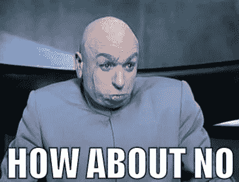
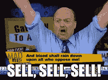

# Reddit 的问题和一些智慧

> 原文：<https://medium.com/coinmonks/ignorance-redefined-by-reddit-and-some-wisdom-1c84b21070e1?source=collection_archive---------43----------------------->

请不要这样做。这就是 Reddit 就是 Reddit。

他们是这样说的:

> 每个人现在能做的如下:
> 
> 购买至少 10 美元或 20 美元的 CEL
> 
> 如果你觉得 1。太冒险了(这不是 imo)，至少在 app 里切换到‘在 CEL 里赚所有奖励’。
> 
> 完成后，请评论并投票支持这篇文章。

对此，我的回答非常明确，这就是智慧发挥作用的地方:

There’s wasting money and being ignorant. Reddit is achieving both.

用一句话来说，打击卖空者就像发生在 Gamestop 身上的事情。它不起作用。不管人们相信市场被操纵(这是真的，[所有市场都被操纵](https://awealthofcommonsense.com/2020/02/market-have-always-been-rigged-broken-manipulated/))，它忽略了它们不仅仅是被 ***金钱*** 操纵。它们可以被一百万种方式操纵，就像从 1900 年的书中引用的那样，会像现在一样公然谈论它。市场中的每一笔订单都是对它的一点操纵，但也只能做到这一点。

这是因为:不管市场上发生了多少买入，总会有人**卖出**。不仅如此，即使你要买 20 亿美元的摄氏度，第一个卖出的人也会是*摄氏度。我可以保证这一点，因为他们能够立即还清贷款。市场中还有一种叫做均衡和/或惯性的东西，市场倾向于回归均值(*均值回归*)。这意味着每个人都同意一个相对价格，所以如果事情超出这个价格，人们就会采取行动。*

智慧之二:有时人们认为如果你只是烧钱，或者投入市场的钱少了，价格就会上涨。例子是经常发生的买和烧。短期来看，买了就烧是在砸钱支撑价格。从长期来看，它摧毁了一个市场，因为市场不能像以前那样处理大量的交易。这就是为什么你会听到成功的公司进行股票分割(即:你的 3 股苹果股票现在是 6 股或其他什么)，而不是反向分割(你的 3 股苹果股票现在是 1 股)。

这里有一个例子:购买 100 美元的苹果公司的股票会使价格上涨 1 美元。现在，我们已经通过回购和焚烧处理掉了一半的数量。现在，购买 100 美元的苹果产品会使价格上涨 2 或 3 美元。突然间，苹果变得不那么好买了，因为现在你买 100 美元的苹果有更大的风险。你现在必须在两天内购买 50 美元的苹果股票，假设到那时你甚至可以获得 100 美元的价格。此外，以前卖 100 美元的苹果会得到 99 美元，但现在会得到 95 美元，因为买卖的东西少了。

那么会发生什么呢？人们停止购买，人们停止出售。它变成了一个被称为 3，3 的东西，来自某些密码克隆体，比如 Ohm。这听起来不错，直到…进入现实:

someone is going to do it.

所以一旦有人卖 100 美元的苹果，现在你只能卖 100 美元的苹果才能得到 94 或 93 美元。在他们卖苹果之前，你仍然可以卖 100 美元的苹果到 98 美元。

因此，用价格来支撑一个*市场*本身，**不起作用**。即使你有比理智更多的钱，足够在某个地方强行定价，也不能保证价格会一直保持下去。它也不能保证任何人都会参与进来。