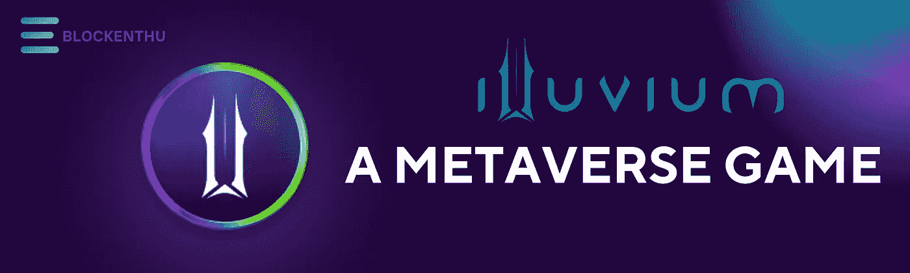
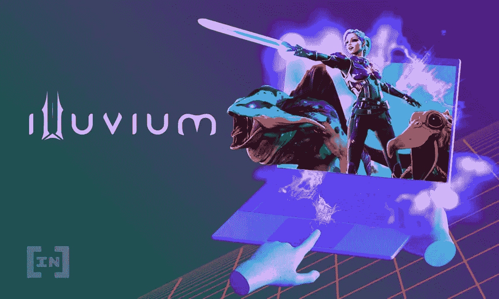
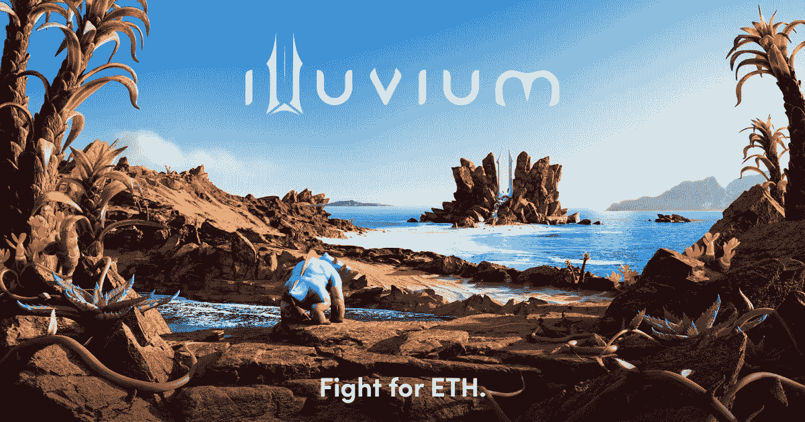

# ILLUVIUM(一款元宇宙游戏)

> 原文：<https://medium.com/coinmonks/illuvium-a-metaverse-game-4d069cf0f995?source=collection_archive---------16----------------------->

# 什么是冲积层？

一款开放世界的 RPG 冒险游戏

这是一款 3D 角色扮演游戏，由 lifetime gamers 首席执行官基兰·沃里克、游戏设计师亚伦·沃里克和艺术总监格兰特·沃里克创建，由一个名为 Illuvium DAO 的分散自治组织(DAO)在区块链以太坊推出沉浸式 AAA 游戏元宇宙。

# Illuvium 是什么时候创建的？

Illuvium 成立于 2020 年 9 月，正在开发一款完全去中心化的游戏，可以作为开放世界 RPG 和自动战斗机的最佳组合。在伊鲁威姆内部，玩家会遇到被称为伊鲁威姆的生物，这些生物可以被击败和捕获。

伊鲁维姆拥有象征 ILV 和西尔弗和其他象征生物，功能性物品和化妆品升级。它有各种各样的广阔的景观来猎捕生物。通过完成任务、挑战和战斗，ILV 代币将获得奖励。

# 怎么玩 Illuvium？

Illuvium game 是一款创建账号后下载的桌面应用。玩家可以根据自己的喜好定制外观。这个开放世界真实引擎游戏是在虚幻引擎 4 上开发的。

这个项目的主要目的是收集和定制 NFT 的洪水。每个 illuvial 是与类和亲缘关系。同样的联盟和职业为战斗提供奖励。个人用改进力量创造他们的新。收集到的沉积物中含有 at 碎片。在受到伤害的情况下，它会在碎片中恢复生命值。你可以支付修复费。

# 沉积层

在伊鲁威姆有五种不同的等级

*   **战斗机**
*   **流氓**
*   **移情**
*   **Psion**
*   **守护者**

# 冲积物亲和力

有五种不同的亲缘关系

**空气**

**性质**

**水**

**火灾**

**接地**

为了让战场上的敌人变得更强，我们可以将相同的亲和力结合两次。例如，空气和水可以结合起来形成霜层，而两种火可以叠加起来形成地狱层。

# 免费版与付费版

将会有免费游戏模式和订阅模式，订阅模式的不同可以让你从更高层次的区域收集 NFT。

# 通过(IMX)整合降低天然气费用

由于与**不可变 X** 的集成，享受 NFTs 的新时代。即时交易的点对点交易零汽油费，同时您可以安全地保管您的资产。

> 当前估价
> 
> ILLUVIUM 目前的市场资本为 437，099，972 美元。单个 ILV 代币的价格目前为 680 美元，最近曾高达 1900 美元。
> 
> 总共只有 1000 万枚代币，这比比特币更可怕。目前循环供应量约为 643k。

# 想买些沉积物吗？

# 兴奋

印度最值得信赖的加密交易所

 [## CoinDCX -加密交易所|购买、出售和交易比特币和顶级替代币

### CoinDCX 是印度最大、最安全的加密货币交易所，在这里你可以买卖比特币和其他…

coindcx.com](https://coindcx.com/) 

# 现在加入我们吧！！

 [## ⚡BLOCKENTHU⚡

### WhatsApp 群邀请

chat.whatsapp.com](https://chat.whatsapp.com/FTKme4XzkOU73ZDv99Oatj) 

[https://www.instagram.com/blockenthu](https://www.instagram.com/blockenthu/)

https://www.linkedin.com/company/blockenthu

 [## ⚡·布洛克登胡·⚡

### 可以马上查看并加入@blockenthu。

t.me](https://t.me/blockenthu)