# 冲积层土地合作社

> 原文：<https://medium.com/coinmonks/illuvium-land-cooperative-bcc044f9d20d?source=collection_archive---------2----------------------->

我们 FractionalHub 成员的第一个新社区 Fractionalised Syndicate。

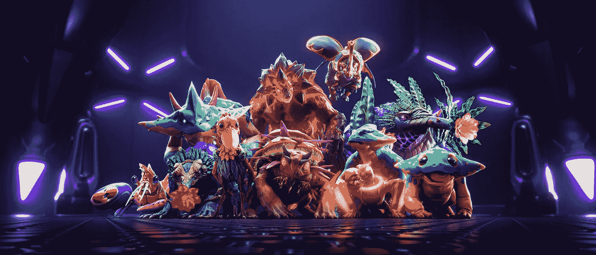

[Illuvium.io](https://www.illuvium.io/land)

# 冲积层土地拍卖即将开始，日期定在 6 月 2 日。

Illuvium 正在开发一系列互连的 Play 2 Earn 游戏，这些游戏都将围绕着 ILV 令牌、illu vium NFT 和可以通过拥有土地资产获得的资源。更高层次的土地将增加资源生产能力。

## 在你的土地上你可以找到 6 种资源，它们分为两类-燃料和元素。

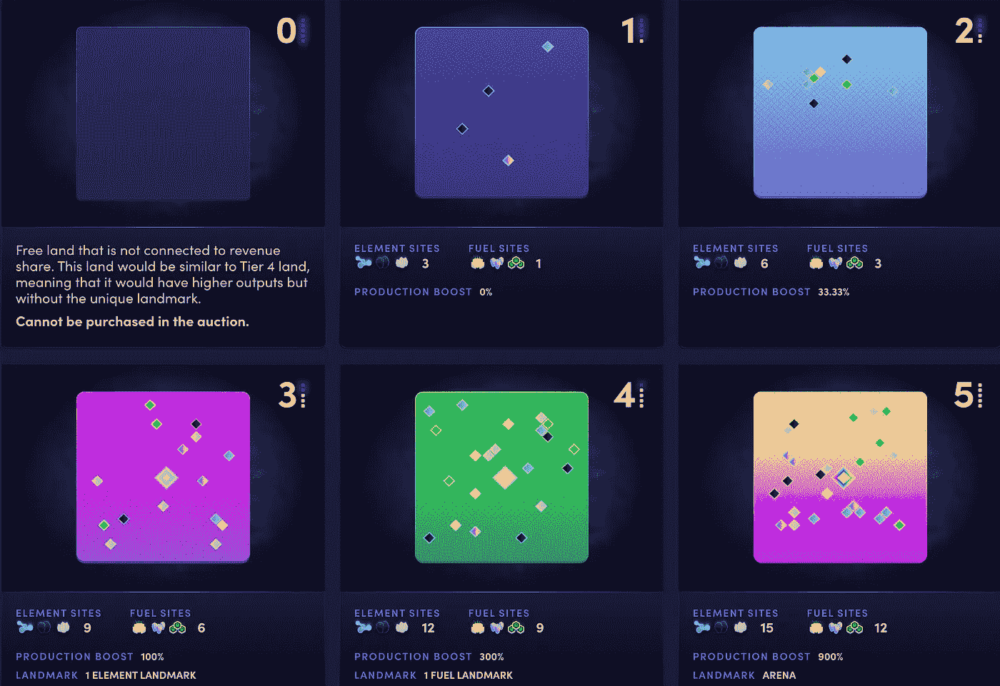

[Illuvium.io](https://www.illuvium.io/land)

*   元素资源由氢、碳和硅组成。
*   燃料资源由梭伦、亥伯龙和密码组成

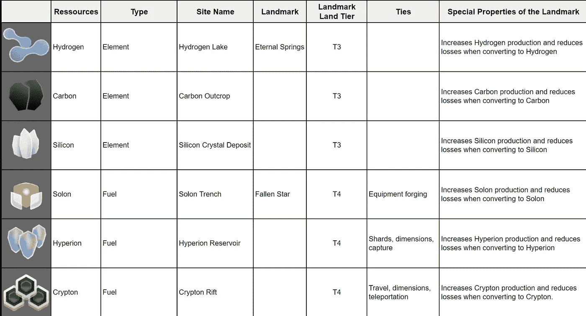

## 不同的资源在游戏中有不同的用途。

更重要的是，3 级和 4 级土地都有一个地标，属于你的土地等级的地标会为那种特殊的资源类型提供生产奖励。

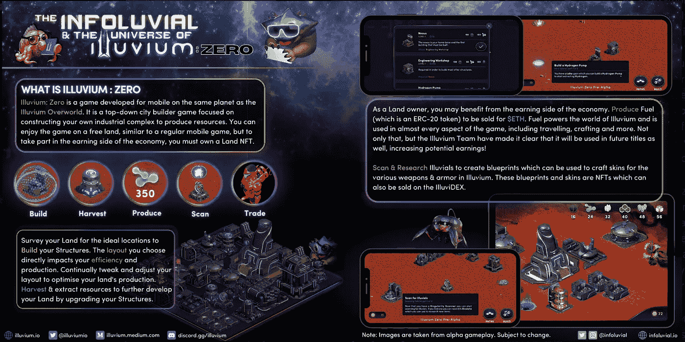

## 并非所有的土地生来平等。

你在这块土地上的资源点组合将会随机分布，所以如果你得到一个三级土地，你可以得到 9 个氢湖点，或者你可以得到一个混合点。这可以创造一种环境，在这种环境中，一些具有特定资源组合的土地在不同时期可能变得更受欢迎。

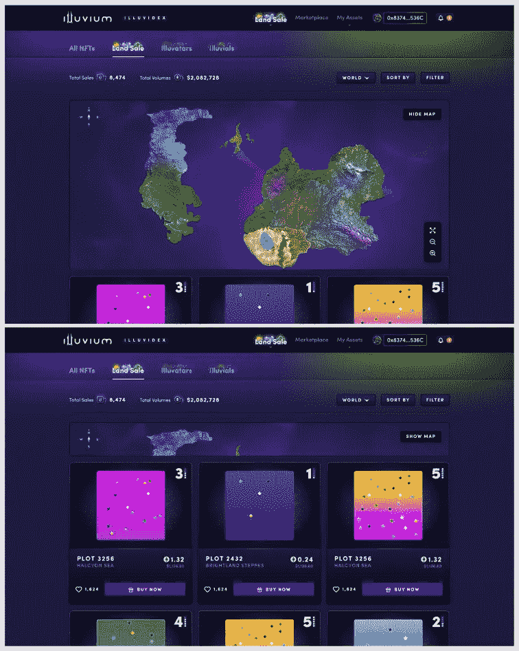

## 在平衡池内或者在伊鲁威姆德克斯上交易资源对于玩家沿着科技树向下迁移是非常重要的。

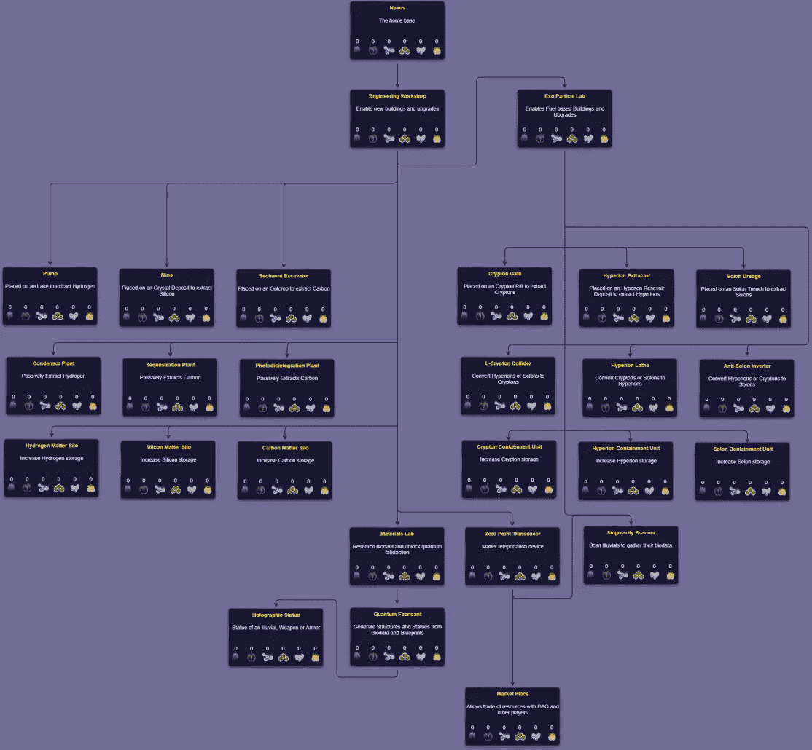

没有任何特定资源生产类型的土地所有者将被要求用他们拥有的一些资源交换他们需要的资源。

# 那么作为一个合作社，FractionalHubs 计划在我们的社区中利用什么呢？

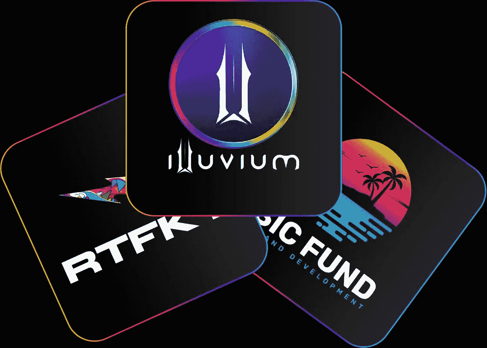

# 很快我们将向我们的 FractionalHub 成员开放加薪。

## 我们的目标是在荷兰拍卖中获得 3 级或 4 级土地。

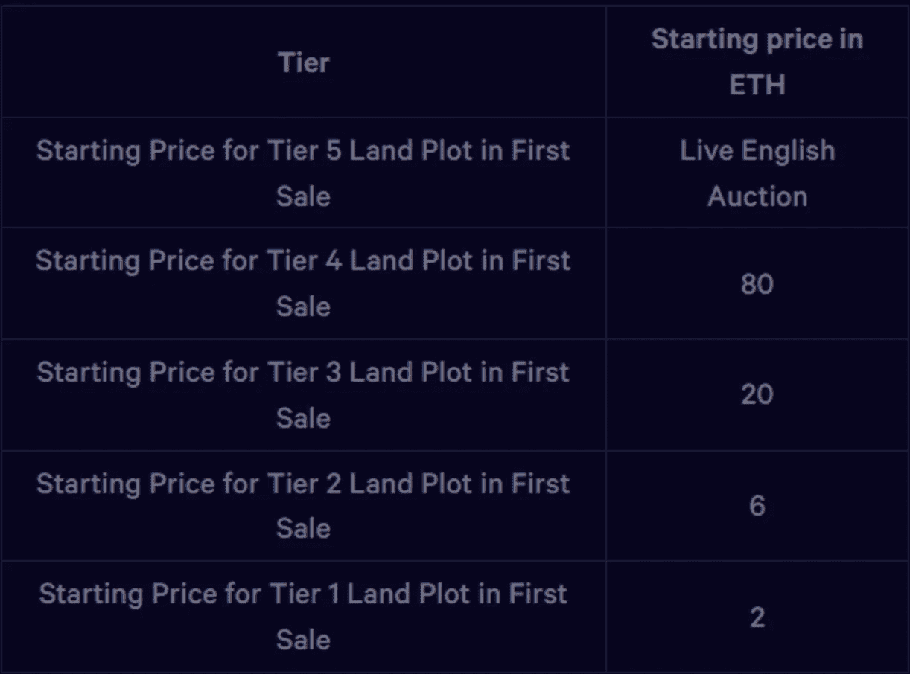

三级土地从 20ETH 开始，每分钟下降 2.5%，30 分钟后价格将是每块地的 10ETH。我们的希望是，如果拍卖价格降得足够低，并且我们筹集到足够多的资金，我们可以获得至少两块三级土地，或者可能是一块四级土地...

# 每合作分配的买入费将设定为 0.55ETH。

## -每次分配的 0.5ETH 将用于购买出售的土地

## - 0.05ETH 将用于管理钱包，以支付任何天然气战争中的天然气费用以及合同部署/令牌分发费用。

# 好吧，这一切都有道理，那么我们如何处理拥有土地的收益呢？

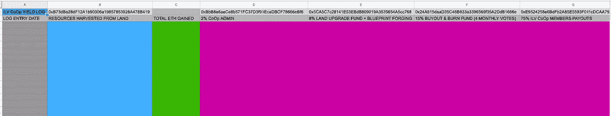

[ILV CoOp YIELD LOG](https://docs.google.com/spreadsheets/d/1n0CxGwKd-yasMpZk3V6xIeVW_t0HxvHSGvqDAdp_uwg/edit?usp=sharing)

## 以上是 Illuvium 土地合作社产量日志的公共链接

产出日志每周都会更新，以显示 ETH 要求和清算的资源数量。

## 该产量将分配如下。

*   2%的收益流入管理人员的钱包，用于支付管理费用。
    -0x BBB 8 a6 aece 8 b 571 fc 37 d3f 91 ecadbcf 78666 ebf 6
*   8%的收益流入土地升级基金——这些基金将用于升级我们的土地，扫描伊鲁维尔火山并伪造蓝图。
    土地更新资金将根据社区的共识进行部署。
    -0 X5 ca 5c 7c 28141 e 53 ebdb 809019 a 3535654 a5cc 768
*   15%的收益进入买断和烧毁国库钱包-这些资金将用于买断和烧毁任何在我们的 4 个月投票中选择退出合作的人。
    -0x24a 515 daad 35 c 46 b 833 a 3396569 f 35 a2 DDB 1666 e
*   每周有 75%的产量流向 Illuvium 土地合作社持有人。
    -0xe 9524258 E6 bdfb 2 a 85 e 5593 f 011 CDC aa 79 FB 1 cc 5

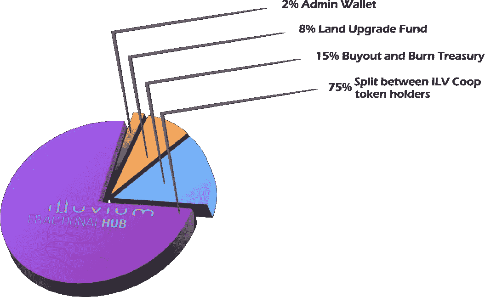

# 为什么我们需要土地升级基金？

升级可能有助于提高我们的生产能力，更重要的是，扫描土地和伪造蓝图将是昂贵的。

拥有蓝图将只允许你伪造那些物品/皮肤。
如果我们找到只有我们自己的稀有蓝图，我们就拥有了市场垄断权，可以用它做一些很酷的事情。
然而，资本将需要每天在我们的土地上搜寻蓝图。

# 为什么我们需要收购和烧毁国库？

## 提供退出流动性很重要！

由于很可能我们将只拥有 1 块高价值的基础土地资产，出售它以买断较早离开者的股份将会减少其他人的机会。

因此，我们应把 15%的收益存起来，存放在国库里。

买断和烧钱基金只能在 4 个月的选择退出投票期内使用，并且只能在找不到这些股票的买家时作为最后手段使用。

买断和烧钱钱包应保持足够高的余额，以在任何 4 个月的投票期间买断至少 20%的成员。

如果国库增长到基础土地价值的 30%以上，额外的资本可以提取并用于土地开发基金。

# 版税和分配

## Illuvium CoOp 股份的二级销售版税将与 FractionalHub 的其他 CoOp 一致，为 7.5%。

这笔收入的 80%将与 Illuvium 合作社成员分享。

- 20%将进入 FractionalHub 钱包，用于基础设施扩建、运营开支和社区活动。

# 关于 FractionalHub 成员如何参与首次公开募股的更多细节将在未来几天内公布。

另外，如果你想加入伊留威姆土地合作社，但没有 150 个 FractionalHub 成员资格的 NFT，你可以在这里购买一个

【https://opensea.io/FractionalHubMembership 

[Fractionalhub.io](http://fractionalhub.io)

## -坚守合作伙伴！

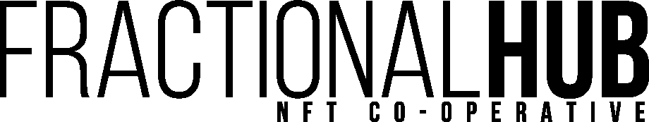

> 加入 Coinmonks [电报频道](https://t.me/coincodecap)和 [Youtube 频道](https://www.youtube.com/c/coinmonks/videos)了解加密交易和投资

# 另外，阅读

*   [如何匿名购买比特币](https://coincodecap.com/buy-bitcoin-anonymously) | [比特币现金钱包](https://coincodecap.com/bitcoin-cash-wallets)
*   [币安 vs FTX](https://coincodecap.com/binance-vs-ftx) | [最佳(SOL)索拉纳钱包](https://coincodecap.com/solana-wallets)
*   [比诺莫评论](https://coincodecap.com/binomo-review) | [斯多葛派 vs 3Commas vs TradeSanta](https://coincodecap.com/stoic-vs-3commas-vs-tradesanta)
*   [Capital.com 评论](https://coincodecap.com/capital-com-review) | [香港的加密借贷平台](https://coincodecap.com/crypto-lending-hong-kong)
*   [如何在 Uniswap 上交换加密？](https://coincodecap.com/swap-crypto-on-uniswap) | [A-Ads 审查](https://coincodecap.com/a-ads-review)
*   [WazirX vs coin dcx vs bit bns](/coinmonks/wazirx-vs-coindcx-vs-bitbns-149f4f19a2f1)|[block fi vs coin loan vs Nexo](/coinmonks/blockfi-vs-coinloan-vs-nexo-cb624635230d)