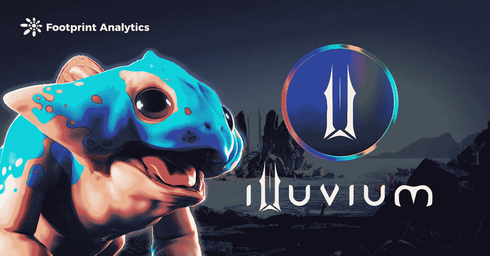

# 尽管遭到攻击，但仍备受期待

> 原文：<https://medium.com/coinmonks/illuvium-still-highly-anticipated-despite-attack-c49a1b4900db?source=collection_archive---------20----------------------->

Illuvium 是一款基于以太坊的分散式 NFT 收集和 RPG 战斗游戏。

2022 年 2 月

数据来源:足迹分析— [冲积层仪表盘](https://www.footprint.network/guest/dashboard/illuvium-dashboard-fp-37e058d8-6b97-4be0-a3e9-d2e697792f26?channel=u-QytebM#secret=84BA3EAE3D093030A4B7CFE6041A9879)

12 月 31 日， [Illuvium 的](https://www.footprint.network/guest/dashboard/illuvium-dashboard-fp-37e058d8-6b97-4be0-a3e9-d2e697792f26?channel=u-QytebM#secret=84BA3EAE3D093030A4B7CFE6041A9879)官方 Discord 频道遭到网络钓鱼，攻击者将用户导向一个声称是 illu vium NFT 平台的网站，造成约 15 万美元的损失。

一周后，Illuvium 团队在 Illuvium 的赌注合同中发现了一个漏洞，该漏洞允许攻击者制造无限量的$sILV。

在这些攻击之后，Illuvium 的交易量显著下降，从交易量排名的第 7 位下降到第 32 位。

Illuvium 的流动性挖掘和锁定抵押品功能使其成为最热门的游戏项目之一(甚至还没有任何游戏性)，它能够恢复交易量吗？

此外，在该项目准备推出游戏测试版之际，这些攻击会影响人们对该项目的看法吗？

# 甚至还没有一个游戏。为什么 Illuvium 这么受欢迎？

## 高调团队

Illuvium 是一款基于以太坊的分散式 NFT 收集和 RPG 战斗游戏。游戏设定在一个可以探索的神秘外星世界，玩家可以捕捉被称为 Illuvials 的生物。

Illuvium 的创始团队包括 Synthetix 创始人凯恩·沃里克的兄弟基兰和亚伦·沃里克。他们在加密货币项目方面拥有超过 7 年的经验，并进行了广泛的研究，以使这款游戏获得成功。

*Screenshot Source — illuvium 3D Animations*

## 创新游戏

Illuvium 包含了许多备受期待的元素，这些元素还没有在游戏赚取空间中成功执行。例如:

*   冒险:玩家可以探索神秘的外星世界，建立团队，并捕捉 Illuvials。
*   战斗竞技场:Illuvials 或玩家可以在自动战斗中互相战斗以提升技能，玩家也可以互相战斗，配置武器和盔甲以增加胜算。其他玩家可以在比赛中下注。

## 奖励具有升值潜力的代币

游戏中有两种类型的代币:ILV 和西尔弗。

ILV 是伊鲁维的本土标志。西尔弗是一种合成的 ILV 代币，被用作游戏中捕捉夜光怪的货币。sILV 不能用于玩家之间的交易，例如买卖 Illuvials。

根据 Footprint Analytics 的数据，自 2021 年 8 月开放流动性挖掘和其他功能以来，ILV 的硬币价格一直在攀升，11 月 30 日达到 1853 美元的峰值。

然而，Illuvium 公开测试版的延迟推出导致 ILV 价格暴跌，攻击者利用一个漏洞窃取资金，导致 ILV 价格跌至 568 美元，交易量同样惨淡。

*Footprint Analytics — Token ILV Price vs Trading Volume*

# Illuvium 面临的一些挑战

根据 Footprint Analytics 的数据，截至 12 月 31 日，Illuvium 以 143 万美元的交易额位列 GameFi 前七名，仅次于元宇宙矿业公司 T1。

*Footprint Analytics — Top 8 GameFi & Affiliation Chains(Dec 31,2021)*

*Footprint Analytics — Daily Volume by Illuvium*

Illuvium 的团队通过及时揭示和修补漏洞来应对攻击。sILV casting 已被 Illuvium 的团队暂停，以补偿损失金钱的用户。此外，还采取了各种措施为协议提供安全性。其中包括:

*   全面审查 Discord 服务器，识别不活跃用户和不良行为者，以防止他们发送欺诈性消息。
*   正在删除除超级管理员之外的所有用户的 webhooks 权限。
*   增强应用程序的安全性，关注错误修复和漏洞，改进工作流程和其他功能。
*   抛弃西尔维。该团队将铸造一个新的西尔弗令牌(暂定名为“西尔弗 V2”)，以取代原来的西尔弗 V1 令牌，这将在标桩 V2 合同中实施。

# 摘要

尽管 Illuvium 尚未上线，但其知名的团队、创新的游戏玩法、吸引人的 tokenomics 模型不仅吸引了玩家的关注，也吸引了攻击者的关注。

幸运的是，Illuvium 的团队迅速行动，重新赢得了信任并解决了问题。这些攻击凸显了为用户提供安全而不仅仅是性能的重要性，随着 P2E 游戏成为主流，这一点将变得越来越重要。

**什么是足迹分析**

足迹分析是一个一体化的分析平台，用于可视化区块链数据和发现见解。它清理和整合链上数据，因此任何经验水平的用户都可以快速开始研究令牌，项目和协议。凭借一千多个仪表板模板和一个拖放界面，任何人都可以在几分钟内构建自己的定制图表。发掘区块链数据，利用足迹进行更明智的投资。

*足迹网址:*[*https://www . Footprint . network*](https://www.footprint.network/)

*不和:*[*https://discord.gg/3HYaR6USM7*](https://discord.gg/3HYaR6USM7)

*推特:*[*https://twitter.com/Footprint_DeFi*](https://twitter.com/Footprint_DeFi)

*电报:*[https://t.me/joinchat/4-ocuURAr2thODFh](https://t.me/joinchat/4-ocuURAr2thODFh)

*Youtube:*[*https://www.youtube.com/channel/UCKwZbKyuhWveetGhZcNtSTg*](https://www.youtube.com/channel/UCKwZbKyuhWveetGhZcNtSTg)

> 加入 Coinmonks [电报频道](https://t.me/coincodecap)和 [Youtube 频道](https://www.youtube.com/c/coinmonks/videos)了解加密交易和投资

# 另外，阅读

*   [Capital.com 评论](https://coincodecap.com/capital-com-review) | [香港的加密借贷平台](https://coincodecap.com/crypto-lending-hong-kong)
*   如何在 Uniswap 上交换加密？ | [A-Ads 评论](https://coincodecap.com/a-ads-review)
*   [WazirX vs CoinDCX vs bit bns](/coinmonks/wazirx-vs-coindcx-vs-bitbns-149f4f19a2f1)|[block fi vs coin loan vs Nexo](/coinmonks/blockfi-vs-coinloan-vs-nexo-cb624635230d)
*   [本地比特币评论](/coinmonks/localbitcoins-review-6cc001c6ed56) | [加密货币储蓄账户](https://coincodecap.com/cryptocurrency-savings-accounts)
*   [什么是融资融券交易](https://coincodecap.com/margin-trading) | [成本平均法](https://coincodecap.com/dca)
*   [支持卡审核](https://coincodecap.com/uphold-card-review) | [信任钱包 vs 元掩码](https://coincodecap.com/trust-wallet-vs-metamask)
*   [Exness 评论](https://coincodecap.com/exness-review)|[moon xbt Vs bit get Vs Bingbon](https://coincodecap.com/bingbon-vs-bitget-vs-moonxbt)
*   [如何开始用加密贷款赚取被动收入](https://coincodecap.com/passive-income-crypto-lending)