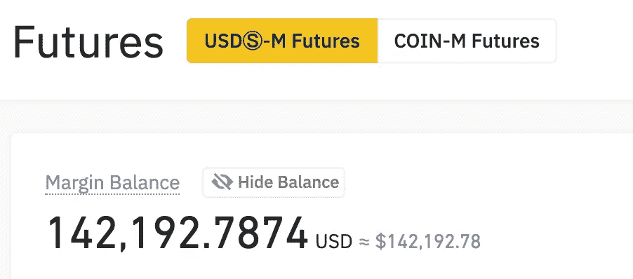
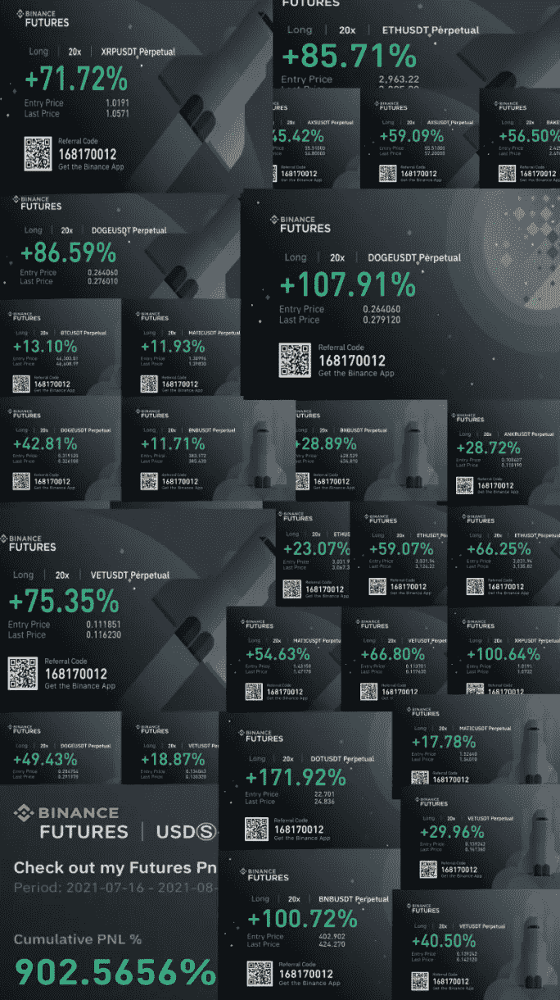
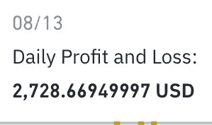
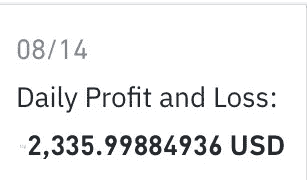
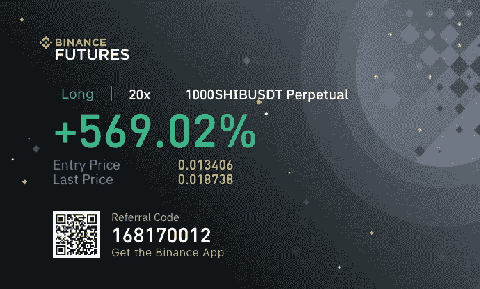
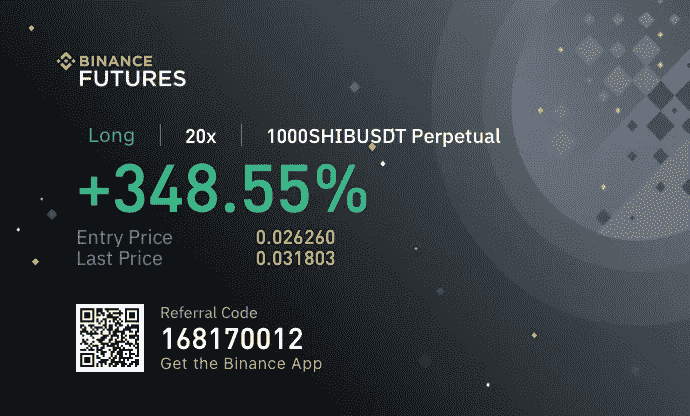
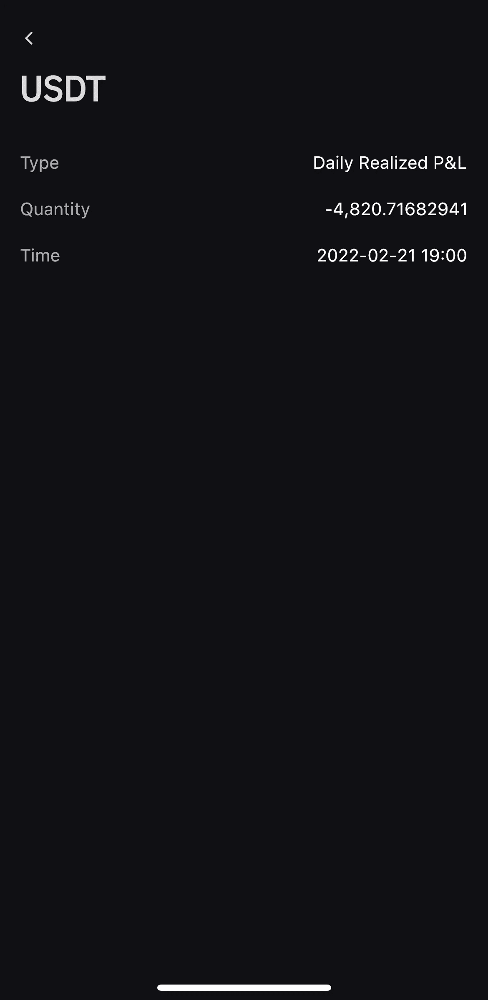

# 我今年 18 岁，通过加密期货赚了 10 万多美元

> 原文：<https://medium.com/coinmonks/im-18-years-old-and-i-made-100-000-from-crypto-futures-7d1e0eac29eb?source=collection_archive---------27----------------------->

我从加密期货中赚了超过 100，000 美元，以下是我是如何做到的。为了一些背景，我从 15 岁开始炒股。当我刚开始工作时，我认为自己将成为一名“长期投资者”。然后我意识到我并不是想等到 50 岁才变得富有。然后我发现了摆动交易。摇摆交易本质上是持有一只股票超过一天，但它通常比投资有更短的前景。通常是几周或几个月。然后我发现了摆动交易细价股，并从中赚了不少钱。16 岁的时候，我通过交易低价股，一个月大概赚了 500 美元。最终，当我 17 岁的时候，我发现了日交易细价股票。我学到了技术分析的基本知识，以及如何阅读股票图表和寻找模式。像 RSI、移动平均线、成交量、支撑位和阻力位这样的指标。这些我都是通过 YouTube 视频和练习日内交易学会的。做了一些损失，但大多是胜利，所以这是一些体面的收入。我开始有 500 美元的日交易股票。然后在 2021 年 4 月左右，细价股开始放缓。这是我最终进入加密领域的地方。一个朋友告诉我他是如何购买“狗屎硬币”的。非常糟糕的硬币，但由于市场营销的原因，它们中的许多往往会上涨。我试着买了一枚这样的硬币，但没有成功。但正因为如此，我开始越来越多地了解 crypto。然后我在大约 2021 年 5 月发现了密码期货。本质上，加密期货是什么，假设我买了比特币，我有 20 倍的杠杆。我在那个位置投了 100 美元。如果比特币上涨 1%，那么我的 100 美元就能获得 20%的收益。所以我会赚 20 美元，因为从技术上来说，20 倍杠杆下，我 100 美元的头寸是 2000 美元。我从大约 1800 美元开始。到 2021 年 8 月底，我终于把它增长到了 5 万美元多一点。

这是我从币安的加密期货交易中获得的一些收益的图像。我在 8 月份经历了一些大幅下跌，但在很大程度上是因为比特币从那次下跌升至 28k 美元，我基本上从未遭受任何重大损失。有几天我赚了 2000 多美元。

这样一直持续下去，在 9 月和 10 月，我在 SHIB 做了一些非常好的交易，赚了很多钱。

我最终获得了 10 万多美元。我的账目比那还要高。直到比特币开始下跌。然后我开始损失很多钱。

但幸运的是，我的账户能够保持在 10 万美元以上。

# 我运气好吗？

当然，这与运气有关。但其中很小一部分是技巧。我从股票中学到了如何使用技术分析，所以把它带到 crypto 是相当简单的。加密期货唯一的区别是有清算价格。如果你的仓位达到你的平仓价，你会失去所有的钱。我意识到，使用 crypto 最重要的一点是，你会有“桌子很热”的时候。比特币正朝着一个明确的方向发展，因此更容易赚钱。在我开始加密的时候，比特币经历了一次大的下跌，然后开始复苏。所以我的大部分交易都是在密码市场朝着一个明确的方向发展时完成的，所以交易很容易。当 crypto 存在整体不确定性时，我意识到最好不要踩油门，全力以赴。只要你能控制自己的情绪，不做傻事，比如在错误的时间全押，你应该能赚钱。如果你想以缓慢但稳定的速度增加你的账户，那么只需拿你账户的 2%到 5%来冒险。这样，如果你真的被清算，你不会失去你所拥有的一切。感谢阅读这篇文章，我真的很感激，更多的内容即将推出。

> 加入 Coinmonks [电报频道](https://t.me/coincodecap)和 [Youtube 频道](https://www.youtube.com/c/coinmonks/videos)了解加密交易和投资

# 另外，阅读

*   [密码本交易平台](/coinmonks/top-10-crypto-copy-trading-platforms-for-beginners-d0c37c7d698c) | [Coinmama 审核](/coinmonks/coinmama-review-ace5641bde6e)
*   [印度的加密交易所](/coinmonks/bitcoin-exchange-in-india-7f1fe79715c9) | [比特币储蓄账户](/coinmonks/bitcoin-savings-account-e65b13f92451)
*   [OKEx vs KuCoin](https://coincodecap.com/okex-kucoin) | [摄氏替代品](https://coincodecap.com/celsius-alternatives) | [如何购买 VeChain](https://coincodecap.com/buy-vechain)
*   [币安期货交易](https://coincodecap.com/binance-futures-trading)|[3 comas vs Mudrex vs eToro](https://coincodecap.com/mudrex-3commas-etoro)
*   [如何购买 Monero](https://coincodecap.com/buy-monero) | [IDEX 评论](https://coincodecap.com/idex-review) | [BitKan 交易机器人](https://coincodecap.com/bitkan-trading-bot)