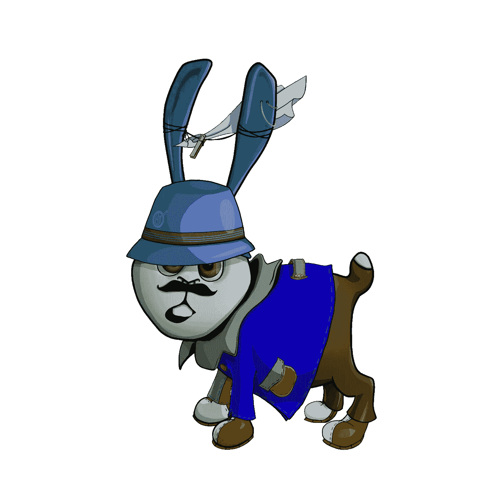
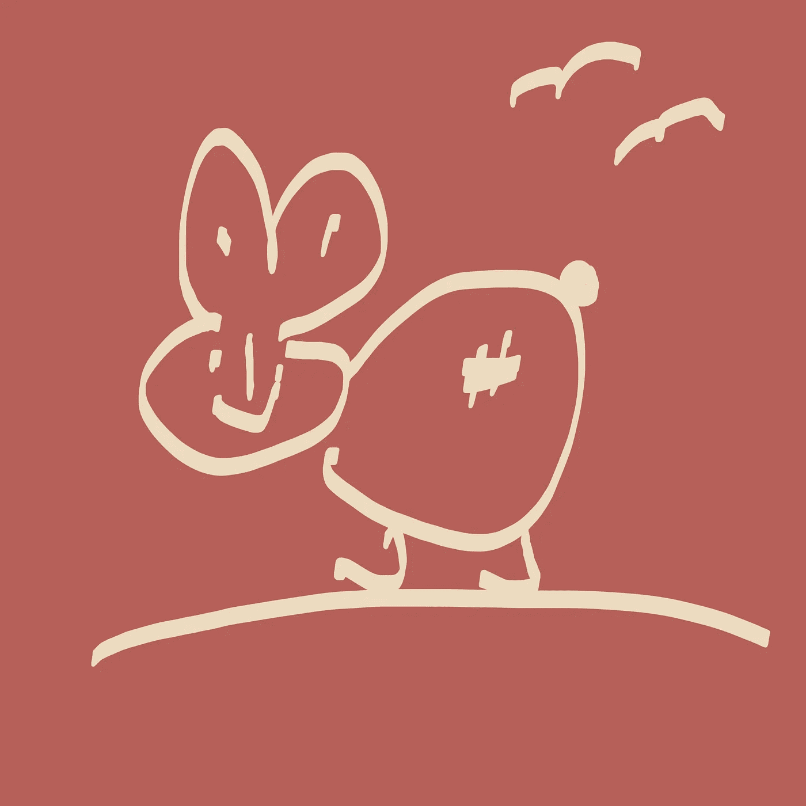
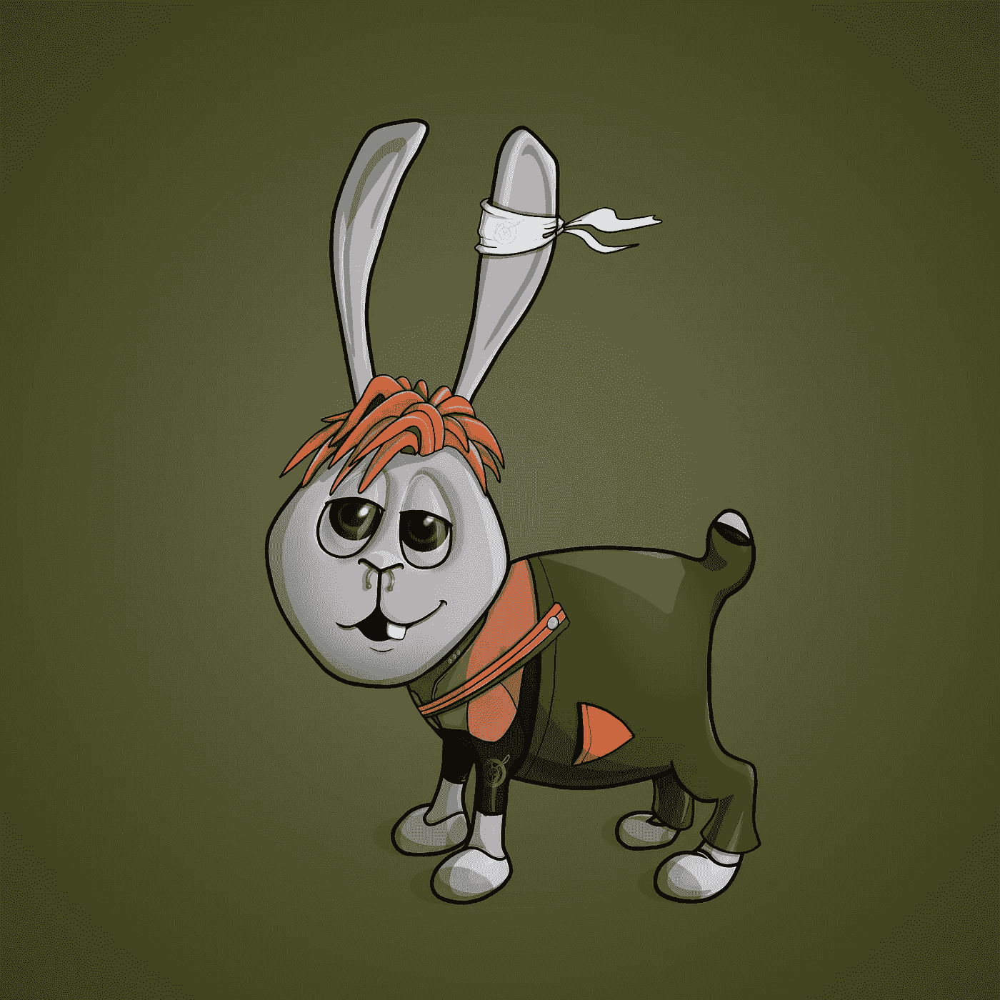
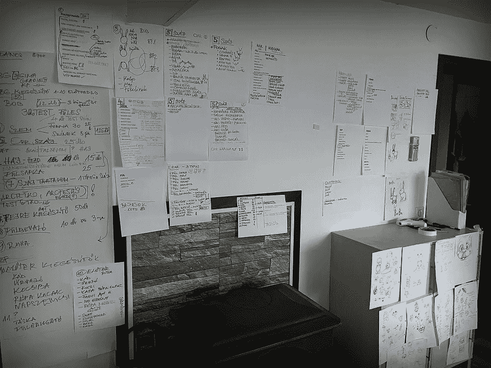
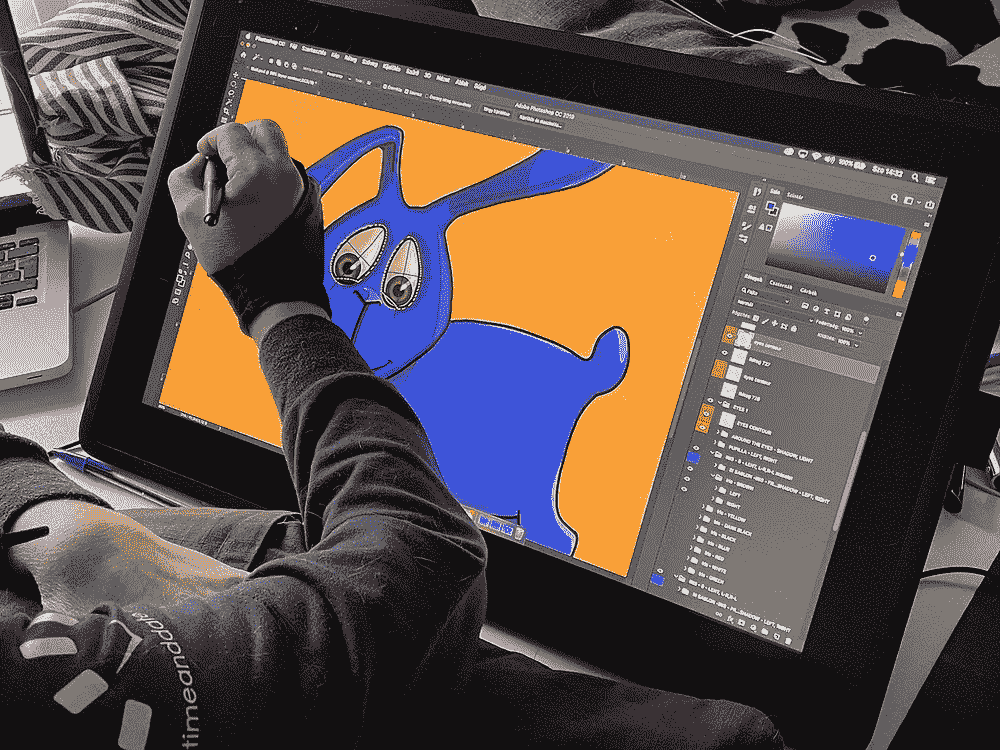

# 我是鲍勃·NFT 项目

> 原文：<https://medium.com/coinmonks/im-bob-nft-project-26cdb777e39d?source=collection_archive---------24----------------------->

我是 BoB，是 9339 个以社区和 BoB 环球之旅为中心的 NFT 的集合。

# **我是 BoB 整体视觉**

我是 BoB，是 9339 个以社区和 BoB 环球之旅为中心的 NFT 的集合。

BoB 是一只兔子，他的主要目标是用他的爱心和时髦的服装让每个人微笑，更不用说有价值的礼物和惊喜了。

每个鲍勃都将作为一个不可替代的象征物(NFT)居住在区块链的以太博物馆，这个象征物由支持鲍勃寻找乐趣和传播快乐的基本使命的特征的独特组合组成。

# **开发 bob**

BoB 的想法诞生于 20 年前。他最初是一个孩子想象出来的虚构人物。一个小可爱，只是为了让人们开心。如果有人看起来很悲伤或者需要振作起来，造物主会给他们画一个 BoB，让他们的日子过得更好一点。

The Old BoB

BoB 会出现在墙上或咖啡店的餐巾纸上——无论他在哪里。巴黎、柏林、华沙、威尼斯和奥斯陆只是 BoB 给某人留下微笑的几个城市。

现在，这个简单的想法已经从一个天真的卡通人物成熟为一个复杂的 NFT。

The new BoB

BoB 的开发始于 2021 年年中。在 BoB 的外观和服装创作过程中，我们的艺术家花了一天一夜的时间进行绘画和规划。这位艺术家的家贴有壁纸(WFH，你知道)，上面画有他丰富多彩、充满活力的资产的草图。很快，您将能够亲眼看到这个神奇的结果，因为我们将在 OpenSea 和其他 NFT 市场上展示薄荷系列。

Developing BoB character

然而，鲍勃不仅仅是元宇宙的另一个人物形象。BoB 是一个环球旅行者，一个活泼的流浪者，他喜欢沿途留下惊喜和珍宝。

BoB 的主要习惯是在世界地图上随机挖掘 BoB Holes。这是一个你想掉进的兔子洞！在 BoB Holes 中，他将 NFT、ETH 和其他有价值的惊喜留给了 BoB 持有者。

# **BOb 团队**

这四位创始人都有 BoB 的主要特点；他传播快乐的喜悦。所有团队成员都在各自的领域有所建树。船上有几十年经验的开发人员，一个创作出精彩设计的真正艺术家，以及一个全世界数百万人阅读其作品的作家。对 BoB 和他的创作者来说，这个 NFT 系列是一个接触世界的绝佳机会。

The founder sometimes do this…

# **路线图纲要**

项目路线图的核心是通过高价值回报为 BoB 持有者增加价值，高价值回报的形式包括 ETH 和 NFT 赠品，BoB 用于莱佛士的代币，等等。

BoB 的使命不仅是为了 BoB 持有者，也是为了每个人。在我们的移动和网络应用程序中，我是 BoB 社区的成员和关注者可以加入其中，享受乐趣，玩游戏，获得有价值的现实世界和数字奖品。

# **销售流程**

加上高昂的汽油费，我们知道在以太坊区块链上购买 NFT 可能是一个非常昂贵的过程。这就是为什么我们的团队区块链开发者努力将煤气费降至最低。这种优化包括在铸造两个 NFT 时只支付一次汽油费。使用我们的智能合同 ERC721A，费用是迄今为止最低的。

[你可以在这里阅读更多关于我们智能合同的信息](/@imbobnft/im-bob-project-smart-contract-erc721-introduction-57ca443484cf?source=friends_link&sk=877233f063ae2560aecd98e0031f9790)

预售开始 TDA 白名单成员，帮助我们接触更多的人在 NFT 空间。路线图步骤的时间段将在我们的 Discord 频道中公布。

价格是 0.25 ETH +燃气费。

我们想和很多人分享 BoB，所以我们设定了每个钱包最多 2 件物品的**。**

# **NFT 稀罕物**

收集项目由 800 个手绘性状生成，并通过 4 个随机世代构建。此外，还有 95 个传说中的 1:1 手绘 bob 和他的 5 个家庭成员。有鲍勃的爷爷，鲍勃的奶奶，鲍勃的姐姐，鲍勃的哥哥，鲍勃的黑帮叔叔。

一些 bob 带有一个象征性的附件。有几种不同的类型，每种 5 个。第一个拥有相同符号的所有 5 个 BoB 的人将赢得 BoB 家族传奇物品的一个成员。

在物品生成的最后，所有的特征和物品都被搅拌并随机分配给鲍勃。没人知道哪只 NFT 拥有哪些特征或稀有性。当我们在公众日展示该系列时，这对 BoB 团队来说也是一个惊喜。

这只是鲍勃带来的一些乐趣。如果你准备好跟随 BoB 的旅程，请加入我们的 Discord 并在 Twitter 上关注我们。

快乐步道！

**推特**:[https://twitter.com/imbobnfts](https://twitter.com/imbobnfts)

**不和**:[https://wfb.app/bob](https://wfb.app/bob)

**网站**:[https://imbobnft.com](https://imbobnft.com)