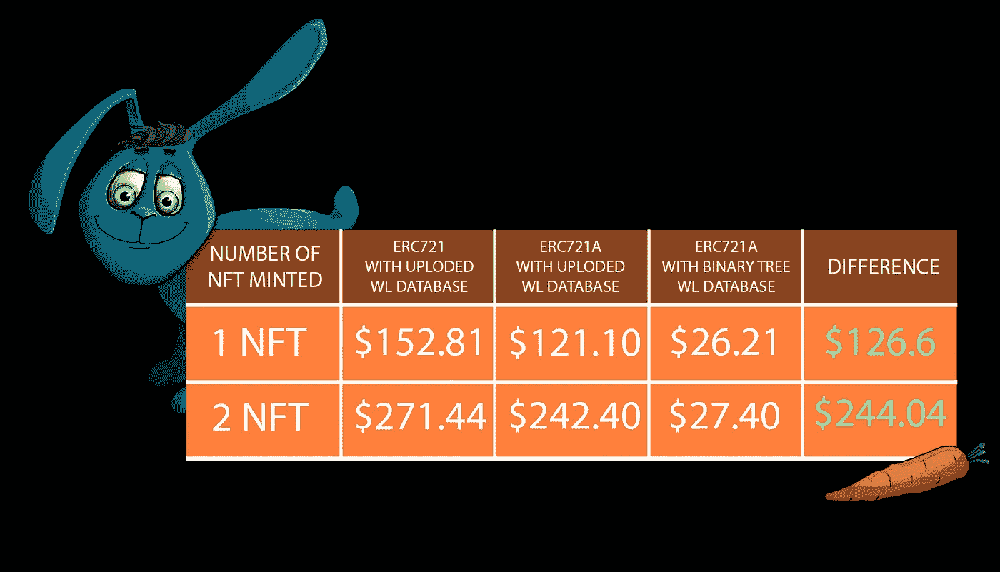

# 我是鲍勃工程智能合同 ERC721 简介

> 原文：<https://medium.com/coinmonks/im-bob-project-smart-contract-erc721-introduction-57ca443484cf?source=collection_archive---------53----------------------->

*   ERC721A 是 ERC721 的一种实现，允许在单个交易中生成多个 NFT 以节省汽油。
*   I'm BoB smart 合同将允许以与铸造一个 NFT 相同的成本铸造多个 NFT。
*   我们的智能合同是完全安全的，我们的目标是为我们的社区简化流程。

# 解释

以太坊在区块链最大的问题之一是燃气费。在以太坊区块链开发的 NFTs 项目需要适应新技术，以降低数月来一直过高的天然气费用。我是鲍勃项目区块链开发商优化了这份合同，以便我们所有的朋友可以在最好的条件下投资他们的钱。

传统工艺不允许，所以我们决定使用 ERC721A 技术，该技术**将允许我们铸造几个 NFT，其汽油费相当于铸造一个 NFT。**

**Calculated with 100 GWEI gas and $3000 / ETH price**

# 结论

这项技术允许减少一个或多个薄荷糖的气体。大多数项目的用气量都很高，有些人无法承受，所以我们必须尽可能降低用气量。

ERC721A 技术允许在一次交易中收购多个 NFT，这是我们所鼓励的。

如果您对合同有任何疑问，您可以通过以下渠道联系我们:

**推特**:【https://twitter.com/imbobnfts】T4

**不和**:[https://wfb.app/bob](https://wfb.app/bob)

**网站**:[https://imbobnft.com](https://imbobnft.com)

> 加入 Coinmonks [电报频道](https://t.me/coincodecap)和 [Youtube 频道](https://www.youtube.com/c/coinmonks/videos)了解加密交易和投资

# 另外，阅读

*   [如何匿名购买比特币](https://coincodecap.com/buy-bitcoin-anonymously) | [比特币现金钱包](https://coincodecap.com/bitcoin-cash-wallets)
*   [币安 vs FTX](https://coincodecap.com/binance-vs-ftx) | [最佳(SOL)索拉纳钱包](https://coincodecap.com/solana-wallets)
*   [比诺莫评论](https://coincodecap.com/binomo-review) | [斯多葛派 vs 3Commas vs TradeSanta](https://coincodecap.com/stoic-vs-3commas-vs-tradesanta)
*   [Capital.com 审查](https://coincodecap.com/capital-com-review) | [港加密借贷平台](https://coincodecap.com/crypto-lending-hong-kong)
*   [如何在 Uniswap 上交换加密？](https://coincodecap.com/swap-crypto-on-uniswap) | [A-Ads 审核](https://coincodecap.com/a-ads-review)
*   [WazirX vs coin dcx vs bit bns](/coinmonks/wazirx-vs-coindcx-vs-bitbns-149f4f19a2f1)|[block fi vs coin loan vs Nexo](/coinmonks/blockfi-vs-coinloan-vs-nexo-cb624635230d)
*   [本地比特币审核](/coinmonks/localbitcoins-review-6cc001c6ed56) | [加密货币储蓄账户](https://coincodecap.com/cryptocurrency-savings-accounts)