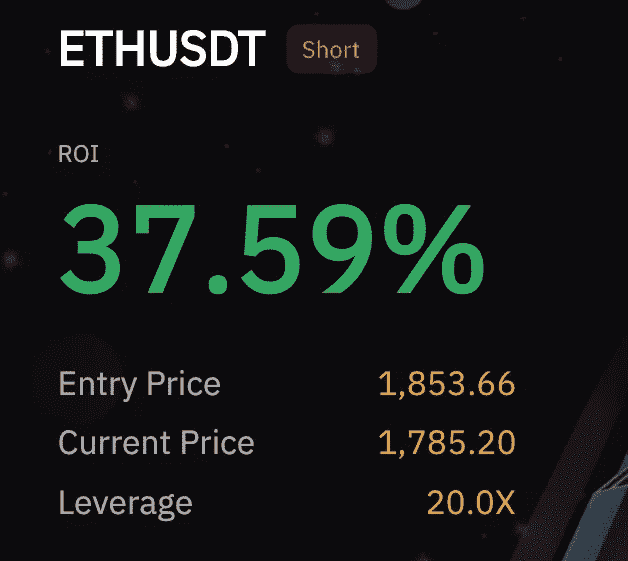

# 我试图用加密期货将 100 美元变成 100，000 美元(第 1 部分)

> 原文：<https://medium.com/coinmonks/im-trying-to-take-100-and-turn-it-into-100-000-with-crypto-futures-part-1-b26b3f1c57ca?source=collection_archive---------11----------------------->

我已经开了一个 100 美元的加密期货账户，我打算把它增加到 10 万美元。我没有给自己这个目标设定时间限制，因为那样我可能会被迫交易。我做过这样的挑战账户，但这是我开始时的最低金额。

我在 5 月 15 日左右开始开户，到目前为止，我已经把它存到了 200 美元左右。

我对这个账户的计划是确保我对每笔交易都使用止损。确保如果我的止损点被击中，我只损失很小一部分。所以基本上我的每笔交易都保持低风险高回报。

# 到目前为止我做过的交易

以下是我迄今为止从交易中获得的一些收获。

正如你所看到的，这些交易大部分是空头交易，这主要是因为市场处于下降趋势，试图对抗趋势是没有意义的。

如果你想了解账户的进展，那就关注我的个人简介 [Aden Rao (Gen Z Money)](https://medium.com/u/384ed9192fed?source=post_page-----b26b3f1c57ca--------------------------------) 每隔几周，我会更新一下我所做的交易和账户金额。

> 加入 Coinmonks [电报频道](https://t.me/coincodecap)和 [Youtube 频道](https://www.youtube.com/c/coinmonks/videos)了解加密交易和投资

# 另外，阅读

*   [德国最佳加密交易所](https://coincodecap.com/crypto-exchanges-in-germany) | [Arbitrum:第二层解决方案](https://coincodecap.com/arbitrum)
*   [币安交易机器人](/coinmonks/binance-trading-bots-d0d57bb62c4c) | [OKEx 评论](/coinmonks/okex-review-6b369304110f) | [Atani 评论](https://coincodecap.com/atani-review)
*   [最佳加密交易信号电报](/coinmonks/best-crypto-signals-telegram-5785cdbc4b2b) | [MoonXBT 评论](/coinmonks/moonxbt-review-6e4ab26d037)
*   如何在 Bitbns 上购买柴犬(SHIB)币？ | [买弗洛基](https://coincodecap.com/buy-floki-inu-token)
*   [CoinFLEX 评论](https://coincodecap.com/coinflex-review) | [AEX 交易所评论](https://coincodecap.com/aex-exchange-review) | [UPbit 评论](https://coincodecap.com/upbit-review)
*   [十大最佳加密货币博客](https://coincodecap.com/best-cryptocurrency-blogs) | [YouHodler 评论](https://coincodecap.com/youhodler-review)