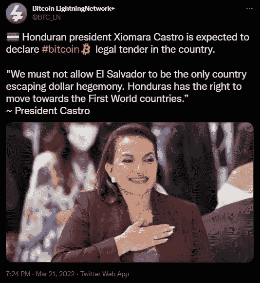
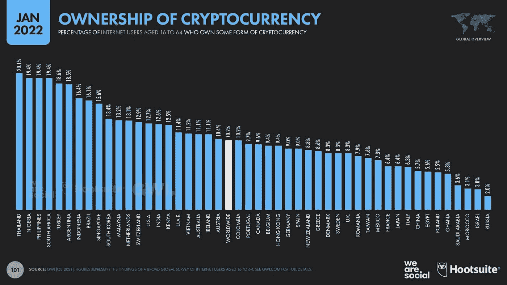
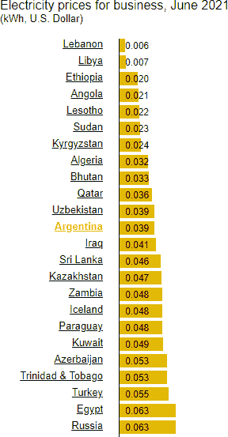

# 国际货币基金组织进入“然后他们打你”阶段

> 原文：<https://medium.com/coinmonks/imf-goes-to-than-they-fight-you-phase-80825062e370?source=collection_archive---------52----------------------->

> 首先他们忽视你，然后他们嘲笑你，然后他们和你斗争，最后你赢了(圣雄甘地)

自乌克兰战争开始以来，全球范围内出现了重大变化的迹象。最近几周，我们通过两篇文章讨论了这些变化，这两篇文章同时关注了经济和 T2 的政治变化。继 3 月 17 日国际货币基金组织和阿根廷签署 450 亿美元的协议后，之前的变革信号又增加了一个新的信号。IMF 与阿根廷的协议与此前数十份协议不同的是，IMF 在协议中加入了一项关于加密货币的附加条款。增加这一条款的背后，除了阿根廷特有的原因，还有各国关于加密货币和数字化的说法。在这篇文章中，我们将从一个更广阔的视角来审视国际货币基金组织的决定，看看阿根廷和全球的发展。

# 紧急按钮:IMF

有 190 个成员国的国际货币基金组织可以被看作是一扇门上的紧急按钮，各国可以敲它来摆脱大规模危机或避免危机。其目的是不扰乱全球债务周期，也不通过向这些国家提供大量贷款来引发地区/全球危机。作为对贷款的回报，国际货币基金组织要求接受援助的国家遵循严格的经济政策。这些政策旨在尽可能减少非紧急支出，提高收入效率，但这种类似公司的政策在应用于有数百万人生活的国家时，并没有给公众带来非常积极的后果。在这种情况下，我们经常看到国家在社会领域的工作被打断。因此，虽然 IMF 是一个完全的紧急按钮，但没有一个国家愿意轻易求助于 IMF。

# 火花

有长期通货膨胀问题的阿根廷作为最后手段联系了国际货币基金组织，并接受了价值 450 亿美元的援助，同意了国际货币基金组织制定的政策。该协议包括一项条款，规定阿根廷不得鼓励在该国使用加密货币。这篇文章对于表明国际货币基金组织已经将加密货币视为一种威胁具有重要意义。自从萨尔瓦多将比特币作为官方货币以来，我们经常在各种 IMF 文件中遇到警告，称这一决定将导致金融不稳定。对于国际货币基金组织在这个问题上持否定立场的原因，市场普遍认为萨尔瓦多计划筹集与 BTC 债券相同的资金，而不是从国际货币基金组织贷款。因此，已经看到比特币和基于比特币的产品可以成为国际货币基金组织的替代选择，由于其严格的政策规定，国际货币基金组织不是任何人的首选。对政府来说，这种选择无疑比 IMF 的政策更有吸引力，因为 IMF 的政策会导致投票权的流失。

这一火花始于萨尔瓦多将比特币作为国际货币基金组织的替代品，并开始向前发展，以显示国际货币基金组织为何担忧。比如说；像萨尔瓦多这样的小国洪都拉斯的总统 Xiomara Castro 发表声明说，他们将跟随萨尔瓦多走上摆脱美元霸权的道路。

# 第一数据

如今加密货币市场的经济规模足以满足洪都拉斯和其他接近萨尔瓦多经济规模的国家的融资需求。因此，这些国家有可能从加密货币市场的玩家那里获得帮助，而不是 IMF。虽然这些国家的经济规模不大，但它们可以产生连锁效应。要让这种效应扩散到阿根廷等更大的经济体，就需要积累数据。由于比特币有固定的货币政策，理论上可以预测它将如何在经济中使用以及如何产生影响，但由于各种因素，特别是价格波动，尚不清楚它在实践中如何发挥作用。

在萨尔瓦多，比特币对国家政策的积极和消极影响第一次开始显现。在随后的几年中，如果这一数据的积极结果被认为是高的，阿根廷等国家很可能参与这一趋势。国际货币基金组织在与阿根廷的协议中提出的加密货币条款表明，从这一点来看，国际货币基金组织的担忧有所增加，并已开始采取措施。

南美国家普遍存在的通胀问题，已使公众转向抗通胀资产成为一种反射。加密货币也是首选，因为从长期来看，它们可以提供高回报。从下面的图表中可以看出，该图表来自 2021 年 1 月进行的一项研究，当根据该国人口比较 16-64 岁之间拥有加密货币的互联网用户数量时，阿根廷以 16.4%的份额排名第五，仅次于土耳其。

阿根廷对加密货币的兴趣不仅限于公共加密货币投资。拉丁美洲最大的电子商务公司 Mercado Libre 获得了价值 860 万美元的 BTC 以抵御通货膨胀，这是公司也要求加密货币的一个重要例子。

另一方面，加密货币矿商最近开始在阿根廷投资，因为阿根廷的高通胀使该国的电价以美元计算非常有吸引力。阿根廷的电力供应和训练有素的人力资源也吸引了人们的注意，这甚至比哈萨克斯坦更经济，因为哈萨克斯坦提供廉价的电力。下表显示了不同国家的企业支付的每千瓦美元价格。

# 突发事件

虽然加密货币在创建国际货币基金组织替代品方面的转型处于火花阶段，但代表向数字经济过渡的数字货币(CBDC)中央银行已经开始跳过火花阶段。换句话说，可以说讨论-审判阶段已经结束。

新加坡、马来西亚、南非和澳大利亚于 2021 年 9 月签署了一项协议，通过原型产品测试 CBDCs 的国际使用。在一份新的声明中，宣布测试已经结束，该系统将很快可用。在公告中，可以在 3 篇主要文章中收集收益:

*   这四个国家之间的汇款变得和国内汇款一样容易和便宜。
*   每个国家都将能够以本国货币收款和汇款。
*   不需要任何中介组织。

从这些文章中得出的最重要的结论是，由于有了 CBDCs，各国之间的转账将不必使用美元，因此 SWIFT 带来的延迟和成本将不复存在。尽管中国在 CBDC 领域开展了最先进的研究，但这四个国家之间建立的结构对于展示 CBDC 的国际可操作性和创建 SWIFT 的替代方案非常重要。

# 战斗阶段

当我们将印度救世主甘地的话“首先他们忽视你，然后他们嘲笑你，然后他们与你战斗，然后你赢了”改编为加密货币时，可以说，在经历了无数庞氏骗局和欺诈批评后，IMF 的阿根廷协议(充当了当前经济秩序的某种保护者)代表了从嘲笑加密货币到战斗的过渡。

在政治上，加密货币非常有利，因为它们可以防止失去 IMF 带来的投票权，预计随着萨尔瓦多数据的成熟，加密货币将迅速传播到相对较小的国家。随着加密货币市场的增长，相对较大的国家可能会开始将加密货币视为替代品。因此，我们可以将上述发展视为将持续多年的变革的最具体的第一步。

编制人:Berkay Aybey

*此处表达的观点和评论归 BV Crypto 所有。BV Crypto 对基于此帖子的任何金融交易概不负责。每一次投资和交易都有风险。当你做决定时，你应该自己做调查。*

> 加入 Coinmonks [电报频道](https://t.me/coincodecap)和 [Youtube 频道](https://www.youtube.com/c/coinmonks/videos)了解加密交易和投资

# 另外，阅读

*   [加密复制交易平台](/coinmonks/top-10-crypto-copy-trading-platforms-for-beginners-d0c37c7d698c) | [Coinmama 评论](/coinmonks/coinmama-review-ace5641bde6e)
*   [印度的加密交易所](/coinmonks/bitcoin-exchange-in-india-7f1fe79715c9) | [比特币储蓄账户](/coinmonks/bitcoin-savings-account-e65b13f92451)
*   [OKEx vs KuCoin](https://coincodecap.com/okex-kucoin) | [摄氏替代品](https://coincodecap.com/celsius-alternatives) | [如何购买 VeChain](https://coincodecap.com/buy-vechain)
*   [币安期货交易](https://coincodecap.com/binance-futures-trading)|[3 commas vs Mudrex vs eToro](https://coincodecap.com/mudrex-3commas-etoro)
*   [如何购买 Monero](https://coincodecap.com/buy-monero) | [IDEX 评论](https://coincodecap.com/idex-review) | [BitKan 交易机器人](https://coincodecap.com/bitkan-trading-bot)