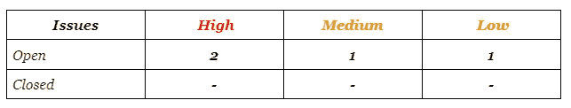
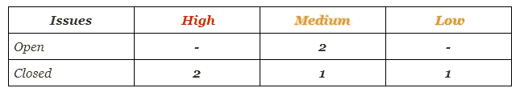
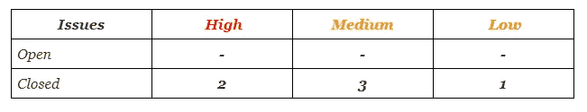

# ImmuneBytes 完成 Retreeb 智能合同审核阅读详细信息

> 原文：<https://medium.com/coinmonks/immunebytes-completes-retreeb-smart-contract-audit-read-details-6507cf668a74?source=collection_archive---------45----------------------->

*ImmuneBytes 正式宣布成功完成 Retreeb 的智能合同安全审计。*

*ImmuneBytes 的审计人员进行了彻底的审计，以确保他们已经消除了所有的漏洞和最大的风险覆盖范围。智能合同代码由独立审计员团队进行审计，其中包括:*

*   *对智能合约的功能进行测试，以确定适当的逻辑一直遵循。*
*   *确保智能合同的行为符合预期。*
*   *通过对代码进行彻底的、手动的逐行审查来分析代码的复杂性。*
*   *使用多个客户端在 testnet 上部署代码以运行实时测试。*
*   *检查代码中使用的所有库是否都是最新版本。*

*我们团队对项目进行了全面的测试，包括* ***审查代码设计模式*** *和* ***分析智能合约架构*** *。这确保了它的结构化和安全性。*

# ***审计报告概述***

> ***项目名称:****retrieb 初步审核*
> 
> *合同名称:StakingPlatform，TesterStakingPlatform，Token.sol*
> 
> *语言:Solidity(智能合约)，Typescript(单元测试)*
> 
> *用于审计的 Github 提交哈希:30471 f1 Fe 81580d 56 cbc2f 3189 e 64d 583 CD 78 a 85*
> 
> *平台和工具:Remix IDE、Truffle、Truffle Team、Ganache、Solhint、VScode、契约库、Slither、SmartCheck、SFuzz*

# ***审核汇总***

*审计员对系统中的漏洞进行了检查，以验证智能合同系统是安全的、有弹性的，并且按照其规范工作。这分为三个不同的类别:*

***1。安全:*** *确定每个合同和合同系统中与安全相关的问题。*

***2。健全的架构:*** *通过已建立的智能合约最佳实践和通用软件最佳实践的视角来评估该系统的架构。*

***3。代码正确性和质量:*** *全面审查合同源代码。*

*审核过程中的主要关注领域包括:*

*   *正确性*
*   *可读性*
*   *高复杂度的代码段*
*   *测试覆盖的数量和质量*

*然后，该团队对智能合约进行了正式的逐行检查，以找到任何潜在的问题，如* ***签名重放攻击、未经检查的外部调用、外部合约引用、可变阴影、竞争条件、交易排序依赖、时间戳依赖、DoS 攻击*** *等。*

***安全等级引用***

*本报告中的每个问题都被指定了一个严重级别，具体如下:*

*我们的* ***智能合同审核员*** *根据严重程度拆分问题:*

管理员/所有者权限可能被有意或无意地滥用。

**严重程度高的问题**会带来问题，应该解决。

**中等严重性问题**可能会带来潜在的问题，最终应该会得到解决。

**低严重性问题**是次要的细节和警告，可以保持不修复，但在将来的某个时候会得到更好的修复。

*关于合同代码及其漏洞的深入细节的智能合同审计报告可在此处找到:* [*报告*](https://immunebytes.com/uploads/pdf/Retreeb%20-%20Preliminary%20Audit%20Report_.pdf)

*在对 Retreeb smart 合同进行审计时，发现合同包含高、中、低严重性问题。*

***然后进行最终审计，具体如下:***

> *合同名称:StakingPlatform，TesterStakingPlatform，Token.sol*
> 
> *语言:Solidity(智能合约)，Typescript(单元测试)*
> 
> *用于审计的 Github 提交哈希:30471 f1 Fe 81580d 56 cbc2f 3189 e 64d 583 CD 78 a 85*
> 
> *用于最终审计的 Github 提交哈希:d 482164125 e 65 a 36 e 652d 7 bb 5 df 7475 BD 4 BCB 50b*
> 
> *平台和工具:Remix IDE、Truffle、Truffle Team、Ganache、Solhint、VScode、契约库、Slither、SmartCheck、SFuzz*

***审计总结***

*智能合同审计的报告可以在这里找到:*[*https://immune bytes . com/uploads/pdf/Retreeb(ERC 20)% 20-% 20 audit % 20 report _。pdf*](https://immunebytes.com/uploads/pdf/HaggleX%20-%20Final%20Audit%20Report_.pdf)

在对 Retreeb smart 合同进行审计时，发现合同不包含高、中、低严重性问题。

***然后进行最终审计，具体如下:***

> *合同名称:StakingPlatform，TesterStakingPlatform，Token.sol*
> 
> *语言:Solidity(智能合约)，Typescript(单元测试)*
> 
> *用于审计的 Github 提交哈希:30471 f1 Fe 81580d 56 cbc2f 3189 e 64d 583 CD 78 a 85*
> 
> *用于最终审计的 Github 提交哈希:d 482164125 e 65 a 36 e 652d 7 bb 5 df 7475 BD 4 BCB 50b*
> 
> *用于最终审计的 Github 提交哈希(11 月 15 日):b 28 EAD 2 bb 3174 f 8 ee 8 D3 bcc 13 aeb CEA 0442 b 53 af*
> 
> *平台和工具:Remix IDE、Truffle、Truffle Team、Ganache、Solhint、VScode、契约库、Slither、SmartCheck、SFuzz*

***审核汇总***

*智能合同审计的最终审计报告可以在这里找到:*[*retrieb 的最终审计报告。*](https://immunebytes.com/uploads/pdf/Retreeb%20-%20Final%20Audit%20Report_.pdf)

在审计过程中发现的所有问题都已解决，我们的审计团队也对潜在威胁进行了评估。审核后，Retreeb 智能合同不包含任何漏洞。

***关于败退***

*在一个快速变化的行业中，*[*Retreeb*](https://retreeb.io/)*提出了一种简单、实用、经济的新支付方式，使其符合道德、分享和团结等普世价值。它针对所有参与团结和可持续方法的人。*

*考虑到用户对服务的采用，retrieb 承诺其用户将支付*[*retrieb*](https://twitter.com/retreeb_io)*收取的交易费用的 33%，用于资助社会和环境项目。有了这种商业模式、技术基础设施、交易费用的再分配以及对项目的监控，他们选择了在一个特别不透明的领域实现前所未有的透明度。*

*出于对环境问题的关注，他们的技术选择是由将我们的碳足迹减少到最低限度的愿望决定的。最后，他们采取了一种新的支付方式，将企业社会和环境责任(CSR)置于其抱负的核心。*

***关于 ImmuneBytes***

***ImmuneBytes*** *是一家快速发展的公司，它结合了区块链安全和* [*智能合同审计*](https://immunebytes.com/) *来保护您的数字资产。自 2020 年以来，我们通过采用尖端工具和实践来识别加密货币钱包和去中心化应用程序(dApps)背后的源代码漏洞，帮助保护了超过 18 亿美元的资产。*

***immune bytes****与客户密切合作，在不中断正常活动或区块链活动的情况下，识别并解决其智能合约中的潜在漏洞。凭借经验丰富的安全专业人员团队，****ImmuneBytes****提供了无与伦比的专业知识和质量承诺，确保我们客户的区块链能够无中断运行。*

关于同一主题的进一步讨论和疑问，请加入关于 ImmuneBytes-[https://t.me/immunebytes](https://t.me/immunebytes)的**报文组的讨论**

查看 **GitHub 库-**https://github.com/ImmuneBytes

> 加入 Coinmonks [电报频道](https://t.me/coincodecap)和 [Youtube 频道](https://www.youtube.com/c/coinmonks/videos)了解加密交易和投资

# 另外，阅读

*   [3 商业评论](/coinmonks/3commas-review-an-excellent-crypto-trading-bot-2020-1313a58bec92) | [Pionex 评论](https://coincodecap.com/pionex-review-exchange-with-crypto-trading-bot) | [Coinrule 评论](/coinmonks/coinrule-review-2021-a-beginner-friendly-crypto-trading-bot-daf0504848ba)
*   [莱杰 vs n 格拉夫](/coinmonks/ledger-vs-ngrave-zero-7e40f0c1d694) | [莱杰纳诺 s vs x](/coinmonks/ledger-nano-s-vs-x-battery-hardware-price-storage-59a6663fe3b0) | [币安评论](/coinmonks/binance-review-ee10d3bf3b6e)
*   [Bybit 交易所评论](/coinmonks/bybit-exchange-review-dbd570019b71) | [Bityard 评论](https://coincodecap.com/bityard-reivew) | [Jet-Bot 评论](https://coincodecap.com/jet-bot-review)
*   [3 commas vs crypto hopper](/coinmonks/3commas-vs-pionex-vs-cryptohopper-best-crypto-bot-6a98d2baa203)|[赚取加密利息](/coinmonks/earn-crypto-interest-b10b810fdda3)
*   最好的比特币[硬件钱包](/coinmonks/hardware-wallets-dfa1211730c6) | [BitBox02 回顾](/coinmonks/bitbox02-review-your-swiss-bitcoin-hardware-wallet-c36c88fff29)
*   [block fi vs Celsius](/coinmonks/blockfi-vs-celsius-vs-hodlnaut-8a1cc8c26630)|[Hodlnaut 审核](/coinmonks/hodlnaut-review-best-way-to-hodl-is-to-earn-interest-on-your-bitcoin-6658a8c19edf) | [KuCoin 审核](https://coincodecap.com/kucoin-review)