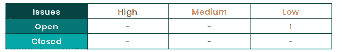

# ImmuneBytes 完成 YellowHeart 智能合同审计|阅读详细信息

> 原文：<https://medium.com/coinmonks/immunebytes-completes-yellowheart-smart-contract-audit-read-details-1a0419ee3466?source=collection_archive---------77----------------------->

*ImmuneBytes 正式宣布成功完成对 YellowHeart 的智能合同安全审计。*

*安全性是 ImmuneBytes 的重中之重。更重要的是，处理用户资金和数百万美元价值的智能合约的安全性至关重要。我们的审计人员花了数周时间分析 YellowHeart 的* [*智能合约*](https://immunebytes.com/) *，以了解底层项目架构，并确保代码按预期工作。*

*进行了细致专业的安全审计，检查了&以确保以下要点:*

*   *代码的整体质量和结构。*
*   *气体的有效利用。*
*   *最佳实践和原则的使用。*
*   *每个代码背后的代码文档和逻辑。*
*   代码可以避免重入以及其他常见的区块链漏洞。
*   *白皮书中提到的令牌分发和计算。*

*随着合同经过* ***结构、静态和动态分析*** *以及有条不紊的代码审查，审计严格检查了智能合同的任何漏洞迹象，如重入、时间戳依赖性、Gas 限制和循环、具有阻塞 Gas 限制的 DoS、未经检查的外部调用、未经检查的数学、不安全的类型推断等。*

*审核后，****immune bytes****团队很高兴地报告，他们没有发现任何可能导致用户资金损失的重大问题。****yellow heart****团队对我们对细节的关注和添加的建议非常满意，这帮助他们对代码库的质量进行了相当大的改进。*

# ***审计概述***

> ***项目名称:*** *黄心*
> 
> ***Token 名称:*** HeartToken
> 
> ***GitHub 地址:***[https://GitHub . com/ImmuneBytes/Smart-Contract-Audit-Reports/tree/main/yellow heart](https://github.com/ImmuneBytes/Smart-Contract-Audit-Reports/tree/main/YellowHeart)
> 
> **合同审核链接:**[https://goer Li . ethers can . io/address/0x 09 df 9984 cfff 401 F2 a 0 a9 ff 13 DD 254490 fa 0 c 25 c # code](https://goerli.etherscan.io/address/0x09Df9984CfFF401F2A0a9Ff13DD254490fA0c25c#code)*:*
> 
> ***语言:*** *Solidity(智能合约)，Typescript(单元测试)*
> 
> ***平台和工具:*** *Remix IDE、松露、松露团队、Ganache、Solhint、VScode、契约库、Slither、SmartCheck、鼹鼠*

# ***审计总结***

在 ImmuneBytes，定期审计是我们多管齐下的安全方法的一个组成部分，但除此之外，我们还采用了许多方法来确保您的资金安全。

*我们的智能合同审计员根据严重程度将问题分开:*

管理员/所有者权限可能被有意或无意地滥用。

**严重程度高的问题**会带来问题，应该解决。

**中等严重性问题**可能会带来问题，最终应该会得到解决。

**低严重性问题**是次要的细节和警告，可以保持不修复，但在将来的某个时候会得到更好的修复。

*有关合同代码及其漏洞的深入细节的智能合同审计报告可在此处找到:*

[*黄心审计报告*](https://immunebytes.com/uploads/pdf/YellowHeart%20-%20Audit%20Report_pdf)

*智能合同代码还根据 YellowHeart 的开发人员提供的单元测试和边缘测试案例运行，以涵盖所有可能的场景。*

## 关于黄心

[*yellow heart*](https://yh.io/)*是一个由分布式账本技术(DLT)支持的纽约、NFT 现场活动票务和区块链收藏品平台。这是一个专门为艺术家、团队和他们真正的粉丝的利益而建立的市场。他们的任务是消除倒票和票务中的不良玩家，让艺术家重新控制他们的门票如何分配和交易。*

*YellowHeart 开发了一款钱包和移动应用，采用区块链技术，可作为活动门票和 NFT 艺术品的数字钱包。该平台的主要优势在于，始终确保你购买的是一张真正的门票，并赋予艺术家定义门票转售参数的权力。这个平台是艺人为粉丝搭建的。*

## 关于免疫字节

[*ImmuneBytes*](https://immunebytes.com/) *是一家区块链安全公司，专注于提供全面的智能合同审计服务。我们帮助初创公司和企业保护他们的应用程序，防止它们变成代价高昂的漏洞。该公司成立的明确目标是促进区块链地区的安全，并热衷于提高大型系统的性能。*

*区块链技术无疑给很多行业带来了革命性的变化。然而，区块链网络是安全的，在其上运行的应用程序可能不安全。ImmuneBytes 执行严格的* [*智能合同审计*](https://immunebytes.com/) *，采用静态和动态方法，同时还检查合同的代码和 gas 优化，不留任何漏洞。*

关于同一主题的进一步讨论和疑问，请加入关于 ImmuneBytes-[https://t.me/immunebytes](https://t.me/immunebytes)的**报文组的讨论**

查看 **GitHub 资源库-**https://github.com/ImmuneBytes