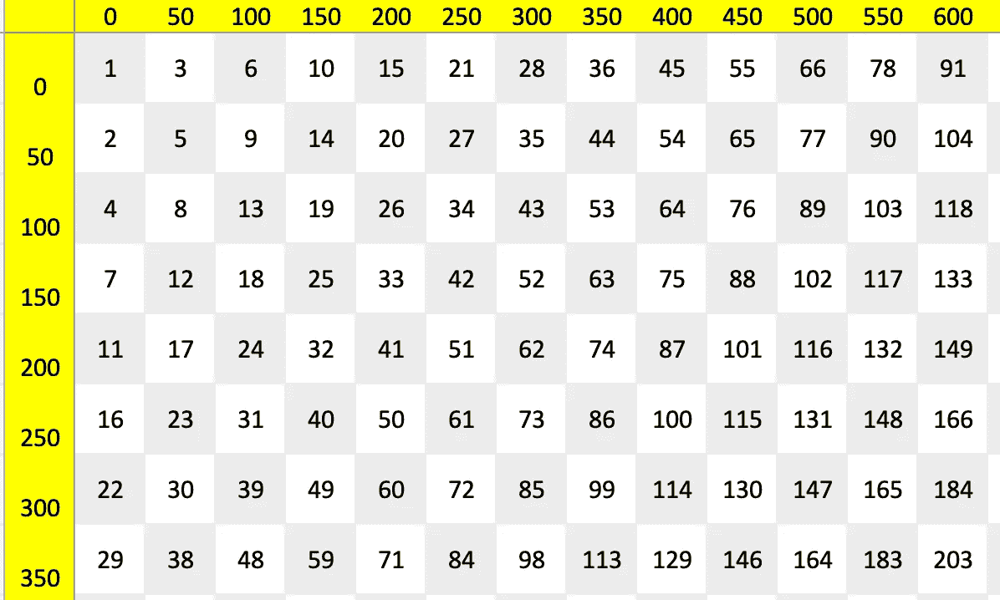
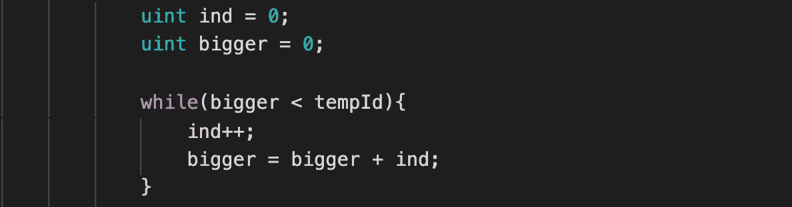
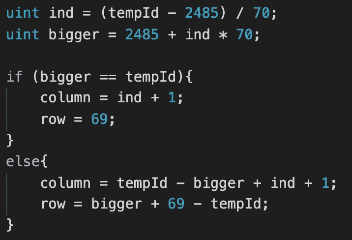
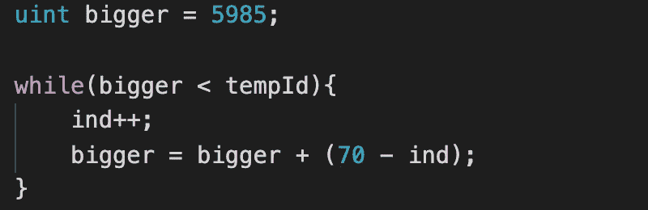

# 不可变元数据

> 原文：<https://medium.com/coinmonks/immutable-metadata-4b1ba369db77?source=collection_archive---------13----------------------->

## 21 毫米像素如何不变地收缩决定了瓷砖的位置

[21mp xels](https://21mmpixels.com)契约的一个特性是，可以用[契约查看函数](https://etherscan.io/address/0x7dd7aa4b560692c882d982312c0b53b24c51523a#code)、 *tileDescriptionArray* 或其更友好的对应物 *tileDescription* 来确定每个图块的位置。与大多数具有托管元数据文件的 NFT 项目不同，2100 万像素图像中的图块位置无法更改，它是真正不可变的。

这个问题的简单解决方案是将图块 1 放在左上角，图块编号按行或列顺序增加。这个解决方案似乎太简单了，而且不符合奖励 2100 万像素瓷砖早期购买者的精神。我们决定按对角线顺序发布图块，这样最左边的图块(x 坐标= 0)将是 1，2，4，7，11…，最上面的图块(y 坐标= 0)将是 1，3，6，10，15…

第二组数字对一些人来说可能很熟悉，因为它们代表三角形的数字，即等边三角形中物体的数量。不幸的是，对于由 70×120 个图块组成的网格的矩形图像，该序列仅适用于前 2485 个图块(序列中的第 70 个三角形编号)，此时 y 坐标为 0 的顶部图块以 70 的增量增加，直到我们得到另一组具有三角形编号属性的图块。

除非你边读边画一个 70 x 120 的格子，否则这可能会有些混乱。我觉得实际的代码更容易理解，所以我将在上面概述的三个部分中介绍它(加上 Tile 1 的特例)。

**平铺 1**

在我们的逻辑中是一个特例，位于 X: 0，Y: 0，*行*等于 0，*列*等于 0。

**图块 2–2485**

对于这些图块，我们使用 while 循环来查找大于图块数减 1 的数( *tempId* )。这个循环修改两个变量， *ind* 和 *bigger* ，两个变量都被初始化为 0。对于每个循环，我们首先将 *ind* 加 1，然后将 *bigger* 计算为 *ind* 加上 *bigger* (我们计算的是三角形数减去行数加 1)。当*大于*小于 *tempId* 时，我们继续循环。

此时，如果*大于*等于 *tempId* 我们知道*行*等于 *ind、*和*列*为零。否则，*行*等于*大*减 *tempId* 减 1，*列*等于 *tempId* 加 *ind* 减*大*。

**瓷砖 2486–5985**

这是简单的部分，直接的人工。我们使用 Solidity 进行整数运算的方式将 *ind* 计算为(图块数减 1 减 2485) / 70。在其他编程语言中，这相当于上下限或下舍入计算。然后我们计算出*大于*为 2485 加上 *ind* * 70。如果*大于*等于瓦片数减 1，*行*为 69，*列*等于 *ind* 加 1。否则，列等于块号减*大*加*小*，行等于*大*加 69 减块号减 1*。*

**瓷砖 5486–8400**

我们又回到了三角数。我们再次使用变量 *ind* 和 *bigger* ，初始值分别为 0 和 5985。在我们的循环中，我们再次增加 *ind* ，然后将 bigger 计算为*bigger*plus(70—*ind*),而 *bigger* 小于图块编号减 1 ( *tempId* )。

如果*大于*等于 *tempId* ，则列等于 *ind* 加 51，*行等于*69。否则，列等于 120 加上 *tempId* 减去 *bigger* ，而*行*等于 *bigger* 加上 *ind* 减去 *tempId* 减 1。

**瓷砖 10，001–18，396(如果存在)**

我们从瓷砖数中减去 10，000，并使用上面的数学方法。您会注意到编号为 18，397–18，400 的分块是不存在的，我们将在详细介绍查找相邻分块和合并分块功能时讨论这一点。

**瓷砖 20，001–28，376(如果存在)**

我们从图块编号中减去 20，000，并使用函数来确定图块 1–8，400 的位置。像瓷砖 18，397–18，400 一样，瓷砖编号 28，377 及以上不能存在。

**确定坐标和尺寸**

为了确定图块的(x，y)坐标，我们将行和列都乘以 50。图块编号 1-8，400 的尺寸为 50 x 50 像素，图块编号 10，001-18，396 的尺寸为 100 x 100 像素，图块编号 20，000 以上的尺寸为 200 x 200 像素。

**最终注释**

正如您可能注意到的，函数 *tileDescriptionArray* 中的循环不是气体最优的。由于这只是作为一个视图函数使用，我们选择在这个函数中保持简单的逻辑。在[21mp xels](https://21mmpixels.com)合同中的 *_adjacentTiles* 函数既用于视图函数，也用于*合并 Tiles* 和*取消合并 Tiles* 函数。虽然查找相邻图块的逻辑类似于确定图块的位置，但我们做了某些更改，以便最大限度地减少气体使用，并使气体使用在整个图块编号范围内更加一致。我们将在下一篇文章中讨论 *_adjacentTiles* 的确定。

> 加入 Coinmonks [电报频道](https://t.me/coincodecap)和 [Youtube 频道](https://www.youtube.com/c/coinmonks/videos)了解加密交易和投资

## 另外，阅读

*   [3 商业评论](/coinmonks/3commas-review-an-excellent-crypto-trading-bot-2020-1313a58bec92) | [Pionex 评论](https://coincodecap.com/pionex-review-exchange-with-crypto-trading-bot) | [Coinrule 评论](/coinmonks/coinrule-review-2021-a-beginner-friendly-crypto-trading-bot-daf0504848ba)
*   [莱杰 vs n rave](/coinmonks/ledger-vs-ngrave-zero-7e40f0c1d694)|[莱杰 nano s vs x](/coinmonks/ledger-nano-s-vs-x-battery-hardware-price-storage-59a6663fe3b0) | [币安评论](/coinmonks/binance-review-ee10d3bf3b6e)
*   [Bybit Exchange 审查](/coinmonks/bybit-exchange-review-dbd570019b71) | [Bityard 审查](https://coincodecap.com/bityard-reivew) | [Jet-Bot 审查](https://coincodecap.com/jet-bot-review)
*   [3 commas vs crypto hopper](/coinmonks/3commas-vs-pionex-vs-cryptohopper-best-crypto-bot-6a98d2baa203)|[赚取加密利息](/coinmonks/earn-crypto-interest-b10b810fdda3)
*   最好的比特币[硬件钱包](/coinmonks/hardware-wallets-dfa1211730c6) | [BitBox02 回顾](/coinmonks/bitbox02-review-your-swiss-bitcoin-hardware-wallet-c36c88fff29)
*   [BlockFi vs Celsius](/coinmonks/blockfi-vs-celsius-vs-hodlnaut-8a1cc8c26630)|[Hodlnaut 点评](/coinmonks/hodlnaut-review-best-way-to-hodl-is-to-earn-interest-on-your-bitcoin-6658a8c19edf) | [KuCoin 点评](https://coincodecap.com/kucoin-review)
*   [Bitsgap 审查](/coinmonks/bitsgap-review-a-crypto-trading-bot-that-makes-easy-money-a5d88a336df2) | [Quadency 审查](/coinmonks/quadency-review-a-crypto-trading-automation-platform-3068eaa374e1) | [Bitbns 审查](/coinmonks/bitbns-review-38256a07e161)
*   [密码本交易平台](/coinmonks/top-10-crypto-copy-trading-platforms-for-beginners-d0c37c7d698c) | [Coinmama 审核](/coinmonks/coinmama-review-ace5641bde6e)
*   [印度的加密交易所](/coinmonks/bitcoin-exchange-in-india-7f1fe79715c9) | [比特币储蓄账户](/coinmonks/bitcoin-savings-account-e65b13f92451)
*   [OKEx vs KuCoin](https://coincodecap.com/okex-kucoin) | [摄氏替代品](https://coincodecap.com/celsius-alternatives) | [如何购买 VeChain](https://coincodecap.com/buy-vechain)
*   [币安期货交易](https://coincodecap.com/binance-futures-trading)|[3 commas vs Mudrex vs eToro](https://coincodecap.com/mudrex-3commas-etoro)
*   [如何购买 Monero](https://coincodecap.com/buy-monero) | [IDEX 评论](https://coincodecap.com/idex-review) | [BitKan 交易机器人](https://coincodecap.com/bitkan-trading-bot)
*   [CoinDCX 评论](/coinmonks/coindcx-review-8444db3621a2) | [加密保证金交易交易所](https://coincodecap.com/crypto-margin-trading-exchanges)
*   [红狗赌场评论](https://coincodecap.com/red-dog-casino-review) | [Swyftx 评论](https://coincodecap.com/swyftx-review) | [CoinGate 评论](https://coincodecap.com/coingate-review)
*   [Bookmap 点评](https://coincodecap.com/bookmap-review-2021-best-trading-software) | [美国 5 大最佳加密交易所](https://coincodecap.com/crypto-exchange-usa)