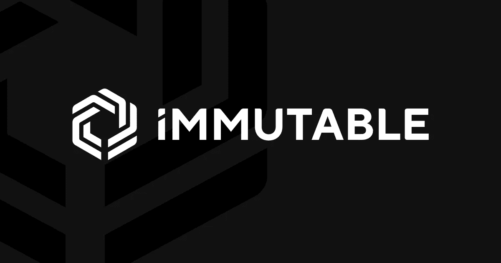
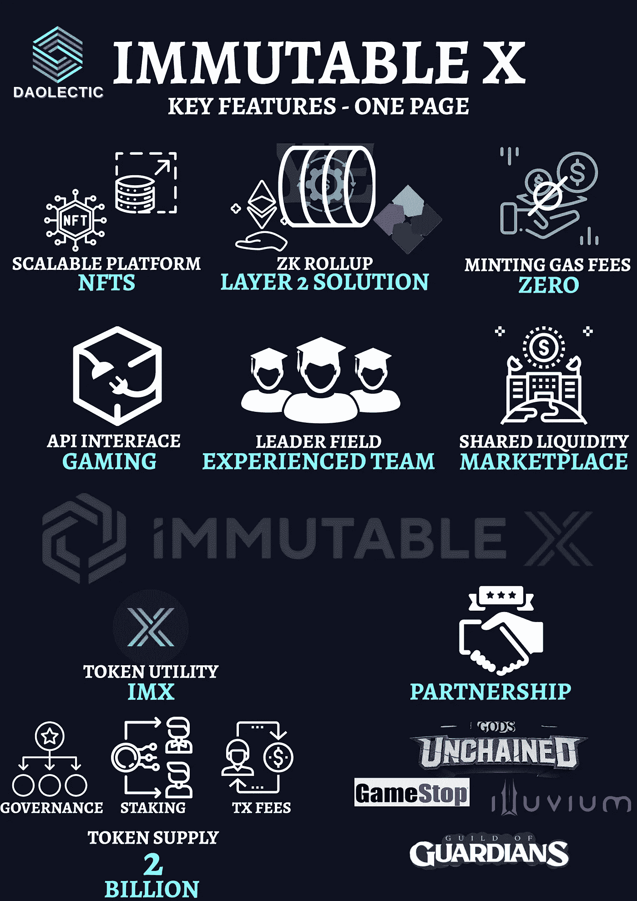
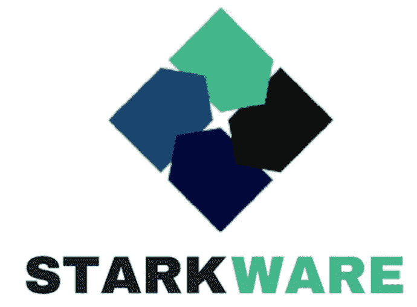
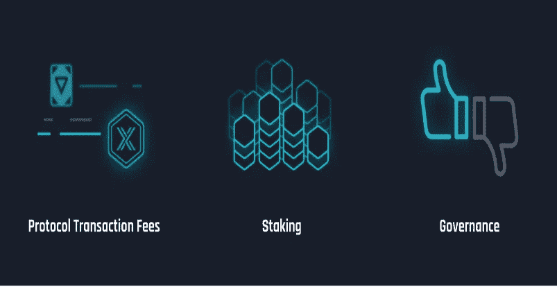
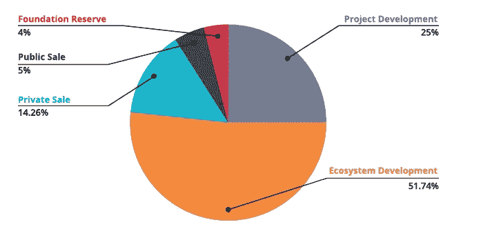
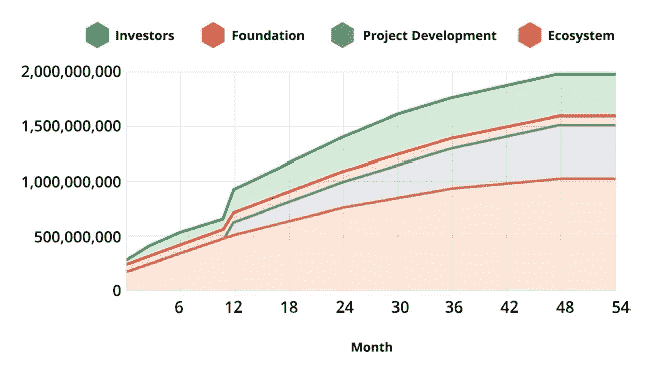
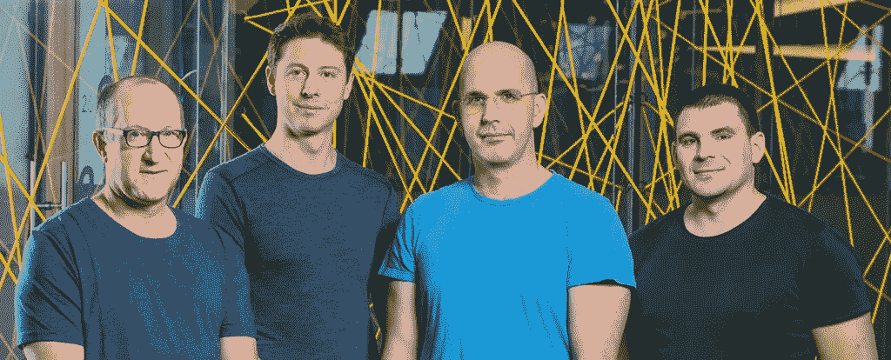
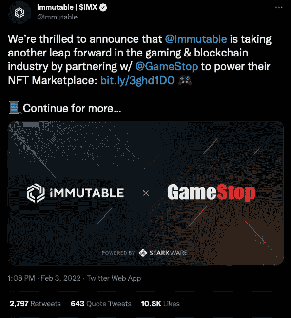
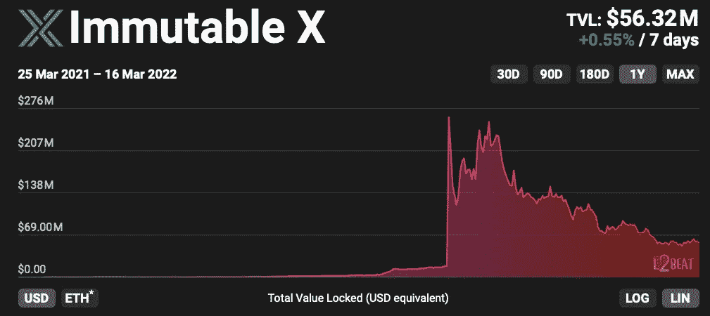

# 不变的 X | NFT 平台的重大突破？|第 2 层解释

> 原文：<https://medium.com/coinmonks/immutable-x-the-major-breakthrough-in-the-nft-platforms-layer-2-explained-91f697f0f18a?source=collection_archive---------35----------------------->

大约一个月前，我们已经向您介绍了 [**以太坊可扩展性和第 2 层生态系统**的概念。](/coinmonks/how-to-scale-ethereum-a-comprehensive-analysis-of-all-the-actual-layer-2-environment-3e909d4e679f)

今天，我们将更进一步，提供对 [**不可变 X**](https://www.immutable.com) 项目的深入概述。

*在继续阅读之前，请在 Twitter 上关注我们，我们在 Twitter 上发布了对某些我们感兴趣的加密项目的分析和有趣的见解，比如这个项目。* [*@道辛*](https://twitter.com/daolectic)

# 项目概述

Immutable 因其基于区块链的游戏[“Gods Unchained”](https://godsunchained.com)而闻名，它是作为下一代协议建立的，为 NFTs 领域提供**可扩展的第 2 层**解决方案。

> Immutable X 的第 2 层零知识汇总解决方案承诺高达每秒 **9000 笔交易的速度**而没有任何非托管方式的天然气成本，为客户提供快速交易确认、巨大的可扩展性和零天然气价格。

Immutable 是第一个基于以太坊的 **100%碳中性 NFT 市场**，也是最高效的 NFTs 第 2 层扩展解决方案。

One Page — Immutable X — Key Features

通过使用 **ZK 汇总**，Immutable 可以确保与以太坊相同的安全性和可伸缩性，而不像其他第 2 层解决方案承诺通过侧链和其他替代技术提供第 1 层的可伸缩性和安全性。

通过这样做，Immutable 团队希望利用 ETH 生态系统的巨大网络效应为开发者和消费者提供一个增强流动性和可扩展性的平台，以确保 NFT 的每一笔交易。

该项目正在为 NFTs 构建一个先进的协议，允许公司在第二层解决方案上构建令人惊叹的 UX 和开发人员体验，强调 NFT 用户和开发人员不应在安全性和网络效果之间进行选择。

# 用例

Immutable 认为，如果 NFT 行业继续以目前的速度扩张，许多希望将 NFT 体验融入其品牌的大公司最终将需要项目可扩展性方面的支持。

虽然许多其他项目渴望通过不太安全的第 2 层解决方案来满足这一需求，如等离子链([多边形](https://polygon.technology))、国家频道([雷电](https://raiden.network))和乐观汇总([乐观](https://www.optimism.io))，但 Immutable 希望通过使用 Starkware 的 ZK 汇总技术来抓住市场需求。

Immutable 与 ZK 汇总实施的主要团队之一 StarkWare 合作，为 NFT 交易和平台构建者提供一流的可伸缩性。

Immutable 多年来一直致力于区块链游戏，并打算利用 ZK 的力量为 NFT 项目和游戏提供以下解决方案:

*1。可扩展的可扩展性*

2.*即时确认和主流用户界面*

3.*以太坊的第 1 层安全和生态系统影响*

通过使用这些基本功能，不可变 X 每秒可以处理比现有的基于以太坊的 NFT 市场多 600 倍的事务。此外，随着最近推出其本地令牌 IMX，该平台希望通过向用户空投 IMX 来有机地建立其用户基础，以换取对网络的贡献。

# 技术

Immutable 通过使用协议的基本组件为开发人员和消费者提供了惊人的体验:

*   **ZK-累计缩放引擎:**

Immutable 的同类最佳 ZK 卷将实现世界级的可扩展性和用户体验，同时保持以太坊的核心安全性。通过扩展以太坊的 NFT 功能，Immutable X 可以创建一个交易成本更低、块验证速度更快的平台。通过 ZK 累积和无延迟地将资产从第 2 层转移到第 1 层，平台已经验证了契约的来源。

*   **鲜明的证明:**

Immutable 通过使用严格的有效性证明在链上发布更多的证明来确保更高程度的安全性:根据协议的创建者，这种技术将永远成为 NFT 可伸缩性的标准。

*   **共享流动性&订单簿:**

不可变 X 提供了一个全局订单簿来帮助协议的流动性。这基本上使协议开发者能够建立 NFT 市场，而不需要他们自己的后端。

*   **交易历史浏览器:**

不可变 X 正在为它的第 2 层网络构建一个事务历史浏览器。通过允许用户和开发人员验证交易和跟踪他们项目的进展，该团队打算在他们的平台上建立信心和合法性。

*   **支持 NFT 的钱包:**

与其他协议不同，Immutable X 设计了自己的桌面以太坊钱包，带有一个被称为“链接”的中间层，允许跨链 NFT 交易，为客户提供世界级的数字钱包体验。

# 令牌组学

接下来让我们看看不可变的 X 记号( **IMX** )及其记号组学。

IMX 代币用于治理、支付交易费用以及通过下注获得奖励。

20%的交易费以$IMX 代币支付，但是如果你使用另一种货币，如以太坊(ETH)，这笔钱将立即在公开市场上兑换成 IMX。

IMX 代币随后以固定的月间隔按比例分配给赌注奖励池。一般来说，你下注越多，你获利越多。

继续，IMX 代币的**总供应量**为**20 亿**，其中约 52%用于促进生态系统的发展。只有大约 14%以私人销售的方式售出，与其他向私人投资者分配更高比例的加密企业相比，这是一个很低的比例。剩余部分(5%)通过初始硬币发售出售，如[硬币列表](https://cryptobullsclub.com/coinlist-announces-immutable-x-token-sale/)选项。

私人投资者和项目开发代币有一年的锁定期，将于 2022 年 10 月到期，之后所有代币将在接下来的四年内出售。

这导致在接下来的 4-5 年里，每 28 天就有大约 3300 万 IMX 源源不断地流入市场。

# 组

詹姆斯和罗比·弗格森兄弟在 2018 年建立了《被解放的神》。在他们参与以太坊之后，两兄弟继续开发不可变 X，这是世界上第一个基于区块链的多人游戏，第一个区块链交易卡游戏，以及以太坊上第一个 NFT 的 ZK 汇总。

Ferguson Brothers

> 不变的

*   [**詹姆斯·弗格森**](https://www.linkedin.com/in/jamesanthonyferguson/) (CEO &联合创始人)

詹姆斯曾为一家价值十亿美元的电子商务公司管理一个软件开发团队。他获得了悉尼大学(金融)的法律学士学位和商业学士学位。他在麻省理工学院学习在线编程，并于 2014 年搬到了硅谷。

*   [**【罗比弗格森**](https://www.linkedin.com/in/robbieferguson/) (联合创始人)

在毕马威工作期间，Robbie 开发了自动资本利得税软件，并租赁给澳大利亚最大的比特币交易所。2015 年，他放弃了悉尼大学的计算机科学/法律学位课程，创办了 Immutable x。2020 年，他获得了 Thiel 奖学金。

*   [**亚历克斯·康诺利**](https://www.linkedin.com/in/alex-connolly/) (首席技术官&联合创始人)

游戏老手克里斯·克莱被任命为游戏总监。2000 年，他加入了 Turbine Inc .，在那里他为 MMO 工作了 15 年，如《亚伦的召唤 1 & 2》、《指环王在线》和《MOBA 无限危机》。Chris 在《海岸巫师》工作了三年，开发了《万智牌:竞技场》,并热衷于通过 NFTs 为游戏玩家和社区提供支持。

此外，似乎这还不够，Immutable 还得到了 Naspers、Galaxy Digital 和比特币基地等知名投资者的支持。

是不是显得耐人寻味？等你了解了斯塔克威尔的队伍。

> 斯塔克威尔

StarkWare 成立于 2018 年，由在密码学方面拥有丰富知识的学者和企业家组成。

*   [**Eli Ben-Sasson**](https://www.linkedin.com/in/eli-ben-sasson-9b7959/) 总裁兼董事长，计算机科学教授，在麻省理工、普林斯顿、哈佛等机构研究零知识证明超过 20 年。
*   [**首席执行官 Uri Kolodny**](https://www.linkedin.com/in/urikolodny/) 拥有麻省理工学院斯隆管理学院 MBA 学位，在计算机行业工作多年。
*   [**Michael Riabzev** ，](https://www.linkedin.com/in/riabzevmichael/)主架构师，拥有计算机科学博士学位，曾供职于英特尔和 IBM。
*   最后但同样重要的是，Starkware 的首席科学家 Alessandro Chiesa 拥有麻省理工学院的博士学位，是 Zerocash 协议的联合创始人。

毫无疑问，Starkware 是一个知名的加密品牌。该公司专门从事 zkRollups(一种以太坊伸缩解决方案)和其他流行的区块链协议。包括比特币基地、红杉资本、甚至维塔利克·布特林本人在内的著名投资者已经为 Starkware 投资了 5000 万美元。

# 采用

不可变 X 吸引了一些最著名的区块链合伙人。

*   2021 年 9 月，抖音 选择了 Immutable 来处理其首次进军 NFTs 的业务。
*   Immutable 向负责所有迪士尼和漫威 NFT 的合作伙伴 [**VeVe**](https://www.veve.me) 提供技术。
*   Immutable 也即将与 ESL(著名的电子竞技比赛平台)和 CS:GO 达成协议和集成。
*   [**Gamestop**](https://venturebeat.com/2022/02/03/gamestop-launches-nft-marketplace-on-immutable-x-creates-100m-dev-fund/) 宣布将使用 Immutable 来建立其 NFT 市场，并且这两家企业还推出了 1 亿美元的基金来推广 NFT 生产商。微软也是 Gamestop 的主要合作伙伴，随着其最近收购动视暴雪，Immutable 与 Gamestop 的合作可能远比人们意识到的更广泛。

2021 年 11 月，以太坊最受欢迎的游戏之一 Ember Sword 选择从 Polygon 过渡到 Immutable X，以获得更快的吞吐量、更高的安全性和更无缝的用户体验，Immutable 获得了最伟大的荣誉之一。

根据 [L2Beat](https://l2beat.com/projects/immutablex/) 的说法，与其他第二层解决方案相比，Immutable 目前在锁定的总价值中排名第九，为 5600 万美元:这是可以理解的，因为该令牌仅在几个月前推出，赌注激励尚未完全生效。

# 放弃

在任何情况下，这都不是财务建议，我研究的目标将永远是深入项目并从不同角度研究它们，我确实包括了基于我最近研究的类似项目的经验的个人意见。

我现在和将来都愿意接受讨论。

**在 Twitter 上关注我们:**

**@道辛**

**请在投资任何东西之前做好调查**。

> 加入 Coinmonks [电报频道](https://t.me/coincodecap)和 [Youtube 频道](https://www.youtube.com/c/coinmonks/videos)了解加密交易和投资

# 另外，阅读

*   [CoinDCX 评论](/coinmonks/coindcx-review-8444db3621a2) | [加密保证金交易交易所](https://coincodecap.com/crypto-margin-trading-exchanges)
*   [红狗赌场评论](https://coincodecap.com/red-dog-casino-review) | [Swyftx 评论](https://coincodecap.com/swyftx-review) | [CoinGate 评论](https://coincodecap.com/coingate-review)
*   [Bookmap 评论](https://coincodecap.com/bookmap-review-2021-best-trading-software) | [美国 5 大最佳加密交易所](https://coincodecap.com/crypto-exchange-usa)
*   [如何在 FTX 交易所交易期货](https://coincodecap.com/ftx-futures-trading) | [OKEx vs 币安](https://coincodecap.com/okex-vs-binance)
*   [CoinLoan 评论](https://coincodecap.com/coinloan-review) | [YouHodler 评论](/coinmonks/youhodler-4-easy-ways-to-make-money-98969b9689f2) | [BlockFi 评论](https://coincodecap.com/blockfi-review)