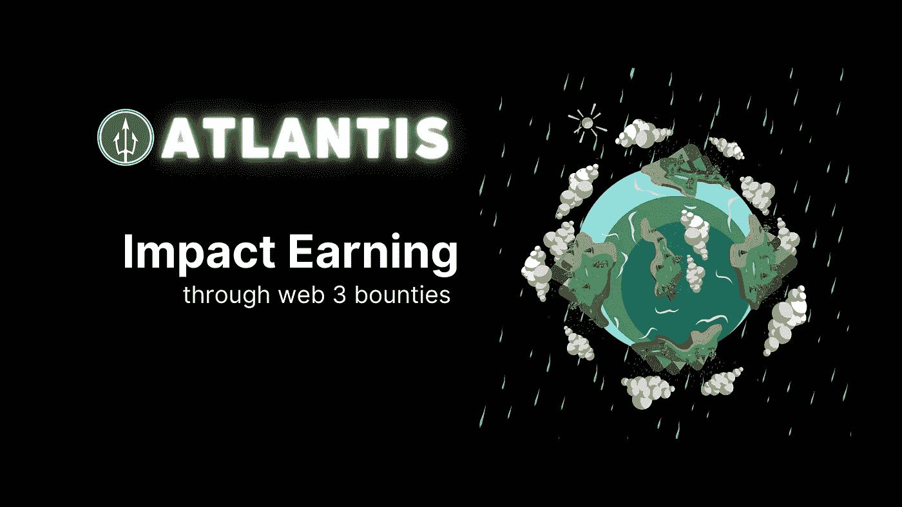
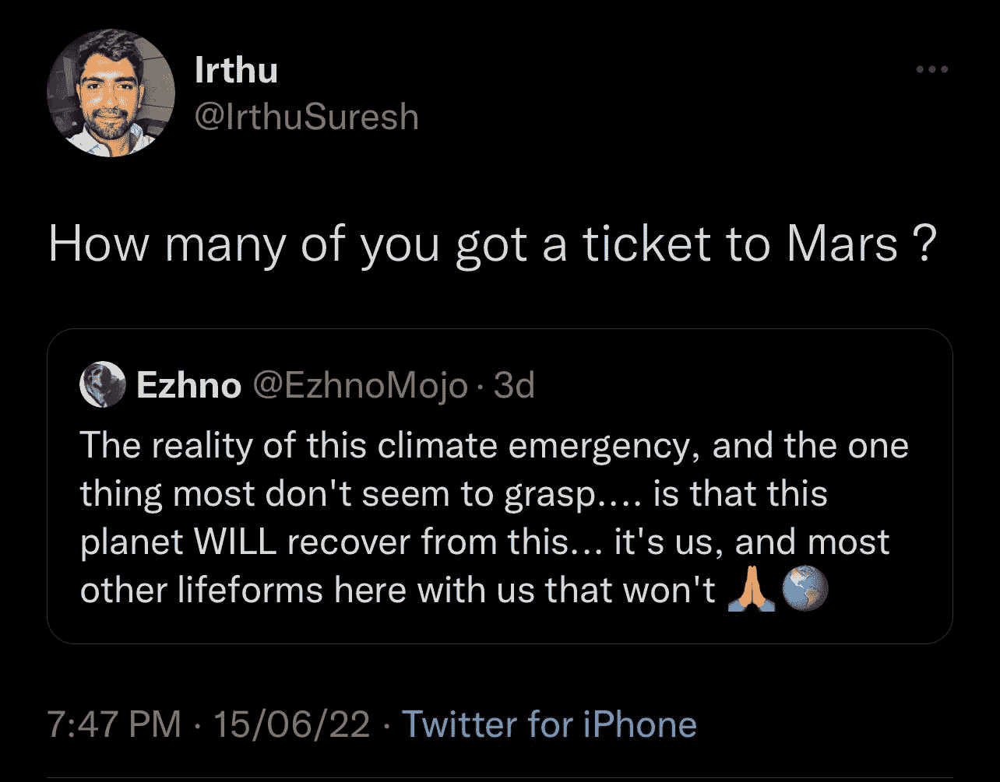
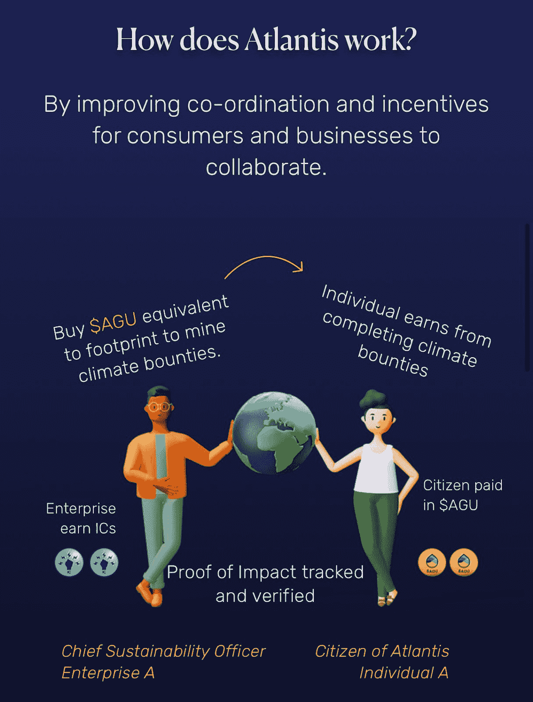

# 通过 Web3 奖金影响收入

> 原文：<https://medium.com/coinmonks/impact-earning-through-web3-bounties-9a6f83f2564c?source=collection_archive---------15----------------------->

Atlantis: Changing the environmental landscape one bounty a time

当你听到“奖金”这个词时，你真正想到的是什么？嗯，是的，如果你是一个游戏玩家，那么你可能会联想到赏金猎人和拿钱去抓俘虏…很像一个附带任务，对吗？Web3 完整地保留了奖金背后的整个想法，实际上就像一个附带任务一样支付给你！

整个隐道文化产生了一种新的工作文化。它已经带回了自由职业者的景观，但具有平等薪酬结构的愿景。如果你翻翻历史书，你会发现不同地理位置的人的工资总是不同的……这公平吗？在我的书里是一个很大的否定。Web3 实现了基于技能的支付，而不是基于你的住处或逗留时间。我们所有人的大胜利！

# "但是赏金是怎么运作的呢，爵士？"🤷🏻‍♂️

奖金可以有很多种，但为了简单起见，我将指出非技术加密人员最常见的一种:

*   **小额支付赏金💸**:写一篇 250 字的文章，制作一个 1 分钟的视频，为 XP 发布相关信息
*   **大付赏金💰**:撰写一篇关于某个行业的深度文章，即将推出的 Web3 解决方案，即将推出的应用程序的测试版……本质上更加深入

让我给你举一个在道文化中赏金是如何运作的主要例子

所以基本上，Dao 是 Web3 空间中的去中心化自治组织，因为 Web3 完全是关于 **1)去中心化，2)无权限& 3)对等** …围绕工作分配的整个框架也严重依赖于这三个指标。

记住上面的陈述，DAOs 和 Web3 作为一个整体的奖金是由一个项目部署的，这将有助于创建对原因的认识。这使得一个项目能够全面获得高质量的内容，并奖励获胜者以回报他们的贡献。

网络中的奖金以更复杂的形式带回了自由职业者的文化。这里不再谈薪酬和反复跟进。此外，奖金还使项目能够以本地代币支付奖励，从而使用户能够在项目的早期生命周期中尝到甜头！

想象一下，你可以通过支持你所信仰的事业来赚钱！听起来超现实，对吧？这不再是遥不可及的现实，但是就在我们说话的时候，它正在发生。亚特兰蒂斯的目标是激励世界各地的人们完成环境保护奖金，并在完成任务时获得回报。这就是 Web3 空间的美妙之处，让促成者成为可能！

现在我们已经非常清楚 Web3 中的 DAOs & Bounties，我们现在将看一下 Atlantis 正在酝酿的这样一个机会，以及他们如何在帮助环境的同时动员隐密土著赚钱。我们走吧…

## **亚特兰蒂斯使命宣言🌍:**

所以作为一个项目，亚特兰蒂斯的目标是解决能源足迹问题。亚特兰蒂斯的联合创始人 Irthu Suresh 对此发表了一条非常有趣的推文(图片附后)

Conserve what we have in hand before shifting our focus on something new

气候变化是一个巨大的问题，人们对它并不感兴趣，因为倡导者把它说得太阴暗或者太平凡。亚特兰蒂斯的愿景是改变对气候变化的看法和方法。减少能源足迹不应该像在最无聊的电子游戏中打一场肤浅的 boss 战……它也可以以一种超级棒的方式完成，而不会忘记目标。

# ✍️外卖店

你看，我们被元宇宙周围的噪音搞得焦头烂额，以至于我们甚至没有意识到技术给环境带来了多大的破坏。不，我们绝不是说要禁止科技，以及人们应该如何抛弃一切依靠电池和电力运行的东西。

我们的目标是能够通过创造气候奖金来帮助企业抵消他们的排放。这些企业还可以发放奖金，让参与者完成任务后获得报酬。听起来很有趣。这里的目的是不要让气候变化听起来像一个反乌托邦，吓唬我们周围的每个人。气候变化是一个问题，但了解它会很有趣，甚至更好的是通过影响全面改变来获得。

围绕同样的整个框架将通过亚特兰蒂斯网络来实现，它通过使用“影响证明”机制来工作。

目前，我们已经听到了太多关于加密项目及其虚假承诺的噪音——但我们需要向前看，开始考虑产生现实影响的项目。为什么？你看，加密是循环工作的，熊市淘汰了所有承诺巨大的项目，但结果却什么也不是，只是快速致富的计划。从长远来看，正是致力于解决实际存在的问题的项目在寒冷和严酷的加密冬天幸存下来。

如果你相信我们需要减少能源足迹，同时还需要赚钱，那么请通过下面的社交网站与我们联系。我们希望有更多的信徒加入我们对抗气候变化的使命，同时让它成为一个有益的过程！

*与我们联系:*

[atlantisdao 1 推特 ](https://twitter.com/atlantisdao1?s=21&t=e-N6i_Hfk_nO2ApFITmQHQ)

[*不和*](https://discord.gg/yDw2Y6X6)

> 加入 Coinmonks [电报频道](https://t.me/coincodecap)和 [Youtube 频道](https://www.youtube.com/c/coinmonks/videos)了解加密交易和投资

# 另外，阅读

*   [Bookmap 点评](https://coincodecap.com/bookmap-review-2021-best-trading-software) | [美国 5 大最佳加密交易所](https://coincodecap.com/crypto-exchange-usa)
*   [如何在 FTX 交易所交易期货](https://coincodecap.com/ftx-futures-trading) | [OKEx vs 币安](https://coincodecap.com/okex-vs-binance)
*   [CoinLoan 评论](https://coincodecap.com/coinloan-review) | [YouHodler 评论](/coinmonks/youhodler-4-easy-ways-to-make-money-98969b9689f2) | [BlockFi 评论](https://coincodecap.com/blockfi-review)
*   [XT.COM 评论](https://coincodecap.com/profittradingapp-for-binance)币安评论 |
*   [SmithBot 评论](https://coincodecap.com/smithbot-review) | [4 款最佳免费开源交易机器人](https://coincodecap.com/free-open-source-trading-bots)
*   [比特币基地僵尸程序](/coinmonks/coinbase-bots-ac6359e897f3) | [AscendEX 审查](/coinmonks/ascendex-review-53e829cf75fa) | [OKEx 交易僵尸程序](/coinmonks/okex-trading-bots-234920f61e60)