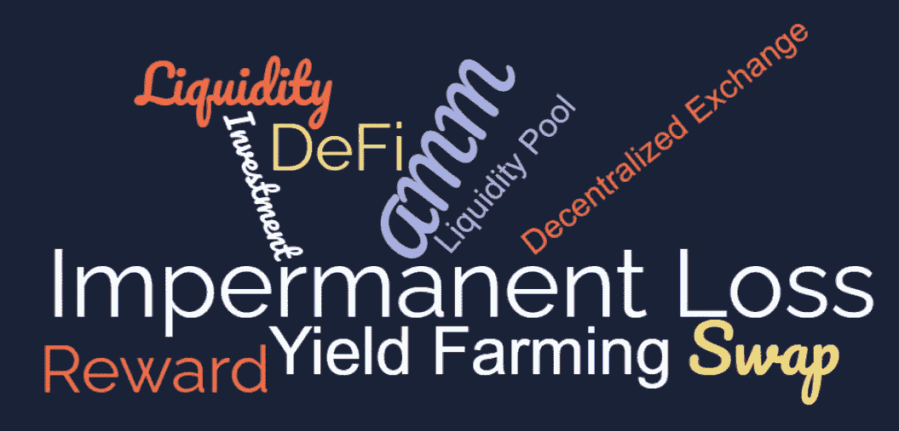

# 非永久性损失用例子来解释

> 原文：<https://medium.com/coinmonks/impermanent-loss-demystified-with-examples-c3fff98a87b1?source=collection_archive---------0----------------------->

高产农业，还是不高产农业，这是个问题。

如果您使用 DeFi 协议有一段时间了，您可能会经常听到“非永久性损失”这个术语。

通过 AMM(DeFi automated markers)或分散式交易所(DEX)提供流动性和收益农业听起来像是一种在初始投资之外赚取一些钱的特殊方法…